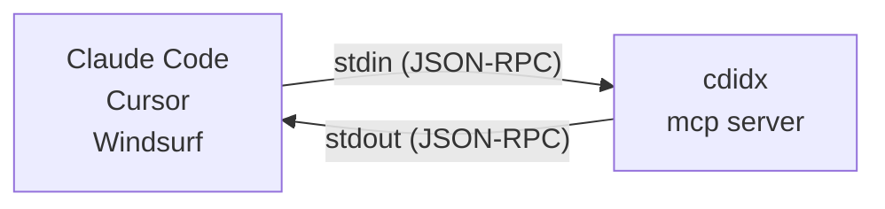

# cdidx User Guide

This is the detailed user documentation moved out of the concise
[README.md](README.md). It keeps the extended install notes, command examples,
AI/MCP setup, language list, and troubleshooting details.

> **[日本語版はこちら / Japanese version](#cdidx日本語)**

**The AI-native local code index that cuts token waste in terminal and MCP workflows.**

`cdidx` indexes a repository once, then serves full-text, symbol, and dependency queries from a local SQLite FTS5 database. Instead of making an AI agent rescan the same tree on every turn, you can reuse the local index and hand the model smaller, structured payloads.

```bash
cdidx .                          # Index current directory
cdidx search "authenticate"      # Full-text search
cdidx definition UserService     # Find symbol definitions
cdidx find "guard" --path src/Auth.cs
cdidx deps --path src/           # File-level dependency graph
cdidx suggestions list           # Review local AI feedback history
cdidx mcp                        # Start MCP server for AI tools
cdidx lsp --db .cdidx/codeindex.db  # Start read-only LSP server for editors
```

82 languages supported. 24 registered MCP tools. Incremental updates. Zero config.

| Topic | Link |
|---|---|
| Docs | [DEVELOPER_GUIDE.md](DEVELOPER_GUIDE.md) for architecture, AI response details, and release workflow |
| AI dev contract | [SELF_IMPROVEMENT.md](SELF_IMPROVEMENT.md) |
| Testing | [TESTING_GUIDE.md](TESTING_GUIDE.md) |
| License | [FSL-1.1-ALv2](LICENSE); integration materials may be Apache-2.0 where marked |

## Why cdidx

Most code search tools optimize for either desktop UI workflows or one-off text scanning in a shell. `cdidx` is built for a different loop: local repositories that need to be searched repeatedly by both humans and AI agents.

| Trait | What it means |
|---|---|
| CLI-first | Designed for terminal workflows, scripts, and automation. |
| AI-native | `--json` output and MCP structured results are built in, not bolted on. |
| Token-efficient | Compact snippets, `map`, `inspect`, and path filters reduce repeated scans and round-trips. |
| Local-first | The SQLite database lives with the project in `.cdidx/`. |
| Incremental | Refresh only changed files with `--files` or `--commits`. |

It is not an IDE replacement or desktop search app. It is a small local search runtime you can script, automate, and hand to AI tools.

Use `rg` when you want a zero-setup one-off scan. Use `cdidx` when the same repository will be searched again and again.

## License and Fair Source Use

CodeIndex and the official `cdidx` binaries are source-available under the
Functional Source License, Version 1.1, ALv2 Future License (`FSL-1.1-ALv2`),
unless a specific file or directory states another license.

In plain language:

| Area | Meaning |
|---|---|
| Allowed use | You may use CodeIndex for personal, commercial, internal, educational, research, and non-competing development work. |
| Own-code search | You may use CodeIndex to search your own code and reduce AI token usage while building your products. |
| Tool invocation | AI agents, IDEs, editors, terminals, scripts, CI workflows, and MCP clients may invoke official CodeIndex releases through CLI, JSON output, or MCP. |
| Integration material | Examples and integration materials are intended to be integration-friendly and may be Apache-2.0 where marked. |
| Separate agreement required | You may not provide CodeIndex, a modified CodeIndex engine, or a derivative work of CodeIndex to third parties as a competing code indexing/search/retrieval product or service without a separate written agreement. |

Reference files:

| File | Purpose |
|---|---|
| `LICENSE` | Top-level license notice. |
| `LICENSES/FSL-1.1-ALv2.txt` | Functional Source License text. |
| `LICENSES/Apache-2.0.txt` | Apache-2.0 text for marked integration materials. |
| `COMMERCIAL_LICENSE.md` | Commercial licensing details. |
| `INTEGRATION_POLICY.md` | Integration policy. |
| `TRADEMARKS.md` | Trademark guidance. |

CodeIndex is source-available / Fair Source-style software, not OSI-approved open source.

## cdidx vs rg

| | `rg` | `cdidx` |
|---|---|---|
| Best at | One-off text scans | Repeated local code search |
| Setup | None | One-time index build |
| Search model | Reads files every time | Queries a local SQLite FTS5 index |
| Output for automation | Plain text | Human-readable, JSON, and MCP |
| AI integration | Needs parsing | Structured by design |
| Token cost in AI loops | Re-sends broad repo context repeatedly | Reuses the index and fetches short, scoped results |
| Updates after edits | Re-run search | Refresh only changed files |

## cdidx vs VS Code workspace index

`cdidx` and VS Code's workspace index can complement each other, but they are optimized for different execution environments.

| | VS Code workspace index | `cdidx` |
|---|---|---|
| Primary environment | Inside VS Code + Copilot UX | Terminal, CI, scripts, and MCP clients |
| Ownership model | Editor-managed index lifecycle | User-managed local SQLite DB (`.cdidx/codeindex.db`) |
| Interface shape | Implicit editor context for chat/commands | Explicit CLI + MCP tools (`search`, `definition`, `references`, `deps`, `inspect`, etc.) |
| Automation and reproducibility | Strongest in interactive IDE sessions | Strongest in headless and repeatable workflows (agents, hooks, CI) |
| Editor dependency | Requires VS Code/Copilot context | Editor-agnostic (works with any editor, remote shell, or no editor) |
| Scope fit | "Make Copilot in VS Code smarter about this workspace" | "Provide a reusable local retrieval runtime for humans and AI agents" |

If your whole workflow lives in VS Code chat, the built-in workspace index may be enough.
If you need deterministic, scriptable retrieval outside an IDE (or across multiple AI tools), `cdidx` is the better boundary.

For implementation details (schema, indexing pipeline, MCP behavior), see [DEVELOPER_GUIDE.md](DEVELOPER_GUIDE.md).

## First Query Quick Start

```bash
# Homebrew install (macOS/Linux)
brew install widthdom/tap/codeindex

# Or one-liner install from GitHub release assets (no .NET required; usually seconds)
curl -fsSL https://raw.githubusercontent.com/Widthdom/CodeIndex/main/install.sh | bash

# First index: ~30-60s on small repos; minutes or longer on 100k-file trees.
# Add --verbose to see each file status while it runs.
cdidx .
cdidx search "handleRequest"
```

Or run the official container image without installing a local binary:

```bash
docker run --rm -v "$PWD:/repo" ghcr.io/widthdom/codeindex:latest search "handleRequest"
docker run --rm -v "$PWD:/repo" ghcr.io/widthdom/codeindex:latest . --json
```

That is the whole loop:

| Step | Command | Result |
|---|---|---|
| 1 | `cdidx .` | Builds or refreshes `.cdidx/codeindex.db`. |
| 2 | `cdidx search ...` | Returns results from the local index. |
| 3 | `cdidx . --files path/to/file.cs` or `cdidx . --commits HEAD` | Refreshes changed files after edits. |

During indexing, interactive terminals show `Scanning...`, `Indexing...`, and
a `67.0% [28/42]`-style progress line. If a large first index looks slow, rerun
with `cdidx . --verbose` to see `[OK  ]`, `[SKIP]`, `[DEL ]`, and `[ERR ]`
file statuses. Use incremental refreshes after the first run; see
[Options](#options) for `--files` and `--commits`.

## Container Image

Release builds publish `ghcr.io/widthdom/codeindex:<version>` and
`ghcr.io/widthdom/codeindex:latest`. The image sets `/repo` as its working
directory and uses `cdidx` as the entrypoint, so pass normal cdidx arguments
after the image name:

```bash
docker run --rm -v "$PWD:/repo" ghcr.io/widthdom/codeindex:latest . --json
docker run --rm -v "$PWD:/repo" ghcr.io/widthdom/codeindex:latest search "authenticate"
docker run --rm -v "$PWD:/repo" ghcr.io/widthdom/codeindex:latest mcp
```

Mount the repository read-write when indexing because `.cdidx/codeindex.db` is
created beside the project. For read-only query containers, mount a repository
that already includes a fresh `.cdidx/codeindex.db`.

## Shell completion

Generate completion scripts with `cdidx --completions <bash|zsh|fish|powershell>`.
The same generator is also available as `cdidx completions <shell>`.
Supported shells are Bash, Zsh, Fish, and PowerShell.
The generated scripts complete subcommands, flags, and common flag values.
`--lang` suggests supported languages, `--kind` suggests symbol/reference kinds,
and path-like options such as `--db`, `--path`, and `--output` use shell file
completion.
Command-specific `--format` values, search origin filters, and `--result-kind`
values come from the same registry as command help and runtime validation. For
example, audit completion includes `sarif`, and search completion includes
`schema_description` and `unknown`.
Completion behavior uses canonical value-kind metadata rather than display
metavariables: finite domains are suggested, while free-form placeholders such
as `<name|path>` remain help text and are never emitted as literal candidates.
Path/project options use shell file completion where supported; repository and
free-text options accept user input without invented placeholder choices.
Mixed options retain real reserved values—for example, `--open-issues` suggests
`github` alongside file completion without suggesting `path` or `github:owner/name`.

Install the script in the startup file or completion directory for your shell:

```bash
# Bash: append to your interactive shell startup file
cdidx --completions bash >> ~/.bashrc

# Zsh: write an fpath entry, then enable compinit from your ~/.zshrc
mkdir -p ~/.zfunc
cdidx --completions zsh > ~/.zfunc/_cdidx
printf '%s\n' 'fpath=(~/.zfunc $fpath)' 'autoload -Uz compinit && compinit' >> ~/.zshrc

# Fish: write to the standard per-user completions directory
mkdir -p ~/.config/fish/completions
cdidx --completions fish > ~/.config/fish/completions/cdidx.fish
```

For PowerShell, add the generated `Register-ArgumentCompleter` script to your
profile after installing `cdidx`:

```powershell
New-Item -ItemType Directory -Force -Path (Split-Path -Parent $PROFILE)
cdidx --completions powershell >> $PROFILE
. $PROFILE
```

## Keeping the index fresh

Install the optional git pre-commit hook when you want commits to refresh the
local index automatically:

| Command | Use |
|---|---|
| `cdidx hooks install [--dry-run]` | Install the optional git pre-commit hook, or preview it without writing. |
| `cdidx hooks status` | Show whether the hook is installed. |
| `cdidx hooks uninstall [--dry-run]` | Remove the cdidx hook, or preview managed-block removal/chained-hook restoration without writing. |

| Hook behavior | Detail |
|---|---|
| Refresh command | The installed hook pins both the selected absolute cdidx invocation and a trusted absolute Git executable; it never performs a mutable `PATH` lookup for either command. At hook execution time, the pinned Git runs `rev-parse --show-toplevel`, and cdidx runs `index "$cdidx_project_root" --quiet` against that active worktree. A hook stored in the shared common Git directory therefore follows whichever linked worktree invoked it, including detached-HEAD worktrees. `--project` selects the repository whose hook is managed; it does not permanently select the worktree to index. If the pinned Git executable disappears or root resolution fails, the hook aborts the commit with guidance to reinstall it with a working trusted Git executable; it never falls back to the installer worktree. |
| Quiet mode | `--quiet` suppresses normal progress and success output for hook contexts while still printing indexing errors to stderr and returning a non-zero exit code. |
| Executable provenance | Install and install dry-run output report `executable.source`, the pinned path/argv, `expected_version`, the observed `actual_version` when available, and an executable `status`. Raw paths are for local use; the sibling `diagnostic_path`, `diagnostic_entry_assembly_path`, and `diagnostic_argv` fields are support-safe. Spaces and shell metacharacters are single-quoted, symlinked executable leaves are pinned to their final target, and a generated script that exceeds the bounded hook-management read limit is rejected before writing. Error previews redact both visible paths and the encoded manifest payload. |
| Preview contract | `cdidx hooks install --dry-run` and `cdidx hooks uninstall --dry-run` return `status: dry_run` for a successful preview, `dry_run: true`, `filesystem_mutation: false`, `planned_action`, `hook_state`, `chained_hook_state`, and `planned_changes`. Each planned change carries its action/path/source, content hashes, executable-mode transition, and provenance. Install preview also reports the resolved executable object. A blocked preview keeps `status: error` while retaining the same non-mutating plan fields. |
| Install preview | Install plans use `create`, `replace_managed`, `chain_existing`, `none`, or `blocked`; `managed_hook_preview` contains the generated managed hook. Preview never creates the missing hooks directory or rewrites an existing file. |
| Uninstall preview | Uninstall plans use `delete_managed`, `remove_managed_block`, `restore_chained`, `force_delete_unmanaged`, `force_restore_chained`, `none`, or `blocked`. A well-formed managed block is removed while preserving surrounding custom hook content; a chained backup is reported as the restoration source. Unmanaged or conflicted marker content is blocked unless `--force` is explicit. |
| Install result | A real install returns `status: installed` when it creates the hook, `status: updated` when it replaces managed content, repairs a non-executable or non-UTF-8/no-BOM managed hook, or chains an existing custom hook, and `status: already_installed` without rewriting when the exact executable UTF-8/no-BOM managed hook is already present. |
| Status JSON diagnostics | `cdidx hooks status --json` keeps `project_path`, `hook_path`, and `chained_hook_path` for compatibility, and also emits `diagnostic_project_path`, `diagnostic_hook_path`, and `diagnostic_chained_hook_path` with path-sanitized values for logs and support bundles. For managed hooks, `executable.status` is `available`, `available_unverified`, `version_mismatch`, `missing`, `not_executable`, or `unresolved`, with a stable `failure_reason` when attention is required. Status never executes a path parsed from a hook, verifies effective executable/read access and regular-file types, requires canonical fully qualified manifest paths, applies non-executing file/owner/permission trust checks to the pinned Git path, validates a pinned managed assembly plus its adjacent `.runtimeconfig.json` and `.deps.json`, and reports malformed source/argv shapes or a manifest/invocation mismatch as unresolved. Windows Git-Bash paths round-trip through this validation without losing their canonical drive path. Current runtime-root hooks report `hook_state: managed` from every linked worktree; if the script is intact but its pinned Git path is missing or no longer trusted, status reports `pinned_git_unavailable` without misclassifying the cdidx executable manifest. Older managed hooks that pinned the installer project report `legacy_project_path_pinned` from that project or `project_path_mismatch` from another worktree; rerun `cdidx hooks install` to migrate them in place. Chained-hook path drift remains separate as `chained_hook_path_mismatch` or `repository_path_mismatch`. |
| Relocation and upgrades | A pinned apphost/wrapper path follows in-place upgrades at that path and status reports a version mismatch until `cdidx hooks install` refreshes the manifest. A versioned `dotnet` tool assembly remains pinned to the installed `cdidx.dll`; moving or removing it is reported as `missing`. After relocating or upgrading cdidx, rerun `cdidx hooks install` from the intended executable. |
| Existing hooks | If `pre-commit` already exists in the resolved common Git hooks directory, `cdidx hooks install` moves it to `pre-commit.cdidx-chain` and calls it after the cdidx refresh, preserving tools such as Husky, pre-commit, and lefthook. |
| Intentional skip | Use `git commit --no-verify` when you intentionally need to skip all pre-commit hooks. |

For managed hook systems, add the same command as a step:

```yaml
# pre-commit / lefthook-style command
cdidx index . --quiet
```

A copyable standalone script is also available at
`samples/git-hooks/pre-commit`.

## CI integration

Use `cdidx status --check` when a script needs one command that verifies both
workspace freshness and readiness of query subsystems. On success, non-JSON
`--check` exits 0 and writes no stdout. On failure, it writes one diagnostic line
per failed check to stderr, such as `[stale] workspace_check ...` or
`[degraded] fold_ready=false ...`.

Exit codes for `status --check` are command-specific:

| Exit | Meaning |
|---|---|
| 0 | ok |
| 1 | stale workspace/index |
| 2 | degraded readiness |
| 3 | both stale and degraded |

For structured automation, use `cdidx status --check --json`. The JSON payload
includes the full status object plus `failed_checks`, an array of the checks that
made the command fail. To check only selected readiness areas, pass
`--check=fold,graph,hotspot,csharp`; `workspace`, `issues`, `sql`, and `newer`
are also accepted scopes.

## Command reference

Use this table when you need to discover the command surface quickly. The detailed
sections below show examples and option details for the most common workflows.

| Category | Command | What it does | Related MCP tool |
|---|---|---|---|
| Index | `index <projectPath>` / `cdidx <projectPath>` | Build or incrementally refresh `.cdidx/codeindex.db` | `index` |
| Index | `backfill-fold` | Upgrade Unicode folded-name metadata in an existing DB | `backfill_fold` |
| Index | `hooks` | Install, remove, or inspect the optional git pre-commit hook | -- |
| Search | `search` | Full-text search across indexed chunks | `search` |
| Search | `find` | Literal or opt-in regex search inside one known indexed file; use context and focus controls to target a position | `find_in_file` |
| Search | `excerpt` | Reconstruct a focused line range from indexed chunks | `excerpt` |
| Navigation | `definition` | Resolve symbol definitions and optional bodies | `definition` |
| Navigation | `symbols` | Search extracted symbols by name, kind, language, and path | `symbols` |
| Navigation | `outline` | Show the symbol outline for one indexed file | `outline` |
| Navigation | `inspect` | Bundle definition, references, callers, callees, nearby symbols, and trust metadata | `analyze_symbol` |
| Repository map | `files` | List indexed files with language, size, and line counts | `files` |
| Repository map | `map` | Summarize languages, modules, hotspots, and likely entrypoints | `map` |
| Graph | `references` | Find indexed references for a symbol name | `references` |
| Graph | `callers` | Find callers of a symbol in graph-supported languages | `callers` |
| Graph | `callees` | Find callees used by a caller symbol | `callees` |
| Graph | `deps` | Show file-level dependency edges ranked by noise-adjusted `ranking_score`. C# applies the limit-scaled candidate window before target matching, so `reference_count` is candidate-scoped when that window truncates source/name groups. | `deps` |
| Analysis | `impact` | Traverse transitive callers from a resolved symbol | `impact_analysis` |
| Analysis | `unused` | Find symbols defined but not referenced, with confidence buckets | `unused_symbols` |
| Analysis | `hotspots` | Rank high-impact symbols/files by reference volume; SQL scopes can use statement grouping | `symbol_hotspots` |
| Analysis | `validate` | Report encoding, line-ending, and file-content diagnostics in indexed files; U+FFFD rows include origin/severity metadata | `validate` |
| Status | `status` | Show DB statistics, freshness, and readiness metadata | `status` |
| Status | `languages` | List language extensions and symbol/reference/graph capabilities; add `--indexed-only` and `--capability graph|references|symbols|missing-graph|missing-references|missing-symbols|search-only` for workspace audits | `languages` |
| Diagnostics | `db --integrity-check` | Run SQLite `PRAGMA integrity_check` against the DB | -- |
| Diagnostics | `report --output <bundle.tgz>` | Build a redacted bug-report bundle | -- |
| Feedback | `suggestions` | List, inspect, and export local suggestion history | -- |
| Portability | `export ctags` | Write a native `tags` file for Vim, Emacs, Sublime, and other ctags consumers | -- |
| Portability | `export` / `import` | Share a built CodeIndex database as a portable archive | -- |
| MCP | `mcp` | Start the MCP server for AI tools | server transport |
| Legal | `license` | Show the license and commercial-use summary; add `--json` for the stable `license`, `commercial_use`, `trademark`, and controlling `documents` fields | -- |

For `files` and `map`, `--exclude-tests` without an explicit `--path` applies the
same production-source preset (`src/**` plus the built-in non-source exclusions).
With an explicit `--path`, both commands keep that selected path scope and remove
test paths from it. As a result, `files --exclude-tests --count` and the
`file_count` reported by `map --exclude-tests --sections summary --json` describe
the same filtered file set.

Stable since values are intentionally not repeated in this guide because the
release changelog is the source of truth for when each command first shipped.
Run `cdidx --help-all` for the full syntax line for every command and
`cdidx --help-flags` for global, safety/scope, index/update, and shared query
options. For focused help,
`cdidx help <command> [subcommand]` is equivalent to the existing
`cdidx <command> [subcommand] --help` form and never executes that command.
Known public command targets and supported command or nested aliases exit `0`;
internal usage keys are not help targets. Missing or unknown targets return usage
exit `1` with a bounded correction or nearest-command/subcommand suggestion.

Fresh indexes resolve reference edges against symbol identity instead of joining folded
names alone. `references --json` reports `target_symbol_id`, `target_symbol_key`,
`resolution_state`, and `resolution_candidate_count` when available. `resolved` identifies
one definition, `resolved_group` identifies one overload family, and `ambiguous` /
`unresolved` keep the edge explicit without letting C# `callers`, `callees`, or `deps`
silently connect it to an unrelated same-named definition. Legacy databases keep the
name-based read fallback until an indexing run refreshes this metadata and stamps its
contract version; even no-op and deletion-only updates perform that repair. Unqualified C#
names are linked globally only when unique, so ambiguous or dynamic-looking calls do not
become same-name dependency edges. An `impact`
query that still resolves to multiple definitions reports those definitions and does not
traverse a combined identity graph; narrow it with language or path filters.

`inspect` and MCP `analyze_symbol` return `candidate_bundles` when a name resolves to
indexed definitions. Each bundle is labeled with a stable selector containing the symbol ID,
qualified/container name, signature, language, kind, path, and line, and its graph sections
are scoped to that candidate identity. When multiple candidates are returned, the top-level
`references`, `callers`, and `callees` arrays are explicitly labeled
`graph_scope: primary_candidate` and mirror only the first prioritized bundle instead of
merging unrelated definitions; consume the corresponding bundle for every other candidate.
Use `--fields candidates` to project these bundles explicitly.

Invalid CLI input emits one command-specific `Error` / `Hint` / `Usage` diagnostic.
Dependent validation stops after the primary invalid token, and transformed aliases
such as `recipes list` retain the command name and usage shape the user invoked.

## JSON output format

Most query commands emit one complete JSON value when `--json` is set. `search
--json` is intentionally stream-oriented: it writes one `CompactSearchResult`
per line as newline-delimited JSON (ndjson), then a final `{"done":true,...}`
line. Stream consumers can parse each line as it arrives; array-oriented tools
can use `jq -s '.'` or pass `--json=array` to `search` to emit the result set as
one JSON array. Add `--pretty` with `--json` to indent single-document JSON
responses; for `search`, use `--json=array --pretty` when the result set itself
should be indented because default `search --json` stays newline-delimited.
Output modifiers are validated as one contract: `--json` is rejected with
non-JSON formats such as `csv`, `tsv`, and `qf`, and `--pretty` is rejected with
`--json=ndjson` instead of being silently ignored. Use `--json=array --pretty`
when an indented search result is required.
Count mode follows the same contract. Bare `--count` preserves the
newline-terminated numeric value used by scripts, while `--count --json`,
`--format count`, and count output wrapped by `--json-envelope` use one JSON
count object. Explicit `--results-only`, `--json=array`, and `--json=ndjson`
streams are incompatible with count mode, and `--count` accepts only
`--format text`, `json`, or `count`;
formats such as `compact`, `grouped`, `csv`, `tsv`, `lsp`, `qf`, and `sarif`
return a usage error instead of being silently replaced. When `--format` is
repeated, its existing rightmost-value-wins rule still applies.
`search --named-query <name>=<query>` can be repeated to run an ad hoc grouped
batch with the same filters and snippet bounds. Named batches emit one grouped
JSON document, and `--format compact` keeps the per-result
`CompactSearchResult` snippet/highlight context instead of reducing rows to
file/line pairs.
`search --format grouped` reports query-wide `total_matches`, `total_groups`,
and `total_files` separately from `grouped_match_count` and
`emitted_match_count`. When `--limit` or `--per-file-limit` omits rows,
`omitted_match_count`, `truncated`, `has_more`, and `continuation_action`
describe the bounded output instead of presenting the displayed page as complete.
High-volume discovery output is resumable without increasing a global limit.
`search --format compact`, `symbols --format compact`, and `files --format
compact` add authoritative totals, omitted/truncated state, `result_stable_at`,
and an opaque `next_cursor` while retaining their existing compact roots.
`search --json=array --json-envelope` provides the same metadata around an
array. `languages --json` accepts `--limit` / `--top`, `--cursor`, and
`--max-json-bytes`; those controls select a bounded envelope without changing
the ordinary unbounded JSON shape. Pass each `next_cursor` back to the same
command and filters. A cursor is bound to that selection and index generation,
so changed inputs or a refreshed index require restarting the pagination.
When a bounded `find --all` scan exits partially, its terminal record includes
`next_cursor`; replaying it resumes after the last scanned line.
The bounded-response commands `search`, `definition`, `find`, `status`,
`hotspots`, `references`, `callers`, `callees`, `symbols`, `files`,
`languages`, `impact`, `map`, and `inspect` validate `--fields` values
against one command-specific registry. Unknown names return a typed
`E010_USAGE_ERROR` instead of successful empty objects. Run
`cdidx <command> --fields list` before a query to obtain the machine-readable
catalog, including `all`, collection-qualified fields, aliases and their
targets, and explicit deprecation metadata. The catalog does not require a
query or index access.
For AI-oriented bounded payloads, `map`, `inspect`, and `outline` accept
`--compact`. It implies JSON output, caps list sections to 5 items by default
(or the explicit `--limit` / `--top` value), and adds `compact`,
`compact_limit`, and `truncation.sections.*` metadata.
Every `inspect` graph bundle also publishes independent
`graph_sections.references`, `graph_sections.callers`, and
`graph_sections.callees` envelopes with `total`, `returned`, `offset`, and
`truncated`. A truncated section includes an opaque `next_cursor`; pass it back
with `--cursor` and unchanged query filters to continue only that section.
The cursor is bound to the query, effective page size, and index generation, so
keep the same `--limit` / `--top` value when continuing. Name and path/line
inspection both preserve the selected persisted symbol ID, so location lookup
returns the same candidate-scoped graph evidence as the corresponding name
bundle instead of re-resolving a display name. MCP `analyze_symbol` exposes the
same section envelopes and accepts their cursors. In path/line mode, `--path`
locates the definition but does not restrict inbound references or callers to
that file. Inspect graph cursors are accepted only by `inspect`; passing one to
another command is a usage error.
For narrower `inspect` evidence, `--fields <csv|list>` implies JSON and selects
top-level groups such as `definitions`, `file`, `graph`, `references`,
`callers`, and `callees`. Collection selectors accept one nested level, for
example `definitions.name`, `definitions.path`, `definitions.line`,
`references.path`, or `callers.path`. Selecting a parent keeps the full rows;
when a parent and child are both requested, the parent wins. Child rows follow
the canonical request order, aliases and duplicates are normalized
deterministically, empty arrays remain arrays, and response counts, truncation,
cursor, body recovery, and partial-family metadata remain available. Unknown
parents or leaves return a typed usage error with the field catalog. Run
`cdidx inspect --fields list` without a query or database to inspect that
catalog. `--outline-only` is shorthand for
`--fields file,definitions,nearby_symbols`, and `--body-only` is shorthand for
`--body --fields definitions`. When a definition body is longer than the returned slice,
`body_content_next_start_line` points to the next source line to pass with
`--body-start`; use `--body-lines` (or alias `--body-line-count`) to choose the page size. `inspect`
can also return a bounded `source_excerpt` when you pass `--line`, `--start-line` / `--end-line`,
and optional `--context`, `--before`, or `--after`. If a single long
source line hits the body byte cap, continuation still advances to the following
source line because body paging is line-based. `inspect --json` also includes
`body_mode` metadata so clients can see whether body content was requested,
whether it is present, and which follow-up flags to use.

For `references`, `callers`, and `callees`, `--body` and `--snippet-lines`
describe the requested body work independently of `--fields`. A projection that
omits every `body_*` field is valid and suppresses body materialization, while
`--fields all` or explicit body fields keep the selected body content, range,
truncation, and recovery metadata. Omitting `--body` still makes an
explicit `--snippet-lines` a usage error.
Count-only JSON (`--count --json` or `--format count` where supported) is a
single object with `count`, applied `query_context`, freshness metadata
(`indexed_file_count`, `indexed_at`, `freshness_available`), and trust flags
`degraded` / `authoritative_count`. Commands that count matched files also
include `files`; the older `file_count` field remains as a compatibility alias
with the same value and is not scheduled for removal before the next major
release. New consumers should read `files` and treat `authoritative_count=false`
as a signal to inspect the accompanying readiness or graph/exact trust fields.

```bash
cdidx search authenticate --json          # ndjson stream, one result per line
cdidx search authenticate --json=array    # single JSON array
cdidx search authenticate --json=array --json-envelope --limit 50
cdidx symbols --format compact --limit 50
cdidx languages --json --limit 20 --max-json-bytes 65536
cdidx inspect QueryCommandRunner --json --pretty
cdidx map --compact                       # capped JSON with truncation metadata
cdidx inspect Compute --outline-only      # file/definition/nearby symbol summary
cdidx inspect Compute --body-only         # definitions with body_content only
cdidx inspect Compute --body --body-start 40 --body-lines 40
cdidx inspect Compute --line 42 --context 2 --json
cdidx inspect Compute --json --limit 1 --cursor '<next_cursor>'
cdidx inspect Compute --json --fields definitions.name,definitions.path,references.line
cdidx inspect --fields list
```

## Editor and index portability

Use `cdidx export ctags` when an editor wants the traditional ctags file format
instead of querying `cdidx` directly:

```bash
cdidx export ctags --output tags
cdidx export ctags --db .cdidx/codeindex.db --output .tags
cdidx export ctags --lang csharp --path src/ --exclude-tests --json
```

`cdidx export ctags` accepts the same language and path filtering style used by
query commands: `--lang <lang>`, repeatable `--path <glob>`, repeatable
`--exclude-path <glob>`, and `--exclude-tests`. Generated files are excluded by
default when the database exposes generated-file metadata; pass
`--include-generated` to include them. Legacy databases without that metadata
remain queryable and report the generated-code policy as `unavailable`.

The default human mode keeps writing the tags file and prints the output path.
`--json` prints a machine summary with `output_path`, `db_path`, total candidate
`tag_count`, `emitted_count`, `skipped_count`, `skip_reason_counts`, `filters`,
and `metadata_fields`. The fixed `skip_reason_counts` object always contains
`invalid_name`, `unsupported_kind`, `generated_code`, `language_filter`,
`test_filter`, `path_filter`, `exclude_path_filter`, and `other`. Each skipped
candidate is assigned to its first matching reason in that order, so exports
satisfy both `tag_count == emitted_count + skipped_count` and
`skipped_count == sum(skip_reason_counts)`. The `filters` object advertises
`include_generated`, `generated_code_policy`, and
`generated_file_filter_available`. Tag lines keep the standard `kind` and
`line` fields and may also include indexed metadata such as `language`,
`container_kind`, `container`, and `visibility`.

Use `cdidx export <archive>` to package the current `codeindex.db` with a
manifest, and `cdidx import <archive>` to restore it on another checkout or CI
job:

```bash
cdidx export codeindex.cdidx.zip
cdidx export codeindex.cdidx.zip --overwrite --json
cdidx export app.cdidx.zip --project App --lang csharp --exclude-tests
cdidx export shared.cdidx.zip --path 'src/shared/*' --exclude-path 'src/shared/generated/*'
cdidx import codeindex.cdidx.zip
cdidx import codeindex.cdidx.zip --db /tmp/codeindex.db --prune-paths
cdidx import codeindex.cdidx.zip --db /tmp/codeindex.db --dry-run --limit 100
```

Archive export accepts `--lang`, repeatable `--path` and `--exclude-path`,
repeatable `--project`, optional `--solution`, and `--exclude-tests`. Requested
paths and resolved project directories form one inclusive scope; language,
exclusion, and test filters then narrow that scope. The exported SQLite
snapshot contains only the retained files and their dependent chunks, symbols,
references, and diagnostics, and is vacuumed before packaging. JSON output and
`manifest.json` include the requested scope, resolved project paths, and source
and exported file counts. The scope also reports
`represents_entire_source_database`. An export without scope flags remains a
full archive and preserves the source database's index completeness,
indexed-HEAD provenance, run telemetry, and unknown-extension summary. A
filtered archive is instead stamped `index_complete: false` with the stable
`partial_archive` reason, clears source-wide indexed-HEAD and run metadata, and
omits unavailable unknown-extension summaries so `status` cannot present the
subset as a fresh full index or an authoritative zero-result scan. This
normalization applies only to the exported snapshot and does not mutate the
source database. A later scoped index request falls back to a full workspace
scan before clearing `partial_archive`.
Portable export refuses an existing destination by default; pass `--overwrite`
only when replacing it is intentional. The archive is built in an owner-only
sibling temporary file and atomically published, and POSIX archives are verified
as mode `0600`. Successful JSON keeps the existing fields and additionally
returns `archive_size_bytes`, the final archive's `archive_sha256`, and the
complete immutable `manifest` object. That manifest carries the database hash,
row counts, schema contract stamps, readiness state, unknown-extension summary,
and export scope needed to evaluate the artifact before import.

The archive path is intended for trusted CodeIndex databases. Import validates
that the embedded SQLite file is a CodeIndex DB before replacing the destination
database. `--prune-paths` rewrites the imported `indexed_project_root` metadata
to the import target project root. Imports targeting `.../.cdidx/codeindex.db`
use the sibling project directory; other database paths fall back to the process
current directory. `--dry-run` and its `--check` alias also compare an existing
destination DB with the validated archive without replacing it. JSON results
expose the normalized `index_complete`, `index_incomplete_reasons`, and `scope`
values. Archives with no scope metadata are treated conservatively as partial
during import; current unfiltered archives explicitly preserve full-snapshot
trust. JSON `destination_delta.comparison` reports schema and count deltas plus bounded
file, symbol, reference-edge, chunk, and metadata records. Text fields in those
records are represented by named SHA-256 and UTF-8 byte-length metadata rather
than source content or paths. Use `--limit <n<=10000>` and `--offset <n>` to
page those records. If the destination does not exist or cannot be read,
`destination_delta` reports that state instead of claiming a comparison.

Use `cdidx diff <db1> <db2> --detailed --json` to verify the restored index.
Database identity is based on semantic index content: reference-line links are
compared by their indexed path, line, and context rather than SQLite surrogate
row IDs, so equivalent databases remain identical after rows are rehydrated.
Every diff summary classifies observed changes as `data`, `schema`,
`readiness_provenance`, or `volatile_telemetry`. The default `semantic` mode
includes the first three categories in `status` / `identical` while observing
but excluding volatile run telemetry, so a no-op reindex that changes only
timestamps, duration, mode, or byte counters still compares identical.
`--data-only` also excludes readiness/provenance from the result status, while
`--include-telemetry` explicitly includes volatile telemetry; these two flags
cannot be combined. `summary.categories[]` reports `evaluated`, `included`,
`different`, and stable `reasons` for every category, and
`summary.difference_reasons` lists every included reason that made the result
non-identical. Human output prints the same category reasons.
Detailed JSON returns one deterministic `records` sequence. Each record names
its `area` and `side`, carries a stable `identity_sha256`, and exposes named
`fields` instead of an opaque encoded row. By default, text fields and database
paths are redacted to SHA-256 and UTF-8 byte-length metadata; source text is
returned only when `--include-content` is explicitly combined with
`--detailed --json`. Readiness/provenance metadata records remain visible for
diagnosis even when `--data-only` excludes that category from status. Volatile
telemetry records are emitted only with `--include-telemetry`.

Detailed JSON is capped at 1 MiB by default. Every JSON mode accepts
`--max-json-bytes <n>` (4096 through 16777216) for a caller-controlled
whole-output UTF-8 budget. In detailed mode, CodeIndex stops only at complete
record boundaries, so the result remains valid JSON. `total_count`, `returned_count`,
`omitted_count`, `truncated`, and `truncation_reason` describe the page.
`--limit` bounds the unified record page, `--offset` remains available for
direct paging, and `next_cursor` plus `replay.next_page_arguments` provide the
preferred deterministic continuation contract. Reuse the same database
arguments and emitted replay flags to resume. Cursors bind the complete
deterministic difference sequence as well as the database arguments and content
policy; if either database changes, restart without `--cursor`.

## Flag compatibility and migrations

`--exact` remains accepted for compatibility, but new usage should prefer the
semantic flag for the command family. The split exists because text search and
symbol navigation use different equality contracts: `search` exact mode is a
case-sensitive substring scan over indexed text, while symbol/navigation exact
mode is NFKC + Unicode CaseFold equality over extracted names.

| Command family | Legacy flag | Preferred flag | Matching semantics |
|---|---|---|---|
| `search` | `--exact` | `--exact-substring`; use `--token-boundary` for bounded code phrases | Case-sensitive exact substring match; bypasses FTS5 tokenization. `--token-boundary` also requires identifier/token boundaries around the full query. |
| `symbols`, `definition`, `references`, `callers`, `callees`, `inspect` | `--exact` | `--exact-name` | Exact extracted-name equality using NFKC + Unicode CaseFold; avoids substring expansion such as `Run` matching `RunAsync`. |
| `find` | `--exact` | `--exact` | Literal in-file matching already has substring semantics, so there is no newer alias. |

The legacy `--exact` aliases are stable for the current major release and are
not scheduled for removal before the next major release. If removal is planned,
the release notes will announce the timeline before the alias stops working.
MCP mirrors the same split: use `exactSubstring` or `tokenBoundary` on
`search`, `exactName` on name-based tools, and keep `exact` only for
backward-compatible clients.
Raw `--fts` mode is mutually exclusive with the literal search modes
`--exact`, `--exact-substring`, and `--token-boundary`. Choose one matching
model per search. Conflicting combinations fail with a typed usage error before
query execution, and generated replay commands preserve only the selected mode.
In `search --json` and MCP `search` responses, exact substring highlights add
`literal_terms` / `literal_term_occurrences` (camelCase in MCP) so clients can
render only the requested literal phrase while keeping the broader diagnostic
`terms` / `term_occurrences` fields.
When a normal `search` query looks like a punctuation-heavy code phrase,
text output suggests `--exact-substring`, JSON results include
`exact_substring_hint`, and MCP `search` includes a `recovery_hint` with
`exactSubstring: true` arguments. Use `--token-boundary` / `tokenBoundary`
when the phrase should not match inside longer identifiers such as
`HttpClientHandler`.

For single-value CLI flags, repeated occurrences keep the long-standing
rightmost-wins behavior. `cdidx` prints a warning that names the winning value:
the last CLI occurrence takes precedence over earlier CLI occurrences and over
environment or `.cdidxrc.json` defaults.

## Documented defaults and drift guard

`cdidx --help` and the source constants are the canonical defaults. This guide
lists defaults only when they matter for decision-making, and those values should
be audited whenever the matching help text changes.

| Setting | Current default | Source of truth |
|---|---|---|
| Query/diff result limit | `20` (`--limit`, aliases `--top` for query commands and `--max-results` for `search`), max `10000` | CLI help and query runners |
| Search snippet lines | `8` (`--snippet-lines`, max `20`) | CLI help and search runner |
| Max line width | `512` (`--max-line-width`, `0` disables) | `LineWidthFormatter.DefaultMaxLineWidth` |
| Index max file size | `4MiB` unless `CDIDX_MAX_FILE_BYTES` is set | index runner help |
| Index max symbols per file | `5000` (`--max-symbols-per-file`), max `50000` | index runner help |
| DB checkpoint name length | max `128` characters | db runner help |
| Watch debounce | `500` ms (`--debounce`), max `60000` ms | index watch runner |
| Status stale-after hint | `24h`, overridden by `--stale-after`, `CDIDX_STALE_AFTER`, or `.cdidxrc.json`; max `30d` | status runner |
| Color mode | `auto`, overridden by `--color`, `CLICOLOR_FORCE`, `NO_COLOR`, or `CLICOLOR=0` | `ConsoleUi` |
| ANSI palette | `basic` fallback, auto-upgraded from terminal hints unless overridden | `ConsoleUi` |
| Report log tail | `200` lines (`--log-lines`), clamped to `2000`, from at most the 32 newest lifecycle log files | report runner help |
| Report per-log tail read | `1,048,576` bytes | `ReportCommandRunner` |
| JSON envelope capture | `10,485,760` characters | `JsonEnvelopeWrapper` |
| CLI batch line | `1,048,576` characters | `QueryCommandRunner` |
| CLI batch arguments | `256` arguments after command name | `QueryCommandRunner` |
| CLI batch input lines | `1,024` by default; configurable from `1` through `65,536` | `QueryCommandRunner` |
| CLI batch JSON-summary output | `10,485,760` characters by default; configurable from `4,096` through `67,108,864` | `QueryCommandRunner` |

When a default changes, update the help text, this table, affected examples, and
the changelog fragment in the same PR so users are not asked to reconcile
conflicting instructions.

## Advanced analysis examples

### Validate indexed files

```bash
cdidx validate
cdidx validate --kind replacement_char --path src/
cdidx validate --kind replacement_char --severity warning --path src/
cdidx validate --exclude-tests --exclude-path 'fixtures/**'
cdidx validate --json=array --limit 50 --path legacy/
cdidx validate --json --limit 50 --path legacy/
cdidx validate --format count --kind replacement_char --path src/
cdidx validate --format compact --limit 50
cdidx validate --format sarif --limit 50
```

`validate` reports indexed files that are likely to produce misleading snippets
or symbol names: U+FFFD replacement characters, UTF-16 BOM and BOM-less
heuristic detections, null bytes, mixed or CR-only line endings, likely non-UTF-8
content, Git LFS pointer placeholders, and malformed or truncated Dockerfile
JSON-form instruction payloads.
For `replacement_char`, JSON and MCP responses include `origin` (`source_literal`
or `decode_replacement`) and `severity` so agents can distinguish intentional
U+FFFD literals from likely encoding damage.
Validation issue rows also include `category` and `actionable` when emitted by
current binaries; expected fixture literals are grouped as
`expected_fixture_literal` with `actionable: false`, while decoder replacement
risks are grouped as `decoding_risk` with `actionable: true`.
Human-readable output prints the same markers in brackets and adds
`test_fixture` when a finding comes from a test or fixture path.
The default JSON object and `--format compact` expose authoritative pagination
metadata as `returned`, `total`, `omitted`, and `truncated`. Their `count` is the
number of emitted issue rows, while `summary` is computed over all matching
issues before `--limit` and is grouped by kind, severity, origin, category, and
actionability. `--format count` emits the common versioned count envelope:
`count` covers all matching validation issues before `--limit`, while
`query_context` records filters such as path, kind, and severity. The legacy
`total_estimated` field remains as a compatibility mirror of `count`.
`api_version`, freshness fields, `issues_table_available`,
`file_issues_data_current`, `severity_filter_available`,
`requested_filters_available`, `index_complete`, `degraded`, and
`authoritative_count` make old databases, unavailable requested filters, and
incomplete indexes explicit;
do not treat the count as exact when `authoritative_count` is `false`.
SARIF exposes the same pagination fields under each run's
`properties`, together with `issues_table_available` and `degraded` so unavailable
legacy validation data is not mistaken for an authoritative zero; each result maps `info` to `note`, preserves `warning` / `error`,
and carries the original `severity`, `origin`, `category`, and `actionable`
values in result properties. Use `--format compact` when an agent or pipeline
only needs that summary plus compact issue rows.
Use `--severity warning` to hide informational source literals and focus on
findings that indicate likely encoding damage.
Use `--exclude-tests` and repeatable `--exclude-path` to keep validation output
focused on production paths when fixtures or generated samples dominate the
issue list.
UTF-8 BOM markers in Visual Studio `.sln` files are treated as expected solution
file noise and are not reported by default.
Use `--json=array` when a pipeline expects a bare issue array instead of the
default `{ "count": ..., "returned": ..., "total": ..., "omitted": ...,
"truncated": ..., "summary": ..., "issues": [...] }` object; the bare array
intentionally omits pagination metadata.
LFS pointers are recorded as `lfs_pointer_skipped`; their placeholder body is
not indexed, and their checksum stays tied to the pointer identity until you run
`git lfs pull` and then `cdidx index .` to index the real file content.

### Find potentially unused symbols

```bash
cdidx unused --lang csharp --exclude-tests
cdidx unused --kind function --path src/ --limit 50
cdidx unused --bucket likely_unused_private --min-confidence medium
cdidx unused --actionable --confidence medium
cdidx unused --json --count
cdidx unused --all --json --count
cdidx unused --compact --bucket likely_unused_private --min-confidence medium
cdidx unused --json --by-bucket
cdidx unused --compact --by-bucket
cdidx unused --json --limit 50 --max-json-bytes 16384
```

`unused` compares definitions with indexed references and groups results by
confidence. Broad `unused` audits suppress low-confidence contract-domain
candidates by default so public API surfaces, generated/config/reflection hooks,
and other contract-like symbols do not dominate first-pass audits. Text output
reports suppressed totals on stderr, and JSON output exposes
`default_suppression` plus `summary.suppressed`; pass `--all` to include those
candidates in normal results and counts. JSON output includes
`summary.by_bucket`, `summary.by_confidence`, and `bucket_taxonomy` for the
`likely_unused_private`,
`maybe_unused_nonpublic`, `public_or_exported_no_refs`, and
`reflection_or_config_suspect` buckets. In regular JSON, `--by-bucket` also
groups returned symbols under those bucket keys; with `--compact`, the same
flag emits count/representative summaries and records `by_bucket.symbols` under
`omitted_sections` instead of duplicating full symbol arrays. Use
`--bucket <name>` to return only one
bucket, and `--min-confidence <medium|low>` or its `--confidence` alias to omit
lower-confidence classes. Use `--actionable` to preset the query to private,
medium-confidence cleanup candidates while excluding tests. JSON output includes
`query_context` so applied bucket and confidence filters are visible to
downstream audit tooling. Count-only JSON includes `returned_bucket_counts` and
`summary.by_bucket` / `summary.by_confidence`, matching the full JSON summary.
Use `--compact` for audit summaries that keep counts, confidence buckets,
taxonomy, and filter context without returning the full `symbols` array.
When `unused` returns `next_cursor`, pass that opaque value back unchanged.
The cursor is bound to the effective audit scope, filters, ordering, and index
generation. Changing those inputs or refreshing the index requires restarting
without `--cursor`; JSON pages also expose `result_stable_at`.
Use `--max-json-bytes <n>` to place a hard UTF-8 byte cap, including the final
newline, on the whole JSON response. The bounded envelope returns only complete
symbol rows, reports the actual returned and omitted counts, and resumes with a
generation-bound `response:v2` cursor. `--compact` projects smaller rows, while
`--by-bucket` keeps the bucket view inside the same byte budget. If the metadata
and one row cannot fit, `unused` returns a typed usage error with empty stdout.
Without the byte cap, the existing JSON and cursor shapes remain unchanged.
For C# private members declared in partial types, `unused` aggregates use
evidence across sibling files by fully qualified logical type name, including
nested partial types. Same-named types in other namespaces or containing types
do not share evidence; containing-type kind and generic arity also remain part
of the logical identity. Genuinely unreferenced members in the family remain
actionable candidates. Regular JSON, compact, `--by-bucket`, and
`--actionable` all use the same family-aware classification. Reads and writes
in sibling declarations are recognized regardless of member naming convention,
including when raw strings cross overlapping production chunk boundaries.
Public APIs, framework entrypoints, DTOs, serialization contracts, generated
hooks, test-only hooks, Markdown headings and fenced-code language markers,
reflection, and configuration-based usage can be false positives and are
routed into lower-confidence buckets. C#
`nameof(...)`, `typeof(...)`, and direct reflection member-name literals such as
`GetMethod("Foo")` are indexed, but dynamically constructed names still require
manual review.

### Rank hotspots

```bash
cdidx hotspots --lang csharp --exclude-tests
cdidx hotspots --group-by=file --json
cdidx hotspots --group-by-name --limit 30
```

`hotspots` ranks symbols or files by incoming reference volume so you can find
central code before refactoring. SQL scopes default to statement grouping, and
explicit `--group-by statement` is accepted only with `--lang sql`; non-SQL
scopes default to symbol grouping and should use `--group-by symbol` or
`--group-by file`. JSON output includes `grouping_unit`, `count_kind`,
`limit_applies_to`, `score_fields`, `ranking_fields`, and matching
`query_context` fields so callers can tell whether `--limit` applies to
returned symbols, files, SQL statements, or is ignored by `--count`. If
`status --json` reports `hotspot_family_ready: false`, duplicate-name grouping
uses a conservative fallback until you re-index with a current binary.
Current indexes maintain compact per-file logical-reference totals for hotspot
ranking. Limited symbol, file, and name-group queries aggregate, order, and
apply `--limit` from those totals instead of regrouping the complete raw
reference graph. Writable legacy databases are backfilled during migration;
immutable legacy databases keep the compatible raw-reference fallback until
they are re-indexed with a current binary.

### Trace impact

```bash
cdidx impact Run --max-hops 2 --exclude-tests
cdidx impact Run --max-hops 0 --json
cdidx impact FolderDiffService --with-paths --json
cdidx impact CurrentValue --include-member-reads --json
```

`impact` resolves a symbol and walks transitive callers through call-graph edges.
`--max-hops 0` resolves without traversing, while `--with-paths` emits shortest call
chains for converging routes. Metadata-only edges such as attributes,
annotations, and type-position references are excluded from the symbol-level BFS
so metadata cycles do not inflate caller counts; single-type queries may still
return heuristic file-level dependency hints. Current indexes store non-invoking
member/value reads as `member_read`, which callers, callees, and impact exclude by
default. Use `--include-member-reads` (MCP: `includeMemberReads`) when read
dependencies are intentionally part of the graph. Legacy indexes stored those
reads as `call`; they remain readable and keep their historical inclusive behavior
until re-indexed.

When the reference-identity contract is current and every matching C# declaration belongs to one logical partial family, `impact`
uses the family's stable `partial_family_id` as one traversal root and walks the
union of all physical member identities. Callers, file hints, and shortest paths
reached through more than one member are deduplicated; the representative
definition still carries `family_members` as physical evidence. An unrelated
same-name type or member remains ambiguous and is never folded into that family.
With `--with-paths`, the logical root's `path_details` node carries the
representative `definition_path` plus `partial_family_id`.
JSON and MCP responses identify this mode with
`traversal_root_scope: "logical_partial_family"` and
`traversal_partial_family_id`. The `partial_family_member_*` fields report the
eligible physical root count, limit, omitted count, and truncation independently
from the normal result/traversal `truncated` fields. A stale identity contract keeps
`traversal_root_scope: "symbol"` and omits the family-root metadata because the
legacy traversal cannot guarantee the physical-ID union. When the separate family
root limit is reached, CLI count JSON also reports `degraded: true` and
`authoritative_count: false`, while MCP count-only output reports `total: null`;
ordinary traversal `truncated` remains unchanged.

On a current index, cycle detection follows the resolved source/target symbol IDs
on real directed edges. Two distinct methods with the same display name are not a
cycle, while direct recursion is reported as a singleton cycle. JSON caller rows
include `caller_symbol_id` and, when the callee is uniquely resolved,
`callee_symbol_id`; uniquely resolved `path_details` nodes include `symbol_id`;
and each cycle can include `member_identities` alongside the compatibility
`members` display-name list. Unresolved or ambiguous caller edges, including
non-unique overload resolution groups, remain visible in traversal results but do
not contribute canonical cycle edges.

## Performance tuning for large repositories

Start by measuring before changing knobs:

```bash
cdidx status --check --json
cdidx index . --dry-run --verbose
cdidx index . --duration-format seconds
```

Use the smallest change that reduces the expensive part of your run.

| Knob | Default | When to tune | Trade-off |
|---|---|---|---|
| built-in skips plus `.gitignore` / `.cdidxignore` | common generated/cache dirs plus project rules | Generated, vendored, cache, or build-output trees dominate scan time | Excluded files disappear from all search and graph results |
| `--files <path...>` | off | Editor/save hooks or known in-place edits | Does not purge old rename/delete paths unless listed |
| `--commits <id...>` | off | After normal commits | Requires git history but sees rename/delete paths |
| `--changed-between <old> <new>` | off | After branch switches when both refs are known | Only as accurate as the supplied refs |
| `--dry-run-path-limit <n>` | `100000` | Previewing a very large scan without building unbounded dry-run estimates | Truncated output reports lower-bound totals |
| `--max-file-bytes <bytes>` / `CDIDX_MAX_FILE_BYTES` | `4MiB` | Legitimate large source files are skipped | Raising it can bloat the DB and slow snippet extraction |
| `--parallelism <n>` / `CDIDX_INDEX_PARALLELISM` | CPU count, capped at `8` | Full-scan extraction is CPU-bound | Explicit values up to `16` can increase memory and IO pressure |
| `--watch --debounce <ms>` | `500` ms | Keep an active worktree fresh during editing | Long-running process; incompatible with commit/file scoped refresh flags |
| `--watch-pending-path-limit <n>` / `CDIDX_INDEX_WATCH_PENDING_PATH_LIMIT` | `4096` | Watcher sees more distinct changed paths than the default queue keeps | Higher values use more memory before the safe full-rescan fallback |
| `--snippet-lines` / `--max-line-width` | `8` / `512` | Query payloads are too large for AI context | Smaller snippets may hide nearby context |
| `--path`, `--exclude-path`, `--exclude-tests` | off | Queries or maps are noisy | Over-filtering can hide real matches |

`index --dry-run --rebuild` previews a full replacement scan but does not delete the existing index, so it never prompts for `--yes`. Add `--json --memory-trace` to receive a `memory_timeline` with `start`, `snapshot`, `scan`, and `finalize` samples from the preview itself. Dry-run reads its database snapshot and source files without changing the workspace or DB/WAL/SHM set.

After a successful real `index --rebuild` commit, cdidx checks the same freelist ratio used by `status --json` maintenance guidance. When the ratio is at least `CDIDX_MAINTENANCE_FREELIST_WARN_RATIO` (default `0.20`) and the database already uses incremental auto-vacuum, cdidx runs bounded incremental reclaim; it never runs an automatic full `VACUUM`. Progress/log output identifies the reclaim phase, CLI JSON returns `rebuild_reclaim`, and `status --json` retains the same object under `last_index_run.rebuild_reclaim`, including before/after logical database sizes, physical main-file samples, page/free-page counts and ratios, and reclaimed page/byte counts. The physical samples can remain unchanged until SQLite checkpoints WAL-backed pages; the logical sizes and page metrics are the immediate reclaim attribution. A skipped or failed reclaim leaves the committed index usable and reports a stable reason; use explicit `cdidx vacuum` for legacy databases or later retry.

On an actual full scan, the same timeline also separates `csharp_prepass`, `extraction`, `reference_graph`, `text_index`, `finalize`, and `commit`; file/commit-scoped updates report the shared extraction, graph, text-index, and finalization boundaries. Sample `elapsed_ms` values are cumulative, so subtract adjacent samples to attribute elapsed time without enabling a profiler.

Index finalization reads reference-completeness metadata through the active writer transaction while preserving the issue-readiness state already established for that run, and validates cross-file hotspot-family readiness in one grouped pass over only the languages present in the index. Large mixed-language indexes therefore avoid repeated reader bootstraps and per-language correlated symbol scans before returning CLI or MCP completion output without treating degraded issue data as authoritative.

For very large repos, index from the repository root once, exclude generated
trees early, then use scoped refreshes for daily work. If a branch switch,
rebase, reset, or merge makes freshness ambiguous, prefer a full `cdidx index .`
or `cdidx . --json` refresh so stale paths are purged.

## Installation

Choose the install channel based on runtime ownership and network shape:

| Channel | Best fit | Prerequisites | Update path |
|---|---|---|---|
| `install.sh` | Self-contained installs, CI, containers, ARM64 hosts without managed .NET | Shell tools and release-asset network access | Re-run the installer, optionally with `vX.Y.Z` |
| NuGet global tool | Workstations already using .NET global tools | .NET 8 SDK for install/update; .NET 8 runtime to run | `dotnet tool update -g cdidx` |
| Build from source | Contributors and custom local builds | .NET 8 SDK | Pull source and rebuild |

For a full comparison, package maintainer guidance, and planned channels such
as winget, apt, rpm, Snap, and Flatpak, see [DISTRIBUTION.md](DISTRIBUTION.md).

### Release artifact verification

GitHub releases publish `sha256sums.txt` for every archive and SBOM asset,
plus a detached GPG signature at `sha256sums.txt.asc`. Verify the checksum
manifest before trusting downloaded release artifacts:

```bash
gpg --verify sha256sums.txt.asc sha256sums.txt
sha256sum -c sha256sums.txt
```

The GPG signature verifies the checksum manifest through the release signing
key.

Windows release ZIPs also contain an Authenticode-signed `cdidx.exe`. After
extracting the archive, verify that Windows trusts the signature and timestamp:

```powershell
Get-AuthenticodeSignature .\cdidx.exe | Format-List Status,SignerCertificate,TimeStamperCertificate
```

Release workflows also emit GitHub build provenance attestations for the
published archives, SBOM, checksum manifest, and checksum signature. Verify
that an artifact was produced by this repository's GitHub Actions release
workflow:

```bash
gh attestation verify CodeIndex-linux-x64.tar.gz -R Widthdom/CodeIndex
```

The GitHub attestation verifies that the artifact was generated by the
repository workflow identity. The installer runs this verification
automatically when the `gh` command is available and the public GitHub release
host is used. By default, installation fails closed unless the checksum
manifest has either a valid GitHub attestation or a valid GPG signature from
the fingerprint pinned by `CDIDX_RELEASE_GPG_FINGERPRINT`.

Installer verification policy is explicit:

- `CDIDX_VERIFY_POLICY=strict` is the default. It requires at least one
  independent provenance proof for `sha256sums.txt`: public GitHub attestation,
  or GPG verification with the signer pinned through
  `CDIDX_RELEASE_GPG_FINGERPRINT`.
- `CDIDX_VERIFY_POLICY=compat` is an explicit audited opt-in. The installer
  still enforces archive checksums and attempts available provenance checks,
  but emits an `AUDIT` warning before continuing without independent proof.
- `CDIDX_REQUIRE_ATTESTATION=1` and `CDIDX_STRICT_VERIFY=1` remain available as
  narrower knobs that require GitHub attestation or pinned GPG verification,
  respectively. Until an official default release-signing fingerprint is
  bundled, strict GPG verification requires operators to distribute the
  trusted fingerprint through `CDIDX_RELEASE_GPG_FINGERPRINT`.

`cdidx upgrade` independently verifies both the downloaded `sha256sums.txt`
and `install.sh` with GitHub release attestations pinned to the CodeIndex
release workflow and the selected tag before it trusts the checksum or starts
`bash`. If GitHub CLI is unavailable or either attestation fails, the upgrade
is blocked unless `CDIDX_VERIFY_POLICY=compat` was explicitly selected. JSON
results expose the policy, per-asset outcomes, and an overall status of
`not_attempted`, `verified`, `verification_failed`, or `compat_bypass`.
The `compat_provenance_bypass` audit code is emitted only for the explicit
compat bypass, rather than mislabeling a strict failure or claiming that a
check-only operation was verified.

The shell installer declares and checks its required commands in one preflight
list, including `find`, before release work begins. A verified payload's
`MANIFEST.sha256` is installed read-only next to `cdidx`, together with the
independently authenticated release checksum receipt (and detached signature
when available). On a later no-version rerun, the installer first
reauthenticates that receipt against the pinned release workflow/tag or pinned
GPG signer, verifies the manifest digest recorded by the receipt, and only then
rehashes the binary, version metadata, native SQLite asset, and installed
notices. A missing or changed artifact is named before the replacement is fully
downloaded and staged. Promotion uses per-file moves with rollback, so avoid
concurrent `cdidx` invocations during that short maintenance window.

### Option A: One-liner install (no .NET required)

Works in containers, CI, and any Linux/macOS environment — no .NET SDK needed.
This includes AI cloud harnesses such as **Claude Code** and **OpenAI Codex**
containers when they can execute shell commands and reach the release assets.
For restricted-network cloud sessions, see
[CLOUD_BOOTSTRAP_PROMPT.md](CLOUD_BOOTSTRAP_PROMPT.md).
That guide also covers `CDIDX_GITHUB_BASE_URL` /
`CDIDX_GITHUB_API_BASE_URL` for mirror or proxy installs, plus the isolated
local-mirror self-test path. The self-test requires `python3` and permission
to listen on `127.0.0.1`; if the default port is busy, move it with
`CDIDX_LOCAL_MIRROR_PORT=18766`. When an install fails behind a corporate
proxy, `bash ./install.sh --doctor` prints the active proxy environment
(with any URL credentials redacted) and probes the installer's upstream URLs,
surfacing the canonical `CONNECT tunnel failed, response 403` guidance so
users get a single actionable next step without having to hand-roll
`curl -I` probes.

```bash
curl -fsSL https://raw.githubusercontent.com/Widthdom/CodeIndex/main/install.sh | bash
```

Install a specific version (fetches the installer from that tag to avoid version skew):

```bash
curl -fsSL https://raw.githubusercontent.com/Widthdom/CodeIndex/v1.5.0/install.sh | bash -s -- v1.5.0
```

If `cdidx` is already installed in a healthy state and you rerun the one-liner without a version, the installer still resolves the latest release tag first. If the installed version already matches the latest healthy release, it skips the download and exits 0; otherwise it upgrades to the newly resolved version. Broken `v0.0.0` installs or same-version installs missing required adjacent assets are treated as reinstall targets. Pass an explicit version when you want to force that exact version.

Supported platforms: `linux-x64`, `linux-arm64`, `osx-arm64` (glibc-based Linux only; Alpine/musl is not supported). Installs to `~/.local/bin` by default (override with `CDIDX_INSTALL_DIR`).

Note: the self-contained binaries installed by `install.sh` are trimmed self-contained releases. CLI `--json` is backed by source-generated serializers, so commands such as `cdidx status --json` work from the release binary. `cdidx mcp` remains available when you want structured responses through an MCP client instead of direct CLI JSON.

**Dockerfile example:**

```dockerfile
# Install cdidx into /usr/local/bin so it's on PATH immediately
RUN export CDIDX_INSTALL_DIR=/usr/local/bin \
    && curl -fsSL https://raw.githubusercontent.com/Widthdom/CodeIndex/main/install.sh | bash
```

#### Isolated networks and proxies

Use `--doctor` before installing when a corporate proxy, egress allowlist, or
GitHub mirror is involved:

```bash
bash ./install.sh --doctor
HTTPS_PROXY=http://proxy.example:8080 bash ./install.sh --doctor v1.5.0
```

To point the installer at a mirror, set both release and API base URLs:

```bash
export CDIDX_GITHUB_BASE_URL=https://github.example.internal
export CDIDX_GITHUB_API_BASE_URL=https://github.example.internal/api/v3
curl -fsSL "$CDIDX_GITHUB_BASE_URL/Widthdom/CodeIndex/raw/main/install.sh" | bash
```

The local mirror self-test verifies the mirror code path without touching real
release assets. It installs a mock `cdidx` into the selected install directory,
so use an isolated directory unless you explicitly pass the overwrite guard:

```bash
export CDIDX_INSTALL_DIR="$(mktemp -d)"
bash ./install.sh --self-test-local-mirror
```

If the default local self-test port is busy, set
`CDIDX_LOCAL_MIRROR_PORT=18766`.

#### Upgrade an install.sh installation

`cdidx upgrade` checks GitHub releases and reruns the verified installer for
the selected release. It defaults to the stable/latest release channel.

```bash
cdidx upgrade
cdidx upgrade --check-only --json
cdidx upgrade --prerelease
cdidx upgrade --channel prerelease
cdidx upgrade --version v1.29.0-rc.1
```

Use `--channel stable` (or `--channel latest`) to stay on stable releases,
`--prerelease` / `--channel prerelease` to dogfood the newest prerelease, and
`--version <tag>` to install a specific release tag. JSON output includes
`selected_version`, `selected_channel`, `selection_source`, and
`include_prerelease` so automation can record why a release was selected.
When the selected prerelease channel has no eligible release, JSON output uses
`error: "prerelease_not_found"`; malformed or safely bounded-out release
metadata uses `error: "invalid_response"` instead.

On Windows, `cdidx upgrade` selects the same release but does not replace the
running binary in place. It prints a NuGet handoff command such as
`dotnet tool update -g cdidx --version <version>` plus the matching release
page and `CodeIndex-win-*.zip` asset URL; JSON output carries those values in
`handoff_command`, `handoff_url`, `handoff_asset`, and `handoff_asset_url`.

### Option B: NuGet Global Tool

Requires the [.NET 8.x SDK](https://dotnet.microsoft.com/download/dotnet/8.0)
for `dotnet tool install` / `dotnet tool update`. CodeIndex targets `net8.0`;
.NET 8.x is the supported runtime line for the published tool, while the CI
test suite also covers the test project on `net9.0`. The NuGet package is
framework-dependent rather than RID-specific or self-contained. On Apple
Silicon, Linux ARM64, and Windows ARM64, prefer `install.sh` when the host does
not already manage a .NET 8 runtime.

```bash
dotnet tool install -g cdidx
```

That's it. `cdidx` is now available as a command.

When `cdidx` is running as a distributed/non-development install, it also
appends stderr plus minimal lifecycle breadcrumbs to a per-user file so silent
hosts still leave traces. Local development runs from the repository's
`src/CodeIndex/bin/...` or `tests/.../bin/...` outputs are excluded by default.
Default locations are `%LOCALAPPDATA%\cdidx\logs\` on Windows,
`~/Library/Logs/cdidx/` on macOS, and `$XDG_STATE_HOME/cdidx/logs/` (or
`~/.local/state/cdidx/logs/`) on Linux. If none of those roots can be used,
the final temp fallback is a hashed per-user `cdidx-u.../logs` directory under
the OS temp root. Logs use per-process filenames, rotate daily, rotate again
when a file reaches 50 MiB by default, and keep the newest 30 files. Set
`CDIDX_GLOBAL_TOOL_LOG_MAX_BYTES` or
`--log-max-size-mb` to tune the size cap up to 1024 MiB / 1 GiB. Set
`CDIDX_DISABLE_PERSISTENT_LOG=1` to opt out. The opt-out toggle accepts `1`,
`true`, `yes`, or `on` case-insensitively.
Developer and packaging smoke tests can force this lifecycle log on with
`CDIDX_FORCE_GLOBAL_TOOL_LOG=1` even from repository-local build paths; use it
only for troubleshooting and keep `CDIDX_DISABLE_PERSISTENT_LOG` as the higher
priority opt-out.

#### Upgrade

If you already have cdidx installed, update to the latest version:

```bash
dotnet tool update -g cdidx
```

### Option C: Build from source

Requires the [.NET 8.x SDK](https://dotnet.microsoft.com/download/dotnet/8.0).

```bash
dotnet build src/CodeIndex/CodeIndex.csproj -c Release
dotnet publish src/CodeIndex/CodeIndex.csproj -c Release -o ./publish
```

Then add the binary to your PATH:

**Linux:**

```bash
sudo cp ./publish/cdidx /usr/local/bin/cdidx
```

**macOS:**

```bash
sudo cp ./publish/cdidx /usr/local/bin/cdidx
```

If `/usr/local/bin` is not in your PATH (Apple Silicon default shell):

```bash
echo 'export PATH="/usr/local/bin:$PATH"' >> ~/.zprofile
source ~/.zprofile
```

**Windows:**

```powershell
# PowerShell (run as Administrator)
New-Item -ItemType Directory -Force -Path C:\Tools
Copy-Item .\publish\cdidx.exe C:\Tools\cdidx.exe

# Add to PATH permanently (current user)
$path = [Environment]::GetEnvironmentVariable('Path', 'User')
if ($path -notlike '*C:\Tools*') {
    [Environment]::SetEnvironmentVariable('Path', "$path;C:\Tools", 'User')
}
```

Restart your terminal after adding to PATH.

### Verify

```bash
cdidx --version
```

## Quick Start

### Index a project

```bash
cdidx ./myproject
cdidx ./myproject --rebuild     # full rebuild from scratch
cdidx ./myproject --verbose     # show per-file details
cdidx ./myproject --duration-format seconds  # show elapsed time as seconds
cdidx ./myproject --notify=osc9 # terminal notification after long runs
cdidx ./myproject --watch       # stay running and reindex on file changes
cdidx ./myproject --watch --debounce 200   # coalesce bursts within a 200 ms window
```

The first index does the expensive work once. Expect roughly 30-60 seconds on
small repositories, and minutes or longer on very large monorepos with around
100k files. Interactive terminals keep a live spinner and progress bar; use
`--verbose` when you want per-file status while waiting.

By default, `cdidx index` stores the database in `<projectPath>/.cdidx/codeindex.db`, even if you run the command from another directory.

#### Watch mode

`--watch` starts the platform watcher before the required baseline scan, then
keeps the process alive and applies file creates, edits, renames, and deletes
incrementally.

| Stage | Behavior |
|---|---|
| Backend | Uses `FileSystemWatcher`: FSEvents on macOS, inotify on Linux, and ReadDirectoryChangesW on Windows. |
| Startup | Buffers events during the baseline and drains them before emitting `watching`. The baseline and startup reconciliation must both succeed; otherwise the command exits without declaring a stale index ready. |
| Normal updates | Debounces event bursts into one `--files` update (`--debounce <ms>`, default 500 ms). The per-DB index lock is released between batches, so other `cdidx` commands can query the index. |
| Recovery | Coalesces genuine event loss or a pending-path safety-cap overflow into at most one justified full incremental recovery scan per generation. |
| Ignore changes | Subdirectory watches also monitor ancestor `.gitignore` and `.cdidxignore` files along the repository path. Polling uses the same pruning as indexing and avoids `.git`, `.cdidx`, build outputs, dependencies, and ignored trees. |
| JSON output | Streams `backend_fallback`, `watching`, `updated`, `rescanned`, `overflow`, `failed`, and `stopped` lifecycle statuses. Startup/recovery events include `backend` (`fsevents` or `polling` on macOS) and machine-readable `recovery_reason`; update/rescan events include `exit_code`. |
| Human output | Includes the same backend and recovery context in `[watch] …` summaries. |
| Shutdown | Ctrl+C or SIGTERM requests cooperative cancellation and still emits `stopped`, including during fallback or an active sub-run. A second Ctrl+C forces exit. |
| Exit status | Returns `0` when every batch succeeded; otherwise it returns the latest non-zero update/rescan exit code observed before shutdown. |
| Incompatible options | Cannot be combined with `--commits`, `--files`, or `--dry-run`; watch mode already drives continuous incremental updates. |

On macOS, a recoverable EventStream startup failure or a later fatal EventStream
error switches to polling without repeating a valid baseline. A failure during
the baseline or after readiness keeps that baseline and schedules one recovery
scan for the backend handoff; callbacks arriving from the replaced backend are
ignored.

On macOS, a subproject watch running on .NET 8 keeps FSEvents for the project tree and additionally polls only the exact ancestor `.gitignore` / `.cdidxignore` paths because that runtime can silently miss those ancestor events. Full-project polling remains reserved for backend failure recovery; top-level .NET 8 watches, .NET 9 subproject watches, and Linux / Windows backend selection are unchanged.

Indexing scope and ignore handling:

| Area | Behavior |
|---|---|
| Built-in skips | Generated/vendor/cache directories such as `node_modules`, `.pnpm-store`, `.turbo`, `.mypy_cache`, `bazel-out`, `.dart_tool`, `bin`, and `obj`, plus platform metadata files, are excluded. Dependency lockfiles are indexed as `dependency_lock` unless user ignore rules exclude them. |
| User ignore files | User `.gitignore` plus optional `.cdidxignore` rules are honored across full scans, `--files`, and `--commits` updates. |
| Explicit `--files` validation | Real and `--dry-run` updates validate every path token supplied directly to `--files` before any database write. One outside-root, symlink-escaping or symlink-policy-disallowed, nonexistent, directory, filtered, unsupported, or canonical-duplicate token rejects the entire request with `UsageError`; valid tokens are not applied partially. `--files` with no path token is also a usage error and never falls through to a full scan. JSON errors expose bounded `rejected_paths` entries (`input_index`, support-safe `path`, and stable `reason`) plus `rejected_path_count`, `rejected_paths_truncated`, and `rejected_path_limit`. An already-indexed path that is now missing, filtered, or unsupported remains eligible for cleanup/deletion. If an indexed control file becomes a directory, FIFO, or symlink disallowed by the active policy, it remains a cleanup tombstone and is never opened or followed. On Windows, an 8.3 ancestor alias is canonicalized to the path spelling already established in the database (#5122). Existing relevant ancestor ignore files remain valid reconciliation controls. In-workspace configuration inputs, including missing or deleted inputs used as reconciliation signals, also remain valid; generated code remains a valid explicit target. Paths derived internally by `--project` keep the established project-scope filtering behavior and are not misreported as direct `--files` inputs. An implicit full scan with no `--files` flag still succeeds when it finds zero files. |
| Workspace-scoped cdidx ignores | A project-root `.codeindex/.cdidxignore` is also loaded as a workspace-scoped ignore file, so multi-workspace manifests can keep local cdidx-only ignore rules out of the repository root. |
| Encoding | Ignore files are read as UTF-8, so non-ASCII patterns behave the same across platforms. |
| Windows attributes | Paths marked Hidden or System are skipped before language detection so broad scans do not enter OS-owned caches such as `System Volume Information` or `$Recycle.Bin`; clear those attributes before indexing project-owned source files because ignore rules only exclude additional paths. |
| Git case rules | When the project is inside Git, ignore matching follows the repository's `core.ignorecase` setting, even when the indexed project path is a subdirectory inside that repo. |
| Ancestor rules and commit paths | Repo-root and other ancestor `.gitignore` files above a subdirectory project root still apply, and `--commits` resolves changed paths from the repository root before narrowing them back to the indexed project root. |
| Nested repositories | Nested directories that contain their own `.git` directory or gitfile are treated as repository boundaries and skipped by default. |
| Stored path form | Indexed file paths are stored in Unicode NFC form so composed and decomposed path spellings match across platforms. |
| Globstar behavior | `**` only gets Git-style special handling in the documented path forms rather than as an unrestricted cross-directory wildcard. |
| Ignore-file changes | If an update refresh includes ignore-file changes, cdidx automatically falls back to a full scan so newly ignored files are purged safely. |
| Invalid or unreadable rules | Invalid ignore lines are skipped with a warning instead of aborting the whole run; unreadable ignore files fail closed for that directory scope so cdidx does not index with incomplete rules. |

Default output:

```
⠹ Scanning...
  Found 42 files

⠋ Indexing...
⠙ Indexing...
  ████████████████████░░░░░░░░░░░░  67.0%  [28/42]

Done.

  Files    : 42
  Chunks   : 318
  Symbols  : 156
  Refs     : 1,024
  Updated  : 14
  Skipped  : 28 (unchanged)
  Graph    : ready
  Issues   : ready
  SQL graph: ready
  Hotspots : ready
  C# names : ready
  C# meta  : ready
  Fold     : ready
  Elapsed  : 2.4s
```

During long-running indexing on an interactive terminal, `Indexing...` stays live as a spinner instead of dropping to a fixed line until the next 50-file progress update. Warnings still print immediately, but the spinner resumes right after each warning so the run does not look frozen. When stdout is redirected (for example `cdidx . > out.txt`), cdidx prints a single `Indexing...` line to stdout, keeps warnings on stderr, and emits only line-based progress updates to stdout.

Human output uses invariant numeric formatting (`.` decimal separator and `,` thousands separators) regardless of the process locale, matching JSON's culture-independent contract. Elapsed index time uses unit labels by default: milliseconds under 1 second, seconds under 1 minute, minutes/seconds under 1 hour, and hours/minutes/seconds after that. Use `--duration-format seconds` for decimal seconds or `--duration-format hms` for the legacy `HH:MM:SS` display. JSON output continues to expose raw `elapsed_ms` for machine consumers.

For index runs that take at least five seconds, `--notify=<auto|bell|osc9|desktop|none>` controls a completion signal on stderr. `auto` rings the terminal bell only for interactive terminals and stays silent for redirected output; `desktop` currently maps to OSC 9 terminal notification text for terminals that support it. `CDIDX_NOTIFY` sets the same default, and `--quiet` suppresses completion notifications.

Machine-readable output also reports the post-run readiness bits directly:

```bash
cdidx ./myproject --json
```

```json
{"status":"success","mode":"incremental","summary":{"files_total":42,"chunks_total":318,"symbols_total":156,"references_total":1024,"files_scanned":42,"files_skipped":28,"files_purged":0,"warnings":0,"errors":0},"graph_table_available":true,"graph_data_current":true,"index_complete":true,"issues_table_available":true,"sql_graph_contract_ready":true,"hotspot_family_ready":true,"csharp_symbol_name_ready":true,"fold_ready":true,"elapsed_ms":2012}
```

When one file throws, successful files and graph edges remain committed. The full-scan
JSON summary separates extracted and persisted file/chunk/symbol/reference counts, the
primary totals describe committed database rows, and `file_errors[]` carries bounded
`category`, `phase`, `file`, `detail`, and optional `line` / `column`. The command exits
with partial-result code `11`; `--allow-partial` opts into exit `0` without changing
`status: "partial"`. Status keeps `index_complete=false` and `graph_data_current=false`
separate from workspace freshness and prioritizes the per-file failure over rebuild advice.
A later scoped `--files`, `--commits`, or `--changed-between` retry automatically uses a
normal incremental full scan until the unresolved file has been revisited, so an unrelated
update cannot erase the failure and a fixed file restores readiness without `--rebuild`.

With `--verbose`, each file also shows a status tag so you can see exactly what happened:

```
  [WARN] src/generated/min.js: line exceeded max display width
  [OK  ] src/app.cs (12 chunks, 5 symbols)
  [SKIP] src/utils.cs
  [DEL ] src/old.cs
  [ERR ] src/bad.cs: <message>
```

> `[OK  ]` = indexed successfully, `[SKIP]` = unchanged / skipped, `[DEL ]` = deleted from DB (file removed from disk), `[ERR ]` = failed (verbose mode keeps the public error one-line and does not print stack traces)

Warnings are written to stderr. On an interactive terminal, the indexing spinner pauses long enough to print each warning cleanly, then resumes immediately.

This is useful for debugging indexing issues or verifying which files were actually processed.

If you only need to upgrade an older `.cdidx/codeindex.db` to Unicode-aware `--exact`, you do not need a full rebuild:

```bash
cdidx backfill-fold
```

This recomputes `name_folded` / `*_folded` columns from the existing DB rows and stamps `fold_ready` without reparsing source files. The target must already be an existing CodeIndex DB; blank or missing paths are rejected instead of creating a new database.

If you suspect the SQLite file itself is corrupted (queries crashing with a SQLite error, unexpected `database disk image is malformed` messages), you can probe it explicitly:

```bash
cdidx db integrity                                      # run PRAGMA integrity_check
cdidx db --integrity-check                              # same legacy spelling
cdidx db integrity --db ./.cdidx/codeindex.db           # point at a specific DB
cdidx db integrity --json                               # machine-readable result
cdidx db integrity --json --show-paths                  # explicitly retain the DB path in an error diagnostic
cdidx db schema --summary-only --json                   # counts without full SQL payloads
cdidx db schema --type table --name files --json         # exact schema object projection
cdidx db schema --limit 20 --max-sql-chars 4000 --exclude-internal --json
cdidx db checkpoint before-prune --dry-run --json        # preview snapshot files and bytes
cdidx db restore-backups --list --json                   # list managed backup IDs and provenance
cdidx db restore-backups --restore <id> --dry-run --json # validate a selected backup without mutation
```

This opens the database read-only, runs SQLite's `PRAGMA integrity_check`, and prints whether the file is `ok` or lists the failures. Exit codes are stable for scripting: `0` clean, `2` (NotFound) when the file does not exist, `3` (DatabaseError) when corruption or an invalid database is detected, and the transient-database exit code for lock/busy contention. SQLite does not offer a general-purpose repair primitive — if the check fails, recover by rebuilding with `cdidx index <projectPath> --rebuild`.

Failures from `vacuum`, `backfill-fold`, `optimize` (including `index --optimize`), and `db integrity` share database-error classifier version `1`. The classifier uses SQLite primary result codes for locked/busy, read-only, corrupt, and not-a-database failures rather than exception wording, and emits stable `error_code`, `category`, `hint`, `path`, `path_redacted`, and optional SQLite result-code fields in JSON. Absolute database paths and file URIs are replaced wholesale with `<redacted>` by default, while relative paths retain the caller's spelling; pass `--show-paths` only when an explicit diagnostic needs the full path. Directory or inaccessible preflight targets use `E008_DB_ERROR` / `database_inaccessible` with regular-file and permission guidance instead of being guessed as missing or invalid databases. Optimize lock failures include bounded holder PID/start-time details when lock metadata is available. A successful `db integrity --json` response keeps the existing `integrity_ok` shape, while failures use this shared error response. Recovery hints are category-specific, so corruption does not recommend lock retries and lock contention does not recommend rebuilding a healthy database.

`db schema` keeps the current full schema dump by default for support bundles. Add `--summary-only` to return only object counts, combine `--type <table|index|trigger|view>` and `--name <object>` for an exact projection, and use `--limit`, `--max-sql-chars`, and `--exclude-internal` to keep schema diagnostics bounded.

`db checkpoint --dry-run` separates source DB/WAL/SHM files and bytes from every planned output without creating the checkpoint directory. The plan includes the versioned `manifest.txt`, its SHA-256, estimated final bytes, destination/conflict status and policy, sidecar/compression/metadata policy, and remaining uncertainty. The metadata policy is `owner_only_files_and_directories` on POSIX and `inherited_windows_acls` on Windows. Execution creates a fresh plan from the current sources, verifies source metadata and SHA-256 before and after copying, verifies every output, and refuses to publish if the inputs drift. Non-regular DB/WAL/SHM inputs such as Unix FIFOs are rejected before hashing. A source database named `manifest.txt` (including an equivalent case variant on a case-insensitive filesystem) conflicts with the generated manifest, so the plan reports `ready: false` and execution refuses without creating a checkpoint. Import, checkpoint restore, and managed-backup restore create a verified standalone rollback snapshot before replacing an existing DB. `db restore-backups --list` returns each managed ID and provenance; `--restore <id>` validates its bounded manifest, SHA-256, supported schema stamp, and free space before an atomic replacement that rolls back on failure. Add `--dry-run` to perform the same validations and preview the pre-restore backup without mutation. `--no-backup` is an explicit opt-out from creating rollback material and should be reserved for cases where losing the current DB is acceptable. A checkpoint name must be a non-blank single file name of at most 128 characters: it cannot be `.` or `..`, contain a directory separator or C0 control character (including CR, LF, and NUL), or contain characters that the operating system rejects in file names. Invalid names are input errors (`E010_USAGE_ERROR` / `usage`), not database or storage failures, and are rejected before checkpoint artifacts are created.

Here, drift refusal means drift detected through the final pre-publication validation. The `uncertainty` field explicitly notes that a source can still change after that validation; the already-copied outputs remain verified against the immutable plan.

`cdidx optimize --dry-run --json` previews FTS5 maintenance without acquiring the index lock or changing the source DB/WAL/SHM files. The result includes DB/core-table/FTS sizes, page and freelist indicators, the incremental-write recommendation, current lock and readiness state, a previous-duration estimate when available, and the operations a real optimize would perform, including its repair-mode schema initialization or migration check. `object_sizes_measurement` distinguishes exact `dbstat` page bytes from the logical-payload fallback used when SQLite does not provide `dbstat`.

`status --check --json` returns structured `repair_commands` for failed checks. Each entry identifies its `action`, `args`, `mutation_class`, `safety_class`, and `safety_notes`; `reason` remains the first trigger for compatibility, while `reasons` contains every trigger in deterministic check order. Identical structured actions are emitted once, but commands with different targets, options, actions, or safety semantics stay separate. Human check output applies the same rule, preserves platform-aware shell quoting, and visibly escapes control characters so each `[repair]` command remains one diagnostic line; structured JSON `args` retain their original values. Writable repair arguments use normalized local paths rather than preserving read-only `file:` URI options.

### Search code

```bash
cdidx search "authenticate"                             # full-text search
cdidx search "handleRequest" --lang go                  # filter by language
cdidx search "TODO" --limit 50                          # more results
cdidx search "TODO" --exclude-comments                  # suppress comment-only matches
cdidx search "Password" --exclude-strings               # suppress string, regex, and help-text matches
cdidx search "DangerousApi" --exclude-fixtures           # suppress fixture-only matches in tests
cdidx search "auth*"                                    # trailing * on one token opts that token into FTS5 prefix matching
cdidx search "計算" --prefix                            # widen every token to a prefix phrase (CJK runs are one unicode61 token; opt in to reach `計算する`)
cdidx search "content:auth*" --fts                      # raw FTS5 syntax; `content:` is the only valid column qualifier, and NEAR distance is capped at 100
cdidx search "Run();" --exact-substring                 # case-sensitive exact substring, no FTS5
cdidx search "new HttpClient" --token-boundary          # exact code phrase, but not inside longer identifiers such as HttpClientHandler
cdidx search "Foo.Bar" --lang csharp --exact-substring  # Java/Kotlin/C# exact search/find canonicalizes escaped source identifiers
cdidx search "ExecuteReader" --source-only --json=array # apply production-source defaults outside recipe mode
cdidx search "File.ReadAllText" --exact-substring --reject-before "Length" --guard-window 8  # API calls missing a nearby preceding guard
cdidx search "FileMode.Create" --exact-substring --require-after "File.Move" --guard-window 12  # require a nearby follow-up action
cdidx search "DangerousCall" --exact-substring --require-before "GuardBefore" --guard-scope same-line --json=array  # require a guard earlier on the same line
cdidx search --list-recipes                             # show reusable audit recipes
cdidx search --list-recipes --query sqlite              # filter recipe discovery by recipe/query text, labels, severity, or paths
cdidx search --list-recipes --names --json              # small deterministic recipe-name payload
cdidx recipes --summary-only --json                     # compact recipe-list alias for automation
cdidx search --recipe risky-code --json                 # run a curated audit query set and return grouped JSON
cdidx search --recipe bounded-read-evidence --json      # show positive evidence for bounded file-read helper paths
cdidx search --recipe resource-materialization-audit --json  # audit resource lifetimes, file-open policy, streams, and eager materialization
cdidx search --recipe nullable-contracts --json         # classify nullable returns, null-forgiving suppressions, and guard evidence
cdidx search --recipe risky-code/raw-diagnostic-echo --json  # run one child query from a recipe
cdidx search --recipe risky-code --include-query raw-diagnostic-echo --exclude-query cancellation-gap --json
cdidx search --recipe risky-code --show-excluded --json      # include recipe scope/exclusion diagnostics
cdidx search --recipe risky-code/raw-diagnostic-echo --format compact --limit 20  # summary-first compact JSON with next_cursor
cdidx search --recipe risky-code/raw-diagnostic-echo --format sarif --limit 20    # bounded SARIF audit findings
cdidx search --recipe risky-code/raw-diagnostic-echo --format compact --cursor <next_cursor>
cdidx audit risky-code --results-only --search-fields path,line,query_name,recipe --json=ndjson --max-json-bytes 65536  # minimal audit rows
cdidx search --recipe risky-code --format count --summary-only --max-json-bytes 20000  # compact recipe counts
cdidx search --named-query pack="dotnet pack" --named-query push="nuget push" --format compact  # named ad hoc batch with compact snippets
cdidx search "catch (Exception" --group-by file --count --json    # rank broad audit hits by file
cdidx search "JsonDocument.Parse" --group-by symbol --count --json # rank broad audit hits by enclosing symbol
cdidx audit nullable-contracts/return-null-contract --group-by return-type --count --json  # rank nullable-return hits by enclosing return type
cdidx audit nullable-contracts --group-by subsystem --count --json # split nullable-contract hits by source subsystem
cdidx search "catch (Exception" --count-by origin --json          # count broad audit hits by match origin
cdidx search "Directory.Delete" --origin code --exclude-origin comment --result-kind call_site --json=array  # focus on code call sites
cdidx search "Authorization" --format grouped --per-file-limit 2  # file-grouped JSON with representative matches
cdidx search "throw new Exception" --search-fields path,line,symbol,origin --results-only  # projected result-only NDJSON
cdidx search "TODO" --first-per-file --sample 25 --json=ndjson --max-json-bytes 65536      # bounded audit sample
cdidx search "ExecuteReader" --next-steps                  # print inspect/excerpt follow-up commands for top hits
cdidx search --recipe risky-code --format issue-drafts --open-issues open-issues.json  # issue draft JSON with duplicate preflight
cdidx search --recipe risky-code --format issue-drafts --open-issues github --repo Widthdom/CodeIndex  # preflight against live open GitHub issues
cdidx map --format issue-drafts --open-issues github --repo Widthdom/CodeIndex --issue-state all  # preflight map drafts against open and closed history
cdidx search --recipe risky-code --format issue-drafts --snippet-lines 0 --max-json-bytes 20000  # path/line-only issue drafts
cdidx search "Thread.Yield" --format issue-drafts --issue-title "Thread.Yield audit" --issue-label audit  # ad hoc issue draft JSON
cdidx search "--open-reports" --path README.md --count  # quoted literal that starts with --
cdidx search --query "--path" --path README.md          # search for an option-looking literal
```

`--lang` validates built-in language names, recognized aliases, extension-like
spellings such as `.cs`, and language IDs registered for the indexed workspace.
A misspelling such as `cshrap` is a usage error (`E010_USAGE_ERROR`) and reports
up to three nearby canonical IDs instead of silently returning zero results.
Use `--allow-unknown-lang` only when querying an unregistered plugin language
ID; that escape hatch trims surrounding whitespace but otherwise preserves the
ID's case and punctuation exactly.

Search normalizes literal FTS queries to Unicode NFC before matching. If every
literal token exceeds SQLite FTS5 unicode61's 1000-character token cap,
zero-result JSON includes `query_degraded_reason` and `tokens_dropped`. Index
validation reports long unbroken FTS tokens as `fts_token_too_long`.
When an ordinary literal search has no matches, an ASCII unicode61 token
substring of at least three characters can be recovered from a reported
overlong token through the synchronized trigram index. The candidate is
rechecked against the greater-than-1000-rune unicode61 token before it is
returned, so substrings in ordinary tokens remain non-matches. This bounded
fallback is unavailable while the trigram index is missing, rebuilding, or
lacks its synchronization triggers.
Literal-safe `search` queries are capped at 1000 characters and 128 whitespace
terms. Oversized generated input is rejected before FTS5 sanitization; split it
into smaller searches or use narrower text.
Guard-aware search filters primary `search` matches by nearby literal guards:
`--require-before` / `--require-after` keep matches only when the guard query
appears in the selected line window, while `--reject-before` / `--reject-after`
drop matches when the guard query appears. Add `--guard-scope same-line` to
limit before/after checks to the same source line and the primary match column
ordering instead of nearby lines. JSON search results include
`guard_evidence` for matched guards and `guard_checks` for each guard evaluated
on a returned match. Guard evidence includes the guard name, pattern,
before/after relationship, scope (`window`, `same_line`, or the recipe-only
`container` scope), 1-based span, origin category, and source line. Built-in
whole-file-read and filesystem-traversal recipes use bounded C# structural
checks instead of line proximity: they correlate the same path through a
size/control guard or resolved bounded writer, and resolve the
`EnumerationOptions` value actually passed to `Directory.Enumerate*`.
Structural `guard_evidence` also reports `decision`, `reason`, `subject`,
`container`, and `evidence_path`; `guard_checks[].rejected_evidence` explains
why unrelated paths, inverted checks, unawaited helpers, or missing/unrelated
options were not accepted as guards.
Each `guard_checks[]` entry includes a compact pass/fail summary.
Guarded searches inspect a bounded candidate set before pagination; if a guarded
query is too broad to satisfy the requested page within that budget, CLI and MCP
return a validation error with the guard budget, sampled candidate files and
languages, and count/count-by fallback hints. Narrow with more specific query
text, `--lang`, `--path`, `--exclude-tests`, or a smaller MCP cursor offset.
The MCP `search` tool exposes the same mode as camelCase arguments:
`requireBefore`, `requireAfter`, `rejectBefore`, `rejectAfter`, and
`guardWindow` / `guardScope`.

Machine-readable search exports include enough context for downstream tools to
triage results without reparsing human text. `--format csv` and `--format tsv`
emit stable columns for file location, label, query, recipe/query names when
present, language, visibility, enclosing symbol, and `match_lines`. `--format sarif`
emits SARIF 2.1.0 with rule metadata/help text, result levels, and
normalized repository-relative artifact URIs.

Search audit recipes expand one named recipe into multiple curated search
queries. `--list-recipes` reports the available names, descriptions,
recommended labels, query text, exact-match mode, false-positive guidance,
guard filters, risk evidence, classifier metadata, and query-specific audit
taxonomy metadata.
Add `--query <filter>` to narrow discovery by recipe/query names, query text,
labels, severity, path metadata, or descriptions.
Built-in recipe queries may also include `risk_evidence`, a short set of
positive and negative evidence facets that explain why a hit is risky or likely
bounded/safe. Recipe run JSON repeats those facets on each matching result so
issue-draft export and downstream triage tools can keep the reviewer guidance
next to the evidence path. For example,
`classifiers` describe the triage dimensions that downstream tools should use,
such as `source_origin`, `guard_evidence`, `secret_origin`,
`parser_guard_evidence`, `process_launch_boundary`, `regex_operation_semantics`,
`shell_execute_polarity`, `cancellation_intent`, `task_result_intent`,
`active_skip_governance`, `broad_catch_boundary`, and `diagnostic_redaction`;
each classifier lists categories, evidence fields, and guidance so noisy audit
terms can be separated before filing.
`dogfood-risk-patterns` includes process-launch boundary child queries for
`ProcessStartInfo`, `Process.Start`, `ArgumentList`, `UseShellExecute`,
working-directory choices, stdout/stderr redirection, waits, termination, shared
launch/environment policies, and broad plugin/hook/trust-override discovery
terms.
The `static-regex-api*` children inspect the matched code-origin `Regex` member:
exact `Escape` / `Unescape` helpers on a receiver proven to be the BCL type are
suppressed, while matching operations and unresolved or source-defined
receiver/member evidence remain findings. `process-shell-execute` similarly
suppresses only a matched direct literal `UseShellExecute=false` assignment;
literal `true` and propagated or otherwise unresolved values remain findings
with semantic classification evidence. Nearby comments and string literals do
not change either semantic decision.
`risky-code/broad-exception-catch` includes broad-catch boundary categories and
expected diagnostic behaviors so users can distinguish intentional top-level,
cleanup, probe, diagnostic-sanitization, and worker boundaries from catches that
should be narrowed or rethrown.
`string-comparison-semantics` and `risky-code/path-case-heuristic` include
string-comparison taxonomy metadata for `path_filesystem`, `protocol_tokens`,
`cli_options`, `stable_identifiers`, `human_text`, and `machine_formatting`
domains, so `OrdinalIgnoreCase`, `StringComparer.Ordinal`, `InvariantCulture`,
and invariant casing hits can be classified before filing.
`nullable-contracts/return-null-contract` includes nullable return domains for
optional lookups, parse misses, unsupported capabilities, legacy schema absence,
and unexpected invariant violations, plus suppression evidence categories for
`null!` / `default!` sites that are backed by Try-pattern, delayed
initialization, or reflection/serialization contracts.
Built-in recipes include `risky-code`, `json-parse-apis`,
`auth-token-audit`, `string-comparison-semantics`, `dogfood-risk-patterns`,
`dotnet-risk-patterns`, `sqlite-query-policy-surfaces`, `xml-parser-security`,
`unsupported-operation-boundaries`, `nullable-contracts`,
`filesystem-traversal`, `bounded-read-evidence`, `resource-materialization-audit`,
`concurrency-state-audit`, `phrase-risk-patterns`, and the
opt-in broad `broad-token-audit` recipe.
`auth-token-audit` applies credential-context ranking before each child-query
limit. Tightly coupled credential identifiers and phrases, runtime header use,
and secret-provider symbols rank ahead of comments, documentation/help text,
regex definitions, and structural parser, LSP, or `CancellationToken` symbols.
Use `broad-token-audit` when those lexical token domains are intentionally in scope.
Use `dotnet-risk-patterns` for .NET cancellation and liveness triage; its async
child queries cover `CancellationTokenSource`, `Register(`, `Task.Run`,
`Task.Delay`, `WaitForExit`, `SemaphoreSlim`, `TaskCompletionSource`, and
`HttpListener` alongside `CancellationToken.None`, `.Wait(`, and
`GetAwaiter().GetResult`.
Use `concurrency-state-audit` for shared-state, locking, cancellation-registration,
background-worker, and cache-ownership reviews; it separates lock scopes,
`ConcurrentDictionary`, `Lazy<T>`, `AsyncLocal`, `Interlocked`, `Volatile`,
`Channel`, `BlockingCollection`, and timer lifetime evidence.
Use `phrase-risk-patterns` for noisy audit phrases such as `async void`,
`throw new Exception`, `.Result`, `unsafe`, `Skip =`, `Version="`, `TODO`, and
`Obsolete` when you need exact-substring, origin, result-kind, file-kind, or
production/test scope facets before filing findings.
`--recipe <name>` applies normal search filters such as `--lang`, `--path`,
`--exclude-path`, `--exclude-tests`, `--limit`, and snippet controls to every
query in the recipe. With `--json`, recipe runs emit one aggregate JSON payload
grouped by recipe query instead of the usual newline-delimited search stream.
Recipe and named-query JSON include per-query counts, `top_files`, and
`truncated` metadata. Recipe JSON rows may include `audit_classifications`
when a recipe classifier can classify an individual result, and query payloads
include `classifier_counts` when classified rows are present. For example,
`phrase-risk-patterns/task-result-property-review` separates DTO/result-wrapper
`.Result` properties from Task/ValueTask blocking waits. Recipe JSON and
compact output also return `next_cursor` when a single selected recipe query is
truncated. Recipe run summaries and count summaries include `query_freshness`.
The compatibility fields `positive_evidence_query_count` and
`zero_result_query_count` still describe result cardinality, while
`clean_query_count`, `matched_query_count`, `clean_zero_match_query_count`, and
per-query `freshness_state` / `result_state` keep successful zero-match queries
separate from real freshness invalidation. `stale_query_names` is now reserved
for stale index or changed recipe/query definition versions; failed or missing
child executions are listed under `invalid_query_names`. Recipe definition and
query definition versions make cached consumers able to detect drift without
inferring freshness from match counts. Text recipe output summarizes the same
states, and SARIF recipe runs expose the same `query_freshness` object in run
properties. Output-limited recipe runs use matched-count metadata for this
summary, so queries with known omitted matches are not reported as zero-match.
The `relaxed-json-encoder` query and JSON read/write queries also publish the
`json_trust_boundary` classifier. Place a source-proximate annotation immediately
before the operation when the trust boundary is known:

```text
// cdidx-audit: json-trust origin=private_local direction=write sensitivity=diagnostic trust=controlled rationale=operator_only_local_jsonl
```

`origin` accepts `private_local`, `public_api`, `network`, `file`, `external`, or
`unknown`; `direction` is `read` or `write`; `sensitivity` accepts `diagnostic`,
`public`, `untrusted`, `confidential`, or `unknown`; and `trust` accepts
`controlled`, `untrusted`, or `review_required`. `rationale` is a stable token
of up to 80 ASCII letters, digits, `_`, `-`, or `.`. A valid annotation can
classify a controlled private writer, an external/public writer, or an untrusted
parser. The marker must be a real C# line comment; annotation-shaped text inside
regular, verbatim, or raw strings is ignored. Annotations inside conditional-compilation
regions, or separated from the operation by a preprocessor directive, are not trust
evidence. Missing, malformed, lexically invalid, directionally inconsistent, or `review_required` evidence remains
`ambiguous_trust`. Every match line is checked from indexed source even when
guard filtering projects the result to one line. If one result contains matches
with distinct trust evidence, it is conservatively reported as
`ambiguous_trust` with `annotation_status:mixed_boundaries`. An annotation binds
only to the next operation: intervening executable code, including an earlier
statement, evaluated operand, completed expression, control-flow block, or comma-separated operation on the matched line, leaves the later match
`ambiguous_trust` with `annotation_status:not_adjacent`. The annotation only enriches `audit_classifications`; it never
suppresses the underlying recipe result, so external parsing remains visible.
An incomplete declaration or assignment prefix may continue through the bounded
indexed-source statement onto the audited operation line without breaking adjacency;
annotation lookup is not limited to a fixed three-line gap.
Across all selected JSON child queries, the first lexical audited match consumes
the annotation; later matches on the line remain ambiguous even when they belong
to a different API family or overlap the first match as another child-query
substring of the same call.
The C# syntax check distinguishes nullable declaration punctuation such as
`JsonNode? value = ...` and first arguments of nested-generic calls from
conditional/comparison operands, evaluated indexer targets, or property-valued
assignment and invocation receivers before the JSON operation. Even an unresolved bare receiver
or a one-hop member receiver remains conservative when its local/type identity cannot be proven
from the audited declaration prefix. Direct casts are part of the
audited operation, and declaration-type occurrences—including expression-bodied
method or local-function return types, fully qualified local declaration types,
and types at any position in generic return wrappers—before a constructor in the
same containing statement do not consume the annotation, even across line breaks.
Add `--show-excluded` to a recipe run when you need the effective path scope and
exclusion diagnostics in JSON output.
Recipe runs support text output, aggregate JSON with `--json` / `--format json`,
NDJSON row streams with `--json=ndjson` or `--results-only`, count-only output
with `--format count`, compact summaries with `--format compact`, SARIF audit
findings with `--format sarif`, and
`--format issue-drafts`; `--list-recipes` supports text, full JSON,
`--format compact`, `--names`, and `--summary-only`. For automation-friendly
recipe discovery, use `cdidx recipes --names --json` for a deterministic name
list or `cdidx recipes --summary-only --json` for compact metadata. Recipe row
streams can be projected with `--search-fields` including `query_name` and
`recipe`, bounded across child queries with `--total-limit`, and byte-bounded
with `--max-json-bytes` for NDJSON. Because the projection whitelist does not
include classification fields, `--search-fields` skips source-backed classification.
Recipe count output can use
`--format count --summary-only --max-json-bytes <n>` to emit only recipe/scope
names, aggregate counts, per-query counts, and query freshness. Recipe count
aggregations support `--count-by path|file|symbol|origin|return-type|subsystem`,
`--group-by file|symbol|origin|return-type|subsystem --count`, and
`--unique path|file|symbol|origin|return-type|subsystem`.
Row-producing search and recipe modes (text, aggregate JSON, compact JSON,
NDJSON, JSON array envelopes, and issue drafts) apply `--first-per-file` and
fixed-seed deterministic `--sample <n>` before
the effective per-query `--limit` / cross-query `--total-limit`. Aggregate JSON
and compact query objects, plain compact roots, run summaries, issue-draft
`source` objects, NDJSON terminal records, and array-envelope
`metadata.stream_terminal` objects distinguish `source_total`,
`selected_total`, `returned`, `selector_omitted_count`, and
`limit_omitted_count`. Their
`selectors` array records each applied selector in execution order, including
per-stage input/output/omission counts and the sample size, mode, and seed.
Issue-draft roots also expose per-query `selection_accounting`, so selector
accounting remains available when no draft is emitted or a cross-query total
limit leaves a selected query with zero returned rows. For byte-bounded compact
and array envelopes, `returned` reflects the rows that fit the final envelope;
logical `limit_omitted_count` remains unchanged, while
`metadata.byte_limit_omitted_count` reports rows removed by the hard byte cap.
`source_total_authoritative` says whether the bounded fetch observed the whole
source population; guard filters, origin/facet post-filters, bounded candidate
windows, and recipe file-reject post-filters conservatively produce
`source_total_authoritative=false` with `source_total_lower_bound`. The
older `selection_reason` and `selection_omitted_count` fields remain as
compatibility summaries. Search `query_context.row_selectors` exposes every
applied selector with the same sample mode and seed. When a hard
`--max-json-bytes` cap cannot fit the additive accounting fields in an NDJSON
terminal, the writer omits those optional fields before failing the terminal
budget; the compatibility selection fields remain. Selection-only
omission contributes to matched and omitted counts but does not set `truncated`,
`has_more`, or `next_cursor`. If a later limit also omits selected rows,
`truncated` / `has_more` are set but `next_cursor` is suppressed because a raw
cursor cannot preserve row-selection state; increase the applicable limit and
rerun instead. For the same reason, recipe row selectors reject an incoming
`--cursor`. Generated compact and issue-draft replay commands retain the active
selector. Count, aggregation,
and summary-only compact recipe output reject row-selection controls because
they cannot represent selected rows. Plain count/aggregation, named-query and
recipe-list modes, `--results-only`, metadata-free `--json=array`, and formatted
row outputs without selector accounting also reject them instead of silently
ignoring them. Add `--json-envelope` to an array request to retain selector
accounting. Recipe execution rejects `--per-file-limit` because it does not
produce grouped search output.
Recipe SARIF emits one bounded finding per returned recipe result. Its rule IDs
use `recipe/query`, result fingerprints are stable for the recipe/query/source
location, and result/run properties preserve severity, confidence, scope,
applied result limits, and conservative truncation metadata.
Other search export formats and `--json=array` are rejected for recipe modes
because recipe output is grouped by query or list metadata.
Recipe JSON and compact output apply `--limit` per query, include a `summary`
  with emitted/truncated counts, and mark truncated child queries that do not
  use a row selector with
`next_cursor`; rerun a single child query as
`--recipe <recipe>/<query> --cursor <next_cursor>` to page the next result set.
Unknown child-query diagnostics compare only the active recipe's canonical
query names and aliases. Their replay command keeps that recipe and normalized
search filters, quotes shell-sensitive values, and never substitutes a query
from another recipe. A replay is emitted only when a close canonical match
exists; otherwise the diagnostic keeps the available-query list without
offering a command that would broaden the selection.
The MCP `search` tool exposes the same recipe surface with
`{"listRecipes":true}` for discovery and `{"recipe":"risky-code"}` for
execution. MCP recipe runs apply the same default source scope as the CLI; pass
`{"auditScope":"all"}` when intentionally auditing docs, tests, changelog, and
recipe definitions. Set `CDIDX_SEARCH_RECIPE_PATHS` to one or more JSON files
separated by the platform path separator to add configured recipe sources; each
file may be a recipe array or `{ "recipes": [...] }`, and invalid sources are
reported as bounded `recipe_source_diagnostics`. External recipes may declare
recipe-level `default_scope`, `default_path_patterns`, and
`default_exclude_paths`; each query may declare `severity`, `path_patterns`, and
`exclude_paths` to narrow a query independently of the recipe default scope.
External queries may also declare `aliases` and `deprecated_aliases`; both
forms select the canonical query name, appear in full recipe discovery JSON,
and participate in active-recipe typo correction without becoming the replay
selector. Aliases that collide with a canonical name or span multiple queries
are ignored and reported through bounded recipe-source diagnostics.
For triage automation, `--format issue-drafts` emits draft issue objects with
titles, labels, evidence paths, severity/confidence/evidence-count triage
metadata, Markdown bodies, and duplicate-preflight metadata. `--open-issues <path>` accepts an open-issue JSON list such as
`gh issue list --state open --json number,title,labels,url`; when omitted,
the payload still includes `duplicate_preflight.checked: false`. Use
`--duplicate-confidence low|medium|high` or `--duplicate-threshold <0..1>` to
tune duplicate preflight strictness; the JSON summary reports `confidence` and
`minimum_score`. Draft bodies include evidence paths, representative source
snippets, omitted-result metadata, and recipe metadata. Add `--summary-only`
to recipe issue-draft export when agents only need compact top-level metadata:
the output uses a dedicated summary contract with one compact row per positive
query instead of embedding full issue bodies, source rows, or repeated recipe
metadata. Each row reports counts, severity/confidence, labels, at most five
evidence paths with explicit omission counts, count authority/lower bounds when
the candidate window is incomplete, and a full-detail replay command. Positive
queries remain represented even when `--total-limit` leaves them with zero
returned results; the uncapped recovery command omits that run-wide limit.
The root reports total/returned/omitted row counts, whether the total is
authoritative, `query_freshness`, and an uncapped `recovery_command`. Combine it
with `--max-json-bytes <n>` to measure the complete UTF-8 document (including
its final newline) and keep only whole rows that fit. If even the zero-row
envelope cannot fit, the command fails closed with `E028` and preserves the
invoked `search` or `audit` command in its retry guidance. Without
`--summary-only`, the full issue-draft contract remains unchanged. These drafts
are triage aids; review duplicate guidance and current open issues before filing.

### Debugging queries

Add `--verbose` to any query command (`search`, `definition`, `references`, `callers`, `callees`, `symbols`, `files`, `find`, `excerpt`, `map`, `inspect`, `outline`, `status`, `validate`, `deps`, `impact`, `unused`, or `hotspots`) to print query diagnostics to stderr without changing normal stdout:

```bash
cdidx search "authenticate" --verbose
```

The verbose query diagnostics include SQL statement count, elapsed time, per-stage row counts, and per-stage elapsed time. SQL text and parameter values are omitted from `--verbose` output by default; use `--profile` when you explicitly need SQL text and `EXPLAIN QUERY PLAN` JSON.

With `--json`, normal JSON result lines remain parseable and cdidx appends a final JSON object with `_debug`:

```bash
cdidx search "authenticate" --json --verbose
```

For scripts or editor integrations that need several queries against the same
index, `cdidx batch --db <path>` reads one JSON command per stdin line. A line
may be the established string-array form
`["search","Needle","--json"]` or the structured form
`{"command":"search","args":["Needle","--json"]}`. Both forms dispatch only the
schema-owned side-effect-free allowlist, which includes read-only navigation and
audit commands such as `goto` and `audit`. Each stdin line is capped at
1,048,576 characters, each decoded string argument is capped at 8,192
characters, and each command can carry at most 256 arguments after the command
name. The default 1,024-line input budget can be changed with
`--max-input-lines <n>` up to the safe maximum of 65,536.

Serial execution is the default and keeps one SQLite connection open. Child
commands stream their normal stdout/stderr directly, so callers can keep the
standalone command output shape. With no input, `batch` exits 0 and prints
nothing by default. Pass `--json-summary` when a non-interactive caller needs a
machine-readable batch stream: each non-blank stdin line emits one JSON envelope
before the final summary. Parsed commands use
`record: "batch_result"` with `line`, `command`, `arguments`, `exit_code`, and
captured child `stderr`. Successful single-document JSON is embedded as typed
`result`, successful NDJSON is embedded as a stable `results` array even when it
contains one row, and text or failed output remains raw `stdout`. Malformed or
over-limit lines use `record: "batch_error"` with an `error` object. The complete
serialized stream, including envelopes, arguments, JSON escaping, terminal
errors, and the final summary, defaults to a 10,485,760-character budget.
`--max-output-chars <n>` can change that budget from 4,096 through the safe
maximum of 67,108,864 characters. The final `record: "batch_summary"` reports
`commands_processed`, `line_errors`, `command_failures`, `exit_code`,
`output_chars`, `output_char_limit`, `input_line_limit`, `parallelism`, and
input/output limit state, including `commands_processed: 0` for immediate EOF.

Use `--parallel <n>` with `--json-summary` to run up to 16 independent read-only
items concurrently. Each worker uses an isolated query-only SQLite connection
and isolated stdout/stderr capture; records are still emitted in input order,
one command failure does not cancel sibling items, and caller cancellation stops
new work. A bounded producer/consumer pipeline starts work as each line arrives
and emits the earliest eligible ordered record without waiting for a full worker
window or stdin EOF. For clean automation, feed stdin from a pipe or file; an interactive
TTY may echo typed JSONL before `cdidx` reads it, but that echo is terminal
behavior rather than process stdout/stderr.

```bash
printf '%s\n' \
  '["search","Authenticate","--json","--exact"]' \
  '["symbols","AuthFixture","--json","--exact-name"]' \
  | cdidx batch --db .cdidx/codeindex.db
```

```bash
printf '' | cdidx batch --db .cdidx/codeindex.db --json-summary
# Emits one batch_summary object; output_chars equals the complete serialized stream length.
```

```bash
printf '%s\n' \
  '{"command":"search","args":["Authenticate","--json","--exact"]}' \
  '{"command":"symbols","args":["AuthFixture","--json","--exact-name"]}' \
  | cdidx batch --db .cdidx/codeindex.db --json-summary --parallel 2 \
      --max-input-lines 4096 --max-output-chars 16777216
```

Output:

```
src/Auth/Login.cs:15-30
  public bool Authenticate(string user, string pass)
  {
      var hash = ComputeHash(pass);
      return _store.Verify(user, hash);
  ...

src/Auth/TokenService.cs:42-58
  public string GenerateToken(User user)
  {
      var claims = BuildClaims(user);
      return _jwt.CreateToken(claims);
  ...

(2 results)
```

Human-readable search output is centered around the first matching line when possible, instead of always showing the start of the chunk. When a matching line is too long, the clamped snippet keeps the strongest match visible by default: a full-query match wins over individual tokens, and a tight cluster of multiple query tokens wins over a weaker incidental token farther left. Use `--snippet-focus=leftmost` for the legacy earliest-match behavior or `--snippet-focus=proximity` to favor dense multi-token clusters.

Use `--json` for machine-readable output (AI agents):

```json
{"path":"src/Auth/Login.cs","start_line":15,"end_line":30,"content":"public bool Authenticate(...)...","lang":"csharp","score":12.5}
{"path":"src/Auth/TokenService.cs","lang":"csharp","chunk_start_line":1,"chunk_end_line":80,"snippet_start_line":40,"snippet_end_line":47,"snippet":"if (claims.Count == 0)\\n    throw new InvalidOperationException();\\nreturn GenerateToken(claims);","match_lines":[42,47],"highlights":[{"line":47,"text":"return GenerateToken(claims);","terms":["GenerateToken"]}],"context_before":2,"context_after":3,"score":9.8}
```

Add `--json-envelope` to wrap the per-line stream into a single document with a `metadata` block (command, `cdidx_version`, `elapsed_ms`, `db_path`, `result_count`, `exit_code`, optional `query_normalized` / `indexed_at_head_sha`) and a `results` array. `indexed_at_head_sha` has the same meaning as status `indexed_head_sha`: it identifies the checkout captured by the latest successful full scan, `--files`, `--commits`, or `--changed-between` refresh. It does not advance after a failed or rolled-back refresh; databases created before `indexed_head_sha` fall back to the legacy full-scan-only `indexed_head_commit`. If the latest-head key exists but its value is unavailable because Git HEAD could not be resolved, the envelope omits `indexed_at_head_sha` instead of reporting the legacy baseline. Every envelope binds this stamp to the validated index generation used for its rows and rejects the response with restart guidance if that generation changes during execution; bounded responses also bind their cursor to that snapshot. The flag implies `--json` and works on every query command (`search`, `definition`, `references`, `callers`, `callees`, `symbols`, `files`, `find`, `excerpt`, `map`, `inspect`, `outline`, `status`, `validate`, `languages`, `impact`, `deps`, `unused`, `hotspots`). Wrapped commands can capture up to 10,485,760 output characters; if the budget is exceeded, cdidx returns a JSON envelope with empty `results`, non-zero `metadata.exit_code`, and `metadata.error`, and suggests using `--limit` / `--top` or streaming `--json`. The flat NDJSON / array output stays the default for one release; the envelope will become the default in the next major release, at which point the flat form will be opt-in via `--json-flat`.

Add `--profile` to any read command when debugging slow queries. It appends one JSON object after the normal result with `profile.phases` (`name`, `elapsed_ms`, `rows_scanned`), `profile.query_plan` (`EXPLAIN QUERY PLAN` rows), and `profile.queries` (the SQL text). Add `--slow-query-ms <n>` to log profiled SQL statements that meet the threshold to the persistent tool log.

### Search symbols (functions, classes, etc.)

```bash
cdidx symbols UserService                            # find by name
cdidx symbols UserService OrderService AuthService   # multi-name OR (positional)
cdidx symbols --name UserService --name OrderService # multi-name OR (--name)
cdidx symbols Run --exact-name                       # exact name match (no `RunAsync` / `RunImpact` expansion)
cdidx symbols 'operator +' --exact-name
cdidx symbols 'explicit operator Money' --exact-name
cdidx symbols Item --exact-name                      # C# indexer
cdidx symbols --kind class                           # all classes
cdidx symbols --kind function --lang python
cdidx symbols --visibility public,internal           # public/internal symbols
cdidx symbols --exclude-visibility private           # hide private symbols
cdidx symbols --kind function --sort hotspot --json  # hotspot-ranked audit stream
cdidx symbols --kind function --sort size --json     # largest definitions first
cdidx symbols --kind function --format compact --limit 20
cdidx symbols --kind function --json --summary-only
cdidx symbols --kind function --format compact --max-json-bytes 12000
cdidx symbols Run --json=array                       # JSON array instead of NDJSON rows
cdidx symbols Run --format lsp                       # LSP locations; qf and sarif are also supported
```

When an indexed symbol has a persisted identifier column, definition-oriented LSP, quickfix, CSV/TSV, and SARIF locations use the identifier's exact token-sized span. Legacy indexes without a column retain the column-1 fallback.

Use `--exact-name` when you already have a precise candidate list (e.g. names returned from an earlier `search` / `inspect` / `map` call). Names are compared case-insensitively for equality instead of substring, so `Run` will not also pull in `RunAsync`, `RunImpact`, etc. `--exact-name` composes with `--name`, positional names, and all existing filters. The older `--exact` spelling still works on these commands for backward compatibility, but `--exact-name` avoids the semantic clash with `search`. For C#, pass the canonical extracted symbol name: operators are stored as `operator +` / `operator checked +`, conversion operators as `explicit operator Money` / `implicit operator decimal`, and indexers as `Item`. If your DB was created before the canonical C# operator/indexer rename landed, a normal `cdidx index .` rewrites unchanged C# rows once to upgrade them; `--rebuild` is not required for that change. `status --json` also exposes `csharp_symbol_name_ready` so you can verify that the canonical C# rename has been applied to the current DB. The fold is NFKC + Unicode CaseFold: common non-ASCII pairs such as `Ä` / `ä`, fullwidth `Ｒｕｎ` / `Run`, ligatures, sharp-S (`Straße` / `STRASSE`), and Greek final sigma (`Σ` / `ς` / `σ`) now collapse correctly. Unicode CaseFold remains locale-invariant, so Turkish dotted `İ` still folds to `i\u0307` rather than plain `i`. DBs with stale fold metadata fall back to ASCII `COLLATE NOCASE` until the DB contains only current folded keys. Prefer `cdidx backfill-fold` to refresh stored folded keys without reparsing. A plain `cdidx index .` is also enough if the scan rewrites or purges every stale row; otherwise use `cdidx index . --rebuild`. Use `status --json` → `fold_ready` to detect which path is active.

For audit passes, add `--sort hotspot|references|size|complexity|path`.
`--json` rows include `sort_mode`, `reference_count`, `hotspot_score`,
`size_lines`, and `complexity_score` whenever an audit sort is active.
Audit sorting combines case-insensitive reference-name variants before ordering
and limiting, so each physical `symbol_id` appears at most once. Internal offset
pagination is applied after that deduplication, and stable tie-breakers keep
adjacent pages deterministic without repeating a symbol.
Use `--format compact` when discovery output must stay small: it emits one JSON
object with `count`, `file_count`, `emitted_count`, `omitted_count`,
`truncated`, `omitted_by`, `query_context`, and freshness metadata. Compact
symbol rows keep location, kind/name, language, container/visibility, and active
rank fields while omitting large signature/body fields. Add `--summary-only` to
return only the aggregate metadata, or add `--max-json-bytes <n>` to trim rows
until the JSON payload fits the byte budget.

Output:

```
class      UserService                              src/Services/UserService.cs:8-72
function   GetUserById                              src/Services/UserService.cs:24-41
function   CreateUser                               src/Services/UserService.cs:45-61
(3 symbols)
```

With `--json`, symbol results also include definition ranges, optional body ranges, signature text, container symbol, visibility, and return type when the language extractor can infer them:

```json
{"path":"src/Services/UserService.cs","lang":"csharp","kind":"function","name":"GetUserById","line":24,"start_line":24,"end_line":41,"body_start_line":26,"body_end_line":41,"signature":"public async Task<User> GetUserById(int id)","container_kind":"class","container_name":"UserService","visibility":"public","return_type":"Task<User>"}
```

Use `--json=array` when a downstream tool needs one JSON array instead of newline-delimited symbol records. Use `--format lsp`, `--format qf`, or `--format sarif` to emit editor locations, quickfix rows, or SARIF locations for the same symbol result set. Because `definition` is a navigation command rather than a diagnostic scan, its SARIF rules and results use the informational `note` level instead of `warning`.

When `definition --body` is combined with `--json`, `body_content` is capped to a bounded excerpt and `body_content_truncated` is true when the stored body exceeds the returned payload.

`symbols`, `definition`, `unused`, and `hotspots` accept `--visibility <public|protected|internal|private[,..]>` and `--exclude-visibility <...>` to include or exclude symbols by stored visibility. `public` also matches language-specific exported forms such as Rust/Zig `pub`, Swift `open`, and JavaScript/TypeScript `export`; `private` also matches Swift `fileprivate`.

`search`, `definition`, `references`, `callers`, `callees`, `symbols`, `files`, and `find` also share repeatable `--path <path-or-glob>` path filters (multiple values are OR'd together), repeatable `--exclude-path <path-or-glob>`, and `--exclude-tests`. Use `*` and `?` for glob matching. Without wildcards, values are normalized as repo-relative paths (`./foo` and `/foo` become `foo`) and match only that exact file/directory path or files below that directory, not arbitrary substrings. Search results prefer source files over tests and docs, and `search` boosts files whose symbol names or paths match the query exactly.

`search --json`, `search --format compact`, named search batches, and MCP `search` return compact match-centered snippets instead of whole chunks. Each result includes `chunk_start_line`, `chunk_end_line`, `snippet_start_line`, `snippet_end_line`, `snippet`, `match_lines`, `highlights`, `context_before`, `context_after`, `truncated_line_count`, `dropped_match_line_count`, and `truncation_context`, plus optional `enclosing_symbol_name`, `enclosing_symbol_kind`, `enclosing_symbol_start_line`, `enclosing_symbol_end_line`, and `enclosing_container_name` when the match line is inside an indexed symbol. Use `--snippet-lines <n>` to shrink or widen the excerpt window (default: 8, max: 20), and `--max-line-width <n>` to clamp each line around the strongest match when a minified / transpiled file would otherwise return a single huge line (default: 512, max: 4096; `0` disables clamping). `--snippet-focus <leftmost|quality|proximity>` controls that long-line focus; `quality` is the default, `leftmost` keeps the legacy earliest-match behavior, and `proximity` favors dense multi-token clusters. Clamped lines are marked with `...(+N)...` in the snippet and expose `highlights[].truncated` / `highlights[].original_line_length` in JSON / MCP output.
Search JSON also exposes `match_origins`, `match_facets`, and `result_kinds` so tools can distinguish matches in code, comments, string literals, regex literals, CLI help text, MCP schema descriptions (`schema_description`), declarations, identifiers, and likely call sites. Source-scoped exact and origin-filtered searches exclude schema-description examples by default so audit recipes prioritize executable evidence. Each highlight includes its own `match_origins`; `--exclude-comments`, `--exclude-strings`, `--origin` / `--match-origin`, `--exclude-origin`, and `--result-kind` use those facets to hide or keep specific match classes. The `query_context` object includes active `match_origins`, `exclude_origins`, and `result_kinds` filters when present. Broad audit output can be reduced with `--unique path|symbol|origin`, `--count-by path|symbol|origin`, `--format grouped`, `--first-per-file`, `--sample <n>`, `--search-fields <fields>`, `--results-only`, and `--max-json-bytes <n>`.
The same facets expose `test_file`, `test_symbol`, and `test_fixture` booleans at result, highlight, and match-facet levels. `test_fixture` marks string-like matches inside likely test files or indexed test methods, and `--exclude-fixtures` hides fixture-only matches while keeping real code matches.

### Resolve a definition

```bash
cdidx definition ResolveGitCommonDir
cdidx definition ResolveGitCommonDir --path src/CodeIndex/Cli --exclude-tests
cdidx definition ResolveGitCommonDir --body --json
cdidx definition 'explicit operator Money' --exact-name
cdidx definition UserService --visibility public
cdidx definition QueryCommandRunner --exact-name --group-partials --count --json
```

`definition` uses indexed symbol ranges plus chunk reconstruction to return the actual declaration text, and optional body content when the language extractor can infer a body range.

For C# partial types and partial methods, `--group-partials` collapses matching
physical declarations into one logical family.

| Area | Contract |
|---|---|
| Supported commands | Available on `definition`, `symbols`, and symbol-mode `inspect`. File-mode `inspect` remains a physical lookup and rejects the option. |
| Default behavior | Without the option, each physical declaration remains a separate row. Non-partial, merely same-named, and nested non-partial types are never grouped. |
| File-local declarations | A `file partial` type and its partial members are scoped to one source file; same-named declarations in other files form different families. |
| Identity preserved | The family key retains the partial type's arity, containing-type arities, user-type casing, and meaningful `global::` root qualification. |
| Equivalent forms normalized | Predefined aliases (including `dynamic` / `object` runtime identity), explicitly global-rooted `System` aliases, nullable value-type equivalents, predefined reference-type nullable annotations, verbatim escapes, declaration/type comments, parameter attributes/names/defaults, and method-signature comment trivia. |
| Deliberate distinctions | An unrooted `System.Int32` stays distinct from `int` because `System` can be shadowed. Method type parameters normalize by ordinal only as unqualified variables; a qualified leaf such as `N.T` remains a concrete type. |
| Extraction metadata | Post-extraction hook cloning preserves declaration metadata, including split modifier-only `partial` lines and modifiers following a balanced attribute list. Repeated same-name declarations on one line retain separate identifier columns. |
| Documentation ranking | A leading attribute binds only to the declaration it prefixes. Only adjacent, lexer-confirmed XML documentation outside the stored signature affects semantic rank; comment/string lookalikes and documentation separated by a blank line do not. |

The family-key contract is versioned. A missing or stale contract returns
physical rows until a full reindex publishes current metadata. LSP position
resolution may still rebuild local partial identity to distinguish type and
constructor targets, but it does not group query output.

The canonical representative is selected in this order:

1. An implementation-bearing partial method before a declaration-only method.
2. Non-generated source before generated or designer source.
3. Declarations with recorded attributes or XML documentation, or indexed
   signatures retaining attributes, base lists, or constraints.
4. Comment-insensitive normalized declaration identity, then ordinal path and
   source position.

Generated sites participate with `--include-generated`. Legacy databases that
lack generated-file metadata use generated/designer filename conventions.

| Grouped output | Meaning |
|---|---|
| Family metadata | `definition_sites` is the physical declaration count. Rows also expose `partial_family_id`, `representative_reason`, authoritative `family_member_total_count`, page counts (`returned`, `omitted`, and `remaining`), and up to 50 stable `family_members`. |
| Member cap and continuation | The first bounded member page always retains the representative and uses identifier-aligned columns after a verbatim `@`; `family_members_truncated` marks additional sites. Reuse `family_members_next_cursor` unchanged with the same symbol query, filters, and ordering to fetch the next page. `family_members_recovery_cursor` restarts at the first family page and remains available when compact output or `--fields` omits the nested list, including under a byte budget. Family cursors are bound to the family identity and index generation; changed selection is rejected as a mismatch and a refreshed index is rejected as stale. |
| `goto` | Uses the canonical representative and returns family metadata in LSP-shaped JSON by default. Use `goto --all` for every physical location. |
| Counts | JSON returns `logical_count`, `physical_count`, and `physical_file_count`. Human summaries distinguish rows shown after `--limit` from query-wide logical and physical totals. |
| Sorted symbols | Uses the family's maximum rank metric while retaining the canonical representative, keeping `--sort` monotonic before `--limit`. |
| `impact` | Reuses the same family key and representative order, reports `logical_definition_count`, counts every physical site, and materializes only the bounded representatives needed for output. |

### Inspect one symbol in one round-trip

```bash
cdidx inspect ResolveGitCommonDir --exclude-tests
cdidx inspect ResolveGitCommonDir --exclude-tests --json
cdidx inspect SELF_IMPROVEMENT.md --json --limit 2
cdidx inspect --path src/CodeIndex/Cli/ProgramRunner.cs --line 20 --json
```

`inspect` bundles the primary definition, nearby symbols from the same file, references, callers, callees, file metadata, workspace freshness metadata, and call-graph support metadata so AI clients can answer many symbol-oriented questions without chaining several separate commands. A positional query that exactly matches an indexed path is resolved as that file before symbol/text lookup. Explicit `--path <file> --line <line>` coordinates are strict: a missing indexed path returns `E019_FILE_NOT_FOUND`, and a line outside `1..file.lines` returns `E020_LINE_OUT_OF_RANGE`, both with a non-success exit status. When a language is unsupported for `references` / `callers` / `callees`, `inspect --json` says so explicitly instead of leaving AI clients to infer that from empty arrays.

### Find references, callers, and callees

```bash
cdidx references ResolveGitCommonDir --exclude-tests
cdidx callers ResolveGitCommonDir --exclude-tests --json
cdidx callees AddToGitExclude --exclude-tests
```

These commands use the indexed reference graph. The canonical graph-supported language filters are reported by `cdidx languages`; in this release they are Assembly, Batch, C, COBOL, C++, C#, CSS, Dart, Dockerfile, Elixir, F#, Go, Gradle, Haskell, Java, JavaScript, Kotlin, Lua, Makefile, Perl, PHP, PowerShell, Protobuf, Python, R, Ruby, Rust, Scala, Shell, SQL, Svelte, Swift, Terraform, TypeScript, VB.NET, Vue, and Zig (37 filters). In JavaScript/TypeScript, graph extraction now also treats zero-argument constructor calls that omit `()` — for example `new Foo;`, `new Date;`, and `new Box<number>;` — as `instantiate` edges. Terraform also indexes dotted `var.*`, `local.*`, `module.*`, and `data.*` references, plus same-file resource-like `TYPE.NAME` references such as `aws_instance.web` and `depends_on = [aws_s3_bucket.foo]`. F# now indexes parenthesized, pipeline, and common space-separated application call sites such as `printfn "x"` and `List.map increment numbers`. Assembly indexes direct call and branch targets such as `call`, `jmp`, `j*`, `bl` / `blx`, `b`, `b.<cond>`, known conditional branch mnemonics, and `loop`-family mnemonics as graph references. Shell now indexes bare function calls in command syntax, so same-file function names remain visible in the graph. For docs, config, markup, or other unsupported languages, fall back to `search`.

When you pass `--lang` for an unsupported language, human-readable graph commands now say so explicitly, and MCP graph tools expose `graph_language`, `graph_supported`, and `graph_support_reason` alongside the empty result list.

By default, `callers` and `callees` return only executable call, construction, and subscription edges. Their public `reference_kind`, `reference_kinds`, and `reference_kind_counts` fields use one canonical vocabulary: `call`, `instantiate`, and `subscribe`. Type and metadata edges such as `generic_type_argument`, `capture`, `friend`, and `project_reference` remain available through `references` or an explicit kind filter; use `--raw-kinds` when you need extractor labels such as `unsubscribe` or `razor_event_binding`.

C# indexing retains receiver- and type-qualified calls even when their member name is common, including `int.Parse`, LINQ `Where` / `Select` / `ToList`, and instance `Read` / `Write` calls. Bare-name `references`, `callers`, and `callees` queries keep resolved qualified calls in the default result while suppressing only unresolved qualified common-name calls as noise. Use `--include-qualified-common-calls` (or MCP `includeQualifiedCommonCalls: true`) when you need those unresolved rows too; an explicit qualified query such as `references int.Parse --exact` is already treated as an intentional completeness request.

`callers` and `callees` rank results by an explicit primary recipe. `weighted` (the default) orders by `reference_weight_score DESC` and then `reference_count DESC`, where `instantiate=3.0`, direct `call=1.0`, and event `subscribe=0.1`. `--rank-by count` makes raw `reference_count DESC` the true primary key, and `--rank-by kind` uses `instantiate`, `call`, `generic_type_argument`, `subscribe`, then other kinds before `reference_count DESC`. Only rows tied on that primary recipe use, in order, exact-case match, exact-name match, path category (`production`, `test`, `documentation`), path, first line, first column, language, container kind, container name, symbol name, and reference kind. Test or documentation paths therefore never override the requested primary rank; `--exclude-tests` removes test rows instead of merely demoting them. CLI JSON exposes this contract as `query_context.rank_by` and `query_context.ranking_recipe`, while MCP exposes `rankBy` and `rankingRecipe`; each recipe contains the complete machine-readable `precedence` array used before pagination. JSON rows also keep raw `reference_count`, `reference_kind_counts`, and `reference_weight_score` (`referenceCount`, `referenceKindCounts`, and `referenceWeightScore` in MCP).

Grouped `callees` rows preserve the earliest precise call site separately from the aggregate `reference_count`. CLI JSON exposes its 1-based `first_line`, nullable `first_column`, and persisted physical-token `first_length`; MCP uses the corresponding `firstLine`, `firstColumn`, and `firstLength` fields. This keeps resolved constructor-chain calls on their actual `base`, `super`, or `this` token. Compact and quickfix output use the same 1-based column, SARIF carries the same token-sized region, and LSP converts it to a zero-based, non-empty token range. If every contributing legacy reference lacks a column, the column remains `null`, quickfix reports column `0`, SARIF omits `endColumn`, and LSP returns a zero-width range at the start of the retained source line. If a migrated row retains its column but has no persisted span length, SARIF still omits `endColumn` and LSP returns a zero-width range at that column instead of inventing a token width.

### Outline a single file

```bash
cdidx outline src/CodeIndex/Cli/GitHelper.cs
cdidx outline src/CodeIndex/Cli/GitHelper.cs --json
cdidx outline src/CodeIndex/Cli/GitHelper.cs --json --kind function --limit 20 --outline-fields name,line,kind,signature
cdidx outline src/CodeIndex/Cli/GitHelper.cs --json --kind function --limit 50 --max-json-bytes 16384 --outline-fields name,line,kind,signature
cdidx outline src/CodeIndex/Cli/GitHelper.cs --json --cursor "$NEXT_CURSOR" --limit 20 --outline-fields name,line,kind,signature
cdidx outline src/CodeIndex/Cli/QueryCommandRunner.cs --compact --kind function --sort size --limit 10
```

Shows all symbols in a single file ordered deterministically by line, start column when available, kind, and name, with signature, visibility, and container nesting. Lets AI agents understand file structure in one call instead of reading the whole file or chaining `symbols` + `definition`.

For large files, `outline --json` supports `--kind <kind[,kind]>`, `--sort <source|kind|references|size|complexity|path|name>`, `--limit` / `--top`, opaque `--cursor <next_cursor>`, `--max-json-bytes <n>`, and `--outline-fields <csv>` so automation can request only the symbol page and fields it needs. Use `--sort size` (alias `span`) or `--sort complexity` to jump to large bodies first, and combine it with `--compact` for bounded giant-file triage. With `--max-json-bytes`, outline returns the shared bounded envelope, counts complete UTF-8 symbol rows plus the final newline, and uses an opaque `response:v2` continuation cursor. If even the minimum envelope cannot fit, it writes no stdout and reports typed `E010_USAGE_ERROR` diagnostics. Without a byte cap, the existing outline JSON shape and cursor contract remain unchanged. Controlled uncapped JSON output includes `total_symbol_count`, `returned_symbol_count`, `cursor_offset`, `next_cursor`, `has_more`, and `result_stable_at`; it also reports `sort`, `kind_filter`, and `selected_fields` when those controls are used. The cursor is bound to the file path, filters, ordering, and index generation, so changing them or refreshing the index requires restarting without `--cursor`. Pass `--outline-fields all` to keep the full symbol payload while still opting into the paging metadata, or select `reference_count`, `size_lines`, `complexity_score`, and `sort_mode` for compact ranking evidence.

### Reconstruct a file excerpt

```bash
cdidx excerpt src/CodeIndex/Cli/GitHelper.cs --start 19 --end 28
cdidx excerpt src/CodeIndex/Cli/GitHelper.cs --start 19 --end 28 --before 3 --after 3 --json
cdidx excerpt src/CodeIndex/Cli/GitHelper.cs --line 24 --context 3 --json --no-semantic-tokens
cdidx excerpt src/CodeIndex/Cli/GitHelper.cs --start 19 --end eof
cdidx excerpt src/CodeIndex/Cli/GitHelper.cs --start 19 --end 999999 --clamp --json
```

Excerpt coordinates are 1-based, and zero or negative coordinates return `E020_LINE_OUT_OF_RANGE`. Numeric `--end` values remain strict: overshooting the indexed file returns a range error with `range_recovery` guidance. Use `--end eof` to explicitly read through the indexed end of file, or add `--clamp` to explicitly clamp numeric overshoot to file boundaries.

JSON keeps the original request in `requested_start_line` / `requested_end_line` and the returned window in `effective_start_line` / `effective_end_line`, with `total_lines` reporting the indexed file length. Context expands only the effective window: for example, `--start 18 --end 22 --before 2 --after 2` reports requested lines 18–22 and effective lines 16–24. `requested_end_mode` distinguishes `numeric` from `eof`, and `range_clamped` reports whether explicit clamping changed the returned bounds.

### Find a substring inside a known file

```bash
cdidx find "graph table" --path src/CodeIndex/Cli/QueryCommandRunner.cs
cdidx find "Graph Table" --path src/CodeIndex/Cli/QueryCommandRunner.cs --exact --context 2 --json
cdidx find "guard" --all --count --json
```

`find` fills the gap between repo-wide `search` and line-number-based `excerpt`: when you already know the target file, it returns matching line numbers, columns, and short surrounding context from the indexed file without falling back to raw-text tools. The query text is capped at 1,000 characters, matching `search`.
`--context <n>` sets both sides of each match to the same number of lines. When
combined with `--before` or `--after`, the asymmetric flag overrides only its
corresponding side regardless of argument order; these explicit controls take
precedence over the fallback distribution from `--snippet-lines`.
Use `--path <glob>` for a bounded file set, or pass `--all` to opt in to a repo-wide indexed-file scan with safety caps. `--all` and `--path` are mutually exclusive. Plain `find` is a literal substring scan that ignores case; add `--exact` when case-sensitive byte-for-byte matching matters, such as distinguishing `TODO` from `todo`. For `--all`, case-insensitive ASCII literals of at least three characters use the trigram index to select candidate files, then run the normal line matcher over those files to preserve columns, context, caps, and match semantics. Regex, `--exact`, literals shorter than three characters, non-ASCII literals, databases that predate the trigram index, missing synchronization triggers, and active trigram rebuilds use the bounded line-scan fallback. Count JSON includes `search_strategy` (`indexed_trigram` or `line_scan`), optional `search_fallback_reason`, and scan summary fields such as `candidate_files`, `files_scanned`, `lines_scanned`, `scan_truncated`, `scan_cap_reached`, `candidate_file_limit`, and `line_scan_limit`; human count output writes the same scan summary to stderr. `candidate_files` is the total scoped file count, while `files_scanned` and `lines_scanned` count files and lines verified after indexed candidate selection.

### List files

```bash
cdidx files                            # all indexed files
cdidx files --lang csharp              # only C# files
cdidx files '*.cs'                     # positional * or ? uses --path glob semantics
cdidx files --path src/Services --exclude-path Migrations
cdidx files --format compact --limit 50
cdidx files --json --summary-only
cdidx files --format compact --max-json-bytes 8000
```

A positional value containing an unescaped `*` or `?` is treated exactly like
`--path <glob>`. Quote the pattern so the shell passes it to `cdidx` unchanged,
for example `cdidx files '**/*.cs'`. Positionals without those glob
metacharacters remain filename-substring queries.

Output:

```
csharp          120 lines  src/Services/UserService.cs
csharp           85 lines  src/Controllers/UserController.cs
csharp           42 lines  src/Models/User.cs
(3 files)
```

Use `--format compact` for a bounded JSON file-discovery document with
`count`, `file_count`, `emitted_count`, `omitted_count`, `truncated`,
`omitted_by`, `query_context`, and freshness metadata. Compact file rows include
`path`, `lang`, `lines`, `size`, `symbol_count`, and `reference_count`.
`--summary-only` omits file rows entirely, and `--max-json-bytes <n>` trims rows
until the payload fits the requested byte budget.

### Check status

```bash
cdidx status
cdidx status --check --json
cdidx status --stale-after 30m --json
cdidx status --explain fold_ready
```

Output:

```
Files    : 42
Chunks   : 318
Symbols  : 156
Refs     : 912
Languages:
  csharp         28
  python         10
  javascript      4
```

`status --check` is the freshness gate. It:

- scans the current indexable files with the same `FileIndexer` path filters and ignore rules used for indexing;
- recomputes raw-byte SHA256 checksums and compares them with the DB's saved checksums;
- reports `index_matches_workspace` plus `workspace_check.changed_files`, `missing_files`, `outside_sparse_cone_files`, `unindexed_files`, `unverifiable_files`, `scan_errors`, and `head_changed` (with `indexed_head_commit` / `workspace_head_commit` when the worktree HEAD has moved since the last full scan). Indexed paths whose git index entry is flagged skip-worktree (sparse-checkout cone/non-cone, partial clone, or manual `git update-index --skip-worktree`) land in `outside_sparse_cone_files` and do not fail the freshness gate;
- exits `0` only when the DB exactly matches the current workspace. A stale-only check exits `1`.

Supplying `--stale-after <duration>` implies `--check`, so a configured threshold
cannot silently fall back to ordinary status. Check-mode JSON records whether the
check was `explicit` or `implied_by_stale_after` in `query_context.check_mode` and
repeats the effective threshold in `query_context.stale_after_seconds`.

`cdidx index <projectPath>` also detects the same HEAD movement. A successful full scan reconciles and purges the complete workspace, advances `workspace_verified_head_sha`, and returns `head_changed: false` without recommending a rebuild. If that scan is partial, `head_changed`, `prior_indexed_head_commit`, `current_head_commit`, and `head_change_notice` explain that verification did not advance and recommend rerunning the normal full scan after fixing the reported errors. When a branch-switch workflow knows the previous and current refs, `cdidx index <projectPath> --changed-between <old-ref> <new-ref>` reconciles the requested range with the persisted verified baseline, carries forward paths changed by earlier scoped updates even when the requested refs have no net file diff, and includes rename/delete old paths for purging. If pending-path coverage is incomplete, run the normal full scan before another scoped Git refresh. Use `cdidx <projectPath> --json` when the refs are unavailable or after history-moving operations; reserve `--rebuild` for damaged or incompatible index state.

Run it at the start of AI-agent work to decide whether `.cdidx/codeindex.db` can be trusted without reindexing.

`status --json` also reports readiness and availability metadata:

- storage/index readiness: `fold_ready`, `fold_ready_reason`, `graph_table_available`, `graph_data_current`, `index_complete`, `index_incomplete_reasons`, `issues_table_available`;
- reference-graph completeness: `reference_extraction_limits`, `reference_graph_complete`, `reference_graph_incomplete_reasons`, `reference_extraction_cap_hits`, and `last_index_run.reference_extraction_cap_hits`;
- SQL graph readiness: `sql_graph_contract_ready`, `sql_graph_contract_degraded_reason`;
- hotspot and C# metadata readiness: `hotspot_family_ready`, `hotspot_family_degraded_reason`, `csharp_symbol_name_ready`, `csharp_metadata_target_ready`;
- full-scan compatibility baseline (#1508 / #1512): `indexed_head_commit` is the HEAD SHA captured by the last successful full scan;
- whole-workspace HEAD verification (#5054): `workspace_verified_head_sha` is advanced only by a successful full scan or by a Git-scoped refresh reconciled from the prior verified baseline. `worktree_head_changed` compares the runtime HEAD with this value, falling back conservatively to `indexed_head_commit` on legacy databases. `head_freshness.indexed_head_source` reports `workspace_verified` when the explicit stamp is available; `latest_index` is an unverified provenance fallback only when neither a verified nor legacy baseline exists, while `head_freshness.latest_index_head` keeps the latest-write provenance visible. The historical `workspace_check.indexed_head_commit` name contains the baseline that the check actually compared, so current databases return the workspace-verified SHA there;
- indexed-HEAD freshness (#1509): `indexed_head_sha`, `indexed_head_branch`, `indexed_head_timestamp`, and `commits_ahead_of_indexed_head` — the SHA / branch / ISO-8601 timestamp captured when the index was last written (full scan AND partial update, unlike `indexed_head_commit` which is full-scan only), plus the count of git commits reachable from the current `HEAD` that are not reachable from the indexed SHA. `commits_ahead_of_indexed_head` is `0` when the index is up to date, a positive integer when the workspace is ahead, and `null` when the indexed SHA is unknown or no longer an ancestor of the current `HEAD` (force-pushed or divergent history). All four fields are omitted on non-git workspaces or legacy DBs that pre-date the stamp.
- filesystem case-sensitivity (#1546): `path_case_sensitive` — `true` when the workspace volume treats `Foo.cs` and `foo.cs` as distinct files, `false` when case-insensitive. Stamped on every successful `cdidx index` (full scan AND partial update, plus MCP-driven indexes) from `core.ignorecase` + a live filesystem probe, replacing the prior OS-keyed heuristic. Use it to audit path-equality decisions on case-sensitive APFS, WSL NTFS / dev-drive, and ReFS mounts. Omitted on legacy DBs that pre-date the stamp.

`hotspot_family_degraded_reason` may report `partial_family_key_population` when some indexed symbols still lack family keys, or `hotspot_family_marker_fingerprint_incomplete` when marker fingerprint traversal hit safety caps during the last index run; rebuild to restamp missing family keys, and narrow or ignore generated/vendor marker trees before rebuilding after an incomplete fingerprint.

Reference extraction stops bounded lookup work at 50,000 symbols, 20,000 lines,
512 names on one line, or 20,000 container candidates. CLI `languages --json` /
`status --json` and the corresponding MCP responses expose those values under
`reference_extraction_limits`. If a
file reaches one of them, its stable diagnostic kind remains in `file_issues`,
the current and last-run summaries count it in `reference_extraction_cap_hits`,
and `reference_graph_complete` becomes false. JSON from callers, callees, deps,
and the corresponding MCP tools repeat the incomplete reasons and set
`degraded=true`; do not treat
an empty result as proof that no edge exists until the offending generated or
pathological files are narrowed/excluded and reindexed.

Human `status` output includes a `Readiness:` section that translates these JSON field names into short labels such as `Unicode exact-name fold contract` and prints degraded reasons/remediation inline. Use `cdidx status --explain <field>` for the full description of one readiness field without opening the database; accepted field names include `graph_table_available`, `graph_data_current`, `index_complete`, `issues_table_available`, `sql_graph_contract_ready`, `hotspot_family_ready`, `csharp_symbol_name_ready`, `csharp_metadata_target_ready`, `fold_ready`, and `index_newer_than_reader`.

Use these fields as concrete remediation hints:

- `fold_ready=false`: `status --json` includes `degraded_reason`, `recommended_action`, and `alternative_action`. Prefer `cdidx backfill-fold`; use a full rebuild as the fallback. For read-only `file:` DB URIs such as `file:///...?...` or `file:codeindex.db?...`, the remediation path is normalized back to a writable filesystem path.
- `sql_graph_contract_ready=false`: rerun `cdidx index .` before trusting SQL `references` / `callers` / `deps` / `unused` / `hotspots`. The same readiness pair is mirrored by SQL-backed `inspect --json`, JSON graph/dependency output, and MCP graph/dependency tools.
- `hotspot_family_ready=false`: `hotspots` can still run, but duplicate-name families use a conservative fallback until `cdidx index . --rebuild` restamps hotspot-family metadata for every indexed row.
- `csharp_symbol_name_ready=false`: rerun `cdidx index .` once to rewrite unchanged C# rows to the current canonical operator / conversion-operator / indexer names.
- `csharp_metadata_target_ready=false`: `deps` / `impact` metadata-attribute edges fall back to a signature-shape heuristic; rerun `cdidx index .` once so the authoritative resolver stamps whether each C# class is attribute-derived.

`reference_lines` stores each reference body once per file/line, so new indexes are smaller than the legacy schema. If an existing `.cdidx/codeindex.db` is already bloated, `VACUUM` cannot remove old duplicate rows; rebuild with `cdidx . --rebuild` to reclaim the space.

Without `--check`, the `status` summary freshness indicator is based on stored `indexed_at` and `latest_modified` timestamps, not elapsed wall-clock time. A clean workspace with `indexed_at >= latest_modified` should read as fresh even if the index itself is older than a few minutes.

### Map the repo before searching

```bash
cdidx map --path src/ --exclude-tests
cdidx map --path src/ --exclude-tests --json
cdidx map --summary-only --json
cdidx map --sections hotspots,metrics --json
cdidx map --format issue-drafts --limit 10
```

`map` is the fastest way to orient both a human and an AI agent before deeper queries. Use it to get languages, modules, hot files, and likely entrypoints, then narrow with `inspect`, `search`, or `definition`. Use `--summary-only` when only aggregate counts and freshness metadata are needed, or `--sections <tree,languages,hotspots,metrics>` to request only selected detail sections. For the full freshness and metadata contract of `status --json`, `map --json`, `inspect --json`, and MCP `analyze_symbol`, see [DEVELOPER_GUIDE.md](DEVELOPER_GUIDE.md).
`--depth <n>` reaggregates modules by the requested path-prefix depth after all
path, language, test, generated-code, and exclusion filters are applied. Scoped
maps omit the workspace-global decomposition plan. Their HEAD freshness remains
available under `head_freshness`, where `scope=workspace`,
`indexed_head_source`, and `legacy_full_scan_head` distinguish current index
stamps from the legacy full-scan stamp.
Use `--format issue-drafts` when maintenance triage needs oversized-file issue
draft candidates instead of the full map. Candidate `count`, emitted/omitted
counts, grouping totals, and limit truncation are computed from every file in
the same applied scope; only the candidate details are retained up to the
requested source limit. The payload also includes thresholds and the active
`query_context`.

### Build a bug-report bundle

```bash
cdidx report --output report.tgz
cdidx report --output report.tgz --json
```

`cdidx report --output <path>` packages a redacted gzip-compressed tar archive you can attach to a GitHub issue. Use `.tgz` or `.tar.gz`; if the output path has a misleading extension such as `.json`, the command still writes the archive but warns on stderr and records the warning in JSON summary metadata. Existing output is refused by default. With explicit `--overwrite`, the complete replacement is staged and the previous bundle is retained as rollback evidence until publication is durable, so a reported collection, staging, replacement, or durability failure leaves the old destination in place. `--json` only changes the command summary written to stdout; it does not make the output artifact JSON. The bundle includes the cdidx version, .NET runtime, OS / process architecture, and a `schema.txt` with a capped SQLite table list plus bounded row counts (no table row contents).

When an unhandled command failure tells you to run `cdidx report`, cdidx first saves a bounded, redacted event. A report includes that event as `last-failure.json` only when its opaque workspace and database identities and binary version match the report context, its timestamp is no more than 24 hours old (with a five-minute future-clock allowance), and all provenance fields are valid. Stale, cross-workspace, cross-database, version-mismatched, and legacy records without provenance are excluded; `support-manifest.json.last_failure` records the `disposition` and bounded machine-readable `reason`. Events emitted by the current binary are validated before persistence; if a platform-specific stack frame cannot fit the canonical bounded representation, cdidx retains the sanitized exception chain without stack frames instead of saving an event that report would reject as invalid. The event records the failure timestamp, binary version and sanitized path, command category, exit code, exception category/type, sanitized diagnostics, and an opaque source run ID; it never records literal command arguments or raw provenance paths.

The bundle also tails the recent cdidx lifecycle log (`stderr-yyyyMMdd.log`), with the database path, lifecycle-log source directory, `process_path=`, `base_dir=`, `cwd=`, `db=`, `path=`, and `args=` lines replaced by `[redacted]` so local filesystem paths and literal query strings never leave your machine. `support-manifest.json.bundle.members` lists every archive member exactly. `db_inspected` and `db_diagnostics_included` say whether the source database was read and diagnostics were emitted; `db_member_included` is `false` because the database file is not bundled. The legacy `db_included` field remains as a compatibility alias for `db_inspected` and must not be interpreted as archive membership. Tar entry modification times are fixed for reproducible archive metadata; the actual generation timestamp is recorded inside `metadata.json`, `env.txt`, and `support-manifest.json`.

| Flag | Default | Effect |
|---|---|---|
| `--output <path>` / `-o <path>` | (required) | Destination gzip-compressed tar bundle; `.tgz` or `.tar.gz` is recommended. The directory is created if missing; an existing file is refused unless `--overwrite` is present. On POSIX, the archive and tar entries are owner-readable/writable only. |
| `--overwrite` | | Atomically replace an existing output after the complete new bundle has been staged. Without this flag, existing output is preserved. |
| `--db <path>` | query DB selection | Override the database whose schema is summarized. Without this flag, report uses the same `CDIDX_DATA_DIR`, active-workspace, XDG, and ancestor-workspace selection as query commands, so diagnostics and failure provenance describe the same effective database. If the selected database does not exist, `schema.txt` records that no DB was found. Schema summaries cap table entries at 64, displayed table names at 96 characters, and row-count scans at 1000 rows per table. |
| `--log-lines <n>` | `200` | How many trailing lifecycle-log lines to include (`0` disables the tail; values above `2000` are clamped). Report collection considers at most the 32 newest lifecycle log files; each file contributes from a bounded 1,048,576-byte tail window instead of being loaded fully. |
| `--no-log` | | Skip the lifecycle log entirely. A saved `last-failure.json` event is evaluated independently and is included only when its provenance matches. |
| `--include-args` | | Keep literal non-path command arguments in `args=` log fields (opt-in; share only with trusted recipients). Path-bearing values such as `cwd=` remain redacted. |
| `--json` | | Print a stable stdout summary envelope (`output_path`, `version`, `artifact_format`, `artifact_media_type`, `recommended_extensions`, `json_metadata_stdout_only`, `warnings`, `files`, `schema_tables`, `log_lines_included`, `log_included`, `last_failure_included`, `last_failure_disposition`, `last_failure_reason`, `db_inspected`, `db_diagnostics_included`, `db_member_included`, legacy `db_included`, `db_path`) instead of the human-friendly output. |

In JSON mode, `output_path` is the generated artifact's basename so automation retains a safe handle even with `--redact-paths`; diagnostic paths such as `db_path` remain `[redacted]`.

## Search query syntax

Default `cdidx search` is literal-safe unless you explicitly opt into raw FTS5:

| Mode | Query interpretation |
|---|---|
| Default literal-safe search | Each whitespace-separated query token is quoted as a phrase. Multiple tokens are combined with FTS5's implicit AND semantics. |
| Example | `cdidx search foo bar` means "find chunks that contain both `foo` and `bar`"; it is equivalent to a raw FTS5 query that requires both terms. |
| Either term is acceptable | Use `--fts 'foo OR bar'`. |
| Adjacent phrase matters | Quote a phrase in raw FTS5 mode, for example `--fts '"foo bar"'`. |
| Raw FTS5 mode | With `--fts`, the query is passed to FTS5 as raw syntax. Supported operators include `content:term` column filters, `NEAR(foo bar, 5)`, `foo OR bar`, `foo NOT bar`, parenthesized groups, prefix tokens such as `foo*`, and quoted phrases such as `"foo bar"`. |
| No `--fts` | Operator-like characters are treated as literal query content except for cdidx's documented literal-safe prefix shorthand. |

For punctuation-heavy code phrases such as `catch { }`, normal search may emit a rerun hint. Use `--exact-substring` when braces, operators, punctuation, and case need byte-for-byte matching. Use `--token-boundary` when the full phrase should match exactly but must stop at identifier/token boundaries, such as finding `new HttpClient` without `new HttpClientHandler`.

For whitespace-containing literal queries passed as one argument, such as `cdidx search "not supported"`, normal search still uses FTS token matching but ranks chunks containing the exact phrase ahead of token-only matches. Multi-token code-like phrases such as `throw new Exception` can emit an `--exact-substring` hint when tokenized search is likely to be misleading.

Search case behavior depends on the selected mode:

| Mode or text | Case and token behavior |
|---|---|
| Default search and raw `--fts` | Use SQLite FTS5's `unicode61` tokenizer. ASCII case is folded, and Latin diacritics are removed by the tokenizer. |
| CJK text | Mostly case-neutral, but matching still follows FTS5 token boundaries. |
| Locale-specific Unicode cases | This is not a full collation. Turkish dotted/dotless I and German sharp-S versus `SS` should be checked with exact mode when identity matters. |
| `--exact-substring` | Uses SQLite `instr()` and is case-sensitive byte-for-byte over the stored text. |
| `--token-boundary` | Uses exact substring matching, then keeps only matches with non-identifier boundaries around the full query. Identifier characters are letters, digits, `_`, `@`, and `$`. |
| Symbol-name exactness | Separate from content search: `--exact-name` uses cdidx's documented NFKC + Unicode CaseFold path when the DB reports `fold_ready`. |

### Result deduplication

Search chunks overlap by 10 lines so matches near a chunk boundary still have
context. By default, `search` collapses duplicate hits that come from this
overlap. Use `--no-dedup` only when you need every raw chunk hit, such as
debugging chunk-boundary behavior, comparing directly with the `chunks` table,
or measuring exact raw match density. It can return repeated snippets for the
same source location.

## Options

| Option | Applies to | Description |
|---|---|---|
| `--db <path>` | All commands except `languages`; for `mcp`, only `--db` is supported | Database file path. `index` defaults to `<projectPath>/.cdidx/codeindex.db`; query commands default to `.cdidx/codeindex.db` in the current directory. Query commands without `--db` keep trusting that default `.cdidx/codeindex.db` sibling path, so moving or renaming the current repo does not leave stale workspace metadata behind. For explicit query DBs, workspace metadata such as `project_root`, `git_head`, and `git_is_dirty` comes from the persisted `indexed_project_root` stored in that DB when available. Legacy explicit DBs created before that metadata existed may return those fields as `null` / absent until you rerun `cdidx index <projectPath> --db <path>` or a scoped update that actually commits at least one file delete/update against the intended project, even if the explicit path itself looks like `.../.cdidx/codeindex.db`. |
| `--json` | All commands except `mcp` | JSON output (for AI/machine use). `search --json` writes newline-delimited result objects followed by a final `{"done":true,"count":N,"interrupted":false}` sentinel, including zero-result output, so stream consumers can detect clean completion. |
| `--quiet`, `-q`, `--silent` | All CLI commands | Suppress informational stderr without changing result stdout; errors remain visible. The flag can appear before or after the command. Use `--` before a query that literally starts with one of these tokens. |
| `--pretty` | JSON-capable commands except `mcp` | Pretty-print JSON output with indentation. Default `search --json` remains newline-delimited; use `search --json=array --pretty` for an indented search result array. |
| `--compact` | `map`, `inspect`, `outline` | Emit AI-oriented compact JSON with capped list sections and `truncation.sections.*` metadata. The default cap is 5 unless `--limit` / `--top` is supplied. |
| `--summary-only` | `map`, `recipes`, `audit`, `deps`, `hotspots`, and supported `search` JSON contexts | Emit aggregate/context JSON while omitting heavy result arrays where supported. For `deps`, use `--json` or `--format json-graph`; for `hotspots`, use `--json`. Machine-readable `deps` output emits `Progress:` diagnostics only with `--verbose`; other large graph queries emit them at `--limit 80+` or with `--verbose`. |
| `--sort <mode>` | `symbols`, `outline` | For `outline`, sort one file's symbols by `source`, `kind`, `references`, `size` / `span`, `complexity`, `path`, or `name` before `--limit` / cursor paging. |
| `--outline-fields <csv>` | `outline` | Project outline JSON symbol fields such as `name`, `line`, `kind`, `signature`, `container`, `range`, `body`, `reference_count`, `size_lines`, `complexity_score`, or `sort_mode`; pass `all` for the full symbol payload with paging metadata. |
| `--fields <csv\|list>` | `inspect` | Select top-level inspect JSON groups or one-level collection leaves such as `definitions.name`, `definitions.path`, `references.line`, and `callers.path`. A parent keeps full rows and wins over its children; aliases, duplicates, and output order are normalized deterministically. `body` includes definition bodies and maps to `definitions`. Use `list` for the queryless typed catalog. |
| `--outline-only` | `inspect` | Shorthand for `--fields file,definitions,nearby_symbols`, useful for outline-first review of large classes/types before requesting body or graph evidence. |
| `--body-only` | `inspect` | Shorthand for `--body --fields definitions`, useful when large audits need implementation text without graph context. |
| `--body-start <line>` | `inspect` | Start the returned definition body slice at a 1-based source line inside the symbol body. Pair with `body_content_next_start_line` from JSON to page a long body. |
| `--body-lines <n>` / `--body-line-count <n>` | `inspect` | Return at most this many definition body lines for `--body`, `--body-only`, or `--fields body`; maximum 1000. |
| `--line <line>` / `--start-line <line>` / `--end-line <line>` | `inspect`, `excerpt` | Add a bounded `source_excerpt` to inspect output, or use `--line` as an `excerpt` shorthand for `--start <line> --end <line>`. Use `inspect --path <file> --line <line>` without a symbol query for a file/line excerpt. |
| `--context <n>` / `--before <n>` / `--after <n>` | `find`, `inspect`, `excerpt` | Add symmetric or one-sided context lines. For `find`, explicit `--before` / `--after` values override the corresponding side from `--context` regardless of option order. |
| `--status <all\|submitted\|unsubmitted>` | `suggestions` | Filter local suggestion history by GitHub submission state. |
| `--language <lang>` / `--lang <lang>` | `suggestions` | Filter local suggestion history by recorded target language. |
| `--category <category>` | `suggestions` | Filter local suggestion history by suggestion category. |
| `--agent <name>` | `suggestions` | Filter local suggestion history by recorded agent/tool name when present. |
| `--limit <n>` | `suggestions list`, `suggestions export` | Cap emitted suggestion records after filters and newest-first ordering. |
| `--offset <n>` | `suggestions list`, `suggestions export` | Skip filtered suggestion records after newest-first ordering before emitting results. |
| `--format <json\|markdown\|issue-drafts>` | `suggestions export` | Choose export format. JSON is the default, markdown is intended for human triage, and issue-drafts emits issue-ready draft objects. |
| `--open-issues <path\|github\|github:owner/name>` / `--repo <owner/name>` | `search --format issue-drafts`, `suggestions export --format issue-drafts` | Preflight drafts against an open-issues JSON file such as `gh issue list --state open --json number,title,labels,url`; both commands can also fetch live GitHub issues with `--open-issues github --repo owner/name` or `--open-issues github:owner/name`. Live lookup requires `CDIDX_GITHUB_TOKEN` and traverses the selected `--issue-state open\|closed\|all` history with bounded GraphQL cursor pagination (100 raw nodes per page, at most 1000 raw nodes), deduplicating issue numbers across pages. An empty terminal cursor is accepted only when `hasNextPage=false`; missing or repeated cursors and authentication, permission, validation, rate-limit, timeout, transient, transport, response, or pagination failures fail closed as categorized `github_preflight_*` runtime errors, leave duplicate status indeterminate, and never mean "no duplicate." Local inputs and each GitHub page are capped at 8 MiB and 32 JSON nesting levels; local input remains capped at 1000 issue entries, with at most 32 labels per issue and bounded title/URL/label strings. |
| `--duplicate-confidence <low\|medium\|high>` / `--duplicate-threshold <score>` | `search --format issue-drafts`, `suggestions export --format issue-drafts` | Tune duplicate-preflight matching. `low`, `medium`, and `high` map to score thresholds of 0.35, 0.45, and 0.7; `--duplicate-threshold` accepts an explicit 0.0-1.0 score and reports `confidence: "custom"` in the JSON summary. |
| `--issue-title <title>` / `--issue-label <label>` | `search --format issue-drafts` | Set the title for an ad hoc search draft and add label hints. `--issue-label` can be repeated or comma-separated. |
| `--check` | `status` | Verify that `.cdidx/codeindex.db` exactly matches the current indexable workspace by comparing DB file paths/checksums against a fresh filesystem scan. Matching indexes exit `0`; stale indexes exit `5`. |
| `--dry-run` | `index` | Scan files and report what would change without writing to the database; JSON includes the resolved symbol-kind filter and filtered symbol mutation estimate |
| `--limit <n>` / `--max-results <n>` | Query result commands except `suggestions`; `--max-results` is `search` only | Max results (default: 20, max: 10000; `map` uses it per section) |
| `--lang <lang>` | Query commands | Filter by language (case-insensitive; `--lang Python` is treated as `--lang python`). Common aliases such as `c#`, `cs`, `kt`, and `kts` are also accepted. Unknown values emit an `Available: <languages>` hint on zero-result responses in human-readable output. |
| `--visibility <v[,v]>` | `definition`, `symbols`, `unused`, `hotspots` | Include only symbols with the requested visibility values: `public`, `protected`, `internal`, `private`. `public` matches stored exported aliases such as `pub`, `open`, and `export`; `private` also matches `fileprivate`. |
| `--exclude-visibility <v[,v]>` | `definition`, `symbols`, `unused`, `hotspots` | Exclude symbols with the requested visibility values. Accepts the same comma-separated values and alias expansion as `--visibility`. |
| `--path <glob>` | `search`, `definition`, `references`, `callers`, `callees`, `symbols`, `files`, `find`, `map`, `inspect`, `validate` | Restrict results to glob-style path patterns. `*` and `?` are wildcards. Repeatable; multiple values are OR'd together. Quote shell globs such as `--path 'src/**'` so the shell passes one literal pattern. |
| `--query <query>` | `search`, `definition`, `references`, `callers`, `callees`, `symbols`, `files`, `find`, `inspect`, `impact` | Pass a query literal explicitly, useful when the query starts with `-`. Query commands except `find` also accept `-- <query>` as a one-token query escape while continuing to parse later options. |
| `--recipe <name>` | `search` | Run a reusable audit recipe such as `risky-code`, `json-parse-apis`, `dotnet-risk-patterns`, `unsupported-operation-boundaries`, `nullable-contracts`, `xml-parser-security`, `filesystem-traversal`, `bounded-read-evidence`, `resource-materialization-audit`, or `concurrency-state-audit`. Use `recipe/query` form, such as `risky-code/raw-diagnostic-echo`, to run one child query directly. An unknown recipe is compared with recipe names; an unknown child query is compared only with canonical names and aliases from the active recipe, and its safely quoted replay preserves that recipe and normalized filters. Recipe runs default to `--audit-scope source`, applying recipe production-code path and exclusion metadata before normal search filters and snippet controls; `--limit` / `--top` is per child query. Text, `--json` / `--format json`, `--format compact`, `--format sarif`, and `--format issue-drafts` are supported, and issue drafts include a replay command. |
| `--include-query <name>` / `--exclude-query <name>` | `search --recipe <name>` | Include or exclude child recipe queries by name. Repeatable and comma-separated; names are listed by `cdidx search --list-recipes`. |
| `--cursor <cursor>` | `search --recipe <name/query>`, `outline`, `unused` | Fetch the next page for one selected recipe child query, outline result, or unused-symbol page. Use the `next_cursor` returned by the previous JSON or compact output; uncapped outline cursors use `outline:<offset>`, while `outline --max-json-bytes` returns an opaque `response:v2` cursor. |
| `--audit-scope <source\|all>` | `search`, `unused` | Choose audit path scope. For recipe search, `source` applies recipe production-code path and exclusion metadata. For ad hoc and named-query searches, `source` adds `src/**` when no user path was supplied, and applies default doc/test/changelog exclusions, `--exclude-tests`, and default comment / CLI help-text origin exclusions. `all` intentionally searches every indexed path unless other filters exclude it. JSON output reports the effective scope, path filters, and exclusions where applicable. |
| `--source-only` | `search` | Shorthand for `--audit-scope source` on ad hoc and named searches. Use it for implementation-code searches without selecting a recipe. It also excludes comment and CLI help-text origins by default; use `--origin comment` or `--origin help_text` when those documentation-like matches are intentional evidence. |
| `--show-excluded` | `search --recipe <name>` | Include `scope.excluded_diagnostics` in recipe output so broad audits can see which default include patterns, default exclusions, user exclusions, and test filtering were applied. |
| `--list-recipes` | `search` | List available search audit recipes with query text, recommended labels, exact-match mode, false-positive guidance, query-specific audit taxonomy metadata, supported formats, filter support, and limit semantics. Add `--query <filter>` to filter by recipe/query names, query text, labels, severity, path metadata, or descriptions. Use `--names --json` for the smallest deterministic recipe-name payload or `--summary-only --json` for compact recipe metadata. |
| `--exclude-path <glob>` | `search`, `definition`, `references`, `callers`, `callees`, `symbols`, `files`, `find`, `map`, `inspect`, `validate`, `deps` | Exclude glob-style path patterns. `*` and `?` are wildcards (repeatable) |
| `--exclude-tests` | `search`, `definition`, `references`, `callers`, `callees`, `symbols`, `files`, `find`, `map`, `inspect`, `validate`, `deps` | Exclude likely test files and prefer production code. For `deps`, source and target files are both filtered. |
| `--exclude-comments` | `search` | Exclude matches whose only retained origin is a comment |
| `--exclude-strings` | `search` | Exclude matches whose only retained origin is a string literal, regex literal, or CLI help text |
| `--exclude-fixtures` | `search` | Exclude matches whose only retained facet is a test fixture string |
| `--origin <origin>` / `--match-origin <origin>` | `search` | Keep only matches from selected origins such as `code`, `comment`, `string_literal`, `regex_literal`, or `help_text`; repeat or comma-separate values |
| `--exclude-origin <origin>` | `search` | Drop matches from selected origins while keeping other origins in the same result; repeat or comma-separate values |
| `--result-kind <kind>` | `search` | Keep only projected result kinds such as `call_site`, `declaration`, `identifier`, `comment`, or `string_literal` |
| `--unique <path\|file\|symbol\|origin>` / `--count-by <path\|file\|symbol\|origin>` | `search` | Emit unique aggregation rows or count aggregation rows for broad audits, including recipe runs |
| `--format grouped` / `--per-file-limit <n>` | `search` | Return file-grouped JSON with bounded representative matches per file |
| `--search-fields <fields>` | `search` | Project compact JSON fields, including recipe `query_name` and `recipe` |
| `--results-only` | `search`, `symbols`, `files` | Emit result-only NDJSON without a stream terminal record for shell pipelines |
| `--first-per-file` / `--sample <n>` / `--total-limit <n>` | `search` | Bound broad audit output by file, deterministic sample size, or recipe total rows |
| `--max-json-bytes <n>` | `search`, `definition`, `recipes`, `audit`, `deps`, `hotspots`, `outline` | Fail before emitting JSON that exceeds this UTF-8 byte budget. Bounded `outline` emits only complete symbol rows in the shared envelope, exposes authoritative returned / total / omitted counts and an opaque continuation cursor, and reports a typed usage error with empty stdout when the minimum envelope cannot fit. A `definition --json` miss preflights its structured not-found object against the same cap and reports a usage error on stderr without oversized stdout when the object cannot fit. For large graph outputs, pair the cap with `deps --summary-only`, `deps --format json-graph --summary-only`, or `hotspots --summary-only`. |
| `--next-steps` | `search` | Emit inspect/excerpt follow-up commands for top search hits |
| `--include-generated` | `search`, `definition`, `references`, `callers`, `callees`, `symbols`, `files`, `find`, `map`, `inspect`, `validate`, `deps`, `impact`, `unused`, `hotspots` | Include files detected as generated code; generated files are excluded from query results by default |
| `--workspace-db <path>` | `deps` | Add another CodeIndex database to the file-dependency query. Repeat it for up to 7 distinct additional DBs (8 total including `--db`); JSON edges include `source_db` and `target_db` so same relative paths can be disambiguated. |
| `--snippet-lines <n>` | `search`, `references`, `callers`, `callees`, `impact` | Search snippet length or graph `--body` excerpt length (default: 8, max: 20) |
| `--snippet-focus <leftmost\|quality\|proximity>` | `search` | Choose how long search-result lines pick the visible focus when clamped. `quality` (default) prefers full-query matches and strong tokens; `proximity` favors dense multi-token clusters; `leftmost` keeps legacy earliest-match behavior. |
| `--max-line-width <n>` | `search`, `references`, `callers`, `callees`, `find`, `excerpt`, `impact`, `inspect` | Clamp very long single-line snippet/reference/excerpt payloads around the relevant match (`0` disables clamping; default: 512, max: 4096) |
| `--fts` | `search` | Use raw FTS5 query syntax; malformed input is reported as a usage error with a hint. `fts_chunks` exposes only the `content` column, so `content:` is the only valid column qualifier. |
| `--exact` | `search`, `find`, `symbols`, `definition`, `references`, `callers`, `callees`, `inspect` | Backward-compatible shorthand. Prefer `--exact-substring` for `search`, keep `--exact` for `find`, and prefer `--exact-name` for symbol / graph commands plus `inspect`. Pass at most one of `--exact`, `--exact-substring`, `--token-boundary`, `--exact-name`; combining two or more is rejected with `Error: pass only one of --exact, --exact-substring, --token-boundary, --exact-name.`. CLI JSON and MCP `structuredContent` expose `exact_index_available` / `degraded_reason`; MCP also keeps the legacy camelCase aliases `exactIndexAvailable` / `degradedReason` for backward compatibility. |
| `--exact-substring` | `search` | Preferred explicit name for search exactness: case-sensitive exact substring (FTS5 bypassed). |
| `--token-boundary` | `search` | Exact code-phrase search that also requires identifier/token boundaries around the whole query. Use it when `new HttpClient` should not match `new HttpClientHandler`. Cannot be combined with `--fts` or other exact-mode flags. |
| `--prefix` | `search` | Opt into FTS5 prefix-phrase expansion for every token in the query. Without this flag the literal-safe path quotes each token as a strict FTS5 phrase, so a bare `search 計算` only matches the token `計算` and not `計算する` (unicode61 keeps adjacent CJK codepoints as one token). Appending `*` to a single token (`search 計算*`) opts in for that token only; `--prefix` opts in for the whole query. Cannot be combined with `--exact` / `--exact-substring` / `--token-boundary` (those bypass FTS5 entirely). |
| `--exact-name` | `symbols`, `definition`, `references`, `callers`, `callees`, `inspect` | Preferred explicit name for symbol-name exactness: NFKC + Unicode CaseFold exact equality (`Ä` / `ä`, `Ｒｕｎ` / `Run`, ligatures, sharp-S, and Greek final sigma collapse). Unicode CaseFold remains locale-invariant, so Turkish dotted `İ` is still distinct from plain `i`. For C#, pass the canonical extracted name (`operator +`, `operator checked +`, `explicit operator Money`, `implicit operator decimal`, `Item`) rather than source keywords like `this` / `explicit`. Falls back to ASCII `COLLATE NOCASE` while the DB still contains stale fold metadata; prefer `cdidx backfill-fold`, or use a plain `cdidx index .` if it rewrites or purges every stale row, otherwise `--rebuild`. `status --json` exposes `fold_ready` and `csharp_symbol_name_ready` so AI clients can tell which path is active. When a read-only legacy DB is missing the fallback exact-match indexes, human-readable output warns and CLI JSON / MCP `structuredContent` expose degraded-state metadata. |
| `--kind <kind>` | `definition`, `references`, `callers`, `callees`, `symbols`, `inspect`, `outline`, `hotspots`, `unused`, `validate` | Filter by kind (case-insensitive; `--kind FUNCTION` is treated as `--kind function`). `outline` also accepts comma-separated symbol kinds, such as `--kind function,class`. `definition` / `symbols` / `inspect` / `outline` / `hotspots` / `unused` use symbol kinds (`function`, `lambda`, `async_function`, `generator`, `async_generator`, `test.method`, `class`, `struct`, `interface`, `protocol`, `enum`, `property`, `event`, `delegate`, `namespace`, `import`); `references` accepts all indexed reference kinds (`call`, `instantiate`, `subscribe`, `attribute`, `annotation`, `type_reference`, `type_tag`); `callers` / `callees` accept only the call-graph kinds (`call`, `instantiate`, `subscribe`) and reject non-call-graph kinds (`--kind attribute` / `--kind annotation` / `--kind type_reference` / `--kind type_tag`) with a usage error — metadata rows are attributed to the enclosing body-range symbol rather than the annotated target, `type_reference` rows are compile-time type-position edges (declaration types, generic constraints, `is`/`as`/`instanceof`, XML-doc `cref`), and `type_tag` rows describe JavaScript/TypeScript discriminant narrowing rather than runtime calls, so `callers` / `callees` cannot answer these kinds correctly; use `references --kind attribute` / `references --kind annotation` / `references --kind type_reference` / `references --kind type_tag` instead. `inspect` filters the definition candidates and primary file context while keeping graph evidence keyed to the queried symbol name. `references` defaults to every indexed reference kind so metadata usages remain visible, while `callers` / `callees` / `hotspots` / `impact` default to the call-graph kinds only (`call`, `instantiate`, `subscribe`) and exclude metadata edges (`attribute`, `annotation`, `type_reference`, `type_tag`). Identical constructor `call` + `instantiate` rows at one physical site still collapse; `validate` uses issue kinds such as `bom` |
| `--rank-by <weighted\|count\|kind>` | `callers`, `callees` | Choose the primary caller/callee ranking recipe. `weighted` orders by weighted score then count; `count` orders by raw `reference_count`; `kind` orders by kind priority then count. Only ties use exact-case/name relevance, production/test/documentation path category, and stable path/location/name fields. JSON/MCP ranking recipes publish the complete precedence applied before pagination. |
| `--body` | `definition`, `references`, `callers`, `callees`, `impact`, `inspect` | Include reconstructed body content or capped graph-location excerpts |
| `--count` | `search`, `definition`, `references`, `callers`, `callees`, `symbols`, `files`, `find`, `impact`, `unused`, `hotspots` | Return only counts. `search` / `definition` / `references` / `callers` / `callees` / `symbols` / `files` / `find` / `unused` / `hotspots` ignore `--limit` and return authoritative totals; only `impact` still reports the visible page count and may truncate with `--limit` (with `--json`: a single count object; commands that expose file counts add `files`) |
| `--group-partials` | `definition`, `symbols`, `inspect` | Collapse actual C# `partial` declarations with the same qualified family identity into logical families. Off by default; unrelated non-partial types remain physical rows. Each grouped result keeps a stable representative and exposes its physical declaration count through `definition_sites`; grouped count JSON includes `logical_count`, `physical_count`, and `physical_file_count`. Audit sorts use per-family maximum rank metrics. `inspect` supports this only for symbol queries, not positional paths or `--path` / `--line` coordinates. |
| `--group-by <symbol\|file\|statement>` | `hotspots` | Choose the hotspot grouping unit. The default is `symbol` for non-SQL scopes and `statement` for `--lang sql`, preserving SQL's statement-oriented grouping; JSON includes `grouped_by` so mixed-language callers can verify the active unit. `file` rolls symbol hotspot volume up to target files and orders by `ranking_score`, preserving raw `reference_count` while applying generic-name and small-file structural penalties; JSON includes `reference_score`, `ranking_score`, `generic_name_penalty`, and `structural_rank_penalty`. |
| `--group-by-name` | `hotspots` | Collapse rows that share the same `(name, kind)` across files into one representative result while preserving definition-site metadata in JSON. Per-group `paths` stays a capped 20-entry sample for compatibility, `paths_truncated` only reports that this sample omitted additional paths, and `definition_site_details` contains the full definition-site list with path, language, line, container, visibility, and disambiguation key. `representative` identifies the selected display site so partial/type families are not hidden behind the sampled paths. In normal JSON, the top-level `count` is the number of returned name/kind groups after `--limit`; with `--count`, `count`, `files`, and `definition_site_total` are full totals that ignore `--limit`. Use each hotspot's `reference_count` for raw incoming references. Hotspot ordering uses `ranking_score`, which starts from the weighted invocation score (`call` / `instantiate` = 1.0, `subscribe` = 0.3) and applies `generic_name_penalty` to broad names such as `Combine` or `GetString`; JSON keeps `reference_score`, `ranking_score`, and `generic_name_penalty` for diagnostics. Metadata-only edges such as `attribute`, `annotation`, and `type_reference` remain excluded from default hotspots. |
| `--with-paths` | `impact` | Emit a `paths` array on each caller listing the shortest call chains `[resolvedRoot, intermediate..., callerName]`, plus `path_details` with per-hop definition path, definition line, language, kind, family key, logical target key, and reference site metadata. Same-depth diamond convergence (e.g. `A → B → foo` and `A → C → foo`) surfaces both routes that the default dedup collapses while keeping same-name and partial symbols distinguishable. Per-row cap (10) keeps JSON payloads bounded; `paths_truncated` signals overflow. Off by default; default behavior is unchanged. |
| `--start <line>` | `excerpt` | Start line for excerpt reconstruction (max: 10000000) |
| `--end <line>` | `excerpt` | End line for excerpt reconstruction (defaults to `--start`; max: 10000000) |
| `--before <n>` | `excerpt`, `find` | Include extra context lines before the requested excerpt or match (max: 1000) |
| `--after <n>` | `excerpt`, `find` | Include extra context lines after the requested excerpt or match (max: 1000) |
| `--focus-line <line>` | `excerpt` | Line inside the requested excerpt to focus when `--max-line-width` clamps long single-line content. It can be used without `--focus-column`; in that case, clamping keeps the leading window of the line (max: 10000000). |
| `--focus-column <n>` | `excerpt` | Column inside the focused line to keep centered when `--max-line-width` clamps long single-line content; must be within that line's length (max: 100000) |
| `--focus-length <n>` | `excerpt` | Width of the focused span when `--max-line-width` clamps long single-line content (default: 1, max: 100000; requires `--focus-column`) |
| `--no-semantic-tokens` | `excerpt` | Omit the `semantic_tokens` array from `excerpt --json` while keeping line spans and content metadata. Useful for compact excerpts and token-budgeted clients. |
| `--rebuild` | `index` | Delete existing DB and rebuild. Interactive terminals prompt for confirmation; non-interactive runs must also pass `--yes` (or `--force`) and otherwise exit with code 64. |
| `--yes` | `index` | Confirm `--rebuild` in non-interactive scripts and CI. |
| `--verbose` | `index` | Show per-file status (`[OK  ]`/`[SKIP]`/`[DEL ]`/`[ERR ]`) |
| `--commits <id...>` | `index` | Update only files changed in specified commits. Prefer this after a normal commit because git history includes rename/delete paths. |
| `--changed-between <old-ref> <new-ref>` | `index` | Update only files changed between two git refs. Useful after branch switches when tooling knows the previous and current refs; rename old and new paths are both considered. |
| `--files <path...>` | `index` | Update only the specified files. Safe for known in-place edits or new files; old rename/delete paths are not purged unless you also list them explicitly. A dry-run exits with a usage error when none of the supplied paths resolves to an existing in-project file or a path already present in the index. |
| `--force` | `index` | Bypass the per-database index lock. Only use when you are sure no other `cdidx index` is active against the same DB; concurrent runs may corrupt the schema. |
| `--duration-format <auto\|seconds\|hms>` | `index` | Choose human elapsed-time display for index summaries. `auto` (default) uses unit labels; `seconds` emits decimal seconds; `hms` keeps `HH:MM:SS`. JSON always keeps raw `elapsed_ms`. |
| `--dry-run-path-limit <n>` | `index` (`--dry-run` only) | Process at most `<n>` dry-run candidate paths before returning truncated estimates. Defaults to `100000`; values above `1000000` are rejected. When the limit is reached, dry-run JSON sets `candidate_paths_truncated: true` and `totals_lower_bound: true`, and reports `candidate_path_limit` plus `candidate_paths_processed`. |
| `--max-file-bytes <bytes>` | `index` | Override the per-file indexing limit for this run. Defaults to 4MiB, or `CDIDX_MAX_FILE_BYTES` when set. Values accept raw bytes or `K` / `M` / `G` suffixes such as `50M`. |
| `--max-symbols-per-file <n>` | `index` | Skip file content, symbols, and references when one file emits too many symbols. Defaults to `5000`; values above `50000` are rejected. |
| `--symbols-only` | `index` | Full-scan only. Build chunks, symbols, and issues while skipping reference extraction and graph finalization for a faster first pass. `search`, `definition`, `symbols`, and `map` are available; reference graph commands remain degraded until a normal `cdidx index <projectPath>` run. |
| `--parallelism <n>` | `index` | Set full-scan extraction worker count. Defaults to CPU count capped at 8, or `CDIDX_INDEX_PARALLELISM` when set; explicit values are capped at 16. SQLite writes stay single-consumer. |
| `--watch` | `index` | Start the filesystem backend before one baseline scan, then stay running and reindex incrementally as files change (FileSystemWatcher / inotify / FSEvents). On macOS/.NET 8, subproject watches keep FSEvents for the project tree and add bounded polling only for exact ancestor `.gitignore` / `.cdidxignore` paths. A recoverable macOS EventStream startup or later fatal error switches to full-project polling without repeating the baseline; a failure during or after the baseline requests one recovery scan for the handoff. Full-project polling prunes ignored directories and internal artifacts with the indexer policy. Buffered startup events are drained before `watching`, stale backend callbacks are ignored, and event loss after activation triggers at most one recovery scan per generation. JSON startup/recovery events expose `backend` and `recovery_reason`. Changes to `.gitignore`, `.cdidxignore`, `.cdidx/patterns/**`, or `.cdidx/plugins/**` trigger a debounced full-workspace reconciliation; pattern/plugin additions, edits, and removals refresh the in-process extractor registry before that scan. The `.cdidx` namespace itself is excluded from source membership consistently with full scan and `status --check`, including ordinary sidecars. Ctrl-C cancels backend fallback or an active indexing sub-run before the loop emits its stopped event. Sub-run stdout is captured through a runner-scoped writer, so an embedded or concurrent command keeps its own process stdout. Rejects `--commits`, `--changed-between`, `--files`, and `--dry-run` because the loop already drives continuous incremental updates. |
| `--debounce <ms>` | `index` (watch only) | Coalesce bursts of file events into a single update after `<ms>` of quiet (non-negative integer; default: 500). Invalid values emit a warning and are ignored. |
| `--watch-pending-path-limit <n>` | `index` (watch only) | Set the number of distinct changed paths the watch loop will queue before it reports an overflow and falls back to a full rescan. Defaults to `4096`, honors `CDIDX_INDEX_WATCH_PENDING_PATH_LIMIT` and `indexing.watchPendingPathLimit`, and rejects values above `262144`. The `watching` and `overflow` JSON events include `watch_pending_path_limit`. |
| `--since <datetime>` | `search`, `definition`, `symbols`, `files` | Filter to files modified since this ISO 8601 timestamp. Offsetless values (e.g. `2024-01-01T00:00:00`) are treated as UTC so the same flag resolves to the same instant in every timezone; append `Z` or an explicit offset (`+09:00`) to be explicit. |
| `--no-dedup` | `search` | Disable overlapping-chunk deduplication and return every raw chunk hit; useful for debugging chunk boundaries or measuring raw match density |
| `--reverse` | `deps` | Reverse lookup: show files that depend ON the matched path |
| `--symbol <name>` / `--symbol-family <prefix>` / `--suppress-noise` | `deps` | Restrict dependency edges by an exact symbol, a symbol-name prefix, or the built-in noise profile. Exact/prefix filters and generic-symbol suppression run in SQLite before candidate ranking and `--limit`, including cycle and cross-workspace queries. `--suppress-noise` also classifies legacy Markdown heading-name matches as evidence, prioritizes retained evidence before candidate limits, and removes only that evidence so explicit Markdown links remain visible. JSON edges expose the `source_language` / `origin` / `reference_kind` / `target_kind` / `reference_count` distribution in `evidence`; `symbol_filter` reports reference before/after totals and per-reason affected/removed counts. |
| `--cycles` / `--graph-budget <n>` / `--cursor <value>` | `deps` | Compute deterministic, stably ranked dependency SCCs. `--graph-budget` independently bounds analyzed edges (default `10000`), while `--limit` pages the ranked SCCs and an opaque `next_cursor` continues the same filtered graph. JSON reports `analysis_complete`, `graph_edge_count`, `graph_edge_budget`, ranking metadata, authoritative-total status, and continuation metadata. When the graph budget is exhausted, the SCC set and total are explicitly non-authoritative; increase `--graph-budget` or narrow the graph with `--suppress-noise`, `--symbol`, `--symbol-family`, or `--path`. |
| `--strict-not-found` | Query commands | Return exit code `2` when a valid query produces zero rows. Without this flag, zero-result queries normally exit `0` and keep their normal empty/zero-result output; the default-format `definition --json` miss is an intentional exception that always emits `E018_QUERY_NOT_FOUND` and exits `2`. |
| `--top <n>` | Query commands | Alias for `--limit` |
| `--max-results <n>` | `search` | Alias for `--limit` |
| `--color <when>` | All commands | Control ANSI color output. Accepts `auto` (default), `always`, or `never`. Precedence: `--color` flag > `CLICOLOR_FORCE` > `NO_COLOR` > `CLICOLOR=0` > terminal capability auto-detect. Auto mode treats redirected stdout and StringWriter-style test capture as non-ANSI; on Windows it also accepts ConPTY/Windows Terminal virtual-terminal support and terminal hints such as `WT_SESSION`, `WT_PROFILE_ID`, `TERM_PROGRAM`, or non-`dumb` `TERM`. Use `--color=always` to keep colored kind labels through a pager such as `cdidx symbols Foo \| less -R`; use `--color=never` (or `NO_COLOR=1`) to suppress ANSI even on a TTY. |
| `--palette <name>` | All commands | Choose the ANSI palette used when color output is enabled. Accepts `basic` (8-color SGR 30–37, the default fallback for minimal SSH/CI terminals), `256` (256-color `\x1b[38;5;Nm`), or `truecolor` (24-bit RGB `\x1b[38;2;R;G;Bm`). Precedence: `--palette` flag > `CDIDX_COLOR_PALETTE` env var > `COLORTERM` / `TERM` auto-detect. The basic palette avoids `\x1b[90m` (bright-black / dim), which is unreadable on many minimal terminals. |
| `--metrics <path>` | All commands (and MCP tool calls) | Append one JSONL metrics record per CLI command / MCP tool call to `<path>`. The `CDIDX_METRICS=<path>` environment variable provides the same destination as a fallback when the flag is not passed. If the destination cannot be opened at startup, cdidx emits a bounded warning, disables metrics, and continues the underlying command. Later write or rotation failures remain best-effort and never break the command. |

If a query itself begins with `-`, pass it as `--query <query>` or `-- <query>`. If an option value itself begins with `--`, pass it as `--opt=<value>` rather than a separated value, for example `--path=--json-dir` or `--db=--tmp.db`.

### Exit codes

| Code | Meaning |
|---|---|
| `0` | Success, including valid queries that produce zero rows, except a default-format `definition --json` miss |
| `1` | Usage error (missing command, missing required positional input, or command-shape error) |
| `2` | Not found (missing indexed path, zero-result query when `--strict-not-found` is set, or a default-format `definition --json` miss) |
| `3` | Permanent database error |
| `4` | Feature unavailable on this build (for example CLI `--json` on a manually trimmed custom build) |
| `5` | Stale index (`status --check` found DB/workspace differences) |
| `6` | Transient database error (SQLite `BUSY` / `LOCKED` / `READONLY`, retry with backoff after fixing the transient holder or mount state) |
| `7` | Invalid argument value (for example invalid `--kind`, `--color`, or `--metrics`) |
| `8` | Cancelled by signal / Ctrl-C (`SIGINT` / `SIGTERM`-style cancellation path) |
| `9` | Install or upgrade installer failure (for example a failed `install.sh` start, timeout, download, checksum, or preparation step) |
| `10` | Runtime error from bounded query/index execution (for example regex match timeout or extraction stall) |
| `99` | Unhandled exception after command dispatch; run `cdidx report` and inspect the lifecycle log |

### Error codes

For scripts and AI agents that need to classify failures without substring-matching the human prose, every CLI error carries a stable machine-readable code. Human stderr prefixes the code in brackets (`Error [E001_DB_NOT_FOUND]: database not found at …`) and CLI `--json` envelopes add an optional `error_code` field (omitted when not applicable, so existing JSON consumers see no schema break). Recoverable non-database failures from `outline`, `hooks`, `doctor`, and `validate-config` always use the versioned error envelope with `error_code`, `category`, `command`, `exit_code`, `hint`, and `usage`, plus sanitized optional context. In JSON mode, missing-query validation for `search` / `find`, incompatible `status --config` modes, `definition` / `goto` misses, and missing or out-of-range `excerpt` coordinates are emitted as one versioned `{ "status": "error", ... }` object on stdout instead of plain text or an empty stream. A `definition` miss uses `E018_QUERY_NOT_FOUND` and exit code `2`; bounded-envelope controls retain the error under `metadata.error` with an empty `results` array. An impossible `--max-json-bytes` request—including an NDJSON terminal or first results-only row that cannot fit—uses `E028_RESPONSE_BUDGET_TOO_SMALL` / `response_budget` and writes one complete error object to stdout with empty stderr, even when the diagnostic exceeds the cap that applies to normal payloads. Its requested/effective/minimum and known/uncertain fields accompany a machine-readable `retry` action. `increase_max_json_bytes` provides `recommended_bytes`; when the minimum exceeds the effective 16 MiB ceiling, `reduce_response_size` instead returns a null recommendation and `maximum_effective_bytes`. MCP tool errors usually surface as `isError: true` text content, while newer failure modes can also expose stable fields under `structuredContent`; the bracketed CLI constant is not guaranteed to appear in MCP message text. See [Troubleshooting](#troubleshooting) for the MCP message text and structured fields each failure mode expects clients to match. Codes never get renamed or reused once published — retired codes simply stop being emitted.

| Code | When emitted |
|---|---|
| `E001_DB_NOT_FOUND` | `--db` path (or default `.cdidx/codeindex.db`) does not exist |
| `E002_DB_LOCKED` | SQLite reported `BUSY`/`LOCKED`, or `cdidx index` could not acquire its per-database file lock |
| `E003_SCHEMA_TOO_NEW` | Reserved for hard read failures on an index written by a newer cdidx (today the same condition is surfaced softly via `status --json index_newer_than_reader: true`) |
| `E004_DB_NOT_WRITABLE` | `--db` points at a read-only target but the command requires write access |
| `E005_DB_INTEGRITY_FAILED` | `cdidx db --integrity-check` saw `PRAGMA integrity_check` return diagnostic rows |
| `E006_FTS_QUERY_SYNTAX` | A raw `--fts` query string failed to parse |
| `E007_TEMP_STORE_EXHAUSTED` | SQLite returned `SQLITE_FULL` (typically temp-store exhausted while planning a heavy query) |
| `E008_DB_ERROR` | Generic SQLite error fallback (no more specific code matched) |
| `E009_FEATURE_UNAVAILABLE` | Requested feature is unavailable in this build (e.g. `--json` on a manually trimmed custom build) |
| `E010_USAGE_ERROR` | Argument parse error, conflicting flags, or unknown subcommand |
| `E011_DIRECTORY_NOT_FOUND` | Project / target directory passed to `cdidx index` does not exist |
| `E012_INTERRUPTED` | The user interrupted the command with Ctrl-C / signal cancellation |
| `E013_INDEX_EXTRACTION_STALLED` | Index extraction made no forward progress within the bounded stall timeout |
| `E014_REGEX_MATCH_TIMEOUT` | A user-supplied regular expression exceeded the bounded match timeout while executing |
| `E015_FS_CASE_PROBE_FAILED` | Filesystem case-sensitivity probing failed before cdidx could select a safe path-casing policy |
| `E016_CHECKPOINT_NOT_FOUND` | The requested database checkpoint name does not exist |
| `E017_WORKSPACE_MANIFEST_INVALID` | A workspace manifest was found but failed JSON schema or safety validation |
| `E018_QUERY_NOT_FOUND` | A lookup that requires a result did not match an indexed entity |
| `E019_FILE_NOT_FOUND` | An exact indexed file path requested by a query command does not exist |
| `E020_LINE_OUT_OF_RANGE` | A requested source line falls outside the indexed file's 1-based line range |
| `E021_SUGGESTION_STORE_UNAVAILABLE` | Suggestion JSON/archive/lock storage could not be resolved, created, read, or written safely |
| `E022_INDEX_PARTIAL` | Indexing committed successful files but one or more files failed; inspect `file_errors` and rerun after fixing that file |
| `E023_COMMAND_FAILED` | A recoverable command failed without a more specific published error code |
| `E024_CONFIG_INVALID` | `validate-config` discovered a configuration file that failed validation |
| `E025_HOOK_OPERATION_FAILED` | A Git hook operation failed at a platform or filesystem boundary |
| `E026_NOT_GIT_REPOSITORY` | `hooks` was run outside a Git worktree and no valid `--project` was supplied |
| `E027_DB_NOT_DATABASE` | SQLite rejected the target as not being a database, or maintenance validation rejected it as not being a CodeIndex database |
| `E028_RESPONSE_BUDGET_TOO_SMALL` | The requested JSON byte budget cannot fit the minimum complete normal payload or envelope |

### Debugging reader errors

If a query fails with a SQLite reader error such as `The data is NULL at ordinal N`, rerun with debug output enabled so the offending record can be located:

| Setting | Behavior |
|---|---|
| unset `CDIDX_DEBUG` | No-op. |
| `CDIDX_DEBUG=1`, `true`, `yes`, or `on` | Redacted mode. The failing SQL, bound parameters, and last-read row columns are printed to stderr. |
| `CDIDX_DEBUG=0`, `false`, `no`, or `off` | Explicitly off. |
| `CDIDX_DEBUG=unsafe` or `full` plus `--debug-unsafe` | Raw mode for local troubleshooting only. |
| Unrecognized non-empty value | Warns once and falls back to off. |

Debug output redaction and storage notes:

| Topic | Detail |
|---|---|
| Text redaction | Text values such as chunk `content`, `context`, signatures, and string parameters are **redacted by default**. Only the length and a process-salted short SHA256 prefix are emitted, so diagnostics can be pasted into issues without leaking indexed source code or creating stable cross-run fingerprints. |
| Path-like values | Values whose parameter or column name contains `path` are reduced to a segment-count shape such as `<path segments=4>` instead of hashed. |
| Values shown as-is | Numeric columns, column names, NULL markers, and SQL text are shown as-is. |
| Raw text opt-in | To include raw text content in a local troubleshooting session, set `CDIDX_DEBUG=unsafe` and pass `--debug-unsafe` on the command line. Env-var-only `unsafe` is downgraded to redacted with a one-shot warning so a stale shell-profile or CI value cannot quietly leak indexed source content. Never paste raw-mode output publicly. |
| Reference line storage | Fresh indexes store reference line text once per file/line in `reference_lines`, instead of duplicating the same `context` text on every `symbol_references` row as the legacy schema did. |
| Reclaiming legacy space | If an existing `.cdidx/codeindex.db` has already grown large, rerun `cdidx . --rebuild` to reclaim the space. `VACUUM` alone will not remove old duplicated rows from a pre-migration database. |

  ```bash
  CDIDX_DEBUG=1 cdidx unused                              # redacted text / テキスト伏字化
  CDIDX_DEBUG=unsafe cdidx --debug-unsafe unused          # raw content, local only / 生テキスト、ローカルのみ
  CDIDX_DEBUG=unsafe cdidx mcp --debug-unsafe             # MCP server, raw content allowed / MCP サーバーで生テキストを許可
  ```

  MCP tool errors that fall through to the catch-all (e.g. unexpected SQLite exceptions) now reach the JSON-RPC client as `Error executing <tool> (<ExceptionType>). See cdidx server stderr for details.` instead of echoing `ex.Message`, because the underlying exception text can quote bound parameters or matched indexed content. Detailed messages remain on the MCP server's stderr for local debugging.

### Color output

`cdidx` colorizes symbol-kind labels with ANSI escapes only when stdout is an interactive terminal. The standard `NO_COLOR` (https://no-color.org), `CLICOLOR`, and `CLICOLOR_FORCE` environment variables override that decision so CI logs and scripts stay clean:

| Variable | Value | Effect |
|---|---|---|
| `CLICOLOR_FORCE` | any non-empty value other than `0` | Force ANSI color on, even when stdout is not a TTY |
| `NO_COLOR` | any non-empty value | Disable ANSI color regardless of TTY status |
| `CLICOLOR` | `0` | Disable ANSI color regardless of TTY status |
| (none of the above) | — | Fall back to the default TTY check |

`CLICOLOR_FORCE` has the highest precedence, then `NO_COLOR`, then `CLICOLOR=0`. An empty `NO_COLOR` (e.g. `NO_COLOR=` exported with no value) is ignored, matching the no-color.org specification.

#### Palette selection

When color is enabled, `cdidx` picks an ANSI palette so the same kind labels stay readable on minimal SSH/CI terminals and on truecolor-capable terminals alike. The `--palette` flag and `CDIDX_COLOR_PALETTE` environment variable override auto-detection:

| Source | Value | Effect |
|---|---|---|
| `--palette` flag | `basic` \| `8` \| `16` \| `ansi` | Force the 8-color SGR palette (30–37); avoids `\x1b[90m` (bright-black / dim), which is unreadable on many minimal SSH/CI terminals |
| `--palette` flag | `256` \| `color256` \| `8bit` | Force the 256-color palette (`\x1b[38;5;Nm`) |
| `--palette` flag | `truecolor` \| `24bit` \| `rgb` | Force the 24-bit RGB palette (`\x1b[38;2;R;G;Bm`) |
| `CDIDX_COLOR_PALETTE` env var | same value set as above | Same as `--palette` when the flag is not passed |
| `COLORTERM` env var | `truecolor` \| `24bit` | Auto-detect truecolor |
| `TERM` env var | contains `256color` | Auto-detect 256-color |
| (none of the above) | — | Fall back to the basic 8-color palette |

Precedence: `--palette` flag > `CDIDX_COLOR_PALETTE` > `COLORTERM` / `TERM` auto-detect. `NO_COLOR` / `--color=never` consistently suppress ANSI escapes across every palette, so opting out of color always wins over palette selection.

### Message language (CDIDX_LANG)

`cdidx`'s user-facing messages are bilingual (English / 日本語). Set `CDIDX_LANG` to control which language the catalog renders:

| Value | Effect |
|---|---|
| `en` / `en-us` / `english` | Force English only |
| `ja` / `jp` / `ja-jp` / `japanese` | Force Japanese only |
| `both` / `bilingual` / `en+ja` / `ja+en` | Print both languages, English first |
| (unset / unknown) | Auto-detect: `ja-*` cultures (via `CultureInfo.CurrentUICulture`) → Japanese; otherwise English |

Currently only the `cdidx --sushi` / `--coffee` / `--ramen` / `--wine` / `--beer` / `--matcha` / `--whisky` easter-egg banners go through the catalog. Existing bilingual help, error, and progress strings are migrated incrementally; until each is moved into the catalog, `CDIDX_LANG` has no effect on them.

### Metrics emission

Pass `--metrics <path>` (or set `CDIDX_METRICS=<path>` in the environment) to make `cdidx` append one JSON-lines record per CLI command and per MCP tool call. The flag wins over the environment variable when both are present. Recording is best-effort: the request path serializes the bounded event and makes a non-blocking attempt to place it in a bounded in-memory queue, while a background writer appends and flushes queued records in batches. A slow or blocked destination therefore does not make an event producer or MCP response wait for file IO. A CLI invocation can still spend up to the bounded shutdown deadline draining its metrics session before `ProgramRunner.Run` returns. If the queue is full or unavailable, the event is explicitly counted as dropped instead of blocking the caller.

If the destination cannot be opened at startup, cdidx emits a bounded warning to stderr, disables metrics, and continues the underlying command. After a runtime write or rotation failure, the affected batch is counted as dropped and is not replayed because a partial append may already have reached the file. The writer applies capped exponential backoff before trying later batches and clears its current degraded state after a successful batch, so recovery remains visible without risking duplicate JSONL records. The first runtime sink failure emits one bounded warning that does not include the configured path; repeated failures are observed through counters rather than repeated stderr messages. During shutdown cdidx drains the queue only up to a bounded deadline, counts records it cannot finish in `dropped_event_count`, and never waits indefinitely for the metrics destination.

Full MCP `status` always includes a `mcp_session.metrics` object; it contains only `enabled:false` when metrics are not configured. An enabled object reports `enabled`, `path`, `max_bytes`, `bytes_written`, `disposed`, `degraded`, `queue_capacity`, `queue_depth`, `queued_event_count`, `written_event_count`, `dropped_event_count`, `queue_full_drop_count`, `serialization_failure_count`, `write_failure_count`, `rotation_failure_count`, `batch_flush_count`, `consecutive_failure_count`, and `recovery_count`. Optional `next_retry_at`, `last_recovery_at`, and `last_failure` fields show the active backoff and latest recovery/failure. MCP `ping` always mirrors the object as `metrics`. Metrics degradation does not change the top-level MCP liveness result.

Each record is a single JSON object on its own line with these fields:

| Field | Type | Meaning |
|---|---|---|
| `timestamp` | string (ISO 8601 with offset) | When the command / tool call started |
| `tool` | string | CLI subcommand (`search`, `index`, …) or MCP tool name |
| `source` | string | `cli` for CLI invocations, `mcp` for MCP tool calls |
| `elapsed_ms` | number | Wall-clock duration in milliseconds (3 decimal places) |
| `exit_code` | number | CLI exit code; `0` for successful MCP tool calls, `1` for tool calls that threw |
| `language` | string (optional) | `--lang` / `language` argument, when present and known |
| `request_id` | string (optional, MCP only) | Process-salted fixed-length opaque token for the JSON-RPC request id |
| `request_id_type` | string (optional, MCP only) | JSON-RPC id type: `string`, `number`, or `null` |
| `request_id_length` | number (optional, MCP only) | Decoded string-value UTF-16 code-unit count, numeric JSON-text character count, or `0` for `null` |
| `bytes_read` | number (optional) | Reserved for future per-call IO accounting |
| `bytes_written` | number (optional) | Reserved for future per-call IO accounting |
| `wal_checkpoint_ms` | number (optional) | Reserved for future WAL checkpoint timing |
| `files_indexed` | number (optional) | Reserved for future per-index file counts |
| `error` | string (optional) | Short error category, when the command failed in a way worth tagging |
| `<field>_length` | number (optional) | Original character count when `tool`, `source`, `language`, or `error` was truncated |
| `<field>_truncated` | boolean (optional) | Present and `true` when `tool`, `source`, `language`, or `error` was truncated |

Optional fields are omitted from the JSON when null so future consumers can grow new columns without breaking older parsers. Metrics string fields are bounded before serialization. If `tool`, `source`, `language`, or `error` is too long, the emitted value is clipped and the record includes the matching `<field>_length` / `<field>_truncated` metadata so consumers can detect the truncation. Each serialized JSON object is also kept within an 8 KiB event budget, so pathological escaping can reduce string fields below the normal per-field cap. The file is local-only and uses the relaxed JSON encoder so timestamps stay human-readable in `tail` / `grep` workflows.

Example output:

```jsonl
{"timestamp":"2026-05-16T09:00:01.1234567+00:00","tool":"search","source":"cli","elapsed_ms":221.574,"exit_code":0,"language":"csharp"}
{"timestamp":"2026-05-16T09:00:02.4567890+00:00","tool":"definition","source":"mcp","elapsed_ms":18.402,"exit_code":0,"request_id":"rid:v1:0123456789abcdef0123456789abcdef","request_id_type":"number","request_id_length":1}
```

### MCP request-id privacy

Externally supplied JSON-RPC ids are echoed verbatim only on the JSON-RPC wire
and retained where the protocol needs them for internal routing or cancellation.
Telemetry never copies the raw value. Wherever MCP telemetry exposes
`request_id`—stderr diagnostics and invocation events, persistent HTTP request
logs, Activity tags (`rpc.request_id`), MCP metrics, audit records, or request
timeout status/logs—it is a fixed-length opaque `rid:v1:...` token derived with
a process-local random salt. The accompanying `request_id_type` and
`request_id_length` fields preserve only the id type and length: decoded string
value UTF-16 code units for strings, JSON text characters for numbers, and `0`
for `null`. Up to 4,096 distinct ids retain individual tokens in one process;
after that budget is exhausted, every previously unseen id uses the same salted
fixed-length overflow token, bounding `request_id` to 4,097 distinct values.
Already registered ids remain correlatable. Restarting the server changes the
salt and therefore every token. CLI metrics have no JSON-RPC id and omit all
three request-id fields.

### MCP audit log

`cdidx mcp` can opt in to a per-tool-call audit log so compliance reviewers can answer *"who called which tool with what shape of arguments and when did it fail?"* without re-running the index. Audit emission is off by default; pass `--audit-log <path>` to the `cdidx mcp` invocation to enable it. The destination file is opened append-only and rotated through `<path>.1` and `<path>.2` when the active file exceeds the configured size cap, dropping the oldest slot rather than spilling further.

Run `cdidx help mcp` to review every public MCP option and its dependencies. The same option inventory drives the generated Bash, Zsh, Fish, and PowerShell completions.

| Flag | Default | Effect |
|---|---|---|
| `--audit-log <path>` | (off) | Enable audit emission and write JSONL records to `<path>`. The parent directory is created if missing. |
| `--audit-log-include-values` | off | Echo a redacted copy of the argument payload into each record. Requires `--audit-log`. Off by default because `query` / `name` arguments may contain literal source snippets or secret-shaped strings. |
| `--audit-log-max-bytes <n>` | `52428800` (50 MiB) | Size threshold (bytes) at which the active log rotates. Must be between 4096 and 1073741824. |
| `--audit-log-strict` | off | Require the audit queue to finish flushing during shutdown. Requires `--audit-log`; an incomplete flush changes an otherwise-successful MCP session to runtime exit code `10`. Existing nonzero exits are preserved. |

Each record is a single JSON object on its own line with these fields:

| Field | Type | Meaning |
|---|---|---|
| `timestamp` | string (ISO 8601 with offset) | When the tool call started |
| `tool` | string | MCP tool name (`search`, `definition`, …) or `(missing)` for malformed `tools/call` |
| `caller` | string (optional) | `initialize.clientInfo.name` from the connected MCP client |
| `caller_version` | string (optional) | `initialize.clientInfo.version` from the connected MCP client |
| `request_id` | string (optional) | Process-salted fixed-length opaque token for the JSON-RPC request id |
| `request_id_type` | string (optional) | JSON-RPC id type: `string`, `number`, or `null` |
| `request_id_length` | number (optional) | Decoded string-value UTF-16 code-unit count, numeric JSON-text character count, or `0` for `null` |
| `request_id_truncated` | boolean (optional) | Compatibility guard; normally omitted because the opaque token is fixed-length |
| `arg_keys` | string[] | Ordered list of argument names supplied to the tool |
| `arg_key_lengths` | object (optional) | Original key lengths for truncated argument names |
| `arg_keys_truncated` | boolean (optional) | `true` when argument names or the argument-key list were truncated |
| `arg_key_truncation_reasons` | string[] (optional) | Stable truncation reason codes for argument-key truncation |
| `arg_lengths` | object | Per-argument length sketch — string→char count, array→element count, object→key count, scalar→0 |
| `arg_values` | object (optional) | Redacted and budgeted argument payload. Present only when `--audit-log-include-values` is enabled |
| `arg_values_redacted` | boolean (optional) | `true` when secret-like keys or token patterns were replaced with `[REDACTED]` |
| `arg_values_truncated` | boolean (optional) | `true` when include-values output hit a depth, count, string, or byte budget |
| `arg_values_truncation_reasons` | string[] (optional) | Stable truncation reason codes when `arg_values_truncated` is true |
| `arg_values_serialized_bytes` | number (optional) | Approximate serialized-byte budget consumed by retained `arg_values` |
| `arg_values_max_bytes` | number (optional) | Maximum serialized-byte budget for retained `arg_values` |
| `result_count` | number (optional) | `structuredContent.count` or `structuredContent.results.length` for successful calls; omitted otherwise |
| `elapsed_ms` | number | Wall-clock duration in milliseconds (3 decimal places) |
| `error_code` | number | `0` on success, `1` for MCP tool errors (`isError: true`), or the verbatim JSON-RPC error code (e.g. `-32602`) |
| `error` | string (optional) | Short error category (`jsonrpc_error`, `tool_error`, `missing_tool_name`, `rate_limited`, or sanitized exception type name) |

Emission remains best-effort by default: serialization, queue-full, write, and rotation failures never break the underlying tool call. At shutdown cdidx waits only for the bounded audit flush deadline. If the deadline expires, it emits one bounded, path-free warning to stderr and preserves the MCP session's exit code. Pass `--audit-log-strict` when an incomplete flush must fail automation: it returns runtime exit code `10` only when the MCP session would otherwise return `0`, and preserves an existing nonzero exit such as a protocol, server, or signal failure.

Full MCP `status` exposes an enabled sink under `mcp_session.audit_log`, and MCP `ping` mirrors the same live object as `audit_log`. It reports `enabled`, `path`, `include_values`, `max_bytes`, `bytes_written`, `disposed`, `queue_capacity`, `queue_depth`, `queued_record_count`, `written_record_count`, `dropped_record_count`, `queue_full_drop_count`, `serialization_failure_count`, `write_failure_count`, `rotation_failure_count`, `rotation_cleanup_failure_count`, and `rotation_degraded`, plus optional `last_drop_reason` and `last_rotation_failure`. `queued_record_count` counts successful queue admissions and `written_record_count` counts successful file appends. Dropped records or degraded rotation make MCP ping/health degraded. Shutdown-only `shutdown_abandoned_record_count` and `shutdown_flush_timed_out` values are available in the sink's final shutdown result and count-only stderr diagnostic, not through live MCP status after the server has stopped. The abandoned count is monotonic and distinct from `dropped_record_count`: an abandoned record may still be written after shutdown returns, so the snapshot is not decremented and must not be added to dropped records as another known-loss count.

Example output:

```jsonl
{"timestamp":"2026-05-16T09:00:01.1234567+00:00","tool":"search","caller":"claude-code","caller_version":"1.4.2","request_id":"rid:v1:0123456789abcdef0123456789abcdef","request_id_type":"number","request_id_length":1,"arg_keys":["query","limit"],"arg_lengths":{"query":12,"limit":0},"result_count":4,"elapsed_ms":18.402,"error_code":0}
{"timestamp":"2026-05-16T09:00:02.4567890+00:00","tool":"(missing)","arg_keys":[],"arg_lengths":{},"elapsed_ms":0.412,"error_code":-32602,"error":"missing_tool_name"}
```

### MCP rate limiting

`cdidx mcp` ships an opt-in token-bucket rate limiter keyed by `(tool, caller)` so a misbehaving client cannot exhaust CPU or memory by spamming MCP tool calls (e.g. `batch_query` carrying multiple `search --limit 200`). It is disabled by default so single-user stdio sessions are unaffected.

| Environment variable | Meaning |
|---|---|
| `CDIDX_MCP_RATE_LIMIT_RPS` | Refill rate in tokens per second. Required to enable rate limiting; values that are missing, non-numeric, zero, negative, or non-finite (`Infinity`, `NaN`) leave the limiter disabled and emit a one-line warning on `stderr`. Values above `100` are clamped to `100` with a warning. |
| `CDIDX_MCP_RATE_LIMIT_BURST` | Bucket capacity (maximum burst). Optional. Defaults to `max(rps, 1)`. Invalid or non-finite values fall back to the default and emit a warning while leaving `rps` honored. Values above `1000` are clamped to `1000` with a warning. |
| `CDIDX_MCP_RATE_LIMIT_BUCKET_IDLE_SECONDS` | Idle bucket TTL. Optional. Defaults to 900 seconds. Stale `(tool, caller)` buckets are pruned on later calls so long-lived servers do not retain historical caller identities forever. Invalid or non-finite values fall back to the default and emit a warning. |

MCP response-size limits are bounded so environment overrides cannot disable the response guards:

| Environment variable | Default | Maximum | Invalid value |
|---|---:|---:|---|
| `CDIDX_MCP_RESPONSE_MAX_BYTES` | `10485760` (10 MiB) | `67108864` (64 MiB) | Uses the default and emits a warning |
| `CDIDX_MCP_BATCH_RESPONSE_MAX_BYTES` | `1048576` (1 MiB) | `10485760` (10 MiB) | Uses the default and emits a warning |

Values above the maximum are clamped with a warning. `status` reports effective response caps under `mcp.limits.max_response_bytes` and `mcp.limits.batch_response_bytes`.

Pagination-style MCP graph tools clamp `offset` to `10000` before querying SQLite; `tools/list` advertises the schema maximum, and `status` reports the offset cap under `mcp.limits.max_pagination_offset`. `status` also reports the current rate limiter settings under `mcp.rate_limit`, including bucket count, idle TTL, next prune timing, and the most recent prune result. Timed-out isolated requests that are still draining after a timeout response are visible under `mcp.request_timeouts`.

Caller identity is captured from the `clientInfo.name` (and `version` when present) of the MCP `initialize` request. Tool calls received before `initialize` are billed against an anonymous `"unknown"` bucket so an unidentified client cannot bypass the limiter. The captured caller is sticky for the lifetime of the session — once a named identity has been recorded, subsequent `initialize` calls under a different name are ignored (with a one-line `stderr` warning) so a long-lived stdio or networked session cannot reset its bucket mid-flight by re-identifying.

Over-quota tool calls receive a structured JSON-RPC `-32000` error:

```jsonc
{
  "jsonrpc": "2.0",
  "id": 42,
  "error": {
    "code": -32000,
    "message": "Rate limit exceeded for tool 'search' (retry after 250 ms).",
    "data": {
      "error_category": "rate_limited",
      "tool": "search",
      "caller": "claude-code/1.2.3",
      "retry_after_ms": 250
    }
  }
}
```

Inside `batch_query`, each inner slot is also checked against the inner tool's bucket. Over-quota slots surface `error_category: "rate_limited"` and `retry_after_ms` directly in the per-slot result without failing the rest of the batch.

### Logs

Persistent lifecycle logs are written to the first available directory in this order:

1. `CDIDX_GLOBAL_TOOL_LOG_DIR` (`~`, `~/...`, `$HOME/...`, and `${HOME}/...` are expanded)
2. `XDG_STATE_HOME/cdidx/logs`
3. `XDG_CACHE_HOME/cdidx/logs`
4. `XDG_RUNTIME_DIR/cdidx/logs`
5. Windows: `%LOCALAPPDATA%\cdidx\logs`
6. macOS: `~/Library/Logs/cdidx`
7. Linux and other Unix-like systems without an XDG log directory: `~/.local/state/cdidx/logs`
8. fallback: the OS local-app-data directory, then a hashed per-user `cdidx-u.../logs` directory under the temp root

Run `cdidx status --log-path` to print the active log directory without opening the index database. Add `--json` to receive `{"log_path":"..."}`. Set `CDIDX_DISABLE_PERSISTENT_LOG=1` to disable persistent lifecycle logs.

### Project-local configuration file (`.cdidx/config.json` / `.cdidxrc.json`)

You can check a `.cdidx/config.json` or `.cdidxrc.json` file into a repository to set per-project defaults instead of relying on shell-profile or CI env vars (#1571). Before a config-dependent command runs, `cdidx` walks upward from the current working directory looking for the first project config file, validates its schema, and materializes recognized keys as scoped environment settings — so every existing env-var consumer picks them up without process-global mutation. Static commands that do not consume project settings (`license`, `--version`, help forms, shell completions, and any command's `--help`) skip config discovery and remain usable even when an unrelated project config is malformed. Discovery stops after checking a directory that contains `.git`, `.hg`, `.svn`, `cdidx.workspace.json`, or `.cdidx-workspace.json`, so a child workspace does not inherit a config file from an unrelated parent.

Precedence is **CLI flag > environment variable > config file > built-in default**. A config-file value is applied only when the matching env var is not already set in the process, so a value the user already exported in the shell or CI always wins. Config JSON is bounded to 64 KiB and a conservative nesting depth before schema validation. For config-dependent commands, a malformed file (invalid JSON, unknown key, wrong type, or excessive nesting) is a hard error: cdidx exits `1` with the file path and all detected offending fields. JSON mode returns the versioned command-error envelope with `error_code: "E024_CONFIG_INVALID"` and `category: "configuration"` instead of writing human-only text to stderr. Set `CDIDX_DISABLE_CONFIG_FILE=1` to bypass the file entirely.

Secrets are intentionally **not** loadable from the file: `CDIDX_GITHUB_TOKEN`, `CDIDX_MCP_AUTH_TOKEN`, and `CDIDX_MCP_HTTP_TOKEN` are env-only so tokens never get checked into version control.

Run `cdidx doctor --env-inventory` to audit a compact environment-variable summary grouped by `domain`, sensitivity, and category. Use `cdidx doctor --env-inventory=full` for the per-variable audit view with source locations and `invalid_value_behavior`, or `cdidx doctor --json --env-inventory=full` when a machine-readable full inventory is needed locally. The full inventory accepts case-insensitive exact `--env-domain`, `--env-category`, and `--env-sensitivity` filters that compose with AND. Add `--max-json-bytes <n>` to the JSON full-inventory form to reject a successful document whose UTF-8 bytes, including its newline, exceed the requested budget; narrow the inventory with filters or increase the budget when that structured error is returned. `doctor --json` and `config show --json` redact local paths by default and expose the compact `environment_inventory_summary`; add `--show-paths` only for local debugging when raw path diagnostics are required. Secret-bearing variables such as `CDIDX_GITHUB_TOKEN`, `CDIDX_MCP_AUTH_TOKEN`, and `CDIDX_MCP_HTTP_TOKEN` are marked `auth_secret` and are redacted from doctor/config diagnostics; trust-boundary variables such as MCP tool filters, workspace plugin trust, hook directories, and GitHub proxy credential opt-ins document whether invalid values fail closed, warn, or leave the feature disabled.

Supported schema (top-level keys are snake_case; nested indexing kind keys keep the CLI issue spelling; every key is optional):

```jsonc
{
  "$schema": "https://github.com/Widthdom/CodeIndex",
  "debug": "1",                          // → CDIDX_DEBUG
  "metrics_path": "./.cdidx/metrics.jsonl", // → CDIDX_METRICS
  "disable_persistent_log": true,        // → CDIDX_DISABLE_PERSISTENT_LOG=1
  "global_tool_log_dir": "./.cdidx/logs", // → CDIDX_GLOBAL_TOOL_LOG_DIR
  "stale_after": "2h",                   // → CDIDX_STALE_AFTER
  "suggestion_dedup_threshold": 0.85,    // → CDIDX_SUGGESTION_DEDUP_THRESHOLD
  "suggestion_max_age_days": 365,        // → CDIDX_SUGGESTION_MAX_AGE_DAYS
  "suggestion_max_count": 5000,          // → CDIDX_SUGGESTION_MAX_COUNT
  "indexing": {
    "includeKinds": ["class"],           // → CDIDX_INDEX_INCLUDE_SYMBOL_KINDS
    "excludeKinds": ["test_method"],     // → CDIDX_INDEX_EXCLUDE_SYMBOL_KINDS
    "generatedCodePatterns": ["src/generated/**", "*.client.ts"], // → CDIDX_INDEX_GENERATED_CODE_PATTERNS
    "watchPendingPathLimit": 8192        // → CDIDX_INDEX_WATCH_PENDING_PATH_LIMIT
  },
  "mcp": {
    "tools": {
      "allow": ["search", "definition", "references"], // → CDIDX_MCP_TOOLS_ALLOW
      "deny":  ["index", "backfill_fold"]              // → CDIDX_MCP_TOOLS_DENY
    },
    "rate_limit": {
      "rps": 5,                       // → CDIDX_MCP_RATE_LIMIT_RPS
      "burst": 10,                    // → CDIDX_MCP_RATE_LIMIT_BURST
      "bucket_idle_seconds": 900      // → CDIDX_MCP_RATE_LIMIT_BUCKET_IDLE_SECONDS
    }
  }
}
```

JSON5-style line comments (`//`) and trailing commas are accepted so the file stays human-editable. The optional `$schema` key is ignored at runtime; it is honored only so editors that recognize JSON Schema references can offer completion. Setting `disable_persistent_log` to `false` is a no-op (absence already means "logging enabled") — only `true` exports `CDIDX_DISABLE_PERSISTENT_LOG=1`. Config-sourced `metrics_path` and `global_tool_log_dir` values are resolved from the config workspace root and must stay inside that workspace; use the CLI flag or a real environment variable when you intentionally need an outside destination. `stale_after` uses the same compact duration format as `status --check --stale-after`: `30m`, `2h`, or `7d`, up to `30d`. `suggestion_dedup_threshold` sets the MCP suggestion fuzzy-deduplication cutoff as a number from `0` to `1`; the built-in default is `0.85`, and `cdidx mcp --suggestion-dedup-threshold <0..1>` overrides it for one MCP session. `suggestion_max_age_days` and `suggestion_max_count` bound the live `.cdidx/suggestions-*.json` store; pruned records are appended to `.cdidx/suggestions-*.archive.jsonl`, whose active file is capped at 8 MiB and rotates up to three retained generations (`.1` through `.3`). Defaults are 365 days and 5000 records, and config-file values may not exceed 3650 days or 100000 records. Matching environment variables above those caps fall back to the defaults. `mcp.rate_limit.bucket_idle_seconds` sets the same idle bucket TTL as `CDIDX_MCP_RATE_LIMIT_BUCKET_IDLE_SECONDS`; invalid runtime values fall back to the default with a warning. String-array settings such as `indexing.includeKinds`, `indexing.excludeKinds`, `indexing.generatedCodePatterns`, `mcp.tools.allow`, and `mcp.tools.deny` are capped at 128 entries and 256 characters per item before they are joined into environment variables. `indexing.watchPendingPathLimit` sets the watch pending-path queue limit and may not exceed 262144; the matching CLI flag and real environment variable override it for one run. `indexing.generatedCodePatterns` treats matching relative paths or basenames as extraction-suppressed generated-code sources. Matching files remain indexed for normal text search and chunk retrieval because the query-filtered `generated` flag is not set by this option; symbol/reference extraction is skipped and `file_issues` records `generated_code_extraction_skipped`. Patterns with a slash match slash-normalized relative paths, patterns without a slash match basenames, and `*`, `?`, and `**` are supported. `indexing.includeKinds` and `indexing.excludeKinds` set the default symbol-kind filter for `cdidx index`; CLI flags `--include-symbol-kind <kind>[,<kind>]` and `--exclude-symbol-kind <kind>[,<kind>]` override those env-backed defaults for a single run.

## How it works

In watch mode, each debounced event batch is first attempted as an internal
`--files` update. If that batch returns `UsageError` because an event target is
a directory, is unsupported, or otherwise fails explicit-file preflight, watch
suppresses the internal failure event and captured sub-run payload, then runs
exactly one full-workspace rescan in the same `startup` or `incremental` phase.
The rejected sub-run itself is not exposed; its rescan event and result remain
visible, so valid sibling changes are reconciled without surfacing a transient
internal error.

TypeScript path-alias configuration reads use the active `none`, `internal`, or
`all` symlink policy and securely open only regular resolved targets. Polling
watch similarly resolves symlink/reparse aliases before classification: aliases
of database artifacts and ancestor ignore files that resolve to those artifacts
are excluded, while ordinary file symlinks allowed by the selected policy remain
watchable. Polling does not yet traverse directory-symlink subtrees; that
follow-up is tracked in #5124.

cdidx scans your project directory, applies the built-in skip lists plus user `.gitignore` / `.cdidxignore` rules, skips Windows Hidden/System paths before language detection, splits each remaining source file into overlapping chunks, and stores everything in a SQLite database with FTS5 full-text search. In each directory, `.gitignore` is loaded before `.cdidxignore`; later rules are additive, so a `!` pattern in `.cdidxignore` can re-include a path ignored earlier by `.gitignore` in the same directory scope. Incremental mode (default) first purges database entries for files that no longer exist on disk, then checks each file's last-modified timestamp against the database — only files whose timestamp exactly matches are skipped, and any difference (newer or older) triggers re-indexing. Newly appeared files are indexed as new entries. The same path filter is reused for scoped `--files` / `--commits` refreshes, commit-based refreshes automatically switch to a full scan when ignore files changed, and Git-managed workspaces follow the repository's `core.ignorecase` setting when evaluating ignore rules. This means re-indexing after a branch switch only processes the files that actually differ unless ignore rules themselves changed.

At index time, `--include-symbol-kind` keeps only matching symbol kinds and `--exclude-symbol-kind` drops matching symbol kinds before rows are written to `symbols`. Values are comma-separated and case-insensitive. If both filters are present, include is applied first and exclude wins for overlapping kinds. The resolved policy is included in index JSON as `symbol_kind_filter`, and the summary reports `symbols_dropped_by_kind_filter`. Dry-run JSON applies the same policy to its DB-backed `estimated_table_mutations.symbols` estimate and exposes both `symbol_kind_filter` and the estimated `symbols_dropped_by_kind_filter`; reference estimates remain unchanged because symbol-kind filters do not filter reference rows.

### Incremental update reliability

Scoped updates use the same path filter as a full scan, including the same `.gitignore`-then-`.cdidxignore` ordering and `!` re-include semantics. If a commit-based update sees `.gitignore` or `.cdidxignore` change in the selected commits, cdidx promotes that run to a full incremental scan so newly ignored files are purged and newly re-included files can be indexed. `--files` only updates the paths you pass, so after changing ignore rules use `cdidx <projectPath> --json` unless a commit-scoped command can see the ignore-file change.

Incremental full scans, scoped updates, and MCP indexing skip the repository-wide mutual-recursion refresh when every changed file has neither old nor new symbol/reference identity rows. Text-only source edits therefore do not pay a whole-graph pass; adding or removing symbols, references, dependent reference-line context, or stale indexed paths still refreshes the graph before readiness is restored.

Fresh indexes and `--rebuild` still rebuild and optimize FTS5 immediately. Incremental full scans, scoped updates, and MCP indexing instead record one FTS maintenance write per mutating run and merge FTS segments after 25 such runs, avoiding repository-size `optimize` work after every small edit while keeping periodic query maintenance.

Indexing commits file-by-file SQLite transactions. Other processes can query during a long refresh, but they may observe a transitional live snapshot until the indexing command finishes. For automation, run `cdidx status --check --json` after the refresh completes and require `index_matches_workspace: true` before trusting search, symbol, or graph results.

Successful narrow update JSON reports `mode: "update"` with `summary.updated`, `summary.removed`, and `summary.skipped`. A promoted full scan uses the full-scan JSON shape: `mode` remains `"incremental"` unless `--rebuild` was passed, and the summary includes `files_scanned`, `files_skipped`, and `files_purged`. Branch-switch or history-moving workflows should use `--changed-between <old-ref> <new-ref>` when both refs are known; otherwise use `cdidx <projectPath> --json` for repo-wide stale-path cleanup.

## Git integration

`cdidx index` automatically adds `.cdidx/` to `.git/info/exclude`. You don't need to edit `.gitignore` just to hide the local index, and user-authored `.gitignore` rules are honored during scanning and scoped updates. If you want cdidx-only exclusions without changing Git behavior, add a `.cdidxignore` file.

### Project-local ignore

Place `.cdidxignore` in the project root or any subdirectory to add cdidx-only ignore rules without changing Git behavior. It uses the same Git-style pattern syntax as `.gitignore`: leading unescaped spaces and tabs are ignored, `#` comments are recognized after that leading whitespace, trailing unescaped whitespace is trimmed, and `\#` or `\ ` keep literal characters in the pattern. In each directory, `.gitignore` is loaded first and `.cdidxignore` second, so `.cdidxignore` extends the active rules and later `!` patterns can re-include paths ignored earlier in the same directory scope. A project-root `.codeindex/.cdidxignore` is also loaded as a workspace-scoped ignore file for cdidx-only rules that should not sit at the repository root.

`.git/info/exclude` is a standard Git mechanism that works just like `.gitignore`. Many tools use `.git/info/exclude` or store data inside `.git/` to avoid polluting `.gitignore` — git-lfs, git-secret, git-crypt, git-annex, Husky, pre-commit, JetBrains IDEs, VS Code (GitLens), Eclipse, etc.

## Git branch switching

The database reflects the working tree at the time of the last index. After switching branches, run `cdidx status --check --json` first. If it exits `0` with `index_matches_workspace: true`, keep using the existing DB. Otherwise re-run `cdidx .` — files that no longer exist on disk are purged from the database, newly appeared files are indexed, and existing files are re-indexed only when their timestamp differs. The update is proportional to the number of changed files, not the total project size.

| Situation | What happens |
|---|---|
| File unchanged across branches | Skipped (instant) |
| File content changed | Re-indexed |
| File deleted after checkout | Purged from DB |
| File added after checkout | Indexed as new |

## Supported languages

CLI JSON and MCP `languages` responses share one catalog snapshot and expose `language_capability_counts`. Every count carries an explicit `scope`, `capability`, `count`, and `available` field. The `catalog` scope describes the complete runtime catalog, `matched_catalog` describes rows remaining after language/capability/indexed filters but before pagination, and `indexed_workspace` describes catalog languages currently present in the configured database. Capabilities are reported separately for detection, symbol extraction, reference extraction, outline, and graph queries, so catalog size and indexed-language totals are never interchangeable.

All indexed languages are searchable through FTS5. Rows with **Symbols = yes** also support structured queries by function, class, import, or language-specific symbol name. Use `cdidx languages --indexed-only --json` to list only languages present in the current DB; JSON rows expose `symbol_extraction`, `reference_extraction`, `graph_queries`, `capability_gaps`, `unsupported_guidance`, and `indexed_file_count`. Pattern capabilities are split into suffix-only `extensions`, literal `exact_filenames`, and `filename_prefix_patterns` whose `<suffix>` placeholder requires one or more trailing characters. `legacy_patterns` retains the previous combined list for a deprecation window, while `pattern_provenance` reports each pattern's kind and `built_in`, `plugin_or_pattern`, or `language_map_override` source. The top-level `detection_policy` reports that extensions remain case-insensitive while exact filenames and filename-prefix patterns follow the indexed filesystem's `path_case_sensitive` policy; its `precedence` array records that a trusted language-map suffix override wins before built-in exact-filename, prefix-pattern, and extension rules. `language_map_diagnostics` reports stable `code`, sanitized `config`, `reason`, and `blocks_parent_fallback` fields. If the closest workspace `.cdidx-langmap.yaml` cannot be probed or read, cdidx reports the failure and does not silently inherit a parent workspace map for that subtree. When references or graph queries are unsupported, `unsupported_guidance` explains why empty reference/graph results are not authoritative and lists fallback commands. Add `--language <name>`, `--extension <ext>`, or `--alias <alias>` to retrieve one language row by canonical name, recognized suffix extension, or display alias. Add `--capability graph|references|symbols|missing-graph|missing-references|missing-symbols|search-only` to narrow the table to languages that support a structured capability or still have a capability gap. YAML reference extraction recognizes GitHub Actions `uses` targets, `needs` job edges, and unambiguous repository-local script/project paths in `run` steps. JSON reference extraction recognizes conservative repository-local file paths in string values, including paths embedded in command strings, and emits them as `project_reference` edges; URLs, parent-directory paths, and ambiguous bare filenames are ignored.

For one `--extension` lookup, CLI JSON and the MCP `languages` tool return the same `extension_lookup` structure. Ambiguous `.m` / `.pl` lookups preserve the case-insensitive normalized extension and ambiguity bucket, then list ordered candidate IDs, display names, aliases, recognized shebang interpreters, exact content regexes, project markers, reason/confidence rules, bounded probe limits, empty/binary handling, and `.cdidx-langmap.yaml` override entries. The ordered rules retain the detector's language-map, exact-filename, and non-empty filename-prefix precedence before shebang inspection. The shebang rule lists every globally recognized exact or prefix interpreter mapping, its case-insensitive matching policy, and the 256-byte first-physical-line boundary; a line that reaches the boundary without a terminator is not accepted as a shebang. These fields describe the same detector used by indexing; `index --dry-run --json` reports a selected ambiguous-extension file in `language_detections` with the corresponding `source` and `confidence`.

| Language | Extensions | Symbols |
|---|---|:---:|
| Python | `.py`, `.pyi`, `.pyw`, `BUILD`, `BUILD.bazel`, `WORKSPACE`, `WORKSPACE.bazel` (Bazel Starlark) | yes |
| Cython | `.pyx`, `.pxd` | yes |
| JavaScript | `.js`, `.jsx`, `.cjs`, `.mjs` | yes |
| TypeScript | `.ts`, `.tsx`, `.cts`, `.mts` | yes |
| C# | `.cs` | yes |
| Go | `.go` | yes |
| Rust | `.rs` | yes |
| Java | `.java` | yes |
| Kotlin | `.kt`, `.kts` | yes |
| Ruby | `.rb`, `.rake`, `.gemspec`, `.podspec`, `Rakefile`, `Guardfile`, `Capfile`, `Vagrantfile` | yes |
| C | `.c`, `.h` | yes |
| C++ | `.cpp`, `.cc`, `.cxx`, `.hh`, `.hpp`, `.hxx` | yes |
| Objective-C | `.m` (content/project classified), `.mm` | yes |
| MATLAB / GNU Octave | `.m` (content/project classified) | yes |
| PHP | `.php` | yes |
| Swift | `.swift` | yes |
| Dart | `.dart` | yes |
| Scala | `.scala`, `.sc` | yes |
| Elixir | `.ex`, `.exs` | yes |
| Lua | `.lua` | yes |
| Groovy | `.groovy`, `.gvy`, `.gy`, `.gsh` | yes |
| Crystal | `.cr` | yes |
| Clojure | `.clj`, `.cljs`, `.cljc`, `.edn` | yes |
| D | `.d` | yes |
| Erlang | `.erl`, `.hrl` | yes |
| Julia | `.jl` | yes |
| Nim | `.nim`, `.nims` | yes |
| OCaml | `.ml`, `.mli` | yes |
| Perl | `.pl` (content/project/shebang classified), `.pm`, `.t`, `.pod` | yes |
| Prolog | `.pl` (content/project/shebang classified) | yes |
| Solidity | `.sol` | yes |
| Tcl | `.tcl`, `.tk` | yes |
| R | `.r`, `.R` | yes |
| Haskell | `.hs`, `.lhs` | yes |
| F# | `.fs`, `.fsx`, `.fsi` | yes |
| VB.NET | `.vb`, `.vbs` | yes |
| Razor/Blazor | `.cshtml`, `.razor` | yes (C#) |
| Protobuf | `.proto` | yes |
| GraphQL | `.graphql`, `.gql` | yes |
| Gradle | `.gradle` | yes |
| Dependency manifest | `package.json`, `pyproject.toml`, `requirements.txt`, `Gemfile`, `Podfile`, `Cargo.toml`, `composer.json`, `go.mod`, `packages.config` | -- |
| Dependency lockfile | `package-lock.json`, `npm-shrinkwrap.json`, `yarn.lock`, `pnpm-lock.yaml`, `Gemfile.lock`, `Cargo.lock`, `go.sum`, `uv.lock` | -- |
| Makefile | `Makefile`, `GNUmakefile`, `Makefile.<suffix>`, `GNUmakefile.<suffix>`, `.mk` | yes |
| Dockerfile | `Dockerfile`, `Containerfile`, `Dockerfile.<suffix>`, `Containerfile.<suffix>` | yes |
| Assembly | `.s`, `.S`, `.asm`, `.nasm` | yes |
| CUDA | `.cu`, `.cuh` | yes |
| GLSL | `.glsl`, `.vert`, `.frag` | yes |
| HLSL | `.hlsl` | yes |
| WGSL | `.wgsl` | yes |
| Metal | `.metal` | yes |
| Verilog | `.v` | yes |
| SystemVerilog | `.sv`, `.svh` | yes |
| VHDL | `.vhd`, `.vhdl` | yes |
| Common Lisp | `.lisp`, `.lsp`, `.cl` | yes |
| Racket | `.rkt` | yes |
| Pascal | `.pas`, `.pp`, `.dpr` | -- |
| Ada | `.ada`, `.adb`, `.ads` | yes |
| Fortran | `.f`, `.f77`, `.f90`, `.f95`, `.f03`, `.f08`, `.for`, `.ftn` | -- |
| Raku | `.raku`, `.rakumod`, `.rakutest` | yes |
| Perl test | `.t` | -- |
| Zig | `.zig` | yes |
| XAML | `.xaml`, `.axaml` | yes |
| MSBuild | `.csproj`, `.fsproj`, `.vbproj`, `.props`, `.targets` | yes |
| Solution | `.sln` | yes |
| Application manifest | `.manifest` | yes |
| Shell | `.sh`, `.bash`, `.zsh`, `.fish` | partial |
| PowerShell | `.ps1`, `.psm1`, `.psd1` | yes |
| Batch | `.bat`, `.cmd` | yes |
| CMake | `.cmake`, `CMakeLists.txt` | yes |
| Justfile | `Justfile` | yes |
| SQL | `.sql`, `.pgsql`, `.tsql`, `.plsql`, `.pks`, `.pkb`, `.pls`, `.plb`, `.psql` | yes |
| Markdown | `.md` | yes |
| YAML | `.yaml`, `.yml` | yes |
| JSON | `.json` | yes |
| TOML | `.toml` | -- |
| HTML | `.html`, `.htm`, `.xhtml`, `.shtml` | yes |
| CSS | `.css`, `.scss`, `.less`, `.pcss` | yes |
| Sass (indented) | `.sass` | yes |
| Stylus | `.styl` | yes |
| Vue | `.vue` | -- |
| Svelte | `.svelte` | -- |
| Terraform | `.tf` | -- |

**Symbol notes**

- C/C++ headers: `.h` stays on the C path unless lexical code (after comments, strings, and macro payloads are masked) has clear C++ markers such as `namespace`, `template`, `using`, `class`, or `std::`; those headers are promoted to `cpp` at index time. Detection scores the full header up to 48 KiB, then uses head/middle/tail ranges for larger files while retaining lexical state across skipped bytes, so long license blocks do not impose a fixed line cutoff. `index --dry-run --json` reports ambiguous-header decisions in `language_detections` with stable `source` and `confidence` values.
- C++ callables: balanced declarators preserve constructors, destructors, conversion operators, ordinary functions, and trailing-return functions as navigable function symbols. Trailing return types populate `return_type` metadata.
- Cython and CUDA: Cython `cdef` / `cpdef` declarations, `cimport` entries, and extern declarations are indexed as symbols; bounded cimport, base-type, and call references feed graph queries. CUDA files reuse C++ symbols and classify `__global__`, `__device__`, and `__host__` functions with CUDA-specific sub-kinds.
- Shaders: GLSL, HLSL, Metal, and WGSL entry points, structs, type aliases, resource bindings, constant buffers, samplers, textures, and uniform/input/output declarations are indexed as symbols.
- HDL: Verilog, SystemVerilog, and VHDL module/package/type/function/resource declarations are indexed as symbols, with bounded syntax-visible reference edges available to graph queries.
- SQL: query-time `--lang tsql` is accepted as a SQL alias, and T-SQL aggregate, assembly, and XML schema collection declarations are searchable.
- R: function assignments, S4/R6 class declarations, validity/generic/method declarations, inherit vectors, public/private/active methods, and `library` / `require` imports are indexed.
- Functional graph languages: Clojure, Erlang, OCaml, and Raku expose conservative declarations plus bounded imports, aliases, calls, and type/protocol/behaviour relationships. References and graph queries are advertised for these languages.
- Dynamic/declarative graph languages: Crystal, Groovy, Tcl, and Prolog expose conservative declarations, imports, and call relationships. Crystal, Groovy, and Prolog parenthesized calls use the shared extractor; command-style calls are limited to callables declared in the same file. Tcl recognizes command substitutions and common control-command script arguments without treating ordinary `name()` words as calls, while Tcl proc / Prolog predicate bodies preserve caller containers.
  An index created before this graph contract reports `reference_graph_complete=false` and `graph_data_current=false` with `dynamic_reference_graph_contract_stale`; rerun `cdidx index <projectPath>` to refresh affected rows before treating absent edges as authoritative.
- Scientific and native-extension graphs: Julia, MATLAB, Nim, D, Cython, and Ada emit bounded language-aware import/module, base/type, and call references. Julia macro invocations and Ada procedure-style calls without parentheses are also represented.
- Markdown, JSON/YAML, and CSS: Markdown headings and explicit HTML anchors are indexed as definitions, while local and cross-document fragment links are indexed as path-scoped references. Heading slugs use rendered inline text; explicit HTML IDs preserve exact case and punctuation after HTML entity decoding. JSON/YAML configuration keys are indexed as structural key paths. YAML sequence elements remain path-only (`steps[14]`) rather than adding synthetic symbols, while their mapping descendants retain the nearest indexed mapping parent so `outline` reports stable paths and meaningful depth. CSS variables, placeholders, and `@extend` references are indexed.
- Dockerfile, Assembly, Common Lisp, and Racket: `ARG` build args, labels/PROC/MACRO blocks, package/module forms, definitions, classes/structs, requires, and provides are surfaced as symbols where applicable.
- Shell, PowerShell, and Batch: command-style function calls, functions/filters, classes/enums, imports, labels, `goto` / `call` targets, and inline control-flow forms are indexed where the language supports them.
- C# and Java: modern C# partial members remain visible to `symbols`, `definition`, and `outline`; Java sealed `permits` lists are recorded as `type_reference` graph edges.
- JavaScript/TypeScript exports: barrel re-exports, local and string-literal export aliases, exported variables, default exports, destructured exports, and CommonJS named/default exports are indexed as exported symbols.
- JavaScript/TypeScript discriminant guards: comparisons such as `shape.type === "circle"` are recorded as queryable `type_tag` references for narrowing analysis and are excluded from runtime call graphs.
- React hooks: JavaScript/TypeScript functions whose names follow `use[A-Z]...` are indexed as `hook` symbols, and calls to `useFoo()` / built-in hooks such as `useState()` are recorded as `consumes_hook` references for hook-composition graph queries.
- JavaScript/TypeScript imports: static imports, dynamic imports, CommonJS `require` / `require.resolve`, `import.meta.resolve`, `new URL(..., import.meta.url)`, `importScripts`, service-worker registrations, worklet loads, and worker constructors add `import` symbols when the specifier is static. `tsconfig.json` / `jsconfig.json` `compilerOptions.baseUrl` and `paths` aliases are resolved to indexed project paths when the target file exists.
- Node module layouts: `.cjs` / `.mjs` are JavaScript; `.cts` / `.mts`, including `.d.cts` / `.d.mts`, are TypeScript.
- Dependency manifests and lockfiles: use `--lang dependency_manifest` or `--lang dependency_lock` for dependency/security audits. `Directory.Packages.props`, `packages.config`, `requirements.txt`, `pyproject.toml`, `packages.lock.json`, and npm `package-lock.json` / `npm-shrinkwrap.json` expose package symbols and `dependency` references with version, scope, and direct/transitive metadata where the format provides it.
- Solution and application manifests: `.sln` files expose project entries as symbols and project path references; `.manifest` files expose assembly identity, requested execution level, supported OS, and long-path settings as symbols.
- Shebang scripts: recognized first-line shebangs index extensionless and unknown-extension files for shell (`sh`, `bash`, `zsh`, `fish`, `dash`, `ksh`, `ash`), Python, Ruby, Perl, Tcl (`tclsh`, `wish`), Node.js, PHP, Lua, and PowerShell. Explicit language-map overrides remain authoritative; for ambiguous `.t` files, a recognized shebang overrides the Perl default, while strong known extensions continue to win conflicts.
- Ambiguous `.m` / `.pl`: recognized shebangs win first, then bounded content checks use only strong Objective-C/MATLAB or Perl/Prolog markers, followed by conservative project markers. Scoped updates that add, change, or remove one of those markers automatically rescan the workspace so unchanged ambiguous files do not retain stale classifications. Weak or conflicting evidence remains searchable under `ambiguous_m` or `ambiguous_pl` instead of being assigned unconditionally. Unresolved `.m` content exposes the conservative union of MATLAB and Objective-C symbols/references after both comment syntaxes are position-preservingly masked. Prolog and `ambiguous_pl` expose conservative symbols, references, and graph queries after classification; `ambiguous_pl` uses a safe union of Perl and Prolog constructs without overriding the content-based language decision.

### Language extraction matrix

Use `cdidx languages --json` as the live capability probe. JSON rows expose
`symbol_extraction`, `reference_extraction`, `graph_queries`,
`capability_gaps`, and `unsupported_guidance`; DB-backed probes such as `--indexed-only` and lookup by
`--language`, `--extension`, or `--alias` also include `indexed_file_count`.
Add `--indexed-only` when you only want languages present in the current DB, add
`--language <name>`, `--extension <ext>`, or `--alias <alias>` when you need one
disambiguated language row, and add
`--capability all|none|graph|references|symbols|missing-any|missing-graph|missing-references|missing-symbols|search-only`
when auditing a specific structured capability or capability gap. Use
`--format count` or `--summary-only --json` when automation needs only compact
capability totals instead of the full language row matrix. This matrix
explains the common extraction behavior so users know when to trust structured
commands and when to fall back to `search`.
Rows with unsupported references or graph queries include `unsupported_guidance`
entries with the unsupported capability, an explanatory message, and
`recommended_commands` for the next safe query.

MCP clients use the `languages` tool against the same canonical catalog and exact
`language`, `extension`, `alias`, and `capability` matching rules. The default
page contains at most 20 rows; follow the opaque `next_cursor` with unchanged
filters, `limit`, and `maxBytes` to enumerate the catalog without gaps.
`maxBytes` bounds the complete UTF-8 JSON-RPC response envelope from 4,096 to
1,000,000 bytes. Page metadata reports authoritative filtered totals separately
from `summary.catalog_language_count` and the symbol/reference capability counts,
plus whether the item or byte budget caused continuation. A changed filter or
page control returns a typed cursor mismatch, while a changed catalog generation
returns a typed stale-cursor error that requires restarting without `cursor`.

| Language family | Symbols | References / graph | Notes and example query |
|---|---|---|---|
| C# / Razor / Blazor | namespaces, types, members, properties, imports | calls, constructors, events, attributes, annotations, type references, metadata edges | Modern partial members and metadata targets are indexed. `cdidx inspect Run --lang csharp --exact-name` |
| Java / Kotlin / Scala | packages/imports, classes/interfaces, methods, properties | calls, constructors, annotations, type references | Kotlin inline lambda body modeling is limited; verify with `references` before relying on deep call chains. |
| JavaScript / TypeScript / Vue / Svelte | functions, classes, exports, imports, variables | calls, constructors, static/dynamic imports, workers, service workers | Dynamic property calls and computed module specifiers are best-effort. `cdidx references render --lang typescript` |
| Python / Ruby / PHP / Perl / R | functions, classes/modules, imports where supported | calls, constructors, decorators/annotations where supported | Dynamic dispatch and metaprogramming may require `search`. PHPDoc/static import patterns are indexed when statically visible. |
| MATLAB / Julia / Nim / D / Ada / Cython | classes/modules/types, functions/procedures, imports | bounded calls, imports/modules, base/type references; Julia macros and Ada procedure-style calls | Static syntax is indexed conservatively; dynamic dispatch, generated code, and macro expansion may still require `search`. |
| Prolog / ambiguous `.pl` | modules, predicates, imports | conservative same-file predicate calls and imports | Calls are recorded only in goal positions for predicates declared in the same file. Ambiguous `.pl` retains its content classification while exposing the safe union of Perl and Prolog structure. |
| C / C++ / Objective-C / Swift / Rust / Go / Zig | functions, types, methods, imports/modules | calls, constructors, macro invocations where supported, type references | C++ templates/macros and Rust macro expansion are not evaluated; Rust macro invocations are still reference edges. |
| CUDA | C++-style functions/types plus CUDA kernel/device/host sub-kinds | calls and kernel launches, includes, workspace-backed user-defined type references, constant bindings, scoped kernel-parameter resource uses | CUDA references are bounded syntactic edges. Macro-generated launches, function pointers, and semantic data flow still require `search`. |
| GLSL / HLSL / Metal / WGSL | entry points, structs, type aliases, resource bindings, constant buffers, samplers, textures, uniforms/inputs/outputs | entry-point/helper calls, includes where supported, workspace-backed user-defined type references, block/direct resource uses, binding metadata | Shader references are bounded syntactic edges. They do not validate binding compatibility or model semantic data flow; use `search` for those questions. |
| Verilog / SystemVerilog / VHDL | modules, packages, interfaces, classes, functions/tasks/processes, types, signals/parameters | module/entity/interface instantiations, package/import/use relationships, architecture/entity links, bounded known signal/type references | HDL graph extraction is syntax-based and does not elaborate generates, macros, parameterized hierarchy, or signal data flow; use `search` for those cases. |
| Shell / PowerShell / Batch / Makefile / CMake / Justfile / MSBuild / Gradle | functions, labels, targets, recipes, tasks, imports where applicable | command-style calls, target dependencies, and control-flow targets | Runtime command construction is not resolved. |
| Solution / application manifest | solution projects and manifest identity/settings | solution project references; application manifests are symbol-only | `.sln` project paths are graph edges for repository structure; use `symbols --lang app_manifest` for Windows manifest metadata. |
| SQL / Terraform / Dockerfile | statements/resources/stages/labels | table/resource/stage references, Dockerfile stage dependencies, Terraform dotted refs | SQL hotspot grouping defaults to statements; Dockerfile `COPY --from=<stage>` follows named stages. |
| Markdown / HTML / CSS / Sass / Stylus / XML / XAML / GraphQL / Protobuf | headings, explicit anchors, selectors, UI elements, generic XML element/attribute paths, schema types/messages where supported | links/assets/components, path-scoped local and cross-document fragments, CSS/Sass/Stylus imports, variables, mixins/functions, XAML resources/bindings/handlers, schema references where supported | Markdown fragment references resolve only against headings or explicit anchors in the linked document. Generic non-XAML XML emits bounded structural symbols; use `search` for prose and generated markup. |
| Dependency manifests / lockfiles | none | none | Use `--lang dependency_manifest` or `--lang dependency_lock` for dependency/security audits. |
| Other indexed text formats | file/chunk search only unless `languages` reports symbols | no graph unless `languages` reports support | `cdidx search "literal" --lang yaml` is the reliable fallback. |

CUDA, GLSL, HLSL, Metal, and WGSL report `reference_extraction: true` and
`graph_queries: true` in `languages --json`. This readiness means the bounded,
statically visible edges listed above are indexed; it is not a claim of compiler
or driver-level semantic analysis.

The graph commands surface `graph_supported` / `graph_support_reason` in JSON and
MCP outputs when a language filter is provided. An empty unsupported-language
graph result is not the same as "no callers"; check the metadata before making a
cleanup decision.

## Prerequisites: sqlite3

AI agents that query the database directly via SQL need the `sqlite3` CLI.

| OS | Status |
|---|---|
| **macOS** | Pre-installed |
| **Linux** | Usually pre-installed. If not: `sudo apt install sqlite3` |
| **Windows** | `winget install SQLite.SQLite` or `scoop install sqlite` |

## Output formats

| Surface | Behavior |
|---|---|
| Human file sizes | Human-facing output formats file sizes with binary units (`KiB`, `MiB`, `GiB`, ...), so large repositories and `map` / `files` listings are easier to scan. |
| Raw byte counts | Use `--bytes` on `files` or `map` when shell pipelines need raw byte counts in text output. |
| JSON size fields | JSON output (`--json`) always keeps size fields as raw integer bytes for machine consumers. |
| Compact location envelope | `--format compact` location output is a versioned object with `api_version`, `format`, `count`, `truncated`, `truncation`, `query_context`, and `results`. Ad hoc search rows contain only `file` and `line`; snippets, highlights, facets, and ranking metadata remain available through the normal JSON formats. |
| `find --count --json` | `files` is the canonical matched-file count. The older `file_count` field remains a deprecated compatibility alias with the same value for the current major release and is not scheduled for removal before the next major release. New consumers should read `files`. |

Command-specific `--format` values:

| Commands | Supported values |
|---|---|
| `search` | `text`, `json`, `count`, `compact`, `grouped`, `csv`, `tsv`, `lsp`, `qf`, `sarif`, `issue-drafts`. Recipe and recipe-list modes have narrower sets shown by their usage lines. |
| `definition`, `references`, `callers`, `callees`, `find`, `validate` | `text`, `json`, `count`, `compact`, `csv`, `tsv`, `lsp`, `qf`, `sarif` |
| `symbols` | `text`, `json`, `count`, `compact`, `lsp`, `qf`, `sarif` |
| `files` | `text`, `json`, `count`, `compact` |
| `inspect` | `text`, `json`, `compact` |

The parser recognizes a shared format vocabulary, but each command accepts only
the values in its own usage line. A recognized value without a deliberate
command-specific implementation is rejected with a usage error instead of
silently falling back to another representation.

`map` entrypoint fields:

| Field or threshold | Meaning |
|---|---|
| `score` | Legacy score field. |
| `match_type` | Reports whether the candidate matched a conventional file path, a symbol name, or both. |
| `confidence` | A `0.0..1.0` confidence value. Near `0.8` or higher means path and symbol/name heuristics agree; around `0.5` means a single weak heuristic matched; lower values are advisory candidates such as ambiguous repeated names or file-only fallbacks. |
| `hint_rank` | 1-based order of the matched language hint. |
| `cdidx map --min-entrypoint-confidence <0.0..1.0>` | Suppresses weaker entrypoints in both human and JSON output. |

CLI JSON and MCP compatibility:

| Area | Contract |
|---|---|
| Stable but different envelopes | CLI JSON (`--json`) and MCP tool responses are both stable integration surfaces, but they are not identical wire envelopes. |
| CLI metadata | CLI commands keep CLI-oriented metadata such as `api_version` and command result fields. |
| MCP metadata | MCP tools return JSON-RPC tool results with camelCase field names and may include MCP-specific metadata. |
| Grouped graph rows | Graph tools that group reference rows (`callers`, `callees`, and bundled `analyze_symbol` caller/callee rows) expose a backward-compatible scalar summary kind plus a sorted kind array and mixed-kind flag. CLI JSON uses `reference_kind` / `reference_kinds` / `has_mixed_reference_kinds`, while MCP uses `referenceKind` / `referenceKinds` / `hasMixedReferenceKinds`. |
| Project filters | When `--project` / MCP `project` expansion cannot resolve the indexed project root and uses the process current directory, structured payloads expose `project_filter_root` and `project_filter_root_fallback_reason`. |
| Issue-draft map output | `cdidx map --format issue-drafts` returns `api_version`, `format`, `candidate_source=evaluated_scoped_candidates`, exact scoped candidate `count`, emitted/omitted counts, `groups`, bounded `issue_drafts`, `thresholds`, `truncation.issue_draft_candidates`, and `query_context`. `limit_omitted_count` counts omitted candidates, not unrelated indexed files. `truncation.largest_files` remains only as a compatibility alias and names its canonical target. |
| Consumer guidance | Consumers that need every underlying kind should read the array for the surface they call and ignore unknown future fields. See [INTEGRATION_POLICY.md](INTEGRATION_POLICY.md#cli-json-and-mcp-response-compatibility) for the CLI/MCP compatibility table. |
| Slow search profiling | Add `--profile` to read commands to append one JSON object after the normal results. It contains `profile.phases` (`name`, `elapsed_ms`, `rows_scanned`), `profile.query_plan` (`EXPLAIN QUERY PLAN` rows), and `profile.queries` (SQL text). With `--slow-query-ms <n>`, profiled SQL at or above the threshold is written to the persistent tool log. |

## AI Integration

cdidx helps AI tools by replacing repeated repo-wide scans with a reusable local index.

- `search --json` and MCP `search` return compact match-centered snippets instead of large file dumps, and `--snippet-lines` lets you cap payload size up front.
- `map`, `inspect`, `definition`, `deps`, and `impact` reduce multi-step repository exploration into fewer round-trips.
- `--path`, repeatable `--exclude-path`, and `--exclude-tests` keep results focused before you spend tokens on excerpts or follow-up prompts.
- `status --json`, `map --json`, and `inspect --json` expose freshness and git-state signals so an agent can decide whether the index is trustworthy.
- `unused --json` and MCP `unused_symbols` expose bucketed dead-code triage metadata plus graph-support signals, so machine clients can distinguish likely-private cleanup from public/config/reflection suspects and from unsupported-language empty pages.
- `cdidx mcp` gives Claude Code, Cursor, Windsurf, Copilot, and Codex a native MCP server instead of forcing them to scrape shell text.
- MCP `tools/list` includes `result._meta` discovery metadata with a first-time AI guide, capability groups, recommended workflows, and the contract that disabled tools are omitted from both `tools` and `_meta`.

For the full MCP tool list, JSON field contracts, exact-match metadata, and fallback behavior on legacy databases, see [DEVELOPER_GUIDE.md](DEVELOPER_GUIDE.md).

### Setup: Configure MCP instead of copying a command catalog

After cdidx is installed and the repository is indexed, downstream repositories
that use it through MCP only need to register the server as shown in the MCP
setup section below. Do not copy a long cdidx command catalog or query-strategy
template into `AGENTS.md`, `CLAUDE.md`, or another repo-local agent guide. The
connected server is the current source of truth:

- MCP `initialize` returns server instructions with the available search and
  resource-discovery workflow.
- MCP `tools/list` returns the enabled tool schemas, descriptions, first-time
  AI guidance, capability groups, and recommended workflows.
- MCP resource discovery advertises its templates, filters, bounds, and cursor
  contract in-band.

This keeps downstream guidance current as cdidx capabilities change. Keep
repo-local agent instructions focused on repository-specific requirements, such
as whether the configured cdidx MCP server is required and who may refresh the
index. A CLI-only integration still needs a short instruction that tells the
agent how to invoke cdidx; link to this guide and command help instead of copying
the full strategy. Contributors working on the CodeIndex repository itself must
follow `AGENT_GUIDE.md`, which uses the locally built binary.

### AI Protocol Boundary Quick Reference

cdidx exposes separate JSON-RPC integration surfaces with different framing and limits. MCP stdio uses LF-delimited UTF-8 JSON-RPC lines and keeps human diagnostics on stderr. MCP HTTP uses POST request/response JSON-RPC with optional bearer authentication, body-size limits, queue/concurrency limits, and opt-in `(tool, caller)` rate limiting. LSP stdio uses standard `Content-Length` framed messages and has its own header/body caps. Discovery output is bounded: MCP `tools/list` is paginated and returns `nextCursor`, graph-style MCP calls clamp pagination offsets, and `status` reports the active MCP limits and rate-limit state.

MCP file-resource discovery can avoid a repository-wide inventory scan. `resources/templates/list` advertises `cdidx://file-path/{path}`; expand `path` as one repository-relative string, then pass that URI to `resources/read`. The template safely percent-encodes separators and reserved filename characters, while a successful read returns the canonical `cdidx://file/<path>` identity. For browsing, `resources/list` accepts one `path` string or an array of up to 100 path filters, a normalized `lang`, and `includeGenerated` (default `false`). Its continuation cursor is bound to both the index generation and the canonical filters, so changing filters requires restarting without the cursor. Generated resources also require `includeGenerated: true` when read directly.

The MCP `initialize` instructions advertise these template and browsing controls
in-band. Every `resources/list` result also publishes the accepted extension
parameters and bounds under `_meta.discovery_contract`, so AI clients can discover
`path`, `lang`, `includeGenerated`, `maxBytes`, and cursor semantics without
guessing beyond the standard protocol.

Clients that need typed discovery should prefer the `read_resource` tool when
`tools/list` advertises it. Its `inputSchema` declares the required `uri` plus
optional 1-based inclusive `startLine` / `endLine`, UTF-8 `maxBytes`,
`includeGenerated`, and opaque continuation `cursor`, including their ranges and
mutual-exclusion rules. The file text is returned in `content[0].text`;
`structuredContent.resource` carries its canonical identity and
`structuredContent._meta` carries effective ranges, byte counts, truncation, and
`nextCursor`. `read_resource` and `resources/read` use the same validation and
bounded database reader. Existing `cdidx://file/...` and
`cdidx://file-path/...` URIs do not change. Clients should feature-detect
`read_resource` through `tools/list`; older servers and compatibility-oriented
clients can continue to use `resources/read`, whose extra range/budget fields
remain supported even though the standard MCP method only types `uri`.

MCP `resources/read` is bounded too. Pass optional inclusive `startLine` / `endLine` values and `maxBytes` (the UTF-8 resource-text budget); the minimum is 4 bytes, omitted budgets default to 64 KiB, and requests cannot exceed 128 KiB. Each page is also capped at 1,000 logical lines. `result._meta.truncationReason` is `maxLines` when that cap is reached and `maxBytes` when the requested text budget is reached. If the configured MCP or HTTP response ceiling is tighter, `_meta.maxBytes` retains the requested budget, `_meta.effectiveMaxBytes` reports the reduced budget, and truncation uses `maxResponseBytes`. Multiple `resources/read` calls in one JSON-RPC batch share the aggregate frame ceiling, so each item also yields to the space remaining in that batch. A non-pageable item that cannot fit its allocation returns a structured `batch_response_budget_too_small` error while preserving the request ID. When `result._meta.truncated` is true, send the returned `nextCursor` with the same resource URI to continue. Do not combine a cursor with new line boundaries; you may change `maxBytes` for the next page. A cursor becomes stale if the indexed resource changes. Read-only or immutable legacy databases without the dedicated range indexes use the existing `idx_chunks_file` index for a metadata-only compatibility lookup under a SQLite VM-step budget; exceeding that budget returns a structured index-unavailable error instead of performing an unbounded scan.

### MCP Server (for Claude Code, Cursor, Windsurf, etc.)

cdidx includes a built-in **MCP (Model Context Protocol) server**. MCP is a standard protocol that lets AI coding tools communicate with external programs. When you run `cdidx mcp`, cdidx starts listening on stdin/stdout — your AI tool sends search requests as JSON, and cdidx returns results instantly from the pre-built index.

MCP stdio is line protocol: send one compact UTF-8 JSON-RPC object per LF-delimited line. It is not LSP `Content-Length` framing. stdout is reserved for JSON-RPC payloads only; startup, shutdown, audit, rate-limit, timeout, and parse diagnostics are written to stderr and persistent logs. HTTP MCP uses request/response JSON-RPC over POST with its own bearer-auth and body-size limits.

### LSP Server (for LSP-native editors)

`cdidx lsp --db .cdidx/codeindex.db` starts a read-only Language Server Protocol
server over stdio. It reuses the existing CodeIndex database and exposes
`initialize`, `workspace/symbol`, `textDocument/documentSymbol`,
`textDocument/definition`, `textDocument/declaration`,
`textDocument/typeDefinition`, `textDocument/implementation`, and
`textDocument/references` for editors that can launch an arbitrary LSP command
but do not speak MCP. It also advertises full `textDocument` sync and
conservative `hover`, `completion`, `documentHighlight`, `semanticTokens/full`,
`codeLens`, and `inlayHint` providers backed by indexed symbols and references
where available.
C# constructor navigation is source-position-aware. For `new Type(...)`,
`textDocument/definition` and `textDocument/declaration` use the exact indexed
reference site and invocation arity to select only matching explicit constructor
symbols. When no explicit constructor is indexed, including implicit constructors
on partial classes and positional records, they return one stable representative
type declaration. This is separate from ordinary type-reference navigation, which
may intentionally return every declaration in one logical partial-type family.
Static constructors and finalizers are never treated as `new` targets. Primary
constructor declarations remain eligible beside secondary constructors, generic
type arity scopes constructor identity, and same-arity overloads remain constructor
locations instead of falling back to same-named type declarations. Default
construction of value types remains attached to the type declaration even when
other explicit constructors exist, and enum and delegate construction remain
navigable.
CLI `definition` and `goto` are name-based; use `--kind function` for explicit
constructors, or a type kind together with `--group-partials` for the logical type
family.
Clients must follow the standard LSP lifecycle: send one `initialize` request
first, optionally send the `initialized` notification after its response, then
send ordinary requests, finish with one `shutdown` request, and finally send the
`exit` notification. Requests received before initialization completes return
JSON-RPC `-32002` (`Server not initialized`). A duplicate `initialize`, or any
request received after `shutdown`, returns `-32600` (`Invalid Request`);
out-of-phase notifications are ignored. Sending `exit` before a successful
`shutdown` terminates the server with a usage error.
`textDocument/inlayHint` honors the requested LSP range (including its exclusive
end position) and omits type labels when the indexed return type is already
written immediately before the symbol name, so explicit field, property, and
method types are not repeated as hints.
Optional LSP methods that are not implemented are also not advertised. In the
current support matrix, `textDocument/prepareRename`, `textDocument/rename`,
`textDocument/foldingRange`, `textDocument/selectionRange`, and
`textDocument/signatureHelp` return JSON-RPC `-32601` (`Method not found`).
Completion is symbol-index-backed: it searches indexed symbols for the token at
the requested position, does not provide keyword/path completion, advertises
`resolveProvider=false`, and returns an empty item list when the position has no
token or no indexed symbol match.
Open buffers sent through `textDocument/didOpen`, `textDocument/didChange`, and
`textDocument/didClose` are kept in a bounded in-memory cache: each document is
capped at 4194304 bytes, the session holds at most 64 live documents and
16777216 aggregate live-document bytes, and older entries are evicted when a
budget is exceeded. `textDocument/didChange` processes only the last 64 change
entries in an oversized `contentChanges` array, preserving the latest full-text
update without retaining unbounded intermediate edits. A full-text change whose
numeric document version is older than or equal to the latest accepted version
does not replace that live buffer. Position-based requests read the live buffer
first, so unsaved edits can drive token lookup without writing back to the
CodeIndex database. `textDocument/documentSymbol` also re-extracts the latest
accepted live text through the normal language extractor and container pipeline;
when no live buffer is available, it falls back to indexed symbols.
Incoming `textDocument.uri` values must be strings, must be absolute `file:`
URIs, and are rejected before URI parsing when they exceed 4096 characters,
matching the MCP resource URI limit and keeping error responses bounded. LSP
frame parsing also rejects more than 64 header lines, more than 65536 aggregate
header bytes, any one header line above 8192 bytes, duplicate, negative,
malformed, or body-over-limit `Content-Length` headers, and bodies above
8388608 bytes before reading the message body. JSON parse errors report only
sanitized payload-size and max-depth context, not payload text. Outgoing LSP
responses are also capped at 8388608 body bytes; an oversized result is replaced
with a bounded JSON-RPC error.
The stdio loop observes the CLI cancellation token while reading headers and
message bodies, so Ctrl-C / host cancellation can interrupt pending frame reads
instead of waiting for another complete request.
Unknown-method diagnostics echo at most 240 method-name characters with `...`
when the method name is longer. Request IDs must be bounded JSON-RPC scalar
values: strings are capped at 256
characters, integer IDs must fit in `Int64`, and non-scalar IDs are rejected as
invalid requests before response IDs are cloned. `workspace/symbol` query
strings are capped at 1000 characters before symbol search runs.
`workspace/symbol` accepts optional numeric `limit` / `maxResults` parameters
and clamps them to 1000 results. `textDocument/documentSymbol` returns
hierarchical `DocumentSymbol` children when container metadata is available,
returns at most 1000 symbols from the latest accepted live buffer or the index,
truncates each `detail` string to 512 characters with `...`, and trims the tree
before the result array exceeds 524288 JSON bytes.
Both symbol providers advertise work-done progress. Requests may pass bounded
string or integer `partialResultToken` / `workDoneToken` values. With a partial
result token, the server sends deterministic `$/progress` notifications capped
at 100 symbols and 65536 JSON body bytes each, then returns `null` as the final
result. Document-symbol partial
results use flat LSP `SymbolInformation` items so a large hierarchy never has
to fit in one progress value; requests without a partial token retain the
hierarchical `DocumentSymbol` result. Work-done tokens receive
`begin` / `report` / `end` values. Result-limit or progress-frame truncation is
reported in the work-done `end` message, or through `window/logMessage` when no
work-done token was supplied. `$/cancelRequest` matches the original string or
integer request ID, ends any active work-done progress, and returns LSP
`RequestCancelled` (`-32800`) for a cancelled symbol request.
If the bounded pending-request queue is full, the server rejects additional
requests with `-32000` (`Server busy`) while preserving document-sync and
control notifications for ordered processing. The bounded rejection path keeps
reading cancellations while it has capacity; if output is backpressured, it
pauses input instead of dropping a required JSON-RPC response.
`textDocument/hover` renders indexed paths relative to the project/workspace
root when possible and uses `[outside workspace]` for absolute paths outside the
known roots.
Position-based `definition` and `references` lookups read at most 16384
characters from the target source line before returning an empty result.
Disk-backed position-line materialization is also streamed through a 4194304-byte
limit. If the file grows beyond that limit after its initial length check, the
reader stops before decoding the over-limit bytes and reports
`position_file_too_large`.
`textDocument/references` honors `context.includeDeclaration`; when true, the
definition locations are prepended to the reference result without duplicating
identical locations. `declaration`, `typeDefinition`, and `implementation`
requests reuse the same indexed definition lookup and return the same location
shape as `definition`.
Tracked `workspaceFolders` are used when resolving position-based requests for
indexed absolute paths, including folders added or removed through
`workspace/didChangeWorkspaceFolders`; relative indexed paths remain anchored to
the database project root.
When a position lookup returns an empty result because the request cannot be
resolved safely, the `CodeIndex` `ActivitySource` emits an `lsp.lookup_failed`
event with a safe `lsp.lookup.failure_reason` code such as `outside_project`,
`file_not_indexed`, `position_file_too_large`, or `no_token_at_position`.
When exact indexed path resolution misses, LSP document path fallback inspects
at most 32 basename candidates before treating the document as unresolved.

Tool results include structured JSON in `structuredContent` plus a short text summary in `content`, so AI tools can parse typed data without scraping large text blocks.

Capped MCP result tools report `truncated` and `more_available` in `structuredContent` when more rows exist than the requested `limit`, so clients can avoid treating a capped page as exhaustive.

Graph tools that can page through result sets (`references`, `callers`, and `callees`) also return `offset` and, when truncated, `next_offset`; pass that value back as `offset` to fetch the next page without re-reading earlier rows.

The MCP `outline` tool pages independently with the same canonical symbol rows,
stable ordering, projection names, and `page:v1` cursor fingerprint as CLI
`outline`. It returns at most 100 symbols by default (200 maximum) and publishes
`total_symbol_count`, `returned_symbol_count`, `cursor_offset`, `has_more`, and
`next_cursor`. Use `fields`, `sort`, `limit`, and `cursor` to enumerate large
files deterministically. `maxBytes` additionally bounds serialized
`structuredContent` in UTF-8 bytes by removing only complete trailing symbol
rows and advancing the cursor by the rows actually returned. Cursors are bound
to the path, ordering, and index generation; restart without the cursor after a
stale-generation error. Unprojected rows retain `depth`, `containerName`, and
symbol `path`; include the corresponding projection fields when a projected
page must carry hierarchy information.



**Setup — add to your AI tool's config:**

Claude Code (`.claude/settings.json` or `.mcp.json`):

```json
{
  "mcpServers": {
    "cdidx": {
      "command": "cdidx",
      "args": ["mcp", "--db", ".cdidx/codeindex.db"]
    }
  }
}
```

Cursor (`.cursor/mcp.json`):

```json
{
  "mcpServers": {
    "cdidx": {
      "command": "cdidx",
      "args": ["mcp", "--db", ".cdidx/codeindex.db"]
    }
  }
}
```

Windsurf (`.windsurf/mcp.json`):

```json
{
  "mcpServers": {
    "cdidx": {
      "command": "cdidx",
      "args": ["mcp", "--db", ".cdidx/codeindex.db"]
    }
  }
}
```

GitHub Copilot (VS Code — `.vscode/mcp.json`):

```json
{
  "servers": {
    "cdidx": {
      "type": "stdio",
      "command": "cdidx",
      "args": ["mcp", "--db", ".cdidx/codeindex.db"]
    }
  }
}
```

OpenAI Codex CLI, desktop app, and IDE extension share TOML MCP configuration.
For a trusted repository, add this to `.codex/config.toml` (or use
`~/.codex/config.toml` for a global default):

```toml
[mcp_servers.cdidx]
command = "cdidx"
args = ["mcp", "--db", ".cdidx/codeindex.db"]
required = true # fail startup instead of silently running without cdidx
```

Alternatively, register the stdio server from the command line:

```bash
codex mcp add cdidx -- cdidx mcp --db .cdidx/codeindex.db
codex mcp list
```

Codex does not auto-discover cdidx merely because the binary is installed or an
agent guide mentions it. Restart Codex (or start a new session) after changing
MCP configuration, then use `/mcp` to confirm that the server and tools are
active. cdidx negotiates MCP `2025-06-18` for current Codex clients while
retaining `2025-03-26` and `2024-11-05` compatibility.

Once configured, the AI can directly call these tools:

The MCP `tools/list` response includes an `examples` array for every registered tool, so AI clients can discover valid `tools/call` argument shapes directly from the server response.

| Tool | Description |
|---|---|
| `search` | Full-text search across code chunks |
| `definition` | Reconstruct a symbol declaration and optional body |
| `references` | Find indexed references for supported languages; identical constructor `call` + `instantiate` rows collapse by default |
| `callers` | List callers for a named symbol in supported languages; `kind` filters by reference kind. The default keeps invocation-like kinds visible (`call`, `instantiate`, `subscribe`) while hiding metadata edges (`attribute`, `annotation`) and compile-time `type_reference` rows (e.g. `nameof(X)` / `typeof(T)`). Human-readable output prints the grouped reference-kind tag at the start of each row, joining multiple distinct kinds with `+` (for example `call+subscribe`) when one container mixes kinds, so terminals can distinguish `call` from `instantiate` / `subscribe` / mixed without `--json`. The reference-kind column widens dynamically to fit the longest label in the batch. The MCP response keeps the scalar `referenceKind` (back-compat with existing consumers; it reports the preferred summary kind `instantiate` > `subscribe` > `MIN(call)`) and adds a sorted `referenceKinds` array plus `hasMixedReferenceKinds` so consumers that need the full picture can avoid trusting a single collapsed label. `callers` is not a reliable path to metadata — an attribute / annotation row is attributed to the enclosing body-range symbol (the class for a member declaration) or drops entirely when the target is file-level (`[assembly: ...]`, where `containerName` is `null`). Use `references` with `kind: "attribute"` / `kind: "annotation"` for metadata enumeration. Identical constructor `call` + `instantiate` rows at one physical site collapse. |
| `callees` | List callees for a named symbol in supported languages; the default keeps invocation-like kinds visible (`call`, `instantiate`, `subscribe`) while hiding metadata edges (`attribute`, `annotation`) and compile-time `type_reference` rows. MCP responses also include the sorted `referenceKinds` array and `hasMixedReferenceKinds` alongside the scalar `referenceKind`, since callee rows stay split per kind but still surface the mixed-kind contract for AI clients. Identical constructor `call` + `instantiate` rows at one physical site collapse. |
| `symbols` | Find functions, classes, interfaces, imports, and namespaces by name |
| `files` | List indexed files |
| `find_in_file` | Find literal substring matches inside known indexed files with line/column context |
| `excerpt` | Reconstruct a specific line range from indexed chunks |
| `map` | Summarize languages, modules, hotspots, and likely entrypoints |
| `analyze_symbol` | Bundle definition, nearby symbols, references, callers, callees, file metadata, workspace trust metadata, and graph support metadata. Bundled `callers` / `callees` rows carry the same `referenceKind` (preferred summary, back-compat) plus `referenceKinds` (sorted distinct) and `hasMixedReferenceKinds` fields as the standalone tools, so mixed `call` + `subscribe` containers stay visible in the bundle. |
| `outline` | Show all symbols in a single file ordered by source location by default, or sorted by size, complexity, kind, path, name, or reference count for large-file triage |
| `status` | Database statistics |
| `deps` | File-level dependency edges from the reference graph |
| `impact_analysis` | Compute transitive callers of a symbol (inclusive `maxHops`: `maxHops: N` returns callers at hop 1..N — a chain A→B→C→D queried against D with `maxHops: 2` yields C at hop 1 and B at hop 2). The deprecated `maxDepth` alias is still accepted during the compatibility period and surfaces a warning. The symbol-level BFS walks only call-graph kinds (`call`, `instantiate`, `subscribe`) and excludes metadata-only edges (`attribute`, `annotation`, `type_reference`) so metadata cycles do not inflate caller counts. Use `maxHops: 0` to resolve the symbol only, or rely on single-type fallback to heuristic file-level dependency hints and partial-definition hints; those file hints may include metadata edges. Pass `withPaths: true` to also receive a `paths` array per caller (shortest chains `[resolvedRoot, intermediate..., callerName]`; diamond convergence surfaces every route, capped per row with a `paths_truncated` overflow flag). |
| `unused_symbols` | Find symbols defined but never referenced, with confidence buckets for dead-code triage |
| `symbol_hotspots` | Find high-impact hotspots. `groupBy` supports `symbol` and `file`; `statement` is accepted only with `lang: "sql"`. Structured output includes `grouping_unit`, `count_kind`, `limit_applies_to`, `score_fields`, `ranking_fields`, and matching `query_context` fields. |
| `batch_query` | Execute multiple queries in a single call (MCP only, max 10). The response includes a top-level `metadata` object with `submitted`, `executed`, `errors`, `total_elapsed_ms`, `success_count`, and `failure_count`; every entry in `results` carries `request_index`, optional client `slot_id`, `ok`, `elapsed_ms`, `summary`, and compact `args_summary` fields so callers can correlate partial failures and slow inner queries without relying on positional guesses. Scalar values in `args_summary` are bounded before full JSON materialization, so huge numbers and strings cannot inflate diagnostics. |
| `validate` | Report encoding and file-content issues (U+FFFD with origin/severity, BOM, null bytes, mixed/CR-only line endings, UTF-16 BOM/heuristic detection, likely non-UTF8 encodings, Git LFS pointer placeholders, Dockerfile JSON-form diagnostics) |
| `languages` | List all supported languages, file extensions, and capabilities |
| `ping` | Lightweight connection check |
| `index` | Index or re-index a project directory |
| `backfill_fold` | Upgrade folded-name keys in an existing DB without reparsing source files |
| `suggest_improvement` | Submit structured improvement suggestions or error reports |

`suggest_improvement` always stores accepted suggestions locally. Its response includes `submitted_to_github` and `github_submission_reason` so clients can distinguish `submitted`, `token_not_configured`, `repo_not_configured`, `network_error`, and `api_error`; failed GitHub attempts also include `github_submission_error`. If the source-code guard rejects `description`, `context`, or `toolInvocationContext`, the error `structuredContent` includes `source_code_rejection.field`, the primary `source_code_rejection.reason_code`, and bounded `source_code_rejection.reason_code_counts` diagnostics without echoing the rejected text. The guard is a convenience filter for accidental pasted code, not a data-loss-prevention or security boundary; encoded or obfuscated code-like text may pass through.

The MCP `index` tool returns a `diagnostics` object when non-fatal indexing problems occur. It includes category counts and up to 50 bounded items for recoverable indexing errors and skipped file-size measurements; item paths are project-relative when possible, and messages are redacted and bounded so permission or path failures can be acted on without leaking local absolute paths or token-shaped values.

For `callers`, `impact_analysis`, and `deps`, the [`reference_kind` filtering matrix](DEVELOPER_GUIDE.md#reference-kind-filtering-matrix) explains which edge kinds each command walks and how to reconcile count differences with `references <Name> --kind attribute` or `--kind annotation`.

No CLAUDE.md hacks or SQL templates needed — the AI interacts with cdidx natively.

If you only need to upgrade an older `.cdidx/codeindex.db` for Unicode `--exact`, or to repair fold metadata drift by regenerating folded keys without reparsing source files, run:

```bash
cdidx backfill-fold
```

This recomputes persisted `name_folded` / `*_folded` columns from existing DB rows and stamps `fold_ready` when verification succeeds. The target must already be an existing CodeIndex DB; blank or missing paths are rejected instead of creating a new database.

Graph-oriented MCP tools such as `references`, `callers`, and `callees` also return `graph_language`, `graph_supported`, and `graph_support_reason` when a language filter is provided, so clients can distinguish unsupported languages from genuine zero-hit queries. When `analyze_symbol` has no language filter or definition, it infers `graph_language` only when all returned reference/caller/callee evidence has one language. `graph_language_source`, `graph_language_confidence`, `graph_language_candidates`, and `graph_language_conflict` distinguish authoritative filter/definition support from consistent inference and leave mixed-language evidence unresolved.

All MCP tools include `annotations` (`readOnlyHint`, `destructiveHint`, `idempotentHint`, `openWorldHint`) so AI clients can auto-approve safe read-only queries without prompting the user.

`tools/list` also advertises argument compatibility metadata. Common path filters such as `excludePaths` accept either a scalar string or a string array, matching `path`; schemas expose `x-expectedType`, aliases through `x-aliases` / `x-aliasOf`, and deprecated aliases through `deprecated` plus `x-deprecationReason`. Validation errors echo `expected` and, where relevant, `alias_of` / `deprecated` so clients can recover without parsing prose. `definition` and `references` accept both `lsp_compatible` and the JSON-style `lspCompatible` alias.

Large-context clients can opt into a lightweight discovery catalog with `tools/list` params `{"format":"compact"}`. The default and explicit `{"format":"full"}` modes preserve the complete, authoritative descriptions, input schemas, examples, annotations, and discovery metadata. Compact entries retain the tool name, a bounded English summary, annotations, stability, and a minimal non-authoritative object schema; `result._meta.full_definition_request` shows how to fetch complete definitions. Pass `names` as one exact tool name or an array of up to 24 names, for example `{"format":"full","names":["search","status"]}`. Name filtering happens after deployment allow/deny filtering, so it never reveals disabled tools. A name-filtered full response marks its returned tool list as scoped while keeping capability metadata based on all enabled tools. When a compact or name-filtered page has `nextCursor`, pass that cursor unchanged; it preserves the original `format` and `names` controls.

The MCP `status` tool accepts `fields` as one exact top-level field name or an array after `format` is applied. For example, `{"check":true,"format":"compact","fields":["index_matches_workspace","readiness"]}` runs the workspace freshness check and returns only those fields plus the standard `api_version`. The projection is limited to 32 fields, 128 characters per name, and 2,048 characters in total. Unknown fields and nested paths such as `readiness.graph_table_available` fail with `invalid_argument`; request the top-level `readiness` object instead. Omitting `fields` preserves the existing full or compact response.

When an MCP tool clamps or ignores a supported argument, successful responses include human-readable `warnings` and machine-readable `argument_adjustments`. Each adjustment records `argument`, `action` (`clamped` or `ignored`), `requested`, `effective`, and cap fields when applicable, so clients can tell when `limit`, `offset`, `snippetLines`, `map.depth`, or `impact_analysis.maxHops` returned a narrower result than requested.

`batch_query` advertises its slot cap as `queries.maxItems` in `tools/list`, and `status` exposes clear `mcp.limits.batch_query_max_queries`, `batch_query_response_bytes`, and `batch_query_max_response_bytes` fields distinct from JSON-RPC batch limits. Clients can pass `estimateOnly: true` to get `slot_estimates` and byte-budget metadata without executing slots, pass `maxResponseBytes` to request a lower per-call response budget, and add per-slot `id` or `slotId` values that are echoed as `slot_id`. When the aggregate response is truncated, `truncated_queries` preserves slot ids and `split_hint` returns `next_request_index`, `suggested_query_count`, and an opaque `resume_cursor` so clients can split the remaining original query array deterministically.

#### MCP error responses

MCP JSON-RPC failures use the standard `error` object. Clients should route on
`error.code` and, when present, `error.data.category`; do not parse
`error.message`, which is human-facing diagnostic text.

| Code | Meaning | Client action |
|---|---|---|
| `-32000` | Rate limited | Retry after the reported delay |
| `-32001` | Permission denied | Provide the configured auth token |
| `-32010` | Index missing | Run `cdidx index <projectPath>` first |
| `-32011` | Index stale/schema mismatch | Rebuild or refresh the index |
| `-32012` | Index corrupted/unreadable | Rebuild the index from source |
| `-32015` | Request cancelled | Retry if the client still needs the result |
| `-32600` | Invalid JSON-RPC request | Fix request shape before retrying |
| `-32601` | Method not found or disabled tool | Check server version and `tools/list` |
| `-32602` | Invalid params, unknown tool, or bad protocol version | Fix arguments or negotiate a supported version |
| `-32603` | Internal error | Surface the failure and inspect server stderr |
| `-32700` | Parse error or frame too large | Fix the JSON/frame size before retrying |

#### Optional HTTP transport

By default `cdidx mcp` speaks JSON-RPC over stdin/stdout, which is what every config example above uses. AI clients that prefer to keep one warm server running across many requests — instead of paying subprocess-spawn cost per call — can switch the transport to HTTP:

```bash
CDIDX_MCP_HTTP_TOKEN=s3cret cdidx mcp \
  --transport http                                      # secure default on 127.0.0.1:38080
CDIDX_MCP_HTTP_TOKEN=s3cret cdidx mcp \
  --transport http --http-listen 127.0.0.1:9000         # custom loopback port
CDIDX_MCP_HTTP_TOKEN=s3cret cdidx mcp \
  --transport http --http-listen 0.0.0.0:9000           # LAN bind; bearer token is mandatory
cdidx mcp --transport http --allow-unauthenticated-http # explicit unsafe loopback-only mode
```

For HTTP, `CDIDX_MCP_HTTP_TOKEN` is the preferred bearer secret. If it is
unset, HTTP falls back to `CDIDX_MCP_AUTH_TOKEN` as the bearer secret, and
clients still authenticate with `Authorization: Bearer <token>`.

One HTTP server process serves one logical MCP client session. Send the first
`initialize` request without `Mcp-Session-Id`; a successful response returns a
fresh `Mcp-Session-Id` header. Send that exact value on every later `POST /`
and `GET /events`. Missing or incorrect values are rejected before the
JSON-RPC request reaches caller, roots, or capability state, so a second client
cannot replace the established session. The session header is separate from
bearer authentication: keep it private as an opaque session selector, not an
authentication substitute. In authenticated mode, established clients must
send both headers. Missing identifiers return `400` with `session_required`,
invalid or ambiguous identifiers return `404` with `session_not_found`, and a
competing headerless initialize while the first is pending returns `409` with
`session_initialization_in_progress`; each reason is also placed in
`X-Cdidx-Mcp-Rejection`. Multiple concurrent `/events` streams are allowed for
the same session, but a different logical client needs a separate server
process. Restarting the process creates a new session identifier. The explicit
unsafe loopback mode disables bearer authentication only; it does not disable
this session contract.

Initialize state is committed after server-side JSON-RPC serialization and
before HTTP delivery. If `CDIDX_MCP_HTTP_MAX_RESPONSE_BYTES` rejects that
already serialized initialize response, the server returns HTTP 500 with the
new `Mcp-Session-Id` and retains the session fail-closed so another client
cannot inherit committed state (#4539). Keep that response header to continue
the session, or restart the server to create a fresh one. This transport gate
is separate from the pre-commit `CDIDX_MCP_RESPONSE_MAX_BYTES` fallback
(#4540).

Each HTTP `POST /` carries one JSON-RPC frame in the request body, the matching response is returned in the same HTTP body (`200 OK`, `application/json`), and notifications return `204 No Content`. POST bodies must declare exactly one `Content-Type: application/json`; the charset may be omitted or be UTF-8, and malformed UTF-8 is rejected instead of replacement-decoded. Unsupported media types or charsets return `415`, while invalid UTF-8 returns `400`. `GET /events` opens a `text/event-stream` channel for server-to-client frames; multiple concurrent streams from the established session can hold `/events`, and server notifications are broadcast to every connected stream in that session. Event responses include `X-Accel-Buffering: no` and a per-stream `X-Cdidx-Mcp-Event-Stream-Id`. The server emits no unsolicited JSON-RPC frames unless keep-alive notifications are opted in with `CDIDX_MCP_KEEP_ALIVE_INTERVAL_S`. Accepted keep-alive values are finite seconds from `1` to `300`; invalid or out-of-range values leave keep-alive disabled with a `stderr` warning. SSE streams use an independent admission gate and therefore do not consume POST handler capacity. Bearer authentication is required for loopback HTTP too. The only no-token mode is the explicit `--allow-unauthenticated-http` opt-in, which is refused for non-loopback listeners; startup emits a security warning and `/healthz` then reports `http_auth_required: false`, `http_auth_disabled: true`, and `http_auth_disabled_warning`. Non-POST verbs on `/` return `405 Method Not Allowed`, while CORS preflight is rejected with `403`. Request bodies are capped at 1,000,000 bytes by default and oversized requests return `413 Payload Too Large`; the pending POST queue and accepted POST handler tasks are capped at 64 by default, and concurrent `/events` streams use a separate gate capped at 16 by default. Full queues, handler pools, or stream slots return `429 Too Many Requests` with `Retry-After: 1` and `X-Cdidx-Mcp-Rejection` set to `request_queue_limit`, `concurrent_handler_limit`, or `event_stream_limit`. Tune those positive-integer limits with `CDIDX_MCP_HTTP_MAX_REQUEST_BYTES`, `CDIDX_MCP_HTTP_MAX_QUEUE_DEPTH`, `CDIDX_MCP_HTTP_MAX_CONCURRENT_HANDLERS`, and `CDIDX_MCP_HTTP_MAX_EVENT_STREAMS`; accepted ranges are `1..16777216` bytes and `1..1024` for each count limit. Only absent variables use defaults; every present non-numeric, zero, negative, or over-maximum value fails startup with the exact variable name and accepted range. `/healthz` includes `http_event_stream_count`, `http_event_stream_limit`, `http_max_concurrent_handlers`, the derived `http_post_handler_capacity` and `http_event_stream_handler_capacity`, `http_separate_event_stream_handlers`, `http_queued_request_count`, `http_request_queue_limit`, HTTP auth state, and separate rejection counts for concurrent handler, request queue, and event stream limits. Idle event streams receive minimal SSE comment heartbeats so disconnected clients release their stream slots. When the persistent lifecycle log is enabled, HTTP mode also writes one `mcp_http_request` record per request with method, path, status, duration, auth outcome, remote peer, correlation id, an opaque JSON-RPC request-id token plus its type and decoded-value length when available, and the rejection reason for classified overload responses. Method, path, and remote peer fields are capped at 256 characters with a `...<truncated>` marker. The request-id token is already fixed-length; the raw JSON-RPC id, Origin, Content-Type, request bodies, and response bodies are not logged.

HTTP request bodies also share a process-wide in-flight byte budget from the first read until the matching response and its underlying MCP work complete. `CDIDX_MCP_HTTP_MAX_IN_FLIGHT_REQUEST_BYTES` defaults to 67,108,864 bytes, accepts `1..1073741824`, and must be at least `CDIDX_MCP_HTTP_MAX_REQUEST_BYTES`; an invalid combination fails before listener startup with both variable names and effective values. A known `Content-Length` is reserved before reading, while unknown-length bodies reserve incrementally. Exhaustion returns `429 Too Many Requests`, `Retry-After: 1`, and `X-Cdidx-Mcp-Rejection: request_body_budget_limit`. If canceled work ignores cancellation, its bytes remain reserved and its concurrency slot remains occupied until the work actually exits; normal responses, rejection, terminal failure, and shutdown otherwise release ownership exactly once. `/healthz` reports the effective per-request limit, aggregate budget, current local and process-wide reserved bytes, peak reserved bytes, process scope, and budget rejection count.

HTTP POST lifetimes have two strict millisecond limits. `CDIDX_MCP_HTTP_BODY_IDLE_TIMEOUT_MS` defaults to `30000` and accepts `1..600000`; it restarts for each bounded body read and limits each gap in an upload. `CDIDX_MCP_HTTP_REQUEST_TIMEOUT_MS` defaults to `120000`, accepts `1..3600000`, and bounds the total POST lifetime across body reading, queueing, tool/SQLite execution, and response completion, so trickled data cannot extend the request indefinitely. The total timeout must be at least the body-idle timeout. As with the other HTTP limits, a present non-numeric, zero, negative, or over-maximum value fails startup with the exact variable name and accepted range; an invalid correlation reports both variable names and effective values.

For a queued JSON-RPC request in an established session that expects a response, HTTP may use chunked transfer encoding and periodically flush leading JSON whitespace before the final JSON value. This standards-compliant whitespace is a liveness probe: a closed client connection or a terminal probe-write timeout cancels the queued or executing request instead of leaving it unbounded. Probe and SSE writes remain serialized until each started output operation completes or the bounded write timeout aborts the stream, so later frames cannot overlap an abandoned write. Clients must accept chunked JSON responses and leading whitespace. The initial headerless `initialize` does not start this probe, so its successful response can add `Mcp-Session-Id` before headers are committed. JSON-RPC notifications also do not start the probe and still complete with `204 No Content`. Deadline or disconnect cancellation removes queued requests promptly and reaches the active MCP tool and its SQLite work; queue slots and response resources are finalized immediately, while a cancellation-ignoring tool retains its bounded concurrency and request-body accounting until it exits. Request logs classify these paths as `timeout:http_request_body_idle`, `timeout:http_request_lifetime`, `timeout:http_disconnect_probe_write`, or `client_disconnected`; `/healthz` reports `http_request_body_idle_timeout_ms`, `http_request_lifetime_timeout_ms`, their timeout counts, `http_client_disconnect_count`, and `http_queued_request_cancellation_count`.

Security defaults:

- The listener binds to a loopback address (`127.0.0.1`) by default, and the wildcard hosts `+` / `*` are rejected outright.
- Every HTTP listener requires `CDIDX_MCP_HTTP_TOKEN` or the `CDIDX_MCP_AUTH_TOKEN` fallback by default, including loopback. `CDIDX_MCP_HTTP_TOKEN` wins when both are set. Every request must carry `Authorization: Bearer <token>` or the listener returns `401 Unauthorized` with `WWW-Authenticate: Bearer realm="cdidx-mcp"`; HTTP clients do not also need `params.auth.token`. `--allow-unauthenticated-http` is an explicit unsafe exception for loopback only and is rejected for non-loopback hosts.
- A request without `Origin` is accepted for native/local clients. When `Origin` is present, its scheme, host, and port must match the configured listener origin exactly; `null`, malformed, duplicated, comma-folded, or cross-origin values return `403`. CORS preflight is always rejected, and the listener emits no `Access-Control-Allow-*` headers.
- The configured token's SHA-256 digest is precomputed at start-up; per-request authentication only hashes the supplied input and compares against the stored digest in constant time, so neither the configured token's length nor its bytes leak through timing. Any configured HTTP bearer token must be 1-4096 characters and must not contain whitespace, control characters, or commas. Supplied HTTP bearer values use the exact bytes after `Bearer ` and are not trimmed before comparison; duplicate or comma-joined `Authorization` headers, oversized values, whitespace-containing values, and control-character-bearing values are rejected before hashing.

The stdio framing and default permissive setup remain unchanged, so clients that leave `CDIDX_MCP_AUTH_TOKEN` unset need no configuration changes. Token-protected clients must now include `params.auth.token` on state-changing notifications as well as responded requests; a denied notification intentionally has no JSON-RPC response.

#### Optional MCP authentication: `CDIDX_MCP_AUTH_TOKEN`

`CDIDX_MCP_HTTP_TOKEN` above guards the HTTP transport at the `Authorization: Bearer ...` header. If it is unset, HTTP uses `CDIDX_MCP_AUTH_TOKEN` as the bearer secret instead. For stdio, `CDIDX_MCP_AUTH_TOKEN` enables the JSON-RPC-level auth gate (#1559).

The default `cdidx mcp` server is **permissive** — the OS-enforced stdio process boundary already gates access, and every existing client setup above (Claude Code, Cursor, Windsurf, Copilot, Codex) keeps working unchanged. When `CDIDX_MCP_AUTH_TOKEN` is unset or set to the empty string, the server accepts every request and tags it with the shared `stdio` / `local` caller identity. A whitespace-only value is invalid rather than permissive.

If you expose stdio `cdidx mcp` over a less-trusted channel (a forwarded socket, a sandbox bridge, a shared CI runner), set `CDIDX_MCP_AUTH_TOKEN` to a 1-4096 character secret with no whitespace or control characters. The stdio server then requires every responded JSON-RPC request (`initialize`, `tools/list`, `tools/call`, `ping`) to include the same token at `params.auth.token`. HTTP uses the same variable only as a bearer-secret fallback when `CDIDX_MCP_HTTP_TOKEN` is unset, so HTTP clients send `Authorization: Bearer <token>` instead of duplicating the token in the JSON-RPC body. HTTP bearer values are compared exactly and are not trimmed before hashing. The expected token is stored as a SHA-256 digest and the presented token is hashed to the same length before `CryptographicOperations.FixedTimeEquals`, so missing / wrong-length / wrong-value guesses share one constant-time path and neither token length nor bytes leak through timing. Mismatches return a uniform JSON-RPC `-32001 "Unauthorized"` — the wire body never distinguishes "missing token" from "wrong token", so the response cannot be used as a token-existence oracle (#1530). The detailed failure reason is written to `cdidx mcp` stderr for local diagnostics, with `method` sanitized to strip control characters so a malicious request body cannot forge log lines. Side-effect-free notifications such as `notifications/initialized` can skip the gate. State-changing notifications (`$/cancelRequest`, `notifications/cancelled`, `notifications/roots/list_changed`, `notifications/shutdown`, and `notifications/exit`) must authenticate before changing cancellation, roots, or lifecycle state; a failure returns no JSON-RPC response and writes only the bounded local diagnostic (#4537).

This remains useful for custom stdio MCP clients you control. Stdio clients that do not inject `params.auth.token` will be rejected once the variable is set, so leave it unset unless you actively want to enforce body-token authentication; HTTP clients should prefer the bearer-header contract above.

#### Restricting which MCP tools a deployment exposes

For read-only deployments or sessions that only need a narrow tool surface, two environment variables control which tools `cdidx mcp` advertises and dispatches (#1561):

- `CDIDX_MCP_TOOLS_ALLOW=<comma-separated names>` — strict allowlist. Only the named tools appear in `tools/list` and are callable via `tools/call`. Example: `CDIDX_MCP_TOOLS_ALLOW=search,references,callers` exposes only those three.
- `CDIDX_MCP_TOOLS_DENY=<comma-separated names>` — remove individual tools from the default-all-enabled set. Example: `CDIDX_MCP_TOOLS_DENY=index,backfill_fold,suggest_improvement` hides the write-side tools on a read-only mount.

When both are set, the allowlist wins. `tools/list` only advertises enabled tools, and the `initialize` instructions string no longer recommends tools the gate disabled. A top-level `tools/call` on a disabled known tool returns the structured JSON-RPC error `-32601 Tool not enabled: <name>`. `batch_query` continues to succeed at the envelope, but each disabled-tool slot carries a `code: -32601` field alongside the `error` string so clients can branch on the code instead of substring-matching prose. Unknown names (typos) still surface as `-32602 Unknown tool`, so operator-disabled tools are distinguishable from missing tools. Names are compared case-insensitively. The default is **all tools enabled**, so existing deployments are unaffected unless an operator sets one of these variables.

Filter parsing also warns on `stderr` when an allow/deny variable is empty, contains empty CSV entries, or names unknown tools. Unknown names in `CDIDX_MCP_TOOLS_DENY` are ignored after the warning. `CDIDX_MCP_TOOLS_ALLOW` fails closed when it is explicitly set but contains no known tool names, so a typo-only allowlist exposes no tools instead of accidentally falling back to the default surface. Oversized filter values remain rejected with a warning.

MCP security-sensitive environment variables share validation diagnostics. Token variables such as `CDIDX_MCP_AUTH_TOKEN` and `CDIDX_MCP_HTTP_TOKEN` reject whitespace/control/oversized values without echoing the configured value. Tool filter warnings redact secret-shaped unknown names before writing to `stderr`. `CDIDX_MCP_SAMPLING` accepts only `1`, `true`, `yes`, or `on` as opt-in and `0`, `false`, `no`, or `off` as opt-out; anything else fails closed. MCP unsafe debug diagnostics require the exact `CDIDX_DEBUG=unsafe` value and should be used only for local troubleshooting.

#### MCP roots and sampling

A successful initialize publishes lifecycle, client identity, roots, and
capabilities together as one immutable snapshot. Concurrent or draining
requests therefore observe one complete generation, and an older in-flight
`roots/list` response cannot overwrite a newer successful handshake (#4540).

`cdidx mcp` advertises roots and sampling support during `initialize`. Client identity, roots, and capabilities become active only after protocol negotiation and complete success-response serialization; a rejected handshake, `CDIDX_MCP_RESPONSE_MAX_BYTES` fallback, or serializer failure leaves the current session unchanged so a corrected retry cannot inherit failed-request metadata (#4540). This guarantee covers server-side JSON-RPC serialization; HTTP delivery has a separate fail-closed boundary described above. When the client supports roots, `index` refreshes `roots/list` and rejects paths outside the granted client roots. `status` exposes a compact `mcp_session.client_capabilities_summary` so clients can inspect roots/sampling support and top-level capability keys without relying on large raw capability subtrees. `suggest_improvement` only calls `sampling/createMessage` when the client advertises sampling and `CDIDX_MCP_SAMPLING` is explicitly opted in with `1`, `true`, `yes`, or `on`; unset, opt-out, and unrecognized values fail closed and return a bounded `sampling_diagnostic` in the tool result. When enabled, sampling extracts an optional one-line title and tag list before storing the raw suggestion. Sampling prompts are byte-bounded, long fields are clamped to one-line summaries, and `toolInvocationContext` is summarized without sending its raw content to the sampling client. Malformed JSON, schema-incompatible metadata, and oversized sampling text are reported as `sampling_status: "sampling_rejected"` with a bounded `sampling_diagnostic`.

### Why cdidx over grep/ripgrep for AI workflows?

| | `grep` / `rg` | `cdidx` |
|---|---|---|
| Output format | Plain text (needs parsing) | Structured JSON (`search`/`symbols`-style hits stream as JSON lines; summaries/counts and degraded zero-result graph responses use one object) |
| Search speed on large repos | Scans every file each time | Pre-built FTS5 index |
| Symbol awareness | None | Functions, classes, imports |
| Token footprint across repeated turns | Broad raw context | Short indexed snippets |
| Incremental update | N/A | `--commits`, `--files` |

### AI Feedback

Each stored suggestion has an immutable `id` and a mutable `revision_hash`. Editing a draft changes its revision hash without changing the ID, so saved links, abbreviated IDs, `show`, `delete`, and exports keep addressing the same record. When an older store has only `hash`, cdidx adopts that value as the stable ID, computes the current revision, and retains `hash` as a compatibility alias; CLI and MCP JSON expose `id` and `revision_hash` explicitly.

On macOS and Linux, an explicit `--db` directly inside a group- or other-writable shared directory such as `/private/tmp` or `/tmp` keeps the database in place but stores its suggestion JSON, archive, and lock files in a deterministic user-scoped private temporary directory with owner-only permissions. Databases inside private directories continue to use colocated sidecars. If the selected parent or private fallback cannot be used, suggestion commands return `E021_SUGGESTION_STORE_UNAVAILABLE`; `--json` also provides a filesystem `category` such as `permission_denied`, `invalid_path`, or `io_error` and a recovery hint instead of falling through to exit 99.

Built-in `suggestions-*` store files under `.cdidx` are excluded from indexing and workspace-freshness scans, while indexable configuration such as `.cdidx/patterns/*.yaml` remains visible. Creating the default `.cdidx/suggestions-codeindex.json` store therefore does not make an otherwise fresh index stale.

cdidx includes a `suggest_improvement` MCP tool for AI agents that hit gaps or bugs. Suggestions are saved in an owner-only sidecar: beside the selected DB when its parent is private, or in a deterministic user-scoped temporary directory when the DB is directly under a shared writable directory (`.cdidx/suggestions-codeindex.json` by default), and are sent to GitHub only when the user explicitly provides `CDIDX_GITHUB_TOKEN`. GitHub submission runs outside the suggestion-store file lock and uses a 10-second timeout by default; set `CDIDX_GITHUB_SUBMIT_TIMEOUT_SECONDS=<seconds>` to tune that deadline up to 300 seconds. Non-positive, non-numeric, and larger values fall back to the 10-second default. GitHub HTTP calls use .NET's default proxy discovery, but they do not forward OS/default proxy credentials by default; set `CDIDX_GITHUB_PROXY_USE_DEFAULT_CREDENTIALS=1` only when an enterprise proxy explicitly requires those credentials. Before posting, cdidx checks GitHub Search and a bounded labeled-Issue listing for the immutable suggestion ID; if that duplicate lookup or response parsing is indeterminate, submission fails closed and records `last_submit_error` instead of creating a possible duplicate Issue. Local records include lifecycle metadata: `draft`, `submitted_pending_triage`, `open_in_upstream`, `resolved_in_upstream`, `wont_fix`, `duplicate`, or `superseded`, plus upstream issue URL/number fields when known. They also persist GitHub submission diagnostics (`last_submit_attempt`, `submit_attempt_count`, `last_submit_error`, and rate-limit `next_retry_at`) so operators can tell whether a suggestion was never attempted, failed transiently, is waiting for a rate-limit window, or was rejected by the API. New records also store attribution metadata: the MCP `initialize.clientInfo` name/version when available, an opaque cdidx session id, the cdidx version that recorded the suggestion, optional natural-language `toolInvocationContext`, and optional repository-relative `evidencePaths` supplied by the caller. Payload details, response-size bounds, redaction behavior, and source-code leak guardrails are documented in the [Developer Guide](DEVELOPER_GUIDE.md#ai-feedback-implementation).

Use `cdidx suggestions list` to review recorded suggestions, `cdidx suggestions show <id>` to inspect one entry, and `cdidx suggestions export --format markdown` to share a filtered triage bundle with a team. Use `cdidx suggestions export --format issue-drafts --open-issues open-issues.json` to emit issue-ready drafts with title, labels, evidence paths, severity/confidence/evidence-count triage metadata, body text, and duplicate matches from an open-issues JSON preflight. Add `--duplicate-confidence low|medium|high` or `--duplicate-threshold <0..1>` when issue-draft exports need looser or stricter duplicate matching. The command reads the selected DB's colocated private suggestion store or its deterministic user-scoped shared-temp fallback (`.cdidx/suggestions-codeindex.json` by default), supports filters such as `--status`, `--language`, `--category`, `--since`, and `--agent`, and prints JSON with `--json` for scripts. By default, `suggestions list` and `suggestions export` emit every matching record in newest-first order; pass `--limit <n>` and `--offset <n>` to page or cap large stores. Exported JSON, markdown bundles, and issue-draft bodies cap long description/context/tool-invocation text with a `[truncated]` marker; use `cdidx suggestions show <id>` when you need the full local record body. Treat exported issue drafts as triage aids and review duplicate guidance plus current open issues before filing.

For full-text triage, add `--query <text>` to `suggestions list` or `suggestions export`. It performs a Unicode NFKC-normalized, case-insensitive substring search over the redacted stable ID, sampled title, description, context, evidence paths, category, and language; normalized queries longer than 1000 characters are rejected. Redaction happens before matching, so a secret removed from persisted output cannot be discovered by querying for its original value. Exact filters and `--query` are applied before deterministic newest-first ordering (`created_at`, then stable ID) and before `--offset` / `--limit`.

Large-history automation can select a bounded JSON projection. `--count` returns the authoritative filtered count (a scalar for human `suggestions list`, or a JSON envelope with `--json`); `--summary-only` returns bounded `by_status`, `by_category`, and `by_language` counts without record bodies; and `--compact` returns only `id`, bounded redacted `title`, `status`, and redacted `evidence_paths`. `--summary-only` and `--compact` imply JSON. Add `--max-json-bytes <n>` to cap the complete UTF-8 JSON document, including its final newline. When the limit removes rows, cdidx removes only whole trailing rows and reports authoritative `total_count`, `returned_count`, `byte_limit_omitted_count`, `truncated`, `next_offset`, and `recovery_guidance`; resume with the reported offset or increase the byte limit. A limit too small for the metadata-only envelope fails without emitting partial JSON. Count, summary, and compact are mutually exclusive, and structured projection flags on `suggestions export` require `--format json`. Row-producing compact and byte-bounded projections require a positive `--limit`; aggregate count and summary modes continue to ignore pagination.

Maintainers can make an explicit audited transition with `cdidx suggestions update <id> --status wont_fix --actor <name> --reason "<text>"`. Manual targets are `draft`, `open_in_upstream`, `resolved_in_upstream`, `wont_fix`, `duplicate`, and `superseded`; `submitted_pending_triage` is reserved for successful GitHub submission. The two upstream states require an existing upstream URL or issue number, while returning to `draft` is allowed only when no upstream reference exists. Local `wont_fix`, `duplicate`, and `superseded` dispositions suppress automatic resubmission of the same suggestion but remain distinguishable from an actual upstream submission. A status transition cannot be combined with content edits, refuses a no-op transition, changes `revision_hash`, and records the latest `previous_status`, `status_changed_at`, `status_changed_by`, and optional `status_change_reason`. Audit text is redacted before its final length cap, and the actor defaults to `cdidx-cli` when omitted.

Markdown and issue-draft exports can be published directly with `--output <path>`, for example `cdidx suggestions export --format markdown --output suggestions.md`. File output is UTF-8 without a BOM, creates missing parent directories, and is capped at 16 MiB; use `--limit` and `--offset` to split larger exports. cdidx refuses an existing destination by default, rejects the selected database and suggestion-store paths including equivalent filesystem aliases, and uses a sibling temporary file plus a same-filesystem publish so a partial payload is never exposed. Pass `--overwrite` to replace an existing destination atomically. JSON-format suggestion exports remain stdout-only; issue-draft output files contain the same JSON object that would otherwise be printed. With `--json`, a successful file export writes a structured summary containing `status`, `format`, `count`, `output_path`, and `bytes` to stdout.

Suggestion history readers can query the local store by lifecycle status, created-at threshold, category, language, or stored-order pages. These query APIs stream records from disk so tools that only need a narrow slice do not have to deserialize the whole suggestions file first.

## Troubleshooting

This section catalogs the failure modes you are most likely to hit while running `cdidx` and the concrete recovery steps for each one. Most coded CLI errors carry a stable code from the `E001`–`E021` taxonomy: human stderr prefixes the constant in brackets (for example `Error [E002_DB_LOCKED]: ...`) and the CLI `--json` envelope adds an optional `error_code` field. The canonical taxonomy lives in [Error codes](#error-codes) under `## Options` above; entries below that have a stable CLI error code tag it in the heading so CLI scripts can branch on it without parsing prose. Other entries cover warning, status-field, or verbose scan-message conditions that do not carry an `error_code` — those document the exact symptom string or `status --json` field to watch instead. MCP tool errors usually surface as `isError: true` text content, but newer entries can also expose structured fields under `structuredContent`; where such fields exist, the entry below records the stable keys. MCP clients should match the documented MCP message text where an entry records one (only the entries below that explicitly describe an MCP symptom), and otherwise rely on the CLI / `status --json` / `--verbose` symptom the entry documents.

### Common failure modes

1. **Database not found** (`E001_DB_NOT_FOUND`)
   - Symptom: CLI exits non-zero with `Error [E001_DB_NOT_FOUND]: ...`. MCP tools return `isError: true` with the message `Database not found: <path>. Run 'cdidx index <projectPath>' first.`.
   - Cause: no `.cdidx/codeindex.db` under the project root, the `--db` URI is unreachable, or the working directory is not the indexed project.
   - Recovery: run `cdidx index <projectPath>` from the project root, or pass `--db <path>` to point at an existing DB. For machine-readable detection, `cdidx db --integrity-check` exits `2` when the file is missing.

2. **Index is stale after edits**
   - Symptom: search returns lines that no longer exist, or new files are missing from results.
   - Cause: files changed since the last index run. `cdidx` does not watch the filesystem; updates are explicit.
   - Recovery: `cdidx status --check --json` reports drift (non-zero exit when DB / worktree disagree). Re-index with `cdidx index .` for a full pass, `cdidx index . --files <path>` for a single file, or `cdidx index . --commits <range>` for a Git range. Use `--rebuild` only when the schema itself looks wrong.

3. **Database is locked or busy** (`E002_DB_LOCKED`)
   - Symptom: `Error [E002_DB_LOCKED]: SQLite reported the database is locked or busy: ...`, or `cdidx index` aborts with a lock-file conflict.
   - Cause: another `cdidx` process (or another reader holding a long write transaction) is using the same DB. SQLite returned `SQLITE_BUSY (5)` / `SQLITE_LOCKED (6)`, or the per-database file lock could not be acquired.
   - Recovery: wait for the other process to finish, then retry. Internal retry with backoff is already applied for transient `BUSY` — sustained `E002_DB_LOCKED` means a real holder, not a flake. `cdidx index <projectPath> --force` bypasses the file lock but risks DB corruption; reserve it for environments where you know the prior holder is dead.

4. **Database is not writable** (`E004_DB_NOT_WRITABLE`)
   - Symptom: `Error [E004_DB_NOT_WRITABLE]: ...` on `cdidx index`, often paired with SQLite `CANTOPEN(14)` on read-only filesystems (e.g. read-only bind mounts, container layers).
   - Cause: the DB path is on a read-only filesystem, filesystem permissions block writes by the current user, or Linux mandatory access control blocks SQLite WAL/SHM sidecar creation under AppArmor / SELinux. WAL mode requires write access even for some read paths.
   - Recovery: relocate the DB with `--db <writable-path>`, fix filesystem permissions, or remount writable. On AppArmor / SELinux systems, check the reported `mac_profile` from `cdidx status --json`, then inspect `aa-status` / snap or flatpak permissions / audit logs for AppArmor, or `getenforce`, `ausearch`, and `audit2why` for SELinux. Automatic read-only fallback uses `Mode=ReadOnly` and does not reinterpret generic `SQLITE_IOERR` failures. Read-only queries can explicitly opt into a SQLite URI such as `--db 'file:///abs/path/codeindex.db?immutable=1'` when policy allows reading the DB file but blocks sidecar writes; this can ignore committed hot-WAL pages, so JSON responses and MCP structured content report `wal_stale_snapshot_risk=true` and the snapshot must not be treated as authoritative. When such a snapshot produces an otherwise empty JSON array, the array contains one `diagnostic_only: true` / `diagnostic_type: "sqlite_stale_snapshot_risk"` carrier; it is metadata, not a query result.

#### Sandbox diagnostics

When SQLite returns permission-style errors such as `SQLITE_AUTH`, `SQLITE_PERM`, `SQLITE_IOERR`, or `SQLITE_CANTOPEN`, `cdidx` adds a confinement-aware hint on Linux if `/proc/self/attr/current` or `/proc/self/attr/exec` exposes an AppArmor or SELinux profile. `status --json` also includes `mac_profile` for the same best-effort signal, for example `apparmor:snap.cdidx.cdidx` or `selinux:user_u:user_r:user_t:s0`.

- Snap / AppArmor: run `aa-status`, inspect snap interface grants, and check audit logs for denied `codeindex.db-wal` or `codeindex.db-shm` creation.
- Flatpak: check filesystem portal permissions and AppArmor/audit logs when the host policy confines the app.
- SELinux: run `getenforce`, inspect denials with `ausearch -m avc -ts recent`, and explain them with `audit2why`.

Existing-database validation does not interpret every `SQLITE_CANTOPEN` as a missing file. It reports one stable bracketed cause: `missing_database`, `permission_denied`, `sidecar_failure`, `invalid_uri`, or `unknown_open_failure`. The classification uses file/directory preflight, SQLite extended codes, and bounded OS probes without exposing provider messages or full sensitive paths.

5. **Database disk image malformed / integrity failure** (`E005_DB_INTEGRITY_FAILED`)
   - Symptom: queries crash with `database disk image is malformed`, or `cdidx db --integrity-check` exits `3` and lists `PRAGMA integrity_check` failures with `Error [E005_DB_INTEGRITY_FAILED]: ...`.
   - Cause: the SQLite file was corrupted — typical sources are abrupt host shutdown, killed `cdidx index` while writing, antivirus quarantine, or filesystem-level corruption.
   - Recovery: SQLite does not provide a general-purpose repair primitive. Rebuild from source: `cdidx index <projectPath> --rebuild`. The probe `cdidx db --integrity-check --json` is read-only and safe to run repeatedly.

6. **Disk full / temp store exhausted** (`E007_TEMP_STORE_EXHAUSTED`)
   - Symptom: `Error [E007_TEMP_STORE_EXHAUSTED]: ...` during a heavy query or WAL checkpoint, mapping to SQLite `SQLITE_FULL (13)`.
   - Cause: the volume holding `.cdidx/` (or `$TMPDIR`, depending on SQLite's temp-store policy) ran out of space — most often during a WAL checkpoint or while materializing a large intermediate result.
   - Recovery: free disk space on the DB volume and on `$TMPDIR`, then retry. For chronic pressure on small volumes, move `.cdidx/` to a larger disk via `--db <path>`, or split heavy queries with `--limit` / `--path` filters.

7. **Index written by a newer cdidx than this binary supports** (`E003_SCHEMA_TOO_NEW`, currently soft)
   - Symptom: `cdidx status --json` reports `index_newer_than_reader: true` (queries may still run but with degraded readiness flags). `Error [E003_SCHEMA_TOO_NEW]: ...` is reserved for a future hard open-time failure and is not emitted today.
   - Cause: the on-disk index was written by a newer `cdidx` version with a schema this binary cannot fully interpret.
   - Recovery: upgrade the local `cdidx` binary, or rebuild the index with the current binary: `cdidx index <projectPath> --rebuild`. Do not hand-edit `version.json` or the DB.

8. **Stale fold metadata after Unicode policy upgrade**
   - Symptom: `cdidx status --json` reports `fold_ready: false` with a `fold_ready_reason`, and `--exact` / Unicode-aware lookups behave inconsistently.
   - Cause: an older `.cdidx/codeindex.db` predates the NFKC + Unicode CaseFold contract, so `*_folded` columns are missing or partial.
   - Recovery: run `cdidx backfill-fold` (or `cdidx backfill-fold --db <path>`). This recomputes folded columns and stamps `fold_ready` in-place without reparsing source files — far cheaper than `--rebuild`. Blank or missing DB paths are rejected.

9. **FTS query syntax error** (`E006_FTS_QUERY_SYNTAX`)
   - Symptom: `Error [E006_FTS_QUERY_SYNTAX]: ...` when running `cdidx search ... --fts`.
   - Cause: the raw FTS5 string failed to parse — usually unbalanced quotes, an unsupported operator combo, a trailing `NEAR/OR`, or a column qualifier other than `content:`.
   - Recovery: drop `--fts` to use the default tokenizer, or fix the FTS5 expression. For prefix matching of a single token, prefer trailing `*` (e.g. `auth*`) without `--fts`.

10. **Regex match timeout** (`E014_REGEX_MATCH_TIMEOUT`)
    - Symptom: CLI `find --regex` exits `10` with `Error [E014_REGEX_MATCH_TIMEOUT]: ...`; `--json` responses include `error_code: "E014_REGEX_MATCH_TIMEOUT"` and `category: "regex_timeout"`. MCP `find_in_file` returns `isError: true` with `structuredContent.category: "regex_timeout"`, `retry_safe: true`, `error_code: "E014_REGEX_MATCH_TIMEOUT"`, and `timeout_ms`.
    - Cause: the user-supplied regular expression exceeded the bounded match timeout while scanning indexed file contents.
    - Recovery: simplify the pattern, narrow the scan with `--path` / `--lang`, or omit `--regex` when searching for literal text.

11. **Files indexed with replacement characters (non-UTF-8 input)**
    - Symptom: `cdidx index --verbose` shows `[OK]` lines but the warning `<path>: contains invalid UTF-8 bytes (replaced with U+FFFD)` is recorded. `cdidx validate` later reports `Likely non-UTF8 encoding (N U+FFFD over M chars, X.X%); source may be SHIFT_JIS, GBK, ISO-8859-1, or UTF-16 without BOM` for the same files.
    - Cause: the file is encoded in something other than UTF-8 (UTF-16 LE/BE files with BOM are decoded losslessly). To preserve indexability `cdidx` falls back to UTF-8 with replacement, but symbol names and snippets are corrupted at the offending bytes.
    - Recovery: re-save the file as UTF-8 (or add a UTF-16 BOM if you must keep UTF-16) and re-index — a normal `cdidx index .` will pick up the fixed file. Run `cdidx validate` to enumerate every affected file in one pass.

12. **Files skipped: permission denied mid-scan**
    - Symptom: `Could not scan directory due to permissions.` or `Could not probe file for indexability/language.` in `--verbose` output; the file is absent from search results.
    - Cause: the indexing process lacks read permission on the directory or file — common with system directories, other users' homes, or files locked by an editor.
    - Recovery: fix file/directory permissions, or exclude the path via `.cdidxignore`. The index keeps running across the rest of the tree; no rebuild is required after permissions are fixed — a normal `cdidx index .` will pick up the now-readable files.

13. **File rejected: too large**
    - Symptom: `validate --kind file_too_large` reports `File too large (N MiB > M MiB limit). Override with --max-file-bytes <bytes> or CDIDX_MAX_FILE_BYTES=<bytes> when this source file is intentionally indexable.` The file is listed in `files`, but no chunks, symbols, or references are indexed for it, so it does not appear in search.
    - Cause: the file exceeds the configured per-file size limit. Indexing huge generated files would waste tokens and bloat the DB.
    - Recovery: shrink or split the file, add it to `.cdidxignore`, or raise the limit with `cdidx index . --max-file-bytes 50M` / `CDIDX_MAX_FILE_BYTES=50M` when the file is legitimate source. Generated artifacts should generally be gitignored too.

14. **Feature unavailable on trimmed / AOT build** (`E009_FEATURE_UNAVAILABLE`)
    - Symptom: `Error [E009_FEATURE_UNAVAILABLE]: ...` when invoking flags such as `--json` on a build that lacks the required code paths.
    - Cause: the binary was produced with trimming or AOT settings that stripped the requested feature.
    - Recovery: use the standard published build, or rebuild without aggressive trimming. Check `cdidx --version` and the release notes for the feature matrix.

15. **Argument or usage error** (`E010_USAGE_ERROR`)
    - Symptom: `Error [E010_USAGE_ERROR]: ...` with a brief explanation of the offending flag combination, unknown subcommand, or missing argument.
    - Cause: conflicting flags (e.g. `--fts` with `--exact-substring`), an unknown option, or a literal starting with `--` mistaken for a flag.
    - Recovery: consult `cdidx <subcommand> --help`. For literals that begin with `--`, pass them via `--query "--path"` or quote them after `--`.

16. **Project directory missing** (`E011_DIRECTORY_NOT_FOUND`)
    - Symptom: `Error [E011_DIRECTORY_NOT_FOUND]: ...` with the requested path.
    - Cause: the project / target directory does not exist on disk, or the path was typed for a different host.
    - Recovery: pass an existing absolute path. `cdidx` does not create the project directory on your behalf.

For the full error-code reference, see [Error codes](#error-codes) under `## Options`.

## Releasing a new version

> **Maintainers / authorized operators only** — the full release procedure now lives in [DEVELOPER_GUIDE.md#release-workflow](DEVELOPER_GUIDE.md#release-workflow). [MAINTAINERS.md](MAINTAINERS.md) is the maintainer index.

The short version: `version.json` is the single source of truth, and the maintainer checklist covers branch/PR triage, changelog promotion, tagging, and clean-install verification.

## More

- [Developer Guide](DEVELOPER_GUIDE.md) — Architecture, database schema, AI response contracts, release workflow, design decisions
- [Testing Guide](TESTING_GUIDE.md) — Test suite layout, helper utilities, cross-platform rules, and test maintenance conventions
- [Self-Improvement Loop](SELF_IMPROVEMENT.md) — Ready-to-use operating contract for iterative AI-driven cdidx improvements

---

<a id="cdidx日本語"></a>
# cdidx（日本語）

**ターミナルとMCPワークフローでAIのトークン浪費を減らす、AIネイティブなローカルコードインデックス。**

`cdidx` は、リポジトリを一度インデックスし、その後の全文検索・シンボル検索・依存関係検索をローカルの SQLite FTS5 DB から返します。AI エージェントに毎ターン同じツリーを読み直させる代わりに、小さく構造化された結果だけを渡せます。

```bash
cdidx .                          # カレントディレクトリをインデックス
cdidx search "authenticate"      # 全文検索
cdidx definition UserService     # シンボル定義を検索
cdidx find "guard" --path src/Auth.cs
cdidx deps --path src/           # ファイル間依存グラフ
cdidx suggestions list           # ローカルのAIフィードバック履歴を確認
cdidx mcp                        # AIツール向けMCPサーバー起動
cdidx lsp --db .cdidx/codeindex.db  # editor向けread-only LSPサーバー起動
```

78言語対応。24 MCPツール。インクリメンタル更新。設定不要。

| 項目 | リンク |
|---|---|
| ドキュメント | [DEVELOPER_GUIDE.md](DEVELOPER_GUIDE.md#開発者ガイド) アーキテクチャ、AI応答の詳細、リリース手順 |
| AI開発規約 | [SELF_IMPROVEMENT.md](SELF_IMPROVEMENT.md#自己改善ループ) |
| テストガイド | [TESTING_GUIDE.md](TESTING_GUIDE.md#テストガイド) |
| ライセンス | [FSL-1.1-ALv2](LICENSE)。統合向け資料は明示されていれば Apache-2.0 です |

## なぜ cdidx なのか

多くのコード検索ツールは、デスクトップUI中心のワークフローか、シェルでの単発テキスト検索のどちらかに最適化されています。`cdidx` が狙っているのは別のループです。ローカルリポジトリを、人間とAIの両方が何度も検索する前提で設計しています。

| 特徴 | 意味 |
|---|---|
| ターミナル中心 | ターミナル、スクリプト、自動化向けに設計。 |
| AIネイティブ | `--json` 出力と MCP の構造化結果を標準搭載。 |
| 省トークン | コンパクトなスニペット、`map`、`inspect`、パス絞り込みで再走査と往復回数を減らす。 |
| ローカル完結 | SQLite DB はプロジェクト内の `.cdidx/` に配置。 |
| 差分更新 | `--files` と `--commits` で変更分だけ更新。 |

IDEの置き換えやデスクトップ検索アプリではありません。スクリプト可能で、自動化できて、AIツールにそのまま渡せる小さなローカル検索ランタイムです。

単発で文字列を掘りたいなら `rg`、同じリポジトリを人間とAIの両方が何度も検索するなら `cdidx` が向いています。

## ライセンスと Fair Source の扱い

このリポジトリの CodeIndex と公式 `cdidx` バイナリは、特定のファイルや
ディレクトリに別ライセンスの明示がない限り、Functional Source License,
Version 1.1, ALv2 Future License (`FSL-1.1-ALv2`) の source-available
ソフトウェアです。

平たく言うと:

| 項目 | 意味 |
|---|---|
| 利用できる範囲 | 個人、商用、社内、教育、研究、そして非競合の開発作業に使えます。 |
| 自分のコード検索 | 自分が管理するコードを検索し、製品開発中の AI token 消費を減らせます。 |
| ツールからの呼び出し | AI エージェント、IDE、エディタ、ターミナル、スクリプト、CI、MCP client は CLI、JSON 出力、または MCP 経由で公式リリースを呼び出せます。 |
| 統合向け資料 | 例や統合向け資料は統合しやすいことを意図しており、明示があるものは Apache-2.0 です。 |
| 別途契約が必要なケース | CodeIndex、改変版 CodeIndex engine、または派生物を、第三者向けの競合する code indexing / search / retrieval 製品またはサービスとして提供するには、別途の書面契約が必要です。 |

参照ファイル:

| ファイル | 用途 |
|---|---|
| `LICENSE` | ルートのライセンス表記。 |
| `LICENSES/FSL-1.1-ALv2.txt` | Functional Source License 本文。 |
| `LICENSES/Apache-2.0.txt` | 明示された統合資料向けの Apache-2.0 本文。 |
| `COMMERCIAL_LICENSE.md` | 商用ライセンスの詳細。 |
| `INTEGRATION_POLICY.md` | 統合ポリシー。 |
| `TRADEMARKS.md` | 商標に関するガイダンス。 |

CodeIndex は source-available / Fair Source-style software であり、OSI-approved open source ではありません。

## rg との違い

| | `rg` | `cdidx` |
|---|---|---|
| 得意な用途 | 単発のテキスト走査 | 繰り返し行うローカルコード検索 |
| 初期セットアップ | 不要 | 最初に一度インデックス作成 |
| 検索モデル | 毎回ファイルを読む | ローカルの SQLite FTS5 インデックスを検索 |
| 自動化向け出力 | プレーンテキスト | 人間向け出力、JSON、MCP |
| AI連携 | パースが必要 | 構造化前提 |
| AIループでのトークン消費 | 広い文脈を何度も送り直す | インデックスを再利用し、必要な結果だけ取る |
| 編集後の更新 | 再検索するだけ | 変更ファイルだけ更新できる |

## VS Code workspace index との違い

`cdidx` と VS Code の workspace index は併用できますが、最適化されている実行環境が異なります。

| | VS Code workspace index | `cdidx` |
|---|---|---|
| 主な実行環境 | VS Code + Copilot のUI内 | ターミナル、CI、スクリプト、MCPクライアント |
| インデックス管理 | エディタ側がライフサイクルを管理 | ユーザー管理のローカルSQLite DB（`.cdidx/codeindex.db`） |
| インターフェース | チャット/コマンド向けの暗黙コンテキスト | 明示的なCLI + MCPツール（`search`、`definition`、`references`、`deps`、`inspect` など） |
| 自動化・再現性 | 対話的なIDEセッションで強い | ヘッドレスで再現可能な運用（エージェント、hook、CI）で強い |
| エディタ依存性 | VS Code/Copilot前提 | エディタ非依存（任意エディタ、リモートシェル、IDEなしでも動作） |
| 向いている問題設定 | 「VS Code内のCopilot体験を賢くする」 | 「人間とAIエージェントが再利用するローカル検索ランタイムを提供する」 |

ワークフローが VS Code チャット中心なら、組み込みの workspace index だけで十分な場合があります。
一方で、IDE外・複数AIツール間でも使える、決定論的でスクリプト可能な検索境界が必要なら `cdidx` が向いています。

実装の詳細（スキーマ、索引パイプライン、MCP挙動）は [DEVELOPER_GUIDE.md](DEVELOPER_GUIDE.md#開発者ガイド) を参照してください。

## 最初の検索を試す

```bash
# Homebrew インストール（macOS/Linux）
brew install widthdom/tap/codeindex

# .NET 不要のワンライナーインストール（通常は数秒）
curl -fsSL https://raw.githubusercontent.com/Widthdom/CodeIndex/main/install.sh | bash

# 初回 index は小規模 repo で約30-60秒、100kファイル級では数分以上かかることがあります。
# 実行中のファイル別ステータスを見たい場合は --verbose を付けてください。
cdidx .
cdidx search "handleRequest"
```

ローカルに binary を入れず、公式 container image からも実行できます:

```bash
docker run --rm -v "$PWD:/repo" ghcr.io/widthdom/codeindex:latest search "handleRequest"
docker run --rm -v "$PWD:/repo" ghcr.io/widthdom/codeindex:latest . --json
```

やることはこれだけです:

| 手順 | コマンド | 結果 |
|---|---|---|
| 1 | `cdidx .` | `.cdidx/codeindex.db` を作成または更新。 |
| 2 | `cdidx search ...` | ローカルインデックスを検索。 |
| 3 | `cdidx . --files path/to/file.cs` または `cdidx . --commits HEAD` | 編集後に変更分を更新。 |

インデックス中、interactive terminal では `Scanning...`、`Indexing...`、
`67.0% [28/42]` のような進捗行が表示されます。大きな初回 index が遅く見える
場合は `cdidx . --verbose` で再実行すると、`[OK  ]`、`[SKIP]`、`[DEL ]`、`[ERR ]`
のファイル別ステータスを確認できます。初回以降は差分更新を使ってください。
`--files` と `--commits` は [オプション一覧](#オプション一覧) を参照してください。

## Container image

リリースビルドは `ghcr.io/widthdom/codeindex:<version>` と
`ghcr.io/widthdom/codeindex:latest` を公開します。image は `/repo` を working
directory にし、`cdidx` を entrypoint にしているため、image 名の後ろに通常の
cdidx 引数を渡します:

```bash
docker run --rm -v "$PWD:/repo" ghcr.io/widthdom/codeindex:latest . --json
docker run --rm -v "$PWD:/repo" ghcr.io/widthdom/codeindex:latest search "authenticate"
docker run --rm -v "$PWD:/repo" ghcr.io/widthdom/codeindex:latest mcp
```

indexing では `.cdidx/codeindex.db` を project 横に作成するため、repository は
read-write で mount してください。read-only query container では、fresh な
`.cdidx/codeindex.db` を含む repository を mount します。

## シェル補完

`cdidx --completions <bash|zsh|fish|powershell>` で補完スクリプトを生成できます。
同じ生成機能は `cdidx completions <shell>` としても利用できます。
対応 shell は Bash、Zsh、Fish、PowerShell です。
生成されたスクリプトは subcommand、flag、よく使う flag 値を補完します。
`--lang` は対応言語、`--kind` は symbol / reference kind を提示し、`--db`、
`--path`、`--output` など path 系 option は shell の file completion を使います。
command 固有の `--format` 値、search origin filter、`--result-kind` 値は command
help と runtime validation と同じ registry から生成されます。たとえば audit の補完には
`sarif`、search の補完には `schema_description` と `unknown` が含まれます。
補完動作は表示用 metavariable ではなく canonical な value kind metadata を使います。
有限 domain の値だけを提示し、`<name|path>` のような自由入力 placeholder は help 表示
だけに使われ、literal 候補にはなりません。path / project 系 option は対応 shell で
file completion を使い、repository / free-text option は架空の placeholder 候補を出さずに
ユーザー入力を受け付けます。混合型 option は実在する予約値を維持し、たとえば
`--open-issues` は file completion と併せて `github` を提示しますが、`path` や
`github:owner/name` は literal 候補にしません。

利用中の shell の startup file または completion directory にスクリプトを
インストールしてください。

PowerShell では、`cdidx` のインストール後に生成された `Register-ArgumentCompleter`
script を profile に追加してください:

```powershell
cdidx --completions powershell >> $PROFILE
. $PROFILE
```

## インデックスを最新に保つ

コミット時にローカルインデックスを自動で更新したい場合は、任意の git
pre-commit hook をインストールします:

| コマンド | 用途 |
|---|---|
| `cdidx hooks install [--dry-run]` | 任意の git pre-commit hook をインストール、または書き込まずにプレビュー。 |
| `cdidx hooks status` | hook のインストール状態を表示。 |
| `cdidx hooks uninstall [--dry-run]` | cdidx hook を削除、または managed block の除去／chained hook の復元を書き込まずにプレビュー。 |

| hook の動作 | 詳細 |
|---|---|
| 更新コマンド | インストールされた hook は、選択済みの cdidx 絶対 invocation と信頼済み Git の絶対 executable の両方を固定し、どちらも可変な `PATH` から検索しません。hook 実行時に固定済み Git で `rev-parse --show-toplevel` を実行し、cdidx はその active worktree に対して `index "$cdidx_project_root" --quiet` を実行します。そのため、共有 common Git directory に置かれた hook は detached HEAD を含め、呼び出し元の linked worktree に追従します。`--project` は hook を管理する repository を選択するもので、index 対象 worktree を恒久的に固定しません。固定済み Git が消失した場合や root 解決に失敗した場合は、installer worktree へ fallback せず commit を中止し、正常に動作する信頼済み Git executable を使って hook を再インストールするよう案内します。 |
| quiet mode | `--quiet` は hook 環境向けに通常の進捗・成功出力を抑制しつつ、indexing エラーは引き続き stderr に出力し、非ゼロの終了コードを返します。 |
| executable provenance | install と install dry-run の出力は、`executable.source`、固定した path / argv、`expected_version`、取得できた場合の `actual_version`、executable の `status` を報告します。raw path はローカル利用向けで、対応する `diagnostic_path`、`diagnostic_entry_assembly_path`、`diagnostic_argv` はサポート共有用に安全化されます。space や shell metacharacter は single quote で保護し、symlink になっている executable leaf は最終 target に固定します。生成 script が上限付きの hook-management read limit を超える場合は、書き込み前に拒否します。error preview では表示 path と encoded manifest payload の両方を redaction します。 |
| プレビュー契約 | `cdidx hooks install --dry-run` と `cdidx hooks uninstall --dry-run` は、成功時に `status: dry_run`、`dry_run: true`、`filesystem_mutation: false`、`planned_action`、`hook_state`、`chained_hook_state`、`planned_changes` を返します。各変更予定には、操作、対象／変更元のパス、内容のハッシュ、実行モードの遷移、由来が含まれます。install preview は解決済み executable object も報告します。実行できないプレビューは `status: error` を維持しつつ、同じ非変更の計画フィールドを返します。 |
| インストールのプレビュー | インストール計画は `create`、`replace_managed`、`chain_existing`、`none`、`blocked` のいずれかで、`managed_hook_preview` に生成予定の管理対象 hook を含めます。プレビューは存在しない hooks ディレクトリを作成せず、既存ファイルも再書き込みしません。 |
| アンインストールのプレビュー | アンインストール計画は `delete_managed`、`remove_managed_block`、`restore_chained`、`force_delete_unmanaged`、`force_restore_chained`、`none`、`blocked` のいずれかです。正しい管理対象 block は周囲の独自 hook 内容を保持して除去し、連結されたバックアップがある場合は復元元として報告します。管理対象外の内容や marker が競合した内容は、明示的な `--force` がない限り実行できません。 |
| インストール結果 | 実際のインストールでは、hook を新規作成した場合は `status: installed`、managed content の置換、実行不可または UTF-8/no-BOM 以外になった managed hook の修復、あるいは既存 custom hook の chain 化を行った場合は `status: updated`、同一かつ実行可能な UTF-8/no-BOM の managed hook がすでに存在して再書き込みを行わなかった場合は `status: already_installed` を返します。 |
| status JSON 診断 | `cdidx hooks status --json` は互換性のため `project_path`、`hook_path`、`chained_hook_path` を維持しつつ、ログやサポートバンドル向けに path をサニタイズした `diagnostic_project_path`、`diagnostic_hook_path`、`diagnostic_chained_hook_path` も出力します。managed hook では `executable.status` が `available`、`available_unverified`、`version_mismatch`、`missing`、`not_executable`、`unresolved` のいずれかになり、対応が必要な場合は安定した `failure_reason` を返します。status は hook から読み取った path を実行せず、実効的な execute / read access と通常ファイル種別を検証し、manifest path に canonical な完全修飾 path を要求します。固定済み Git path には非実行の file / owner / permission trust check を適用し、固定された managed assembly と隣接する `.runtimeconfig.json` / `.deps.json` も検証します。また、source / argv の不正な組み合わせまたは manifest と invocation の不一致を unresolved と報告します。Windows Git Bash path も canonical drive path を失わずにこの検証を round-trip します。現行の runtime-root hook はどの linked worktree からも `hook_state: managed` を返します。script が正しい一方で固定済み Git path が消失または信頼できなくなった場合は、cdidx executable manifest の異常と誤分類せず `pinned_git_unavailable` を返します。installer project を固定していた旧 managed hook は、その project では `legacy_project_path_pinned`、別 worktree では `project_path_mismatch` を返すため、`cdidx hooks install` を再実行してその場で移行してください。chained hook path の drift は引き続き `chained_hook_path_mismatch` または `repository_path_mismatch` として分離されます。 |
| relocation と upgrade | 固定した apphost / wrapper path は同じ path での in-place upgrade に追従し、`cdidx hooks install` が manifest を更新するまでは status が version mismatch を報告します。version 付きの `dotnet` tool assembly はインストール済み `cdidx.dll` に固定され、移動または削除されると `missing` になります。cdidx の移動または upgrade 後は、意図する executable から `cdidx hooks install` を再実行してください。 |
| 既存 hook の扱い | 解決済みの common Git hooks directory に `pre-commit` がある場合、`cdidx hooks install` はそれを `pre-commit.cdidx-chain` に移動し、cdidx の更新後に呼び出すため、Husky、pre-commit、lefthook などのツールも維持されます。 |
| 意図的な skip | すべての pre-commit hook を意図的にスキップする必要があるときは `git commit --no-verify` を使ってください。 |

マネージドな hook システムでは、同じコマンドをステップとして追加します:

```yaml
# pre-commit / lefthook 形式のコマンド
cdidx index . --quiet
```

コピーして使えるスタンドアロンスクリプトも `samples/git-hooks/pre-commit` に
用意しています。

## CI 連携

スクリプトから workspace の鮮度と query subsystem の readiness を一度に確認したい場合は
`cdidx status --check` を使います。成功時、非 JSON の `--check` は exit 0 で stdout に
何も出力しません。失敗時は `[stale] workspace_check ...` や
`[degraded] fold_ready=false ...` のように、失敗した check ごとに stderr へ 1 行出力します。

`--stale-after <duration>` を指定すると `--check` を暗黙に有効化するため、設定した
しきい値が通常の status として無視されることはありません。check mode の JSON は
`query_context.check_mode` に `explicit` または `implied_by_stale_after` を記録し、
有効なしきい値を `query_context.stale_after_seconds` にも出力します。

`status --check` の exit code はこのコマンド専用です:

| Exit | 意味 |
|---|---|
| 0 | ok |
| 1 | workspace / index が stale |
| 2 | readiness が degraded |
| 3 | stale と degraded の両方 |

構造化された自動化では `cdidx status --check --json` を使ってください。JSON には
完全な status object に加えて、失敗原因の配列 `failed_checks` が含まれます。
特定の readiness だけを確認する場合は `--check=fold,graph,hotspot,csharp` を指定できます。
`workspace`、`issues`、`sql`、`newer` も scope として受け付けます。

## コマンドリファレンス

コマンド全体を素早く把握したい場合はこの表を使ってください。詳細な例と option は
後続の各セクションにあります。

| カテゴリ | コマンド | できること | 関連 MCP ツール |
|---|---|---|---|
| Index | `index <projectPath>` / `cdidx <projectPath>` | `.cdidx/codeindex.db` を作成または差分更新 | `index` |
| Index | `backfill-fold` | 既存 DB の Unicode folded-name metadata を更新 | `backfill_fold` |
| Index | `hooks` | 任意の git pre-commit hook を install / remove / inspect | -- |
| Search | `search` | indexed chunk の全文検索 | `search` |
| Search | `find` | 既知の indexed file 内で literal または opt-in regex 検索。文脈と focus 指定で位置を絞り込み | `find_in_file` |
| Search | `excerpt` | indexed chunk から指定行範囲を復元 | `excerpt` |
| Navigation | `definition` | symbol definition と任意の body を解決 | `definition` |
| Navigation | `symbols` | name / kind / language / path で symbol を検索 | `symbols` |
| Navigation | `outline` | 1 ファイルの symbol outline を表示 | `outline` |
| Navigation | `inspect` | definition / references / callers / callees / nearby symbols / trust metadata をまとめて取得 | `analyze_symbol` |
| Repository map | `files` | indexed files を language / size / lines 付きで一覧 | `files` |
| Repository map | `map` | languages / modules / hotspots / likely entrypoints を要約 | `map` |
| Graph | `references` | symbol name の indexed references を検索 | `references` |
| Graph | `callers` | graph-supported language で symbol の callers を検索 | `callers` |
| Graph | `callees` | caller symbol が使う callees を検索 | `callees` |
| Graph | `deps` | noise-adjusted な `ranking_score` で並べた file-level dependency edges を表示。C# は limit 連動の候補窓を target 照合前に適用するため、source/name group が窓で切り詰められた場合の `reference_count` は候補範囲内の値になります。 | `deps` |
| Analysis | `impact` | 解決した symbol から transitive callers を探索 | `impact_analysis` |
| Analysis | `unused` | 参照されていない可能性がある symbols を confidence bucket 付きで表示 | `unused_symbols` |
| Analysis | `hotspots` | reference volume で high-impact symbols/files を ranking。SQL scope は statement grouping も使用可 | `symbol_hotspots` |
| Analysis | `validate` | indexed files の encoding / line-ending / file-content 診断を報告。U+FFFD 行には origin/severity metadata が付く | `validate` |
| Status | `status` | DB stats、freshness、readiness metadata を表示 | `status` |
| Status | `languages` | language extensions と symbol/graph capabilities を一覧 | `languages` |
| Diagnostics | `db --integrity-check` | DB に対して SQLite `PRAGMA integrity_check` を実行 | -- |
| Diagnostics | `report --output <bundle.tgz>` | redact 済み bug-report bundle を作成 | -- |
| Feedback | `suggestions` | local suggestion history を list / inspect / export | -- |
| Portability | `export ctags` | Vim、Emacs、Sublime など ctags consumer 向けに `tags` file を出力 | -- |
| Portability | `export` / `import` | build 済み CodeIndex database を portable archive として共有 | -- |
| MCP | `mcp` | AI tools 向け MCP server を起動 | server transport |
| Legal | `license` | license と commercial-use summary を表示。`--json` を付けると、安定した `license`、`commercial_use`、`trademark`、controlling `documents` field を出力 | -- |

`files` と `map` では、明示的な `--path` なしで `--exclude-tests` を指定すると、
同じ本番ソース preset（`src/**` と組み込みの非ソース除外）が適用されます。
明示的な `--path` がある場合は、両コマンドとも選択した path scope を維持し、
そこから test path を除外します。このため、`files --exclude-tests --count` と
`map --exclude-tests --sections summary --json` が返す `file_count` は、同じ
filter 済み file 集合を表します。

Stable since の値はこのガイドでは重複管理しません。各コマンドがいつ入ったかは
release changelog を source of truth とします。全 command の完全な syntax line は
`cdidx --help-all`、global、safety / scope、index / update、共有 query option は
`cdidx --help-flags` を参照してください。個別の help は
`cdidx help <command> [subcommand]` を使え、既存の
`cdidx <command> [subcommand] --help` と同じ内容を command を実行せずに表示します。
既知の公開 command target と対応する command / nested alias は終了コード `0` を返し、
内部 usage key は help target として受理しません。target の欠落・未検出は bounded な
修正案または最も近い command / subcommand の候補とともに usage 終了コード `1` を返します。

新しい index は、folded name だけを結合せず symbol identity に対して reference edge を
解決します。`references --json` は利用可能な場合に `target_symbol_id`、
`target_symbol_key`、`resolution_state`、`resolution_candidate_count` を返します。
`resolved` は単一定義、`resolved_group` は単一 overload family を示し、`ambiguous` /
`unresolved` は edge を明示したまま、C# の `callers`、`callees`、`deps` が無関係な
同名定義へ暗黙に接続することを防ぎます。legacy DB は、次回の index 実行でこの metadata
を再構築して contract version を記録するまで name-based read fallback を維持します。
no-op や削除のみの update でもこの修復を行います。C# の無修飾名は一意な場合だけ global に
接続するため、曖昧または dynamic に見える call を同名 dependency edge にしません。
`impact` query が複数定義へ
解決される場合は、それらの定義を報告し、identity graph を結合して走査しません。
language または path filter で対象を絞り込んでください。

`inspect` と MCP `analyze_symbol` は、名前が index 済み定義へ解決される場合に
`candidate_bundles` を返します。各 bundle は symbol ID、qualified/container name、
signature、language、kind、path、line を含む安定 selector で識別され、graph section は
その candidate identity に限定されます。複数 candidate が返る場合、top-level の
`references`、`callers`、`callees` 配列は `graph_scope: primary_candidate` と
明示され、無関係な定義を結合せず優先順位1位の bundle だけを反映します。それ以外は
対応する bundle を利用してください。`--fields candidates` で bundle を明示的に
projection できます。

不正な CLI input は、コマンド固有の `Error` / `Hint` / `Usage` diagnostic を 1 件だけ
出力します。primary な不正 token の後では dependent validation を打ち切り、
`recipes list` のように内部変換する alias でも、ユーザーが呼び出した command 名と
usage shape を維持します。

## JSON 出力形式

ほとんどの query command は `--json` 指定時に 1 つの完全な JSON 値を出力します。
`search --json` は stream 向けの形式で、1 行に 1 件の `CompactSearchResult` を
newline-delimited JSON (ndjson) として出力し、最後に `{"done":true,...}` 行を
出力します。stream consumer は各行を到着順に parse できます。array 前提の tool
では `jq -s '.'` を使うか、`search` に `--json=array` を渡すと result set を
1 つの JSON array として出力できます。`--json` と一緒に `--pretty` を付けると
単一 document の JSON 応答をインデント付きで出力します。`search` の result set を
整形したい場合は、既定の `search --json` が newline-delimited のまま保たれるため
`--json=array --pretty` を使います。
output modifier は 1 つの contract として検証されます。`--json` と `csv` / `tsv` / `qf`
などの非 JSON format の組み合わせ、および `--pretty` と `--json=ndjson` の組み合わせは、
黙って無視せず usage error として拒否します。indent 済みの search result が必要な場合は
`--json=array --pretty` を使ってください。
count mode も同じ contract に従います。bare `--count` は script が利用する改行終端の
数値を維持し、`--count --json`、`--format count`、`--json-envelope` で包んだ count
出力は 1 つの JSON count object を使います。明示的な `--results-only`、
`--json=array`、`--json=ndjson` stream は count mode と両立せず、`--count` と
組み合わせられる `--format` は `text`、`json`、`count` だけです。`compact`、
`grouped`、`csv`、`tsv`、
`lsp`、`qf`、`sarif` などは黙って count output に置き換えず usage error を返します。
`--format` を繰り返した場合は、既存どおり右端の値を優先します。
`search --named-query <name>=<query>` は繰り返し指定でき、同じ filter と snippet 上限で
ad hoc な grouped batch を実行します。名前付き batch は 1 つの grouped JSON document を
出力し、`--format compact` でも各 result の `CompactSearchResult` snippet / highlight
context を維持し、file/line だけの行には縮約しません。
`search --format grouped` は query 全体の `total_matches`、`total_groups`、
`total_files` と、表示対象の `grouped_match_count`、実際に出力した
`emitted_match_count` を分けて報告します。`--limit` または `--per-file-limit` で
row を省略した場合は、`omitted_match_count`、`truncated`、`has_more`、
`continuation_action` が上限付き出力であることを示します。
高ボリュームな discovery 出力は global limit を増やさず再開できます。
`search --format compact`、`symbols --format compact`、`files --format compact`
は既存の compact root を維持したまま、authoritative な総数、省略 / truncation 状態、
`result_stable_at`、opaque な `next_cursor` を追加します。
`search --json=array --json-envelope` は array を同じ metadata で包みます。
`languages --json` は `--limit` / `--top`、`--cursor`、`--max-json-bytes` を
受け付け、これらを指定した場合だけ bounded envelope を選択するため、通常の上限なし
JSON 形状は変わりません。`next_cursor` は同じ command と filter に渡してください。
cursor はその選択条件と index generation に束縛されるため、入力変更後または index
更新後は pagination を最初からやり直す必要があります。上限に達した
`find --all` scan が partial exit した場合、terminal record の `next_cursor` を
再利用すると最後に scan した line の次から継続します。
bounded-response command の `search`、`definition`、`find`、`status`、
`hotspots`、`references`、`callers`、`callees`、`symbols`、`files`、
`languages`、`impact`、`map` は、command ごとの単一レジストリに対して
`--fields` の値を大文字・小文字を区別して検証します。未知の名前では空 object の
まま成功せず、型付き `E010_USAGE_ERROR` を返します。query の実行前に
`cdidx <command> --fields list` を実行すると、`all`、collection 修飾 field、
alias とその参照先、明示的な deprecation metadata を含む機械可読 catalog を取得
できます。この catalog の取得には query も index access も不要です。
AI 向けに上限付き payload が必要な場合、`map`、`inspect`、`outline` は
`--compact` に対応しています。これは JSON 出力を暗黙に有効化し、list section を
既定 5 件（明示した `--limit` / `--top` があればその値）に cap し、
`compact`、`compact_limit`、`truncation.sections.*` metadata を追加します。
すべての `inspect` graph bundle は、独立した
`graph_sections.references`、`graph_sections.callers`、
`graph_sections.callees` envelope も公開し、`total`、`returned`、`offset`、
`truncated` を示します。truncated な section には opaque な `next_cursor` が付き、
query filter を変えず `--cursor` で渡すと、その section だけを継続できます。
cursor は query、effective page size、index generation に束縛されるため、継続時は
同じ `--limit` / `--top` 値を維持してください。名前指定と path/line 指定の
どちらも選択された永続 symbol ID を維持するため、location lookup は display name を
再解決せず、対応する name bundle と同じ candidate-scoped graph evidence を返します。
path/line mode の `--path` は定義の位置を特定しますが、inbound references や callers を
そのファイルだけに制限しません。MCP `analyze_symbol` も同じ section envelope を公開し、
その cursor を受け付けます。inspect graph cursor は `inspect` だけが受理し、別 command に
渡すと usage error になります。
`inspect` の証跡をさらに絞りたい場合、`--fields <csv|list>` は JSON 出力を暗黙に有効化し、
`definitions`、`file`、`graph`、`references`、`callers`、`callees` などの
top-level group を選択します。collection selector は 1 階層の nested field に対応し、
たとえば `definitions.name`、`definitions.path`、`definitions.line`、
`references.path`、`callers.path` を指定できます。parent を選ぶと row 全体を保持し、
parent と child を同時指定した場合は parent が優先されます。child row は canonical な
指定順を保ち、alias と重複は決定的に正規化されます。空配列は配列のまま保持され、count、
truncation、cursor、body recovery、partial-family metadata も維持されます。未知の parent / leaf
は field catalog 付きの型付き usage error になります。query や DB なしで
`cdidx inspect --fields list` を実行すると catalog を確認できます。`--outline-only` は
`--fields file,definitions,nearby_symbols` の shorthand で、`--body-only` は
`--body --fields definitions` の shorthand です。definition body が返却 slice より長い場合は
`body_content_next_start_line` が次に `--body-start` へ渡す source line を示します。
`--body-lines`（alias: `--body-line-count`）で page size を指定できます。`--line`、`--start-line` / `--end-line`、
任意の `--context`、`--before`、`--after` を渡すと、`inspect` は範囲を絞った `source_excerpt`
も返します。`inspect --json` には `body_mode`
metadata も含まれるため、body content が要求済みか、存在するか、次に使う flag が何かを
client 側で判断できます。

`references`、`callers`、`callees` では、`--body` と `--snippet-lines` が表す body
取得意図は `--fields` から独立しています。すべての `body_*` field を省く投影も有効で、
その場合は body の materialization を省略します。`--fields all` または明示的な body field
を指定した場合は、選択した body content、範囲、truncation、recovery の metadata を
維持します。`--body` を省略したまま `--snippet-lines` を明示すると、従来どおり usage error
になります。
count-only JSON（対応 command の `--count --json` または `--format count`）は、
`count`、適用済み `query_context`、freshness metadata（`indexed_file_count`、
`indexed_at`、`freshness_available`）、trust flag の `degraded` /
`authoritative_count` を持つ単一 object です。matched file を数える command は
`files` も含みます。古い `file_count` field は同じ値の互換 alias として残っており、
少なくとも次の major release までは削除予定はありません。新しい consumer は
`files` を読み、`authoritative_count=false` の場合は同じ payload の readiness または
graph/exact trust field を確認してください。

```bash
cdidx search authenticate --json          # ndjson stream、1 行 1 result
cdidx search authenticate --json=array    # 単一 JSON array
cdidx search authenticate --json=array --json-envelope --limit 50
cdidx symbols --format compact --limit 50
cdidx languages --json --limit 20 --max-json-bytes 65536
cdidx inspect QueryCommandRunner --json --pretty
cdidx map --compact                       # truncation metadata 付きの cap 済み JSON
cdidx inspect Compute --outline-only      # ファイル・定義・近傍シンボルの概要
cdidx inspect Compute --body-only         # body_content 付き definitions のみ
cdidx inspect Compute --body --body-start 40 --body-lines 40
cdidx inspect Compute --line 42 --context 2 --json
cdidx inspect Compute --json --limit 1 --cursor '<next_cursor>'
cdidx inspect Compute --json --fields definitions.name,definitions.path,references.line
cdidx inspect --fields list
```

## Editor / index portability

Editor が `cdidx` を直接 query するのではなく従来の ctags file を読む場合は、
`cdidx export ctags` を使います。

```bash
cdidx export ctags --output tags
cdidx export ctags --db .cdidx/codeindex.db --output .tags
cdidx export ctags --lang csharp --path src/ --exclude-tests --json
```

`cdidx export ctags` は query command と同じ language / path filter の形を受け付けます。
`--lang <lang>`、繰り返し指定できる `--path <glob>` / `--exclude-path <glob>`、
`--exclude-tests` を使えます。database に generated-file metadata がある場合、既定では
generated file を除外し、`--include-generated` を指定すると含めます。この metadata がない
legacy database も query でき、generated-code policy は `unavailable` と報告されます。

既定の human mode は tags file を書き出し、output path を表示します。`--json` は
`output_path`、`db_path`、総候補数の `tag_count`、`emitted_count`、`skipped_count`、
`skip_reason_counts`、`filters`、`metadata_fields` を含む機械処理向け summary を出力します。
固定 schema の `skip_reason_counts` は常に `invalid_name`、`unsupported_kind`、
`generated_code`、`language_filter`、`test_filter`、`path_filter`、
`exclude_path_filter`、`other` を含みます。各 skip 候補はこの順で最初に一致した理由へ
1 回だけ計上されるため、`tag_count == emitted_count + skipped_count` と
`skipped_count == sum(skip_reason_counts)` の両方が成立します。`filters` object は
`include_generated`、`generated_code_policy`、`generated_file_filter_available` を
報告します。tag line は標準の `kind` / `line` fields を維持し、indexed metadata として
`language`、`container_kind`、`container`、`visibility` も含めることがあります。

`cdidx export <archive>` は現在の `codeindex.db` と manifest を archive 化します。
別 checkout や CI job では `cdidx import <archive>` で復元できます。

```bash
cdidx export codeindex.cdidx.zip
cdidx export codeindex.cdidx.zip --overwrite --json
cdidx export app.cdidx.zip --project App --lang csharp --exclude-tests
cdidx export shared.cdidx.zip --path 'src/shared/*' --exclude-path 'src/shared/generated/*'
cdidx import codeindex.cdidx.zip
cdidx import codeindex.cdidx.zip --db /tmp/codeindex.db --prune-paths
cdidx import codeindex.cdidx.zip --db /tmp/codeindex.db --dry-run --limit 100
```

archive export では `--lang`、繰り返し指定できる `--path` / `--exclude-path` /
`--project`、任意の `--solution`、`--exclude-tests` を使えます。指定した path と
解決した project directory を包含 scope とし、language、除外 path、test filter で
さらに絞り込みます。出力する SQLite snapshot には残した file と、それに従属する
chunk、symbol、reference、diagnostic だけを保持し、packaging 前に vacuum します。
JSON output と `manifest.json` には指定 scope、解決済み project path、元と出力後の
file count が含まれます。scope には `represents_entire_source_database` も含まれます。
scope flag を指定しない full archive は source database の index completeness、
indexed-HEAD provenance、run telemetry、unknown-extension summary を維持します。一方、
filter 済み archive は `index_complete: false` と stable reason `partial_archive` を記録し、
source 全体に対する indexed-HEAD / run metadata を消去し、未計測の unknown-extension
summary を省略するため、`status` が subset を fresh な full index や authoritative な
0 件 scan として表示することはありません。この正規化は export snapshot だけに適用され、
source database は変更しません。後続の scoped index request は `partial_archive` を解除する前に
full workspace scan へ fallback します。
portable export は既存 destination を既定で拒否します。意図して置き換える場合だけ
`--overwrite` を指定してください。archive は owner-only の sibling temporary file に
構築して atomic に publish し、POSIX では mode `0600` であることも検証します。
成功時の JSON は既存 field を維持したまま、`archive_size_bytes`、最終 archive の
`archive_sha256`、完全で immutable な `manifest` object を追加で返します。この manifest
には import 前に artifact を評価するための database hash、row count、schema contract
stamp、readiness state、unknown-extension summary、export scope が含まれます。

archive は信頼できる CodeIndex database の共有向けです。Import は埋め込まれた
SQLite file が CodeIndex DB であることを検証してから destination database を置き換えます。
`--prune-paths` は import した `indexed_project_root` metadata を import 先 project root に書き換えます。
`.../.cdidx/codeindex.db` を import 先にした場合は sibling の project directory を使い、
それ以外の database path では process current directory に fallback します。
`--dry-run` と alias の `--check` は置換せず、既存 destination DB と検証済み archive を
比較します。JSON result は正規化後の `index_complete`、`index_incomplete_reasons`、
`scope` を公開します。scope metadata がない archive は import 時に保守的に partial と
扱い、現行の filter なし archive だけが full snapshot の trust を明示的に維持します。
JSON の `destination_delta.comparison` には schema / count delta と、
file、symbol、reference edge、chunk、metadata の bounded record が含まれます。
これらの record の text field は source content や path そのものではなく、名前付きの
SHA-256 と UTF-8 byte length metadata として表現されます。record の paging には
`--limit <n<=10000>` と `--offset <n>` を使います。destination が存在しない、または
読み取れない場合は、比較済みとせずその状態を `destination_delta` に返します。

復元した index の確認には `cdidx diff <db1> <db2> --detailed --json` を使います。
database の同一性は semantic index content に基づきます。reference-line link は SQLite の
surrogate row ID ではなく indexed path、line、context で比較されるため、row が再構築されても
意味的に同等な database は identical のままです。
すべての diff summary は観測した変更を `data`、`schema`、`readiness_provenance`、
`volatile_telemetry` に分類します。既定の `semantic` mode は最初の3カテゴリを
`status` / `identical` の判定に含め、volatile な実行 telemetry は観測しつつ除外します。
そのため、timestamp、duration、mode、byte counter だけが変わる no-op reindex は
identical と比較されます。`--data-only` は readiness/provenance も結果 status から除外し、
`--include-telemetry` は volatile telemetry を明示的に判定へ含めます。この2 flag は
同時指定できません。`summary.categories[]` は各カテゴリの `evaluated`、`included`、
`different`、stable な `reasons` を報告し、`summary.difference_reasons` は
non-identical の原因になった判定対象の理由をすべて列挙します。human output も同じ
category reason を表示します。
詳細 JSON は deterministic な単一の
`records` sequence を返します。各 record は `area` と `side` を明示し、stable な
`identity_sha256` と、opaque な encoded row ではなく名前付きの `fields` を持ちます。
既定では text field と database path を SHA-256 と UTF-8 byte length metadata に
redact します。source text を返すには `--detailed --json` とともに
`--include-content` を明示的に指定してください。readiness/provenance metadata record は
`--data-only` で status 判定から除外した場合も診断用に表示されます。volatile telemetry
record は `--include-telemetry` を指定した場合だけ出力されます。

詳細 JSON は既定で 1 MiB に制限されます。すべての JSON mode で、caller が output
全体の UTF-8 budget を指定するための `--max-json-bytes <n>`（4096 以上 16777216 以下）
を使えます。詳細 mode では CodeIndex が complete record の境界でのみ停止するため、
結果は常に valid JSON です。
page の状態は `total_count`、`returned_count`、`omitted_count`、`truncated`、
`truncation_reason` で確認できます。`--limit` は unified record page を制限し、
direct paging 用の `--offset` も引き続き使えます。deterministic な続きの取得には
`next_cursor` と `replay.next_page_arguments` を使うことを推奨します。同じ database
arguments と、出力された replay flags を再利用して再開してください。cursor は database
arguments と content policy に加えて deterministic な差分 sequence 全体に束縛されます。
いずれかの database が変更された場合は `--cursor` なしで最初からやり直してください。

## フラグ互換性と移行

`--exact` は互換性のため引き続き受け付けますが、新しい使い方ではコマンド系統に
合った意味のフラグを優先してください。この分割は、テキスト検索とシンボル移動で
等価判定の契約が異なるためです。`search` の exact mode は indexed text に対する
大小文字区別の部分文字列 scan で、シンボル/ナビゲーション系の exact mode は抽出済み
name に対する NFKC + Unicode CaseFold の等価比較です。

| コマンド系統 | 従来フラグ | 推奨フラグ | 一致 semantics |
|---|---|---|---|
| `search` | `--exact` | `--exact-substring`; bounded な code phrase には `--token-boundary` | FTS5 tokenization を経由しない、大小文字区別の exact substring match。`--token-boundary` は query 全体の前後に identifier/token 境界も要求します。 |
| `symbols`, `definition`, `references`, `callers`, `callees`, `inspect` | `--exact` | `--exact-name` | NFKC + Unicode CaseFold による抽出済み name の完全一致。`Run` が `RunAsync` に広がるような部分一致を避ける。 |
| `find` | `--exact` | `--exact` | 既に literal in-file substring semantics のため、新しい alias はありません。 |

従来の `--exact` alias は現行 major release では安定扱いで、次の major release より前に
削除する予定はありません。削除する場合は、alias が使えなくなる前に release notes で
timeline を告知します。MCP も同じ分割を反映します。`search` では `exactSubstring` または
`tokenBoundary`、name-based tools では `exactName` を使い、`exact` は後方互換 client 向けに残します。
raw `--fts` mode と literal search mode の `--exact`、`--exact-substring`、
`--token-boundary` は相互排他です。検索ごとに一致モデルを 1 つだけ選んでください。
競合する組み合わせは query 実行前に型付き usage error となり、生成される replay command
には選択した mode だけが保持されます。
`search --json` と MCP `search` の exact substring highlight には
`literal_terms` / `literal_term_occurrences`（MCP では camelCase）も追加されるため、
広めの診断用 `terms` / `term_occurrences` を残したまま、要求した literal phrase だけを
render できます。
通常の `search` query が記号の多い code phrase に見える場合、text output は
`--exact-substring` を提案し、JSON 結果は `exact_substring_hint`、MCP `search` は
`exactSubstring: true` arguments 付きの `recovery_hint` を返します。phrase が
`HttpClientHandler` のような長い identifier 内に一致してほしくない場合は
`--token-boundary` / `tokenBoundary` を使います。

単一値の CLI フラグを複数回指定した場合は、従来どおり右端の指定が採用されます。
`cdidx` は採用される値を含む警告を出し、最後の CLI 指定がそれ以前の CLI 指定や
環境変数 / `.cdidxrc.json` の既定値より優先されることを明示します。

## 既定値と drift 防止

`cdidx --help` と source constants が canonical な既定値です。このガイドでは、
意思決定に影響する既定値だけを記載し、対応する help text を変えた場合はここも
同時に audit してください。

| 設定 | 現在の既定値 | Source of truth |
|---|---|---|
| Query/diff result limit | `20`（`--limit`、query command では alias `--top`、`search` では `--max-results`）、最大 `10000` | CLI help と query runners |
| Search snippet lines | `8`（`--snippet-lines`、最大 `20`） | CLI help と search runner |
| Max line width | `512`（`--max-line-width`、`0` で無効） | `LineWidthFormatter.DefaultMaxLineWidth` |
| Index max file size | `CDIDX_MAX_FILE_BYTES` 未設定時は `4MiB` | index runner help |
| Index max symbols per file | `5000`（`--max-symbols-per-file`）、最大 `50000` | index runner help |
| DB checkpoint name length | 最大 `128` 文字 | db runner help |
| Index completion notification | `auto`（interactive terminal は bell、redirected output は none）。`--notify` / `CDIDX_NOTIFY` で上書き | index runner help |
| Watch debounce | `500` ms（`--debounce`）、最大 `60000` ms | index watch runner |
| Status stale-after hint | `24h`。`--stale-after` / `CDIDX_STALE_AFTER` / `.cdidxrc.json` で上書き、最大 `30d` | status runner |
| Color mode | `auto`。`--color` / `CLICOLOR_FORCE` / `NO_COLOR` / `CLICOLOR=0` で上書き | `ConsoleUi` |
| ANSI palette | `basic` fallback。terminal hints で自動昇格、または明示上書き | `ConsoleUi` |
| Report log tail | `200` lines（`--log-lines`）、最大 `2000` に clamp、最新 32 件までの lifecycle log file から収集 | report runner help |
| Report per-log tail read | `1,048,576` bytes | `ReportCommandRunner` |
| JSON envelope capture | `10,485,760` 文字 | `JsonEnvelopeWrapper` |
| CLI batch line | `1,048,576` 文字 | `QueryCommandRunner` |
| CLI batch arguments | command 名の後ろに `256` 引数 | `QueryCommandRunner` |
| CLI batch input lines | 既定 `1,024`、`1` から `65,536` まで設定可能 | `QueryCommandRunner` |
| CLI batch JSON-summary output | 既定 `10,485,760` 文字、`4,096` から `67,108,864` まで設定可能 | `QueryCommandRunner` |

既定値を変更するときは、help text、この表、影響する examples、changelog fragment を
同じ PR で更新してください。

## 高度な analysis 例

### Indexed files を validate する

```bash
cdidx validate
cdidx validate --kind replacement_char --path src/
cdidx validate --kind replacement_char --severity warning --path src/
cdidx validate --exclude-tests --exclude-path 'fixtures/**'
cdidx validate --json=array --limit 50 --path legacy/
cdidx validate --json --limit 50 --path legacy/
cdidx validate --format count --kind replacement_char --path src/
cdidx validate --format compact --limit 50
cdidx validate --format sarif --limit 50
```

`validate` は、snippet や symbol name を誤らせやすい indexed file を報告します。
対象は U+FFFD replacement character、UTF-16 BOM と BOM なし heuristic 検出、
null byte、mixed / CR-only line ending、likely non-UTF-8 content、Git LFS pointer
placeholder、Dockerfile の JSON-form instruction payload の parse / truncation
診断などです。
`replacement_char` の JSON / MCP response には `origin` (`source_literal` /
`decode_replacement`) と `severity` が入り、意図的な U+FFFD literal と
エンコーディング破損の可能性を agent が区別できます。現在の binary が出力する
validation issue row には `category` と `actionable` も入り、想定済み fixture literal は
`expected_fixture_literal` / `actionable: false`、decoder replacement のリスクは
`decoding_risk` / `actionable: true` として grouped summary に載ります。human-readable output
にも同じ marker が角括弧で表示され、test / fixture path の finding には
`test_fixture` が付きます。既定の JSON object と `--format compact` には、authoritative な
pagination metadata として `returned`、`total`、`omitted`、`truncated` が入ります。`count` は
実際に出力した issue row 数で、`summary` は `--limit` を適用する前の全 matching issue を対象に
kind、severity、origin、category、actionability ごとに集計します。`--format count` は共通の
versioned count envelope を出力します。`count` は `--limit` を適用する前の全 matching validation
issue を対象とし、`query_context` には path、kind、severity などの filter が記録されます。従来の
`total_estimated` は `count` の互換 mirror として維持されます。`api_version`、freshness field、
`issues_table_available`、`file_issues_data_current`、`severity_filter_available`、
`requested_filters_available`、`index_complete`、`degraded`、`authoritative_count` によって
旧 database、利用できない指定 filter、incomplete index を明示するため、
`authoritative_count` が `false` の count を exact として扱わないでください。SARIF では同じ pagination field が
各 run の `properties` に入り、`issues_table_available` と `degraded` も併記されるため、利用できない
legacy validation data が authoritative な 0 件と誤認されることはありません。各 result は `info` を `note` に mapping し、`warning` / `error` は
維持したうえで、元の `severity`、`origin`、`category`、`actionable` を result properties に保持します。
agent や pipeline が summary と compact な issue row だけを必要とする場合は `--format compact` を使えます。`--severity warning`
を使うと、informational な source literal を隠して、エンコーディング破損の
可能性がある finding に集中できます。fixture や generated sample が issue list を
支配する場合は、`--exclude-tests` と繰り返し指定できる `--exclude-path` で
本番コード側の path に validation output を絞れます。Visual Studio の `.sln`
file に含まれる UTF-8 BOM marker は solution file の既知ノイズとして扱われ、
既定では報告されません。pipeline が既定の `{ "count": ..., "returned": ..., "total": ...,
"omitted": ..., "truncated": ..., "summary": ..., "issues": [...] }` object ではなく bare issue array を
期待する場合は `--json=array` を使えます。bare array は意図的に pagination metadata を含みません。LFS pointer
は `lfs_pointer_skipped` として記録され、placeholder 本文は index されず、checksum は
実体を取得するまで pointer identity に紐づきます。実体を index するには `git lfs pull`
の後に `cdidx index .` を再実行してください。

### 未使用の可能性がある symbols を探す

```bash
cdidx unused --lang csharp --exclude-tests
cdidx unused --kind function --path src/ --limit 50
cdidx unused --bucket likely_unused_private --min-confidence medium
cdidx unused --actionable --confidence medium
cdidx unused --json --count
cdidx unused --all --json --count
cdidx unused --compact --bucket likely_unused_private --min-confidence medium
cdidx unused --json --by-bucket
cdidx unused --compact --by-bucket
cdidx unused --json --limit 50 --max-json-bytes 16384
```

`unused` は definitions と indexed references を比較し、confidence ごとに結果を
分類します。広い `unused` audit では、Public API surface、generated/config/reflection
hook、その他の contract-like symbol が初回 audit を支配しないように、低 confidence の
contract-domain 候補を既定で抑制します。text 出力は stderr に抑制件数を表示し、
JSON 出力は `default_suppression` と `summary.suppressed` を公開します。これらの候補を
通常の結果と count に戻すには `--all` を指定してください。JSON 出力には
`likely_unused_private`、`maybe_unused_nonpublic`、
`public_or_exported_no_refs`、`reflection_or_config_suspect` bucket 用の
`summary.by_bucket`、`summary.by_confidence`、`bucket_taxonomy` が含まれます。
通常の JSON では `--by-bucket` が返却されたシンボルを bucket key ごとに grouped します。
`--compact` と組み合わせると、同じ flag は件数と代表例の概要を返し、
完全なシンボル配列を重複させずに `omitted_sections` へ `by_bucket.symbols` を記録します。
`--bucket <name>` で単一 bucket だけを返し、`--min-confidence <medium|low>` で
より低い confidence class を除外できます。`--confidence` はその alias です。
`--actionable` は private かつ medium confidence の削除候補に絞り、tests を除外する
preset です。JSON 出力には `query_context` も含まれるため、audit tooling は適用された
bucket と confidence filter を直接確認できます。count-only JSON には
`returned_bucket_counts` と `summary.by_bucket` / `summary.by_confidence` も含まれ、
full JSON summary と同じ bucket totals を返します。count、confidence bucket、taxonomy、
filter context だけが必要な場合は `--compact` を使ってください。
`unused` が `next_cursor` を返した場合は、その opaque 値を変更せず次の呼び出しへ渡してください。
cursor は有効な audit scope、filter、ordering、index generation に束縛されます。条件を変更した場合や
index を更新した場合は `--cursor` なしで再開する必要があり、JSON page は `result_stable_at` も返します。
`--max-json-bytes <n>` を使うと、最後の改行を含む JSON 応答全体へ UTF-8 byte の
hard cap を設定できます。bounded envelope は完全な symbol row だけを返し、実際の返却件数と
省略件数を報告して、generation に束縛された `response:v2` cursor から再開します。
`--compact` はより小さな row へ projection し、`--by-bucket` の bucket view も同じ
byte budget 内に収めます。metadata と 1 row が収まらない場合、`unused` は stdout を空にして
型付き usage error を返します。byte cap を指定しない既存の JSON と cursor shape は変わりません。
C# の partial type で宣言された private member について、`unused` は nested partial type を含む
完全修飾された logical type 名を使い、sibling file 全体の使用 evidence を集約します。
別 namespace または別 containing type にある同名 type とは evidence を共有せず、
containing type の kind と generic arity も logical identity の一部として維持します。family 内で
本当に参照されていない member は actionable candidate のまま残ります。通常の JSON、compact、
`--by-bucket`、`--actionable` はすべて同じ family-aware classification を使います。
sibling declaration 内の read / write は member の命名規則にかかわらず認識され、raw string が
重複する本番 chunk 境界をまたぐ場合も同様です。
Public API、framework entrypoint、DTO、serialization contract、generated hook、test-only hook、Markdown heading と fenced-code の
language marker、reflection、config 経由の使用は false positive になりうるため、
低 confidence bucket に寄せられます。
C# の `nameof(...)`、`typeof(...)`、`GetMethod("Foo")` のような
直接的な reflection member-name literal は indexed されますが、動的に組み立てられる
名前は手動確認が必要です。

### Hotspots を ranking する

```bash
cdidx hotspots --lang csharp --exclude-tests
cdidx hotspots --group-by=file --json
cdidx hotspots --group-by-name --limit 30
```

`hotspots` は incoming reference volume で symbols / files を ranking し、refactor 前に
中心的なコードを見つけます。SQL scope は既定で statement grouping になり、明示的な
`--group-by statement` は `--lang sql` の場合だけ受け付けます。非 SQL scope は symbol
grouping が既定で、`--group-by symbol` または `--group-by file` を使います。JSON 出力には
`grouping_unit`、`count_kind`、`limit_applies_to`、`score_fields`、`ranking_fields` と対応する
`query_context` fields が含まれ、`--limit` が返却 symbols / files / SQL statements のどれに
適用されるか、または `--count` で無視されるかを判別できます。`status --json` が
`hotspot_family_ready: false` を返す場合、current binary で再 index するまで
duplicate-name grouping は保守的な fallback になります。
current index は hotspot ranking 用に file 単位の compact な logical-reference totals を
維持します。limit 付きの symbol / file / name-group query は complete raw reference graph を
毎回 regroup せず、その totals から集約・ordering・`--limit` 適用を行います。writable な
legacy database は migration 時に backfill され、immutable な legacy database は current
binary で再 index されるまで互換性のある raw-reference fallback を使います。

### Impact を追跡する

```bash
cdidx impact Run --max-hops 2 --exclude-tests
cdidx impact Run --max-hops 0 --json
cdidx impact FolderDiffService --with-paths --json
cdidx impact CurrentValue --include-member-reads --json
```

`impact` は symbol を解決し、call-graph edges を通じて transitive callers を探索します。
`--max-hops 0` は traversal せず resolve のみ行い、`--with-paths` は収束する経路の shortest
call chains を出力します。Attributes、annotations、type-position references のような
metadata-only edges は symbol-level BFS から除外されるため、metadata cycle で caller
count が膨らむことはありません。ただし single-type query では heuristic file-level
dependency hints が返る場合があります。current index は呼び出しを伴わない
member / value read を `member_read` として保存し、callers / callees / impact は既定で
除外します。read dependency を graph に含める場合は `--include-member-reads`
（MCP は `includeMemberReads`）を明示してください。legacy index はこれらの read を
`call` として保存しているため、引き続き読み取り可能で、再 index するまでは従来の
inclusive な挙動を維持します。

reference-identity contract が current で、一致する C# declaration がすべて 1 つの論理 partial family に属する場合、`impact` は
安定した `partial_family_id` を 1 つの traversal root として使い、全物理 member identity
の和集合を辿ります。複数 member から到達する caller、file hint、shortest path は重複排除し、
代表 definition の `family_members` には物理 evidence を残します。無関係な同名 type / member
は曖昧なままで、この family へ統合しません。JSON / MCP response はこの mode を
`traversal_root_scope: "logical_partial_family"` と `traversal_partial_family_id` で示します。
`--with-paths` では論理 root の `path_details` node に代表 `definition_path` と
`partial_family_id` も含めます。
`partial_family_member_*` fields は物理 root 候補の件数、上限、省略件数、truncation
を通常の result / traversal 用 `truncated` fields とは独立して報告します。identity contract
が stale の場合、legacy traversal は物理 ID の和集合を保証できないため
`traversal_root_scope: "symbol"` のままとし、family-root metadata を省略します。独立した
family root 上限に達した count JSON は CLI で `degraded: true` と
`authoritative_count: false`、MCP count-only で `total: null` を返しますが、通常の traversal
用 `truncated` は変更しません。

current index では、cycle 判定は実在する有向辺の解決済み source/target symbol ID を
辿ります。表示名が同じ別 method は cycle にせず、直接再帰は singleton cycle として
報告します。JSON の caller row は `caller_symbol_id` と、callee を一意に解決できる場合は
`callee_symbol_id` を含み、`path_details` node は node を一意に解決できる場合に
`symbol_id` を含み、
各 cycle は互換用の表示名 `members` に加えて `member_identities` を含む場合があります。
一意でない overload の resolution group を含む未解決または曖昧な caller edge は
traversal 結果には残りますが、正規 cycle edge には使用しません。

## 大規模リポジトリの performance tuning

knob を変える前に、まず測定してください。

```bash
cdidx status --check --json
cdidx index . --dry-run --verbose
cdidx index . --duration-format seconds
```

実行時間を支配している部分を減らす最小の変更から始めます。

| Knob | 既定値 | いつ調整するか | Trade-off |
|---|---|---|---|
| 組み込み skip と `.gitignore` / `.cdidxignore` | 一般的な generated/cache directory と project rules | generated / vendored / cache / build output が scan time を支配している | 除外した file は search / graph から消える |
| `--files <path...>` | off | editor/save hook や既知の in-place edit | rename/delete 旧 path は明示しない限り purge されない |
| `--commits <id...>` | off | 通常の commit 後 | git history が必要だが rename/delete paths も扱える |
| `--changed-between <old> <new>` | off | branch switch 後に両 ref が分かる | 渡した ref の正確さに依存 |
| `--dry-run-path-limit <n>` | `100000` | 非常に大きい scan を preview し、dry-run estimate を無制限に作らない | truncate された出力は lower-bound totals を報告する |
| `--max-file-bytes <bytes>` / `CDIDX_MAX_FILE_BYTES` | `4MiB` | 正当な大きい source file が skip される | DB が大きくなり snippet extraction も遅くなりうる |
| `--parallelism <n>` / `CDIDX_INDEX_PARALLELISM` | CPU 数、最大 `8` | フルスキャンの抽出が CPU-bound | 明示値は最大 `16` で、増やすとメモリと IO の圧力が増えうる |
| `--watch --debounce <ms>` | `500` ms | 編集中の worktree を live に保つ | long-running process。commit/file scoped refresh flags とは併用不可 |
| `--watch-pending-path-limit <n>` / `CDIDX_INDEX_WATCH_PENDING_PATH_LIMIT` | `4096` | watcher が既定 queue を超える数の changed path を検知する | 大きくすると安全な full-rescan fallback 前に使うメモリが増える |
| `--snippet-lines` / `--max-line-width` | `8` / `512` | AI context に対して query payload が大きすぎる | 小さくしすぎると周辺文脈が見えない |
| `--path`, `--exclude-path`, `--exclude-tests` | off | query / map が noisy | 絞り込みすぎると実 match を隠す |

`index --dry-run --rebuild` は full replacement scan を preview しますが既存 index を削除しないため、`--yes` の確認を要求しません。`--json --memory-trace` を追加すると、preview 自身から取得した `start`、`snapshot`、`scan`、`finalize` sample を含む `memory_timeline` を返します。dry-run は database snapshot と source file を読み取るだけで、workspace や DB/WAL/SHM set を変更しません。

実際の `index --rebuild` が正常に commit された後、cdidx は `status --json` の maintenance guidance と同じ freelist ratio を確認します。ratio が `CDIDX_MAINTENANCE_FREELIST_WARN_RATIO`（既定 `0.20`）以上で、database が既に incremental auto-vacuum を使用している場合に限り、上限付きの incremental reclaim を実行し、自動の full `VACUUM` は実行しません。progress / log output は reclaim phase を示し、CLI JSON は `rebuild_reclaim`、`status --json` は同じ object を `last_index_run.rebuild_reclaim` に保持し、before / after の logical database size、物理 main-file sample、page / free-page count と ratio、回収 page / byte 数を含めます。WAL-backed page が SQLite により checkpoint されるまでは物理 sample が変わらないことがあり、即時の reclaim attribution には logical size と page metrics を使用します。reclaim が skip または失敗しても commit 済み index は利用可能なままで stable reason を報告します。legacy database や後からの再試行には明示的な `cdidx vacuum` を使用してください。

実際の full scan では、同じ timeline が `csharp_prepass`、`extraction`、`reference_graph`、`text_index`、`finalize`、`commit` も分離します。file/commit-scoped update は共通の extraction、graph、text-index、finalize 境界を返します。sample の `elapsed_ms` は累積値なので、隣接 sample の差分から profiler なしで所要時間を帰属できます。

index finalize は、その run で既に確定した issue-readiness state を維持しながら active writer transaction から reference completeness metadata を読み、cross-file hotspot-family readiness は index に実在する言語だけを対象に1回の grouped scan で検証します。これにより、degraded な issue data を authoritative と誤認せず、大規模な mixed-language index でも CLI / MCP の完了出力前に reader bootstrap や言語ごとの correlated symbol scan を繰り返しません。

非常に大きい repo では、repo root で一度 index し、generated tree を早めに除外し、
日々の作業は scoped refresh を使ってください。branch switch、rebase、reset、merge で
freshness が曖昧になった場合は、stale paths を purge できるように full `cdidx index .`
または `cdidx . --json` refresh を優先します。

## インストール

runtime の管理方法とネットワーク条件に合わせて install channel を選んでください。

| Channel | 向いている用途 | 前提条件 | 更新方法 |
|---|---|---|---|
| `install.sh` | self-contained install、CI、container、managed .NET が無い ARM64 host | shell tools と release asset へ到達できるネットワーク | installer を再実行。必要なら `vX.Y.Z` を指定 |
| NuGet global tool | 既に .NET global tool を使う workstation | install/update には .NET 8 SDK、実行には .NET 8 runtime | `dotnet tool update -g cdidx` |
| source build | contributor と custom local build | .NET 8 SDK | source を pull して rebuild |

完全な比較、package maintainer guidance、winget / apt / rpm / Snap /
Flatpak などの予定チャネルは [DISTRIBUTION.md](DISTRIBUTION.md) を参照してください。

### リリースアセットの検証

GitHub releases は、すべての archive と SBOM asset を対象にした
`sha256sums.txt` と、detached GPG signature の `sha256sums.txt.asc` を
公開します。download した release artifact を信頼する前に checksum manifest
を検証してください。

```bash
gpg --verify sha256sums.txt.asc sha256sums.txt
sha256sum -c sha256sums.txt
```

GPG signature は release signing key を通じて checksum manifest を検証します。

Windows release ZIP にも Authenticode 署名済みの `cdidx.exe` が含まれます。
archive を展開したあと、Windows が署名と timestamp を信頼していることを
確認してください。

```powershell
Get-AuthenticodeSignature .\cdidx.exe | Format-List Status,SignerCertificate,TimeStamperCertificate
```

release workflow は、公開された archive、SBOM、checksum manifest、checksum
signature に対する GitHub build provenance attestation も出力します。artifact が
この repository の GitHub Actions release workflow で生成されたことを検証できます。

```bash
gh attestation verify CodeIndex-linux-x64.tar.gz -R Widthdom/CodeIndex
```

`gh` command が利用可能で public GitHub release host を使っている場合、
installer はこの provenance verification を自動実行します。既定では checksum
manifest に、有効な GitHub attestation、または
`CDIDX_RELEASE_GPG_FINGERPRINT` で fingerprint を固定した signer の有効な GPG
signature のどちらも無い場合、install は fail closed します。

installer の verification policy は明示的です:

- 既定は `CDIDX_VERIFY_POLICY=strict` です。`sha256sums.txt` に対し、public
  GitHub attestation、または `CDIDX_RELEASE_GPG_FINGERPRINT` で signer を固定した
  GPG verification のうち、少なくとも一方の独立した provenance proof を必須にします。
- `CDIDX_VERIFY_POLICY=compat` は、監査対象となる明示的な opt-in です。archive
  checksum は引き続き必須で、利用可能な provenance check も試行しますが、独立した
  proof がないまま続行するときは `AUDIT` warning を出します。
- `CDIDX_REQUIRE_ATTESTATION=1` と `CDIDX_STRICT_VERIFY=1` は、片方の
  verification method を個別に必須化する knob として残っています。
  公式の default release-signing fingerprint が bundled されるまでは、strict GPG
  verification を使う operator が信頼する fingerprint を
  `CDIDX_RELEASE_GPG_FINGERPRINT` 経由で配布してください。

GitHub attestation は、その artifact が repository workflow identity により
生成されたことを検証します。

`cdidx upgrade` は checksum を信頼したり `bash` を起動したりする前に、download
した `sha256sums.txt` と `install.sh` の両方を、CodeIndex release workflow と選択
tag に固定した GitHub release attestation で独立に検証します。GitHub CLI が無い
場合や一方でも attestation に失敗した場合、`CDIDX_VERIFY_POLICY=compat` を明示して
いなければ upgrade を中断します。JSON result は policy、asset ごとの検証結果と、
`not_attempted`、`verified`、`verification_failed`、`compat_bypass` のいずれかの
全体 status を返します。`compat_provenance_bypass` audit code は明示的な compat bypass
にだけ出力し、strict failure を誤分類したり check-only の操作を verified と誤表示したり
しません。

shell installer は `find` を含む必須 command を1つの preflight list で宣言し、release
処理前に確認します。検証済み payload の `MANIFEST.sha256` は read-only で `cdidx` の
隣に、独立に認証済みの release checksum receipt（利用可能なら detached signature も）
と一緒に保存されます。後で version 指定なしで再実行すると、receipt を固定済み release
workflow/tag または GPG signer に対して再認証し、receipt に記録された manifest digest
を確認してから、binary、version metadata、native SQLite asset、installed notice を
再ハッシュします。欠落・変更した artifact は replacement の完全な download と staging
前に名前を出します。promotion は file ごとの move と rollback なので、その短い
maintenance window 中は別の `cdidx` を同時実行しないでください。

### 方法A: ワンライナーインストール（.NET 不要）

コンテナ、CI、Linux/macOS 環境で .NET SDK なしで使えます。
これは **Claude Code** や **OpenAI Codex** のクラウド実行環境
（シェル実行とリリース取得が可能な場合）も含みます。ネットワーク制約のある
クラウドセッション向け手順は
[CLOUD_BOOTSTRAP_PROMPT.md](CLOUD_BOOTSTRAP_PROMPT.md#日本語) を参照してください。
同ガイドには、mirror / proxy install 用の
`CDIDX_GITHUB_BASE_URL` / `CDIDX_GITHUB_API_BASE_URL`、隔離された
local-mirror self-test の使い方、そして `python3` と `127.0.0.1` への
listen 権限が必要なことも書いてあります。既定ポートが埋まっている場合は
`CDIDX_LOCAL_MIRROR_PORT=18766` で変更できます。企業 proxy 経由で
インストールが失敗するときは `bash ./install.sh --doctor` を使うと、
有効な proxy 環境変数（URL 中の資格情報は redact 済み）を表示し、
installer が叩く upstream URL を probe して、`CONNECT tunnel failed,
response 403` 用の定型ガイダンスまで自動で出力します。`curl -I` を
手打ちしなくても、次の一手がひと目で分かります。

```bash
curl -fsSL https://raw.githubusercontent.com/Widthdom/CodeIndex/main/install.sh | bash
```

特定バージョンをインストール（バージョンスキューを防ぐため、そのタグからインストーラーを取得）:

```bash
curl -fsSL https://raw.githubusercontent.com/Widthdom/CodeIndex/v1.5.0/install.sh | bash -s -- v1.5.0
```

健全な `cdidx` が既に入っている状態でバージョン指定なしのワンライナーを再実行しても、installer はまず latest release tag を解決します。現在の install がその最新健全版と一致している場合だけ download を skip して 0 終了し、一致していなければ新しい版へ更新します。壊れた `v0.0.0` install や、同版でも必須隣接資産が欠けた install は再インストール対象として扱われます。特定の版を強制したい場合は、明示的にバージョンを指定してください。

対応プラットフォーム: `linux-x64`, `linux-arm64`, `osx-arm64`（glibc ベースの Linux のみ。Alpine/musl は非対応）。デフォルトで `~/.local/bin` にインストール（`CDIDX_INSTALL_DIR` で変更可）。

注意: `install.sh` で入る自己完結バイナリは trim せずに publish されるため、CLI の `--json` は NuGet グローバルツール版と同じように使えます。MCP クライアント経由の構造化レスポンスが必要な場合は、引き続き `cdidx mcp` も利用できます。

**Dockerfile の例:**

```dockerfile
# /usr/local/bin にインストールして PATH に即反映
RUN export CDIDX_INSTALL_DIR=/usr/local/bin \
    && curl -fsSL https://raw.githubusercontent.com/Widthdom/CodeIndex/main/install.sh | bash
```

#### 隔離ネットワークと proxy

企業 proxy、egress allowlist、GitHub mirror が関係する環境では、install 前に
`--doctor` で経路を確認してください。

```bash
bash ./install.sh --doctor
HTTPS_PROXY=http://proxy.example:8080 bash ./install.sh --doctor v1.5.0
```

installer を mirror に向ける場合は、release host と API host の両方を設定します。

```bash
export CDIDX_GITHUB_BASE_URL=https://github.example.internal
export CDIDX_GITHUB_API_BASE_URL=https://github.example.internal/api/v3
curl -fsSL "$CDIDX_GITHUB_BASE_URL/Widthdom/CodeIndex/raw/main/install.sh" | bash
```

local mirror self-test は、実リリース資産に触れずに mirror 経路を検証します。
選択した install directory に mock `cdidx` を配置するため、明示的に
overwrite guard を渡す場合を除き、隔離ディレクトリを使ってください。

```bash
export CDIDX_INSTALL_DIR="$(mktemp -d)"
bash ./install.sh --self-test-local-mirror
```

既定の local self-test port が埋まっている場合は
`CDIDX_LOCAL_MIRROR_PORT=18766` を設定してください。

#### install.sh で入れた cdidx のアップグレード

`cdidx upgrade` は GitHub releases を確認し、選択した release に対して検証済み
installer を再実行します。既定では stable/latest release channel を使います。

```bash
cdidx upgrade
cdidx upgrade --check-only --json
cdidx upgrade --prerelease
cdidx upgrade --channel prerelease
cdidx upgrade --version v1.29.0-rc.1
```

stable release に留まる場合は `--channel stable`（または `--channel latest`）、
最新 prerelease を試す場合は `--prerelease` / `--channel prerelease`、特定
release tag を入れる場合は `--version <tag>` を使います。JSON 出力には
`selected_version`、`selected_channel`、`selection_source`、
`include_prerelease` が含まれるため、automation 側で選択理由を記録できます。
選択した prerelease channel に対象 release がない場合、JSON 出力は
`error: "prerelease_not_found"` を返します。不正な release metadata または
安全上限を超えた metadata の場合は、代わりに `error: "invalid_response"` を返します。

Windows では `cdidx upgrade` は同じ release を選択しますが、実行中 binary を
その場では置き換えません。代わりに
`dotnet tool update -g cdidx --version <version>` 形式の NuGet handoff command
と、対応する release page / `CodeIndex-win-*.zip` asset URL を表示します。JSON 出力では
`handoff_command`、`handoff_url`、`handoff_asset`、`handoff_asset_url` に
同じ値が入ります。

### 方法B: NuGet グローバルツール

`dotnet tool install` / `dotnet tool update` には
[.NET 8.x SDK](https://dotnet.microsoft.com/download/dotnet/8.0) が必要です。
CodeIndex は `net8.0` を対象にしており、公開ツールのサポート対象 runtime
系列は .NET 8.x です。一方で、CI のテストスイートはテストプロジェクトを
`net9.0` でも検証します。NuGet package は framework-dependent であり、
RID-specific / self-contained ではありません。Apple Silicon、Linux ARM64、
Windows ARM64 で host 側が .NET 8 runtime を管理していない場合は、
`install.sh` を優先してください。

```bash
dotnet tool install -g cdidx
```

これだけです。`cdidx` コマンドがすぐ使えます。

#### アップグレード

すでにインストール済みの場合、最新版に更新できます:

```bash
dotnet tool update -g cdidx
```

### 方法C: ソースからビルド

[.NET 8.x SDK](https://dotnet.microsoft.com/download/dotnet/8.0) が必要です。

```bash
dotnet build src/CodeIndex/CodeIndex.csproj -c Release
dotnet publish src/CodeIndex/CodeIndex.csproj -c Release -o ./publish
```

ビルド後、バイナリをPATHに追加します:

**Linux:**

```bash
sudo cp ./publish/cdidx /usr/local/bin/cdidx
```

**macOS:**

```bash
sudo cp ./publish/cdidx /usr/local/bin/cdidx
```

`/usr/local/bin` がPATHに含まれていない場合（Apple Siliconのデフォルトシェル）:

```bash
echo 'export PATH="/usr/local/bin:$PATH"' >> ~/.zprofile
source ~/.zprofile
```

**Windows:**

```powershell
# PowerShell（管理者として実行）
New-Item -ItemType Directory -Force -Path C:\Tools
Copy-Item .\publish\cdidx.exe C:\Tools\cdidx.exe

# PATHに永続的に追加（現在のユーザー）
$path = [Environment]::GetEnvironmentVariable('Path', 'User')
if ($path -notlike '*C:\Tools*') {
    [Environment]::SetEnvironmentVariable('Path', "$path;C:\Tools", 'User')
}
```

PATH追加後はターミナルを再起動してください。

### 確認

```bash
cdidx --version
```

## シェル補完

`cdidx --completions <bash|zsh|fish|powershell>` で補完スクリプトを生成できます。
同じ generator は `cdidx completions <shell>` でも利用できます。対応シェルは
Bash、Zsh、Fish、PowerShell です。生成されたスクリプトは subcommand、flag、
よく使う flag value を補完し、`--lang` は対応言語、`--kind` は symbol/reference
kind、`--db` / `--path` / `--output` のような path 系 option は shell の file
completion を使います。
command 固有の `--format` 値、search origin filter、`--result-kind` 値は command
help と runtime validation と同じ registry から生成されます。たとえば audit の補完には
`sarif`、search の補完には `schema_description` と `unknown` が含まれます。
補完動作は表示用 metavariable ではなく canonical な value kind metadata を使います。
有限 domain の値だけを提示し、`<name|path>` のような自由入力 placeholder は help 表示
だけに使われ、literal 候補にはなりません。path / project 系 option は対応 shell で
file completion を使い、repository / free-text option は架空の placeholder 候補を出さずに
ユーザー入力を受け付けます。混合型 option は実在する予約値を維持し、たとえば
`--open-issues` は file completion と併せて `github` を提示しますが、`path` や
`github:owner/name` は literal 候補にしません。

使っている shell の startup file または completion directory に保存してください:

```bash
# Bash: interactive shell startup file に追記
cdidx --completions bash >> ~/.bashrc

# Zsh: fpath 用の directory に書き出し、~/.zshrc で compinit を有効化
mkdir -p ~/.zfunc
cdidx --completions zsh > ~/.zfunc/_cdidx
printf '%s\n' 'fpath=(~/.zfunc $fpath)' 'autoload -Uz compinit && compinit' >> ~/.zshrc

# Fish: ユーザー別 completion directory に書き出し
mkdir -p ~/.config/fish/completions
cdidx --completions fish > ~/.config/fish/completions/cdidx.fish
```

PowerShell では、`cdidx` のインストール後に生成された
`Register-ArgumentCompleter` script を profile に追加します:

```powershell
New-Item -ItemType Directory -Force -Path (Split-Path -Parent $PROFILE)
cdidx --completions powershell >> $PROFILE
. $PROFILE
```

## クイックスタート

### プロジェクトをインデックス

```bash
cdidx ./myproject
cdidx ./myproject --rebuild     # 完全再構築
cdidx ./myproject --verbose     # ファイルごとの詳細表示
cdidx ./myproject --duration-format seconds  # 経過時間を秒で表示
cdidx ./myproject --watch       # 初回スキャン後も常駐して変更を反映
cdidx ./myproject --watch --debounce 200   # 200 ms のデバウンス窓でまとめて反映
```

初回 index は重い処理を一度だけ実行します。小規模リポジトリでは約30-60秒、
100kファイル級の大規模 monorepo では数分以上かかることがあります。
interactive terminal では spinner と progress bar が動き続けます。待っている間に
ファイル別ステータスを確認したい場合は `--verbose` を使ってください。

`cdidx index` は、別ディレクトリから実行しても、デフォルトでは `<projectPath>/.cdidx/codeindex.db` にDBを保存します。

#### Watch モード

`--watch` は必要な baseline scan より先に platform watcher を開始し、その後も
プロセスを残して、ファイルの作成・編集・リネーム・削除を差分反映します。

| 段階 | 挙動 |
|---|---|
| backend | `FileSystemWatcher` を使用します。macOS は FSEvents、Linux は inotify、Windows は ReadDirectoryChangesW です。 |
| startup | baseline 中の event を buffer し、`watching` を出す前に drain します。baseline と startup reconciliation の両方が成功するまで ready を宣言せず、失敗時は stale な index のまま終了します。 |
| 通常更新 | event burst を `--debounce <ms>`（既定 500 ms）で 1 回の `--files` 更新にまとめます。batch 間ではデータベースごとの index lock を解放するため、ほかの `cdidx` コマンドから問い合わせできます。 |
| recovery | backend 有効化後の実際の event loss、または pending path の安全上限到達を、generation ごとに最大 1 回の根拠付きフル差分 recovery scan へ集約します。 |
| ignore 変更 | subdirectory watch でも repository path 上の ancestor `.gitignore` / `.cdidxignore` を監視します。polling は index と同じ policy を使い、`.git`、`.cdidx`、build output、dependency、ignored tree を剪定します。 |
| JSON 出力 | `backend_fallback`、`watching`、`updated`、`rescanned`、`overflow`、`failed`、`stopped` を lifecycle status として流します。startup/recovery event は `backend`（macOS では `fsevents` または `polling`）と機械可読な `recovery_reason`、update/rescan event は `exit_code` を含みます。 |
| human 出力 | `[watch] …` 要約に同じ backend / recovery context を含めます。 |
| 停止 | Ctrl+C または SIGTERM は協調的 cancellation を要求し、fallback 中や sub-run 実行中でも `stopped` を出します。2 回目の Ctrl+C で強制終了できます。 |
| 終了コード | 全 batch が成功した場合は `0`、失敗があった場合は停止前の直近の non-zero update/rescan exit code です。 |
| 併用不可 | 連続的な差分更新を内蔵するため、`--commits`、`--files`、`--dry-run` とは併用できません。 |

macOS で回復可能な EventStream 起動失敗または ready 後の致命的な
EventStream error が起きた場合は、有効な baseline を繰り返さず polling へ
切り替えます。baseline 実行中または ready 後に失敗通知が届いた場合も baseline を
保持し、backend handoff 用の recovery scan を 1 回だけ実行します。置換済み
backend から遅れて届いた callback は無視します。

macOS では、.NET 8 の subproject watch は project tree の FSEvents を維持しつつ、この runtime が黙って見落とす可能性のある ancestor `.gitignore` / `.cdidxignore` の exact path だけを追加で polling します。project 全体の polling は backend failure recovery に限定したままです。.NET 8 の top-level watch、.NET 9 の subproject watch、Linux / Windows の backend 選択は変わりません。

デフォルト出力:

```
⠹ Scanning...
  Found 42 files

⠋ Indexing...
⠙ Indexing...
  ████████████████████░░░░░░░░░░░░  67.0%  [28/42]

Done.

  Files    : 42
  Chunks   : 318
  Symbols  : 156
  Refs     : 1,024
  Updated  : 14
  Skipped  : 28 (unchanged)
  Graph    : ready
  Issues   : ready
  SQL graph: ready
  Hotspots : ready
  C# names : ready
  C# meta  : ready
  Fold     : ready
  Elapsed  : 2.4s
```

対話ターミナルで長時間インデックスするときも、`Indexing...` は次の 50 ファイル更新まで固定文字列に落ちず、スピナーとして動き続けます。警告はその場で表示されますが、各警告の直後にスピナーが再開するため、処理が止まったようには見えません。stdout をリダイレクトしている場合（例: `cdidx . > out.txt`）は、stdout には `Indexing...` を 1 回だけ出し、警告は stderr に分離したまま、stdout には行単位の進捗だけを出します。

human 出力の index 経過時間は既定で単位付きになります。1 秒未満はミリ秒、1 分未満は秒、1 時間未満は分/秒、それ以上は時/分/秒です。`--duration-format seconds` で小数秒、`--duration-format hms` で従来の `HH:MM:SS` 表示にできます。JSON 出力は機械向けに raw の `elapsed_ms` を維持します。

機械向けの `--json` 出力でも、実行後の readiness bit がそのまま返ります:

```bash
cdidx ./myproject --json
```

```json
{"status":"success","mode":"incremental","summary":{"files_total":42,"chunks_total":318,"symbols_total":156,"references_total":1024,"files_scanned":42,"files_skipped":28,"files_purged":0,"warnings":0,"errors":0},"graph_table_available":true,"graph_data_current":true,"index_complete":true,"issues_table_available":true,"sql_graph_contract_ready":true,"hotspot_family_ready":true,"csharp_symbol_name_ready":true,"fold_ready":true,"elapsed_ms":2012}
```

1 ファイルで例外が発生しても、成功ファイルと graph edge は commit されたままです。
full-scan JSON summary は file / chunk / symbol / reference の extracted 数と persisted 数を分け、
primary total は database に commit 済みの row を表します。`file_errors[]` は上限付きの
`category`、`phase`、`file`、`detail` と、取得可能な場合の `line` / `column` を返します。
既定の終了コードは partial-result の `11` で、`--allow-partial` は `status: "partial"` を
保ったまま終了コード `0` を明示的に許容します。status は workspace freshness と別に
`index_complete=false` / `graph_data_current=false` を保持し、rebuild 案内より per-file error を優先します。
未解決 file が残る間、後続の scoped `--files` / `--commits` / `--changed-between` retry は
通常の incremental full scan に自動移行します。無関係な update が failure を消すことを防ぎ、
file 修正後は `--rebuild` なしで readiness を復元します。

`--verbose` を付けると、各ファイルにステータスタグも表示され、何が起きたか一目でわかります:

```
  [WARN] src/generated/min.js: 表示幅を超える長い行を検出
  [OK  ] src/app.cs (12 chunks, 5 symbols)
  [SKIP] src/utils.cs
  [DEL ] src/old.cs
  [ERR ] src/bad.cs: <message>
```

> `[OK  ]` = インデックス成功、`[SKIP]` = 未変更・スキップ、`[DEL ]` = DBから削除（ディスク上のファイルが消えた）、`[ERR ]` = 失敗（verboseでも公開 stderr は 1 行のエラーに抑え、スタックトレースは出しません）

警告は stderr に出ます。対話ターミナルでは、警告をきれいに表示するために一瞬だけスピナーを止め、表示後すぐに再開します。

インデックスの問題をデバッグしたり、どのファイルが実際に処理されたかを確認するのに便利です。

インデックス対象と ignore の扱い:

| 項目 | 動作 |
|---|---|
| DB の既定配置 | `cdidx index` は DB を `<projectPath>/.cdidx/codeindex.db` に置きます。 |
| 組み込み skip | `node_modules`、`.pnpm-store`、`.turbo`、`.mypy_cache`、`bazel-out`、`.dart_tool`、`bin`、`obj` などの生成・vendor・cache directory と platform metadata file は除外されます。dependency lockfile は、ユーザー ignore rule で除外しない限り `dependency_lock` として index されます。 |
| ユーザー ignore | ユーザーの `.gitignore` と任意の `.cdidxignore` は、full scan、`--files`、`--commits` の更新経路すべてで尊重されます。 |
| 明示的な `--files` の検証 | 通常実行と `--dry-run` の両方で、DB へ書き込む前に `--files` へ直接指定した path token 全体を検証します。project root 外、symlink escape、選択した symlink policy で許可されない path、存在しない path、directory、filter 対象、未対応、canonical identity の重複が 1 件でもあれば `UsageError` で要求全体を拒否し、有効な token も部分適用しません。path token のない `--files` も usage error とし、full scan へ移行しません。JSON error は上限付きの `rejected_paths`（`input_index`、support-safe な `path`、安定した `reason`）と `rejected_path_count`、`rejected_paths_truncated`、`rejected_path_limit` を返します。既に index 済みで現在は missing / filtered / unsupported となった path は cleanup/deletion 対象として許可します。既に index 済みの control file が directory、FIFO、または active policy で禁止された symlink に変わった場合も cleanup tombstone として保持し、open / follow しません。Windows では 8.3 ancestor alias を DB に確立済みの path spelling へ canonicalize します (#5122)。既存の関連 ancestor ignore file は reconciliation 用 control として引き続き有効です。workspace 内の configuration input も、reconciliation signal として使う missing / deleted input を含めて許可し、generated code も正常な明示対象として扱います。`--project` が内部で導出した path は従来の project scope filter 契約を維持し、直接指定した `--files` 入力として誤報告しません。`--files` flag のない暗黙の full scan は、対象が 0 件でも引き続き成功します。 |
| workspace scope の cdidx ignore | project root の `.codeindex/.cdidxignore` も workspace scope の ignore file として読み込むため、multi-workspace manifest 用の cdidx 専用 rule を repository root に置かずに管理できます。 |
| encoding | ignore file は UTF-8 として読み込むため、非 ASCII pattern も platform 間で同じように動作します。 |
| 同一 directory の rule 順序 | 同じ directory では `.gitignore` を先に読み、その後で `.cdidxignore` を読みます。後の rule は加算的に適用されるため、`.cdidxignore` の `!` pattern で同じ directory scope の `.gitignore` が先に除外した path を再包含できます。 |
| Windows attribute | Hidden または System 属性が付いた path は言語検出前に skip されるため、広い範囲を走査しても `System Volume Information` や `$Recycle.Bin` のような OS 管理 cache には入りません。project 所有の source を索引したい場合は、ignore rule では再包含できないため先にそれらの属性を外してください。 |
| Git の大文字小文字判定 | Git 管理下では ignore の大文字小文字判定は OS 名ではなく repository の `core.ignorecase` に従い、repo 配下の subdirectory を project root にした場合でも同じ設定を引き継ぎます。 |
| ancestor rule と `--commits` | subdirectory より上位にある repo-root などの `.gitignore` も有効です。`--commits` の changed path も一度 repository root 基準で解決してから project root 配下へ絞り込みます。 |
| nested repository | 独自の `.git` directory または gitfile を持つ nested directory は repository boundary として扱い、既定で skip します。 |
| 保存 path | index に保存する file path は Unicode NFC へ正規化するため、合成済み・分解済みの path 表記が platform をまたいでも一致します。 |
| `**` | 無制限の cross-directory wildcard ではなく、Git の path-form globstar でのみ特別扱いされます。 |
| ignore file 変更 | `--commits` 実行中に ignore file 自体が変わっていた場合は、新しく無視対象になった file を安全に purge するため自動で full scan へ fallback します。 |
| 不正・読めない ignore | 不正な ignore 行は警告して skip し、index 全体は中断しません。ignore file 自体が読めない場合は、その directory scope を fail-closed で扱い、不完全な rule のまま index しません。 |

古い `.cdidx/codeindex.db` を Unicode-aware な `--exact` に上げたいだけなら、フル rebuild は不要です:

```bash
cdidx backfill-fold
```

これは既存 DB 行から `name_folded` / `*_folded` 列を再計算し、ソース再解析なしで `fold_ready` を stamp します。対象は既存の CodeIndex DB に限られ、空のDBや存在しないパスを指定しても新規作成せず拒否します。

SQLite ファイル自体が破損していると疑われる場合（クエリが SQLite エラーで落ちる、`database disk image is malformed` といったメッセージが出る等）には、整合性を明示的に確認できます:

```bash
cdidx db integrity                                      # PRAGMA integrity_check を実行
cdidx db --integrity-check                              # 従来の同義表記
cdidx db integrity --db ./.cdidx/codeindex.db           # 特定 DB を指定
cdidx db integrity --json                               # 機械可読な結果
cdidx db integrity --json --show-paths                  # error diagnostic に DB path を明示的に残す
cdidx db schema --summary-only --json                   # SQL 本文なしで件数だけ確認
cdidx db schema --type table --name files --json         # schema object を exact に絞り込み
cdidx db schema --limit 20 --max-sql-chars 4000 --exclude-internal --json
cdidx db checkpoint before-prune --dry-run --json        # snapshot 対象 file と byte 数を preview
cdidx db restore-backups --list --json                   # managed backup の ID と provenance を一覧表示
cdidx db restore-backups --restore <id> --dry-run --json # 選択した backup を変更せず検証
```

DB を read-only で開いて SQLite の `PRAGMA integrity_check` を実行し、`ok` か、検出された破損行の一覧を出力します。終了コードは安定しており、`0` = 健全、`2` (NotFound) = ファイル無し、`3` (DatabaseError) = 破損または不正な database、lock / busy 競合は transient-database exit code です。SQLite には汎用的な修復プリミティブが無いため、チェックが失敗した場合は `cdidx index <projectPath> --rebuild` で再構築するのが推奨復旧手段です。

`vacuum`、`backfill-fold`、`optimize` (`index --optimize` を含む)、`db integrity` の失敗は database-error classifier version `1` を共有します。classifier は例外 message ではなく SQLite primary result code から locked / busy、read-only、corrupt、not-a-database を分類し、JSON では安定した `error_code`、`category`、`hint`、`path`、`path_redacted` と任意の SQLite result-code field を返します。absolute database path と file URI は既定で値全体を `<redacted>` に置換し、relative path は呼び出し側の表記を維持します。明示的な diagnostic で full path が必要な場合だけ `--show-paths` を指定してください。directory またはアクセス不能な preflight target は missing / invalid database と推測せず、regular file と permission の案内を伴う `E008_DB_ERROR` / `database_inaccessible` として扱います。lock metadata が利用できる場合、optimize の lock failure には上限付きの holder PID / start-time detail も含まれます。成功した `db integrity --json` は従来の `integrity_ok` shape を維持し、失敗時はこの共有 error response を使います。recovery hint は category ごとに選ばれるため、corruption に lock retry を案内したり、lock 競合で健全な database の rebuild を案内したりしません。

`db schema` は support bundle 向けに、既定では従来どおり full schema dump を維持します。`--summary-only` を付けると object 件数だけを返し、`--type <table|index|trigger|view>` と `--name <object>` を組み合わせると exact projection を適用できます。schema diagnostics を小さく保つには `--limit`、`--max-sql-chars`、`--exclude-internal` を使います。

`db checkpoint --dry-run` は checkpoint directory を作らずに、source DB/WAL/SHM file と byte 数を、作成予定の全 output から分けて報告します。plan には version 付き `manifest.txt`、その SHA-256、最終 byte 数の見積もり、destination/conflict の状態と policy、sidecar/compression/metadata policy、残る不確実性が含まれます。metadata policy は POSIX では `owner_only_files_and_directories`、Windows では `inherited_windows_acls` です。実行時は現在の source から新しい plan を作成し、copy 前後の source metadata と SHA-256、および全 output を検証して、入力が変化した場合は publish を拒否します。Unix FIFO など regular file ではない DB/WAL/SHM input は hash 読み取り前に拒否します。source database 名が `manifest.txt`（case-insensitive filesystem 上の同等な大小文字違いを含む）の場合は生成 manifest と衝突するため、plan は `ready: false` を報告し、実行は checkpoint を作成せず拒否します。import、checkpoint restore、managed-backup restore は既存 DB の置換前に検証済み standalone rollback snapshot を作成します。`db restore-backups --list` は managed ID と provenance を返し、`--restore <id>` は bounded manifest、SHA-256、対応する schema stamp、free space を検証してから、失敗時に rollback する atomic replacement を実行します。`--dry-run` を付けると、同じ検証と pre-restore backup の予定を DB 無変更で確認できます。`--no-backup` は rollback material 作成の明示的な opt-out であり、現在の DB を失ってもよい場合にだけ使用してください。checkpoint 名は空白だけではない 128 文字以下の単一 file 名でなければならず、`.`、`..`、directory separator、C0 制御文字（CR、LF、NUL を含む）、または OS が file 名で拒否する文字は使用できません。不正な名前は checkpoint artifact の作成前に拒否され、database / storage 障害ではなく入力エラー (`E010_USAGE_ERROR` / `usage`) として扱われます。

ここで drift の拒否とは、publish 前の最終検証までに検出した drift を指します。`uncertainty` field は、その検証後にも source が変化し得ることを明示しますが、copy 済み output は immutable plan に対して検証されたままです。

`cdidx optimize --dry-run --json` は index lock を取得せず、source DB/WAL/SHM file も変更せずに FTS5 maintenance を preview します。結果には DB/core table/FTS の size、page と freelist の指標、incremental write に基づく推奨、現在の lock/readiness 状態、利用可能な場合は前回所要時間に基づく見積もり、repair mode での schema 初期化または migration の確認を含む、実際の optimize が行う操作が含まれます。`object_sizes_measurement` は、正確な `dbstat` page byte と、SQLite が `dbstat` を提供しない場合の logical-payload fallback を区別します。

成功時の `--json` 診断出力は自動化向けに安定した `severity` と `diagnostic_code` を含みます。`db --integrity-check --json` の成功時は `integrity_ok` を返し、失敗時は上記の共有 database-error response を返します。`db schema --json` は `schema_ok` / `schema_truncated` に加えて `object_type_counts` と `object_type_omitted_counts` で SQLite の table / index / trigger / view 件数と省略数を返します。

DB / WAL の肥大や空き page を確認したい場合は `status --json` の `maintenance_guidance` を見ます。既定では WAL が 64 MiB 以上で `checkpoint_recommended`、`freelist_count / page_count` が 0.20 以上で `vacuum_recommended` になり、`recommended_command` と `post_maintenance_follow_up` が返ります。しきい値は `CDIDX_MAINTENANCE_WAL_WARN_BYTES` と `CDIDX_MAINTENANCE_FREELIST_WARN_RATIO` で調整できます。

`status --check --json` は failed check に対する構造化 `repair_commands` を返します。各 entry は `action`、`args`、`mutation_class`、`safety_class`、`safety_notes` を持ち、互換用の `reason` は最初の trigger、`reasons` は deterministic な check 順序ですべての trigger を保持します。同一の構造化 action は1件だけ返しますが、target、option、action、安全性 semantics が異なる command は別々に維持します。human check output にも同じ規則を適用し、platform-aware な shell quote と control character の可視 escape により、各 `[repair]` command を1行に維持します。構造化 JSON の `args` は原値を保持します。書き込み用の修復 argument には read-only の `file:` URI option を残さず、正規化済み local path を使います。前回の index が中断・失敗した情報が DB に残っている場合は、`last_failed_or_partial_index_run` に bounded metadata だけを返し、例外本文や file path は含めません。

```bash
cdidx vacuum --dry-run --json   # 回収見積もりと maintenance guidance だけを確認
cdidx vacuum --json             # incremental vacuum / 初回変換を実行
```

### コード検索

```bash
cdidx search "authenticate"                             # 全文検索
cdidx search "handleRequest" --lang go                  # 言語でフィルタ
cdidx search "TODO" --limit 50                          # 結果数を増やす
cdidx search "TODO" --exclude-comments                  # コメントだけの一致を除外
cdidx search "Password" --exclude-strings               # 文字列・正規表現・ヘルプ文言の一致を除外
cdidx search "DangerousApi" --exclude-fixtures           # テスト内 fixture だけの一致を除外
cdidx search "auth*"                                    # 末尾の * はそのトークンだけを FTS5 prefix phrase にする shorthand
cdidx search "計算" --prefix                            # クエリ全体を prefix phrase 化（CJK は unicode61 が連続コードポイントを 1 トークン扱いするため、`計算する` に届かせるには opt-in）
cdidx search "content:auth*" --fts                      # 生のFTS5構文。列修飾子は `content:` だけが有効で、NEAR distance は 100 まで
cdidx search "Run();" --exact-substring                 # 大文字小文字区別の完全部分一致、FTS5 なし
cdidx search "new HttpClient" --token-boundary          # exact な code phrase。ただし HttpClientHandler のような長い identifier 内には一致しない
cdidx search "Foo.Bar" --lang csharp --exact-substring  # Java/Kotlin/C# の exact 検索 / find は escaped source identifier を正規化する
cdidx search "ExecuteReader" --source-only --json=array # recipe なしで本番 source 向け既定 scope を適用
cdidx search "File.ReadAllText" --exact-substring --reject-before "Length" --guard-window 8  # 直前の guard がない API 呼び出し
cdidx search "FileMode.Create" --exact-substring --require-after "File.Move" --guard-window 12  # 近傍の後続処理を要求
cdidx search "DangerousCall" --exact-substring --require-before "GuardBefore" --guard-scope same-line --json=array  # 同じ行の前方 guard を要求
cdidx search --list-recipes                             # 再利用可能な audit recipe を表示
cdidx search --list-recipes --query sqlite              # recipe/query text、label、severity、path で recipe 発見を絞る
cdidx search --list-recipes --names --json              # 小さく決定的な recipe 名 payload
cdidx recipes --summary-only --json                     # automation 向けの compact recipe list alias
cdidx search --recipe risky-code --json                 # curated audit query set を実行し、grouped JSON を返す
cdidx search --recipe bounded-read-evidence --json      # 上限付き file-read helper 経路の陽性根拠を表示
cdidx search --recipe resource-materialization-audit --json  # resource lifetime、file-open policy、stream、eager materialization を監査
cdidx search --recipe nullable-contracts --json         # nullable return、null-forgiving suppression、guard evidence を分類
cdidx search --recipe risky-code/raw-diagnostic-echo --json  # recipe 内の child query を1つだけ実行
cdidx search --recipe risky-code --include-query raw-diagnostic-echo --exclude-query cancellation-gap --json
cdidx search --recipe risky-code --show-excluded --json      # recipe scope / exclusion diagnostics を含める
cdidx search --recipe risky-code/raw-diagnostic-echo --format compact --limit 20  # summary-first compact JSON と next_cursor
cdidx search --recipe risky-code/raw-diagnostic-echo --format sarif --limit 20    # 上限付き SARIF audit finding
cdidx search --recipe risky-code/raw-diagnostic-echo --format compact --cursor <next_cursor>
cdidx audit risky-code --results-only --search-fields path,line,query_name,recipe --json=ndjson --max-json-bytes 65536  # 最小限の audit row
cdidx search --recipe risky-code --format count --summary-only --max-json-bytes 20000  # compact な recipe count
cdidx search --named-query pack="dotnet pack" --named-query push="nuget push" --format compact  # 名前付き ad hoc batch と compact snippet
cdidx search "catch (Exception" --group-by file --count --json    # 広い audit hit を file 別にランク付け
cdidx search "JsonDocument.Parse" --group-by symbol --count --json # 広い audit hit を enclosing symbol 別にランク付け
cdidx audit nullable-contracts/return-null-contract --group-by return-type --count --json  # nullable return の hit を囲む戻り値型別にランク付け
cdidx audit nullable-contracts --group-by subsystem --count --json # nullable contract の hit を source subsystem 別に分割
cdidx search "catch (Exception" --count-by origin --json          # 広い audit hit を match origin 別に集計
cdidx search "Directory.Delete" --origin code --exclude-origin comment --result-kind call_site --json=array  # コード上の呼び出し候補に絞る
cdidx search "Authorization" --format grouped --per-file-limit 2  # file grouped JSON と代表 match
cdidx search "throw new Exception" --search-fields path,line,symbol,origin --results-only  # projection 付き result-only NDJSON
cdidx search "TODO" --first-per-file --sample 25 --json=ndjson --max-json-bytes 65536      # 上限付き audit sample
cdidx search "ExecuteReader" --next-steps                  # 上位 hit の inspect / excerpt follow-up command を表示
cdidx search --recipe risky-code --format issue-drafts --open-issues open-issues.json  # duplicate preflight 付き issue draft JSON
cdidx search --recipe risky-code --format issue-drafts --open-issues github --repo Widthdom/CodeIndex  # GitHub の live open issue と照合
cdidx map --format issue-drafts --open-issues github --repo Widthdom/CodeIndex --issue-state all  # map draft を open / closed 履歴と照合
cdidx search --recipe risky-code --format issue-drafts --snippet-lines 0 --max-json-bytes 20000  # path / line のみの issue draft
cdidx search "Thread.Yield" --format issue-drafts --issue-title "Thread.Yield audit" --issue-label audit  # ad hoc issue draft JSON
cdidx search "--open-reports" --path README.md --count  # `--` で始まる引用済みリテラル
cdidx search --query "--path" --path README.md          # オプションに見えるリテラルを検索
```

`--lang` は組み込み言語名、認識済み alias、`.cs` のような拡張子形式の表記、
および indexed workspace に登録された language ID を検証します。`cshrap` のような
入力ミスは 0 件として黙って成功せず、usage error（`E010_USAGE_ERROR`）として近い
canonical ID を最大3件報告します。未登録 plugin の language ID を検索する場合だけ
`--allow-unknown-lang` を使ってください。この escape hatch は前後の空白のみを除去し、
ID の大小文字と句読点はそれ以外そのまま保持します。

literal FTS クエリは照合前に Unicode NFC へ正規化されます。すべての literal
token が SQLite FTS5 unicode61 の 1000 文字 token 上限を超える場合、0 件
JSON には `query_degraded_reason` と `tokens_dropped` が含まれます。index
validation は長い連続 FTS token を `fts_token_too_long` として報告します。
通常の literal search が 0 件の場合、3 文字以上の ASCII unicode61 token の
部分文字列は、同期済み trigram index を介して報告済みの長すぎる token 内から復旧できます。
候補を返す前に 1000 rune 超の unicode61 token 内の一致を再検証するため、通常の
token 内の部分文字列は一致になりません。この限定 fallback は trigram index が
存在しない場合、再構築中の場合、または同期 trigger が欠落している場合は使われません。
literal-safe な `search` query は 1000 文字、128 whitespace term までです。
生成された大きすぎる入力は FTS5 sanitization 前に拒否されるため、小さな検索へ分割するか、
より狭い text にしてください。
guard-aware search は primary の `search` 一致を近傍の literal guard で絞り込みます:
`--require-before` / `--require-after` は指定行窓内に guard query がある場合だけ残し、
`--reject-before` / `--reject-after` は guard query がある一致を落とします。
`--guard-scope same-line` を追加すると、近傍行ではなく同じソース行内で primary match の列位置を基準に
before / after を評価します。JSON の検索結果には
一致した guard の `guard_evidence` と、返却された一致に対して評価した各 guard の
`guard_checks` が含まれます。guard evidence には guard 名、pattern、before/after の関係、
scope（`window`、`same_line`、または recipe 専用の `container`）、1-based span、
origin category、ソース行、簡潔な pass/fail summary が入ります。組み込みの whole-file-read と
filesystem-traversal recipe は行の近接性ではなく、上限付きの C# 構造判定を使います。同じ path の
size / control guard または解決済み bounded writer を関連付け、`Directory.Enumerate*` に実際に
渡された `EnumerationOptions` 値を解決します。構造的な `guard_evidence` はさらに
`decision`、`reason`、`subject`、`container`、`evidence_path` を返し、
`guard_checks[].rejected_evidence` は無関係な path、反転した条件、await されない helper、
未指定または無関係な options が guard として採用されなかった理由を説明します。
guard filter を使う検索は pagination 前に上限付きの候補集合だけを調べます。その budget 内で
要求ページを満たせないほど query が広い場合、CLI/MCP は validation error を返します。
このエラーには guard budget、sampled candidate files / languages、`--count` / `--count-by`
fallback hint が含まれます。query text、`--lang`、`--path`、`--exclude-tests` で絞り込むか、
MCP cursor の offset を小さくしてください。
MCP `search` tool では同じ mode を camelCase 引数 `requireBefore`, `requireAfter`,
`rejectBefore`, `rejectAfter`, `guardWindow` で指定できます。

機械可読な search export は、下流ツールが人間向けテキストを再解析せずに triage できる
文脈を含みます。`--format csv` と `--format tsv` は file location、label、query、
該当する場合の recipe/query 名、language、visibility、enclosing symbol、`match_lines`
の安定した列を出力します。`--format sarif` は SARIF 2.1.0 として rule metadata/help text、
result level、正規化済みの repository-relative artifact URI を出力します。

search audit recipe は、名前付き recipe を複数の curated search query に展開します。
組み込み recipe には `risky-code`、`json-parse-apis`、`dotnet-risk-patterns`、
`auth-token-audit`、`string-comparison-semantics`、`dogfood-risk-patterns`、
`sqlite-query-policy-surfaces`、`unsupported-operation-boundaries`、`xml-parser-security`、
`nullable-contracts`、`filesystem-traversal`、`bounded-read-evidence`、
`resource-materialization-audit`、`concurrency-state-audit`、`phrase-risk-patterns`、
`broad-token-audit` があります。
`auth-token-audit` は各 child query の limit 適用前に credential context ranking を行います。
密接に結合した credential identifier / phrase、実行時の header 利用、secret-provider symbol を、
comment、documentation / help text、regex 定義、parser / LSP / `CancellationToken` の構造的 symbol
より上位に配置します。これらの lexical token domain も意図的に対象とする場合は
`broad-token-audit` を使用してください。
`dotnet-risk-patterns` は .NET の cancellation と liveness の triage にも使えます。
async 系の child query は `CancellationToken.None`、`.Wait(`、
`GetAwaiter().GetResult` に加えて、`CancellationTokenSource`、`Register(`、
`Task.Run`、`Task.Delay`、`WaitForExit`、`SemaphoreSlim`、
`TaskCompletionSource`、`HttpListener` を対象にします。
`concurrency-state-audit` は shared-state、locking、cancellation registration、
background worker、cache ownership の review に使えます。lock scope、
`ConcurrentDictionary`、`Lazy<T>`、`AsyncLocal`、`Interlocked`、`Volatile`、
`Channel`、`BlockingCollection`、timer lifetime の evidence を分けて確認できます。
`phrase-risk-patterns` は `async void`、`throw new Exception`、`.Result`、`unsafe`、
`Skip =`、`Version="`、`TODO`、`Obsolete` のようなノイズの多い監査語句を対象に、
issue 化前に exact-substring、origin、result-kind、file-kind、production/test scope の
facet で切り分けたい場合に使います。
`--list-recipes` は利用可能な名前、
説明、推奨 label、query text、exact-match mode、false-positive guidance、guard filter、
risk evidence、classifier metadata、query 固有の audit taxonomy metadata を表示します。
`--query <filter>` を追加すると、recipe/query 名、query text、label、severity、path metadata、
説明で discovery を絞り込めます。
組み込み recipe query は `risk_evidence` も出力できます。これは hit が risky なのか、
すでに bounded / safe と見なせる可能性が高いのかを説明する positive / negative evidence
facet の短い一覧です。recipe run の JSON は各 matching result にも同じ facet を付けるため、
issue-draft export や下流の triage tool が evidence path の近くに reviewer guidance を
保持できます。`classifiers` は下流 tool が使うべき triage の軸を表し、
`source_origin`、`guard_evidence`、`secret_origin`、`parser_guard_evidence`、
`process_launch_boundary`、`regex_operation_semantics`、`shell_execute_polarity`、
`cancellation_intent`、`task_result_intent`、`active_skip_governance`、
`broad_catch_boundary`、`diagnostic_redaction` などの classifier が category、
evidence field、guidance を持つため、ノイズの多い audit term を起票前に切り分けられます。
`dogfood-risk-patterns` は `ProcessStartInfo`、`Process.Start`、`ArgumentList`、
`UseShellExecute`、working-directory 選択、stdout/stderr redirection、wait、
termination、共有 launch/environment policy、広めの plugin/hook/trust-override
discovery 用語を process-launch boundary の child query として含みます。
`static-regex-api*` child は一致した code-origin の `Regex` member を判定し、BCL type と
証明できる receiver 上の厳密な `Escape` / `Unescape` helper を除外する一方、matching
operation、解決不能または source-defined の receiver/member evidence は finding として
残します。`process-shell-execute` も、一致した直接の literal `UseShellExecute=false` 代入だけを
除外します。literal `true` と、伝播またはその他の理由で解決できない値は、意味論的な分類
evidence を伴う finding として残ります。周辺の comment や string literal は、どちらの意味
判定も変更しません。
たとえば `risky-code/broad-exception-catch` は
broad catch の境界カテゴリと期待される diagnostic behavior を含めるため、意図的な
top-level、cleanup、probe、diagnostic-sanitization、worker 境界と、narrowing または
rethrow が必要な catch を区別できます。
`string-comparison-semantics` と `risky-code/path-case-heuristic` は
`path_filesystem`、`protocol_tokens`、`cli_options`、`stable_identifiers`、
`human_text`、`machine_formatting` の domain を持つ string-comparison taxonomy metadata
を含みます。これにより、`OrdinalIgnoreCase`、`StringComparer.Ordinal`、
`InvariantCulture`、invariant casing の hit を起票前に分類できます。
`nullable-contracts/return-null-contract` は optional lookup、parse miss、
unsupported capability、legacy schema absence、unexpected invariant violation の
nullable return domain と、Try-pattern、delayed initialization、reflection /
serialization contract で裏付けられる `null!` / `default!` 用の suppression evidence
category を含めます。
`--recipe <name>` は `--lang`、`--path`、`--exclude-path`、`--exclude-tests`、
`--limit`、snippet control など通常の search filter を recipe 内の各 query に適用します。
`--json` 併用時、recipe run は通常の newline-delimited search stream ではなく、recipe
query ごとに grouped された 1 つの aggregate JSON payload を出力し、query ごとの count、
`top_files`、`truncated` metadata を含みます。named-query JSON も count、`top_files`、
`truncated` の per-query metadata を返します。recipe classifier が個別 result を分類できる場合、
recipe JSON row は `audit_classifications` を含むことがあり、分類済み row がある query payload は
`classifier_counts` を含みます。例えば `phrase-risk-patterns/task-result-property-review` は
DTO / result-wrapper の `.Result` property と Task / ValueTask の blocking wait を分離します。
recipe の JSON / compact output は、単一の recipe query が truncated された場合に `next_cursor`
も返します。`--format compact` は
summary、query count、query ごとの count、`truncated` flag、該当する場合の `next_cursor`
を返します。recipe run summary と count summary は `query_freshness` も返します。
互換フィールドの `positive_evidence_query_count` と `zero_result_query_count` は引き続き結果件数を
表し、`clean_query_count`、`matched_query_count`、`clean_zero_match_query_count` と query ごとの
`freshness_state` / `result_state` により、正常に実行された 0 件の query を実際の freshness
無効化と分離します。`stale_query_names` は stale index または recipe / query definition version
変更だけに使い、失敗または欠落した child execution は `invalid_query_names` に示します。
recipe definition と query definition の version により、cache consumer は match 数から freshness
を推測せず drift を検出できます。text の recipe output も同じ状態を要約し、SARIF recipe run は
run properties の `query_freshness` に同じ object を出力します。出力制限された recipe run では
matched-count metadata を使うため、省略済みの match がある query は zero-match として報告されません。
`relaxed-json-encoder` query と JSON の read / write query は
`json_trust_boundary` classifier も公開します。trust boundary が判明している場合は、対象操作の
直前に source-proximate な注釈を置きます。

```text
// cdidx-audit: json-trust origin=private_local direction=write sensitivity=diagnostic trust=controlled rationale=operator_only_local_jsonl
```

`origin` は `private_local`、`public_api`、`network`、`file`、`external`、`unknown`、
`direction` は `read` または `write`、`sensitivity` は `diagnostic`、`public`、
`untrusted`、`confidential`、`unknown`、`trust` は `controlled`、`untrusted`、
`review_required` を受け付けます。`rationale` は ASCII の英数字、`_`、`-`、`.` からなる
80文字以下の安定した token です。有効な注釈は controlled private writer、external / public
writer、untrusted parser を分類できます。marker は実際の C# line comment でなければならず、
regular / verbatim / raw string 内にある注釈形式の text は無視します。条件コンパイル領域内の注釈、
または preprocessor directive をまたいで対象操作へ到達する注釈は trust evidence にしません。注釈の欠落、不正、
lexical context 不正、read / write の不一致、または `review_required` の evidence は
`ambiguous_trust` のままです。guard filter により result が1行へ投影される場合も、各 match line を
indexed source から検査します。1つの result に異なる trust evidence を持つ match が含まれる場合は、
`annotation_status:mixed_boundaries` を伴う `ambiguous_trust` として保守的に報告します。
注釈は次の操作1件だけに束縛され、途中の実行コードや、match と同じ行の先行 statement、評価済み operand、完了済み expression、control-flow block、カンマ区切りの操作がある後続 match は
`annotation_status:not_adjacent` を伴う `ambiguous_trust` のままです。
この注釈は `audit_classifications` に根拠を追加するだけで、
元の recipe result を抑制しないため、external parsing は引き続き表示されます。
未完了の宣言または代入 prefix が上限付き indexed-source statement 内で audit 対象操作の行まで継続する場合は、隣接性を失いません。注釈探索は固定の3行差に制限されません。
選択されたすべての JSON child query を横断して、最初の lexical な audit 対象 match が注釈を消費します。後続 match は別の API family に属する場合や、同じ呼び出しに対する別の child-query substring として最初の match に重なる場合も曖昧なままです。
C# 構文検査では `JsonNode? value = ...` のような nullable 宣言の記号や nested-generic 呼び出しの first argument と、JSON 操作より前に評価される条件式・比較式の operand、indexer 代入先、property-valued な代入 / 呼び出し receiver を区別します。audited declaration prefix から local / type と証明できない単純名 receiver や1段の member receiver も保守的に扱います。
直接 cast は audit 対象操作の一部として扱い、expression-bodied method / local function の戻り型、完全修飾された local 宣言型、generic return wrapper 内の任意位置にある型を含め、同じ containing statement の constructor より前にある宣言型 occurrence は改行をまたいでも注釈を消費しません。
`--show-excluded` を recipe と併用すると、有効な path scope と除外診断を出力に含めます。
recipe run が対応する形式は text output、`--json` / `--format json` の aggregate JSON、
`--json=ndjson` または `--results-only` の NDJSON row stream、`--format count` の
count-only output、`--format compact` の compact summary、`--format sarif` の SARIF audit
finding、`--format issue-drafts` です。
`--list-recipes` は text、full JSON、`--format compact`、`--names`、`--summary-only` に対応します。
automation 向けの recipe 発見では、決定的な名前一覧だけなら `cdidx recipes --names --json`、
compact metadata が必要なら `cdidx recipes --summary-only --json` を使います。recipe row stream は
`query_name` と `recipe` を含む `--search-fields` で投影でき、`--total-limit` で
child query 全体の emitted row 数を制限でき、NDJSON では `--max-json-bytes` で byte 数を制限できます。
projection の allowlist は classification field を含まないため、`--search-fields` は
source-backed 分類を実行しません。
recipe count output は `--format count --summary-only --max-json-bytes <n>` により、recipe / scope 名、
aggregate count、query ごとの count、query freshness だけを出力できます。recipe の count aggregation は `--count-by path|file|symbol|origin|return-type|subsystem`、
`--group-by file|symbol|origin|return-type|subsystem --count`、`--unique path|file|symbol|origin|return-type|subsystem` に対応します。
row を返す search / recipe mode（text、aggregate JSON、compact JSON、NDJSON、
JSON array envelope、issue draft）は、`--first-per-file` と固定 seed の決定的な
`--sample <n>` を、有効な query ごとの `--limit` /
query 全体の `--total-limit` より先に適用します。aggregate JSON / compact の query object は
plain compact の root、run summary、issue-draft の `source` object、NDJSON terminal record、
array envelope の `metadata.stream_terminal` と同様に、`source_total`、`selected_total`、
`returned`、`selector_omitted_count`、`limit_omitted_count` を分けて返します。
`selectors` array は適用順の各 selector について、
各段階の入力件数、出力件数、省略件数、および sample の size / mode / seed を記録します。
issue-draft の root も query ごとの `selection_accounting` を公開するため、draft が 0 件の場合や
query 全体の total limit により選択済み query の返却 row が 0 件になった場合も selector accounting
を保持します。byte 上限付き compact / array envelope の `returned` は最終 envelope に収まった
row 数を表します。論理的な `limit_omitted_count` は変更せず、hard byte cap で除外した row 数は
`metadata.byte_limit_omitted_count` で別に報告します。
bounded fetch が source population 全体を観測できたかは `source_total_authoritative` で示し、
guard filter、origin / facet の後段 filter、bounded candidate window、recipe の file-reject
後段 filter がある場合は保守的に `source_total_authoritative=false` と
`source_total_lower_bound` を返します。従来の `selection_reason` と
`selection_omitted_count` は互換用 summary として維持します。
search の `query_context.row_selectors` も適用済み selector と同じ sample mode / seed を公開します。
hard な `--max-json-bytes` cap で NDJSON terminal に追加 accounting field が収まらない場合、
terminal budget 自体を失敗させる前にこれらの任意 field を省略し、互換用 selection field は維持します。
selection だけによる省略は matched / omitted count に含まれますが、`truncated`、
`has_more`、`next_cursor` は設定しません。後続の limit でも選択済み row が省略される場合は
`truncated` / `has_more` を設定しますが、raw cursor では row-selection state を保持できないため
`next_cursor` は抑止します。この場合は該当 limit を増やして再実行してください。同じ理由で、
recipe の row selector は受け取った `--cursor` も拒否します。compact / issue-draft が生成する
replay command は有効な selector を保持します。count、aggregation、summary-only compact の
recipe output は選択済み row を表現できないため row-selection control を拒否します。
plain count / aggregation、named-query、recipe-list、`--results-only`、metadata を持たない
`--json=array`、selector accounting を持たない formatted row output も、黙って無視せず
row-selection control を拒否します。array request で accounting を保持するには
`--json-envelope` を追加します。recipe execution は grouped search output を生成しないため
`--per-file-limit` を拒否します。
recipe SARIF は返却された recipe result ごとに上限付き finding を1件出力します。rule ID は
`recipe/query` を使い、result fingerprint は recipe / query / source location に対して安定し、
result / run properties は severity、confidence、scope、適用済み result limit、
保守的な truncation metadata を保持します。
その他の search export format と `--json=array` は、recipe output が query または
list metadata ごとに grouped されるため usage error で拒否します。
  recipe の JSON/compact output は `--limit` を query ごとに適用し、emitted/truncated
  count を含む `summary` を出力し、row selector を使っていない truncated な child query には
  `next_cursor` を付けます。
次の result set を取得するには、単一 child query を
`--recipe <recipe>/<query> --cursor <next_cursor>` として再実行してください。
未知の child query の診断は、active recipe 内の canonical query 名と alias だけを比較します。
再実行コマンドは同じ recipe と正規化済み search filter を保持し、shell で意味を持つ値を引用し、
別 recipe の query へ置き換えることはありません。近い canonical 候補がある場合だけ再実行コマンドを
返し、候補がない場合は selection を広げるコマンドを提示せず、利用可能な query の一覧を維持します。
MCP `search` tool では `{"listRecipes":true}` で recipe を発見し、
`{"recipe":"risky-code"}` で実行できます。MCP の recipe run も CLI と同じ既定の source
scope を適用します。docs、tests、changelog、recipe definitions を意図的に audit する場合は
`{"auditScope":"all"}` を指定してください。`CDIDX_SEARCH_RECIPE_PATHS` に platform path
separator 区切りの JSON file を指定すると、設定済み recipe source を追加できます。各 file は
recipe array または `{ "recipes": [...] }` を受け付け、不正な source は bounded な
`recipe_source_diagnostics` として報告されます。外部 recipe は recipe-level の
`default_scope`、`default_path_patterns`、`default_exclude_paths` を宣言できます。
各 query は `severity`、`path_patterns`、`exclude_paths` を宣言でき、recipe の既定 scope
とは独立して query ごとの対象を狭められます。
外部 query は `aliases` と `deprecated_aliases` も宣言できます。どちらも canonical query 名へ
解決され、完全な recipe discovery JSON に表示され、active recipe 内の typo correction 候補に
使われますが、再実行 selector には canonical query 名が使われます。canonical 名と衝突する alias、
または複数 query にまたがる alias は無視され、上限付きの recipe-source diagnostic で報告されます。
triage automation では `--format issue-drafts` を使うと、title、label、evidence path、
severity / confidence / evidence-count の triage metadata、Markdown body、
duplicate-preflight metadata を持つ issue draft object を出力します。
`--open-issues <path>` は `gh issue list --state open --json number,title,labels,url`
のような open issue JSON list を受け取り、未指定の場合も payload には
`duplicate_preflight.checked: false` が含まれます。duplicate preflight の厳しさは
`--duplicate-confidence low|medium|high` または `--duplicate-threshold <0..1>` で調整でき、
JSON summary には `confidence` と `minimum_score` が出力されます。draft body は evidence path、
代表的な source snippet、omitted-result metadata、recipe metadata を含みます。エージェントが compact な
top-level metadata だけを必要とする場合は、recipe issue-draft export に `--summary-only` を追加します。
この出力は専用の summary contract を使い、完全な Issue body、source row、query ごとに重複する
recipe metadata を埋め込まず、結果がある query ごとに compact な row を1件出力します。各 row は
count、severity / confidence、label、最大5件の evidence path、明示的な省略件数、candidate window が
不完全な場合の count authority / lower bound、完全な詳細を取得する replay command を返します。
`--total-limit` により返却 result が0件になった positive query も row として保持し、上限なしの recovery
command からは run 全体のその limit を除外します。root は total / returned / omitted row count、total が authoritative か、
`query_freshness`、上限なしの `recovery_command` を返します。`--max-json-bytes <n>` を併用すると、末尾の
改行を含む UTF-8 document 全体を計測し、上限に収まる完全な row だけを保持します。row 0件の envelope
さえ収まらない場合は `E028` で fail-closed にし、retry guidance でも実行元の `search` または `audit`
command を維持します。`--summary-only` を付けない完全版 issue-draft contract は変更しません。これらの
draft は triage aid なので、起票前に duplicate guidance と現在の open issue を確認してください。

### クエリのデバッグ

任意の query command（`search`、`definition`、`references`、`callers`、`callees`、`symbols`、`files`、`find`、`excerpt`、`map`、`inspect`、`outline`、`status`、`validate`、`deps`、`impact`、`unused`、`hotspots`）に `--verbose` を付けると、通常の stdout を変えずに query 診断を stderr へ出力します:

```bash
cdidx search "authenticate" --verbose
```

verbose query 診断には SQL statement 数、合計経過時間、stage ごとの row count、stage ごとの経過時間が含まれます。`--verbose` では既定で SQL 本文と parameter 値を省略します。SQL 本文と `EXPLAIN QUERY PLAN` JSON が必要な場合だけ、明示的に `--profile` を使ってください。

`--json` と併用した場合、通常の JSON result line は parse 可能なまま維持し、最後に `_debug` を持つ JSON object を追加します:

```bash
cdidx search "authenticate" --json --verbose
```

同じインデックスに対して複数の query を投げる script や editor integration では、
`cdidx batch --db <path>` が stdin の各行から 1 つの JSON command を読みます。各行は従来の
文字列配列 `["search","Needle","--json"]`、または structured form
`{"command":"search","args":["Needle","--json"]}` を使用できます。どちらの form も
`goto` や `audit` を含む schema 管理の副作用なし allowlist だけを dispatch します。各 stdin 行は
1,048,576 文字まで、デコード後の各文字列引数は 8,192 文字まで、各 command は command 名の後ろに
最大 256 引数までです。既定の入力 budget は 1,024 行で、`--max-input-lines <n>` により安全な最大値
65,536 まで変更できます。

既定の serial execution は 1 つの SQLite connection を開いたまま処理します。child command の
通常の stdout / stderr を直接 stream するため、単発 command と同じ出力形状を維持できます。入力が
ない場合、`batch` は既定で exit 0 かつ無出力です。非対話の呼び出し元が machine-readable な batch
stream を必要とする場合は `--json-summary` を渡します。この場合、空白でない stdin 行ごとに
1 つの JSON envelope を出力してから final summary を出します。parse 済み command は
`record: "batch_result"` として `line`、`command`、`arguments`、`exit_code`、捕捉した child
`stderr` を持ちます。成功した単一 document JSON は型付き `result`、成功した NDJSON は 1 row
の場合も安定して `results` array に埋め込み、text または失敗時の出力は raw `stdout` のまま
保持します。malformed line や上限超過 line は `record: "batch_error"` と `error` object を
持ちます。envelope、arguments、JSON escape、terminal error、final summary を含む serialized
stream 全体の既定 budget は 10,485,760 文字です。`--max-output-chars <n>` で 4,096 から安全な
最大値 67,108,864 文字まで変更できます。最後の `record: "batch_summary"` object は
`commands_processed`、`line_errors`、`command_failures`、`exit_code`、`output_chars`、
`output_char_limit`、`input_line_limit`、`parallelism` と input / output limit state を報告し、
即時 EOF では `commands_processed: 0` を含みます。

`--json-summary` とともに `--parallel <n>` を使うと、最大 16 個の独立した read-only item を
並列実行できます。各 worker は分離された query-only SQLite connection と stdout / stderr capture
を使い、record は完了順にかかわらず入力順で出力されます。1 command の失敗は sibling item を
cancel せず、caller cancellation は新しい work を停止します。bounded producer / consumer
pipeline は各行の到着時に work を開始し、worker window が満杯になることや stdin EOF を待たずに、
入力順を守って出力可能になった最初の record を出力します。automation で clean な入出力が
必要な場合は stdin を pipe または file から渡してください。interactive TTY では入力した JSONL が
`cdidx` の読み取り前に echo される場合がありますが、これは process の stdout / stderr ではなく
terminal の挙動です。

```bash
printf '%s\n' \
  '["search","Authenticate","--json","--exact"]' \
  '["symbols","AuthFixture","--json","--exact-name"]' \
  | cdidx batch --db .cdidx/codeindex.db
```

```bash
printf '' | cdidx batch --db .cdidx/codeindex.db --json-summary
# batch_summary object を 1 件出力し、output_chars は serialized stream 全体の実際の長さと一致します。
```

```bash
printf '%s\n' \
  '{"command":"search","args":["Authenticate","--json","--exact"]}' \
  '{"command":"symbols","args":["AuthFixture","--json","--exact-name"]}' \
  | cdidx batch --db .cdidx/codeindex.db --json-summary --parallel 2 \
      --max-input-lines 4096 --max-output-chars 16777216
```

出力:

```
src/Auth/Login.cs:15-30
  public bool Authenticate(string user, string pass)
  {
      var hash = ComputeHash(pass);
      return _store.Verify(user, hash);
  ...

src/Auth/TokenService.cs:42-58
  public string GenerateToken(User user)
  {
      var claims = BuildClaims(user);
      return _jwt.CreateToken(claims);
  ...

(2 results)
```

人間向けの検索出力は、可能な限り最初の一致行を中心にスニペットを表示し、常にチャンク先頭だけを出すことはありません。一致行が長すぎて切り詰められる場合、デフォルトではスニペットは最も強い一致を残します。全文クエリ一致は個別トークンより優先され、複数のクエリトークンが近接している箇所は左側にある弱い偶発トークンより優先されます。従来の最左一致に戻すには `--snippet-focus=leftmost`、近接した複数トークンをさらに優先するには `--snippet-focus=proximity` を使います。

`--json` でAI/機械向け出力:

```json
{"path":"src/Auth/Login.cs","start_line":15,"end_line":30,"content":"public bool Authenticate(...)...","lang":"csharp","score":12.5}
{"path":"src/Auth/TokenService.cs","start_line":42,"end_line":58,"content":"public string GenerateToken(...)...","lang":"csharp","score":9.8}
```

`--json-envelope` を追加すると、1 行ごとの stream を `metadata`（command、`cdidx_version`、`elapsed_ms`、`db_path`、`result_count`、`exit_code`、任意の `query_normalized` / `indexed_at_head_sha`）と `results` 配列を持つ 1 つの JSON document に包みます。`indexed_at_head_sha` の意味は status の `indexed_head_sha` と同じで、最後に成功した full scan、`--files`、`--commits`、`--changed-between` refresh が取り込んだ checkout を示します。失敗または rollback された refresh では進まず、`indexed_head_sha` より前の database では legacy の full-scan 限定 `indexed_head_commit` に fallback します。最新 HEAD key が存在していても Git HEAD を解決できず値が未設定の場合は、legacy baseline を返さず `indexed_at_head_sha` を省略します。すべての envelope はこの stamp を row と同じ検証済み index generation に固定し、実行中に generation が変わった場合は response を拒否して再実行案内を返します。bounded response では cursor も同じ snapshot に固定します。この flag は `--json` を暗黙に有効化し、各 query command で使えます。wrapped command の捕捉出力は最大 10,485,760 文字です。超過した場合は、空の `results`、非 0 の `metadata.exit_code`、`metadata.error` を持つ JSON envelope を返し、`--limit` / `--top` または streaming `--json` の利用を促します。

### シンボル検索（関数、クラスなど）

```bash
cdidx symbols UserService                            # 名前で検索
cdidx symbols UserService OrderService AuthService   # 複数名を OR 結合（positional）
cdidx symbols --name UserService --name OrderService # 複数名を OR 結合（--name）
cdidx symbols Run --exact-name                       # 名前の完全一致（`RunAsync` / `RunImpact` に広がらない）
cdidx symbols 'operator +' --exact-name
cdidx symbols 'explicit operator Money' --exact-name
cdidx symbols Item --exact-name                      # C# インデクサ
cdidx symbols --kind class                           # すべてのクラス
cdidx symbols --kind function --lang python
cdidx symbols --visibility public,internal           # public/internal シンボル
cdidx symbols --exclude-visibility private           # private シンボルを除外
cdidx symbols --kind function --sort hotspot --json  # hotspot ranking の audit stream
cdidx symbols --kind function --sort size --json     # 大きい definition から表示
cdidx symbols --kind function --format compact --limit 20
cdidx symbols --kind function --json --summary-only
cdidx symbols --kind function --format compact --max-json-bytes 12000
cdidx symbols Run --json=array                       # NDJSON 行ではなく JSON array
cdidx symbols Run --format lsp                       # LSP locations。qf / sarif も対応
```

インデックス済みシンボルに識別子列が保存されている場合、definition 系の LSP、quickfix、CSV/TSV、SARIF 位置は識別子の正確な token サイズ範囲を使います。列を持たない legacy index では 1 列目への fallback を維持します。

`--exact-name` は、すでに解決済みの候補リスト（例: `search` / `inspect` / `map` の結果）を渡して正確にその行だけ取り返したいときに使う。部分一致ではなく大文字小文字を無視した完全一致で比較するため、`Run` を指定しても `RunAsync`、`RunImpact` 等には広がらない。`--exact-name` は `--name`、positional 名、他の全フィルタと組み合わせ可能。従来の `--exact` も後方互換で引き続き使えるが、`search` と意味がぶつからない `--exact-name` を推奨する。C# では抽出済みの canonical symbol name を渡す必要があり、演算子は `operator +` / `operator checked +`、変換演算子は `explicit operator Money` / `implicit operator decimal`、インデクサは `Item` で引く。canonical な C# operator/indexer 名へ変わる前に作った DB でも、通常の `cdidx index .` を 1 回流せば unchanged な C# 行を自動で再抽出して更新するため、この変更だけのために `--rebuild` は不要。upgrade 済みかどうかは `status --json` の `csharp_symbol_name_ready` で判定できる。fold は NFKC 正規化 + Unicode CaseFold で、`Ä` / `ä`、全角 `Ｒｕｎ` / `Run`、合字、sharp-S（`Straße` / `STRASSE`）、Greek final sigma（`Σ` / `ς` / `σ`）などの非 ASCII 差分も正しく一致する。Unicode CaseFold は locale-invariant のため、トルコ語の dotted `İ` は依然 plain `i` ではなく `i\u0307` に fold される。stale な fold metadata を含む DB は、DB 内が current folded key のみになるまで ASCII `COLLATE NOCASE` に黙ってフォールバックする。stored folded key を再解析なしで更新したいなら `cdidx backfill-fold` を優先し、scan が stale row をすべて rewrite / purge できるなら通常の `cdidx index .` でも復帰できる。stale row が残る場合だけ `cdidx index . --rebuild` が必要。`status --json` の `fold_ready` で現在の経路を判定可能。

audit では `--sort hotspot|references|size|complexity|path` を追加できます。
audit sort が有効な `--json` row には `sort_mode`、`reference_count`、
`hotspot_score`、`size_lines`、`complexity_score` が含まれます。
audit sort は大文字小文字だけが異なる参照名を ordering / limit 適用前に統合するため、
各物理 `symbol_id` は最大1回だけ返ります。内部 offset pagination もこの重複排除後に
適用され、安定した tie-breaker により隣接ページ間で同じ symbol を繰り返さず
決定的な順序を維持します。
discovery 出力を小さく保つ必要がある場合は `--format compact` を使います。
これは `count`、`file_count`、`emitted_count`、`omitted_count`、
`truncated`、`omitted_by`、`query_context`、freshness metadata を含む 1 つの
JSON object を返します。compact な symbol row は location、kind/name、
language、container/visibility、rank field を残し、巨大になりやすい
signature/body field は省略します。`--summary-only` を追加すると集計 metadata
だけを返し、`--max-json-bytes <n>` を追加すると JSON payload が byte budget に
収まるまで row を切り詰めます。

出力:

```
class      UserService                              src/Services/UserService.cs:8-72
function   GetUserById                              src/Services/UserService.cs:24-41
function   CreateUser                               src/Services/UserService.cs:45-61
(3 symbols)
```

`--json` を使うと、シンボル結果には定義範囲、判定できる場合の本体範囲、シグネチャ文字列、親シンボル、可視性、戻り値型も含まれます。

```json
{"path":"src/Services/UserService.cs","lang":"csharp","kind":"function","name":"GetUserById","line":24,"start_line":24,"end_line":41,"body_start_line":26,"body_end_line":41,"signature":"public async Task<User> GetUserById(int id)","container_kind":"class","container_name":"UserService","visibility":"public","return_type":"Task<User>"}
```

後続ツールが newline-delimited symbol record ではなく単一 JSON array を必要とする場合は `--json=array` を使ってください。同じ symbol result set を editor location、quickfix 行、SARIF location として出したい場合は `--format lsp`、`--format qf`、`--format sarif` を使います。`definition` は診断 scan ではなく navigation command なので、その SARIF rule と result は `warning` ではなく情報レベルの `note` を使います。

`definition --body` と `--json` を組み合わせた場合、`body_content` は bounded excerpt に cap され、保存された body が返却 payload を超えると `body_content_truncated` が true になります。

`symbols`、`definition`、`unused`、`hotspots` は `--visibility <public|protected|internal|private[,..]>` と `--exclude-visibility <...>` で、保存された可視性に基づく include / exclude ができます。`public` は Rust/Zig の `pub`、Swift の `open`、JavaScript/TypeScript の `export` などの exported 表現にも一致し、`private` は Swift の `fileprivate` にも一致します。

`search`、`definition`、`references`、`callers`、`callees`、`symbols`、`files` は共通で繰り返し指定できる `--path <glob>` の glob 形式パスフィルタ（複数値は OR で結合）、繰り返し指定できる `--exclude-path <glob>`、`--exclude-tests` に対応しています。`*` と `?` でパスパターンを指定でき、ワイルドカードを含めない場合は従来どおり部分文字列として扱われます。検索結果は tests や docs より source を優先し、`search` はシンボル名やパスがクエリと正確に一致するファイルを上に出します。

`search --json`、`search --format compact`、名前付き search batch、MCP の `search` は、チャンク全文ではなく一致中心の軽量スニペットを返します。各結果には `chunk_start_line`、`chunk_end_line`、`snippet_start_line`、`snippet_end_line`、`snippet`、`match_lines`、`highlights`、`context_before`、`context_after`、`truncated_line_count`、`dropped_match_line_count`、`truncation_context` が含まれ、マッチ行がインデックス済みシンボル範囲内にある場合は `enclosing_symbol_name`、`enclosing_symbol_kind`、`enclosing_symbol_start_line`、`enclosing_symbol_end_line`、`enclosing_container_name` も含まれます。抜粋の長さは `--snippet-lines <n>` で調整でき（デフォルト: 8、最大: 20）、minified / transpiled で 1 行が極端に長いファイルでは `--max-line-width <n>` を使って各行を最も強い一致周辺へクランプできます（`0` でクランプ解除、デフォルト: 512、最大: 4096）。長い行の焦点は `--snippet-focus <leftmost|quality|proximity>` で制御でき、`quality` がデフォルト、`leftmost` は従来の最左一致、`proximity` は近接した複数トークンを優先します。クランプされた行はスニペット内に `...(+N)...` マーカーが入り、JSON / MCP 出力では `highlights[].truncated` / `highlights[].original_line_length` でも検出できます。
検索 JSON には `match_origins`、`match_facets`、`result_kinds` も含まれ、コード、コメント、文字列リテラル、正規表現リテラル、CLI ヘルプ文言、MCP schema description（`schema_description`）、宣言、識別子、呼び出し候補のどこで一致したかをツール側で区別できます。source scope の exact 検索と origin filter 付き検索では schema description 内の例を既定で除外し、audit recipe が実行可能な根拠を優先します。各 highlight にも個別の `match_origins` が付き、`--exclude-comments`、`--exclude-strings`、`--origin` / `--match-origin`、`--exclude-origin`、`--result-kind` はこの facet を使って特定の一致種別を隠す、または保持します。`query_context` object には、有効な `match_origins`、`exclude_origins`、`result_kinds` filter がある場合に含まれます。広い audit 出力は `--unique path|symbol|origin`、`--count-by path|symbol|origin`、`--format grouped`、`--first-per-file`、`--sample <n>`、`--search-fields <fields>`、`--results-only`、`--max-json-bytes <n>` で小さくできます。
同じ facet は result、highlight、match-facet の各レベルで `test_file`、`test_symbol`、`test_fixture` boolean も返します。`test_fixture` はテストらしいファイルまたはインデックス済み test method 内の文字列系一致を示し、`--exclude-fixtures` は実コードの一致を残したまま fixture だけの一致を隠します。

### 定義を引く

```bash
cdidx definition ResolveGitCommonDir
cdidx definition ResolveGitCommonDir --path src/CodeIndex/Cli --exclude-tests
cdidx definition ResolveGitCommonDir --body --json
cdidx definition 'explicit operator Money' --exact-name
cdidx definition UserService --visibility public
cdidx definition QueryCommandRunner --exact-name --group-partials --count --json
```

`definition` は、インデックス済みシンボル範囲とチャンク再構成を使って実際の宣言テキストを返します。言語抽出器が本体範囲を推論できる場合は、`--body` で本体内容も返します。

C# の partial type と partial method では、`--group-partials` により、対応する
物理宣言を 1 つの論理 family に集約できます。

| 項目 | 契約 |
|---|---|
| 対応コマンド | `definition`、`symbols`、symbol mode の `inspect` で使えます。file mode の `inspect` は物理 lookup のままで、この option を拒否します。 |
| 既定動作 | option を付けない場合は物理宣言ごとに 1 row です。non-partial、単に同名の type、partial host 内の nested non-partial type は集約しません。 |
| file-local 宣言 | `file partial` type とその partial member は 1 source file に限定され、別 file の同名宣言は別 family になります。 |
| 保持する identity | partial type 自身と外側 type の arity、user type の大文字小文字、意味のある `global::` root 修飾を family key に保持します。 |
| 正規化する同値表記 | `dynamic` / `object` の runtime identity を含む predefined alias、明示的な global-root `System` alias、nullable value type の同値表記、predefined reference type の nullable annotation、verbatim escape、declaration/type comment、parameter attribute・名前・default、method signature 内の comment trivia。 |
| 意図的に区別する表記 | `System` は shadow 可能なので root のない `System.Int32` と `int` は区別します。method type parameter は unqualified variable の場合だけ ordinal で正規化し、`N.T` のような qualified leaf は実型として保持します。 |
| extraction metadata | post-extraction hook の clone 後も declaration metadata を維持し、modifier-only 行に分割された `partial` や balanced attribute list 後の modifier を保持します。同一行の反復宣言は別々の identifier column を持ちます。 |
| documentation rank | 先行 attribute は直後の宣言だけに結び付けます。保存済み signature 外の隣接した lexer 確認済み XML documentation だけが rank に影響し、comment/string 内の類似 text や空行で切り離された documentation は影響しません。 |

family-key 契約は version 管理されます。契約が未登録または stale の場合は、full
reindex が現行 metadata を公開するまで物理 row を返します。LSP の位置解決は type と
constructor を区別するために局所的な partial identity を再構築できますが、query 出力は
集約しません。

canonical representative は次の順序で決定します。

1. 本体を持つ partial method を、宣言だけの method より先にします。
2. 非生成 source を generated / designer source より先にします。
3. attribute / XML documentation の metadata、または attribute・base list・constraint
   を保持する indexed signature がある宣言を優先します。
4. comment を無視した正規化 declaration identity、ordinal path、source position の
   順で決定します。

generated site は `--include-generated` 指定時に候補へ入ります。generated-file
metadata がない旧 database では generated/designer filename 規約へ fallback します。

| 集約後の出力 | 意味 |
|---|---|
| family metadata | `definition_sites` は物理宣言数です。row は `partial_family_id`、`representative_reason`、authoritative な `family_member_total_count`、page 件数（`returned`、`omitted`、`remaining`）、安定順で最大 50 件の `family_members` も公開します。 |
| member 上限と継続取得 | 上限付き list の先頭 page は representative を必ず残し、verbatim `@` より後ろの identifier に column を揃えます。追加 site がある場合は `family_members_truncated` が true です。同じ symbol query、filter、order で `family_members_next_cursor` を変更せず再利用すると次 page を取得できます。byte budget の指定時を含め、compact 出力または `--fields` により nested list を省略しても `family_members_recovery_cursor` から family の先頭 page を再取得できます。family cursor は family identity と index generation に束縛され、選択条件を変えると mismatch、index を更新すると stale として拒否されます。 |
| `goto` | 既定では canonical representative と family metadata を LSP 形式の JSON で返します。全物理 location には `goto --all` を使います。 |
| count | JSON は `logical_count`、`physical_count`、`physical_file_count` を返します。human summary は `--limit` 後の表示行数と query 全体の論理・物理総数を区別します。 |
| sorted `symbols` | family 内の最大 rank metric と canonical representative を使い、`--limit` 前の `--sort` 順序を単調に保ちます。 |
| `impact` | 同じ family key と代表順を使い、`logical_definition_count` を返します。必要な上限付き論理代表だけを materialize しつつ、全物理 site を数えます。 |

### 1往復でシンボルを精査する

```bash
cdidx inspect ResolveGitCommonDir --exclude-tests
cdidx inspect ResolveGitCommonDir --exclude-tests --json
cdidx inspect SELF_IMPROVEMENT.md --json --limit 2
cdidx inspect --path src/CodeIndex/Cli/ProgramRunner.cs --line 20 --json
```

`inspect` は、主定義、同一ファイル内の近傍シンボル、参照、caller、callee、ファイルメタデータ、さらにワークスペース鮮度メタデータと call graph 対応メタデータをまとめて返すため、AIクライアントが複数コマンドを連鎖させずにシンボル調査を進められます。positional query が indexed path に完全一致する場合は、symbol / text lookup より先にその file として解決します。明示的な `--path <file> --line <line>` 座標は strict で、indexed path が無ければ `E019_FILE_NOT_FOUND`、line が `1..file.lines` の範囲外なら `E020_LINE_OUT_OF_RANGE` を non-success status で返します。`references` / `callers` / `callees` が未対応言語で空になる場合も、`inspect --json` がその理由を明示します。

### 参照、callers、callees を調べる

```bash
cdidx references ResolveGitCommonDir --exclude-tests
cdidx callers ResolveGitCommonDir --exclude-tests --json
cdidx callees AddToGitExclude --exclude-tests
```

これらのコマンドはインデックス済み参照グラフを使います。canonical な graph 対応言語フィルタは `cdidx languages` が返します。このリリースでは Assembly、Batch、C、COBOL、C++、C#、CSS、Dart、Dockerfile、Elixir、F#、Go、Gradle、Haskell、Java、JavaScript、Kotlin、Lua、Makefile、Perl、PHP、PowerShell、Protobuf、Python、R、Ruby、Rust、Scala、Shell、SQL、Svelte、Swift、Terraform、TypeScript、VB.NET、Vue、Zig の 37 フィルタです。JavaScript/TypeScript では `()` を省略した zero-arg コンストラクタ呼び出し、たとえば `new Foo;`、`new Date;`、`new Box<number>;` も `instantiate` edge として扱います。Terraform では `var.*`、`local.*`、`module.*`、`data.*` の dotted 参照に加えて、`aws_instance.web` や `depends_on = [aws_s3_bucket.foo]` のような同一ファイル内の resource-like `TYPE.NAME` 参照も索引されます。F# は親付き呼び出し、pipeline 呼び出し、空白区切り application の common な形も graph で拾えるようになりました。Assembly は `call`、`jmp`、`j*`、`bl` / `blx`、`b`、`b.<cond>`、既知の条件分岐 mnemonic、`loop` 系 mnemonic などの直接 call/branch ターゲットを graph 参照として索引します。Shell は command syntax の bare function call を索引するため、同一ファイル内の関数名も graph で見えるようになります。ドキュメント、設定ファイル、マークアップなどの未対応言語では `search` に戻してください。

未対応言語を `--lang` で指定した場合、人間向けの graph コマンドはその旨を明示し、MCP の graph ツールは空結果に加えて `graph_language`、`graph_supported`、`graph_support_reason` を返します。

既定の `callers` / `callees` は、実行可能な call、construction、subscription edge だけを返します。公開される `reference_kind`、`reference_kinds`、`reference_kind_counts` は、`call`、`instantiate`、`subscribe` という 1 つの canonical 語彙を共有します。`generic_type_argument`、`capture`、`friend`、`project_reference` などの型 / metadata edge は `references` または明示 kind filter で引き続き利用できます。`unsubscribe` や `razor_event_binding` のような extractor label が必要な場合は `--raw-kinds` を使ってください。

C# の indexing は member 名が一般的な場合でも、`int.Parse`、LINQ の `Where` / `Select` / `ToList`、instance の `Read` / `Write` など、receiver または型で修飾された call を保持します。無修飾名による `references`、`callers`、`callees` query の既定結果では、解決済みの修飾 call を維持し、未解決の修飾付き一般名 call だけを noise として除外します。未解決 row も必要な場合は `--include-qualified-common-calls`（MCP では `includeQualifiedCommonCalls: true`）を使ってください。`references int.Parse --exact` のような明示的な修飾 query は、それ自体を completeness の指定として扱います。

`callers` と `callees` は、明示的な primary recipe で結果を並べます。既定の `weighted` は `reference_weight_score DESC`、次に `reference_count DESC` の順で、`instantiate=3.0`、直接 `call=1.0`、event `subscribe=0.1` として計算します。`--rank-by count` では生の `reference_count DESC` が真の primary key になり、`--rank-by kind` では `instantiate`、`call`、`generic_type_argument`、`subscribe`、その他の kind の順を優先してから `reference_count DESC` を適用します。この primary recipe で同順位の場合だけ、完全な大小文字一致、完全な名前一致、path category（`production`、`test`、`documentation`）、path、最初の行、最初の列、language、container kind、container name、symbol name、reference kind の順で tie-break します。そのため test / documentation path が指定した primary rank を上書きすることはなく、`--exclude-tests` は test 行を単に降格するのではなく除外します。CLI JSON はこの契約を `query_context.rank_by` と `query_context.ranking_recipe`、MCP は `rankBy` と `rankingRecipe` で公開し、各 recipe の machine-readable な `precedence` 配列には pagination 前に適用した全順序が入ります。JSON row は生の `reference_count`、`reference_kind_counts`、`reference_weight_score` も保持し、MCP では `referenceCount`、`referenceKindCounts`、`referenceWeightScore` として返します。

集約された `callees` 行は、集約値の `reference_count` とは別に、最初の精密な call site を保持します。CLI JSON は 1-based の `first_line`、nullable な `first_column`、永続化された物理 token 幅の `first_length` を返し、MCP は対応する `firstLine`、`firstColumn`、`firstLength` を使います。そのため、解決後の constructor-chain call も実際の `base`、`super`、`this` token を指します。compact / quickfix も同じ 1-based 列を使い、SARIF は同じ token 幅の region、LSP は 0-based の非空 token range に変換します。寄与する legacy reference の全てで列が欠けている場合は列を `null` のまま保ち、quickfix は列 `0`、SARIF は `endColumn` を省略し、LSP は保持した source line の先頭に zero-width range を返します。移行済み row に列はあるものの永続化 span 長がない場合も、SARIF は `endColumn` を省略し、LSP はその列に zero-width range を返すため、token 幅を捏造しません。

### 1ファイルのアウトラインを見る

```bash
cdidx outline src/CodeIndex/Cli/GitHelper.cs
cdidx outline src/CodeIndex/Cli/GitHelper.cs --json
cdidx outline src/CodeIndex/Cli/GitHelper.cs --json --kind function --limit 20 --outline-fields name,line,kind,signature
cdidx outline src/CodeIndex/Cli/GitHelper.cs --json --kind function --limit 50 --max-json-bytes 16384 --outline-fields name,line,kind,signature
cdidx outline src/CodeIndex/Cli/GitHelper.cs --json --cursor "$NEXT_CURSOR" --limit 20 --outline-fields name,line,kind,signature
cdidx outline src/CodeIndex/Cli/QueryCommandRunner.cs --compact --kind function --sort size --limit 10
```

1ファイル内の全シンボルを行、利用可能な場合は開始列、種別、名前の決定的な順序で、シグネチャ・可視性・コンテナ深さに応じたネスト付きで表示します。ファイル全体を読んだり `symbols` + `definition` をチェーンしたりする代わりに、1回でファイル構造を把握できます。

大きなファイル向けに、`outline --json` は `--kind <kind[,kind]>`、`--sort <source|kind|references|size|complexity|path|name>`、`--limit` / `--top`、opaque な `--cursor <next_cursor>`、`--max-json-bytes <n>`、`--outline-fields <csv>` に対応します。自動化側は必要なシンボルページとフィールドだけを取得できます。`--sort size`（`span` alias）や `--sort complexity` を使うと大きい本体を先に確認でき、`--compact` と組み合わせると巨大ファイル調査向けの上限付きペイロードになります。`--max-json-bytes` を指定すると、outline は共通 bounded envelope を返し、最後の改行を含む完全な UTF-8 symbol row 単位で計測して opaque な `response:v2` continuation cursor を使用します。最小 envelope さえ収まらない場合は stdout を空に保ち、型付きの `E010_USAGE_ERROR` diagnostic を報告します。byte cap がない場合、既存の outline JSON 形状と cursor 契約は変わりません。上限なしの制御付き JSON 出力には `total_symbol_count`、`returned_symbol_count`、`cursor_offset`、`next_cursor`、`has_more`、`result_stable_at` が入り、sort、kind、field を指定した場合は `sort`、`kind_filter`、`selected_fields` も返します。cursor は file path、filter、ordering、index generation に束縛されるため、それらを変更した場合や index を更新した場合は `--cursor` なしで再開してください。`--outline-fields all` を渡すと、シンボルペイロードはフルのままページングメタデータだけを追加できます。ランキング根拠だけが必要な場合は `reference_count`、`size_lines`、`complexity_score`、`sort_mode` を選択できます。

### ファイル抜粋を再構成する

```bash
cdidx excerpt src/CodeIndex/Cli/GitHelper.cs --start 19 --end 28
cdidx excerpt src/CodeIndex/Cli/GitHelper.cs --start 19 --end 28 --before 3 --after 3 --json
cdidx excerpt src/CodeIndex/Cli/GitHelper.cs --line 24 --context 3 --json --no-semantic-tokens
cdidx excerpt src/CodeIndex/Cli/GitHelper.cs --start 19 --end eof
cdidx excerpt src/CodeIndex/Cli/GitHelper.cs --start 19 --end 999999 --clamp --json
```

excerpt の座標は 1-based で、0 以下の座標は `E020_LINE_OUT_OF_RANGE` を返します。数値の `--end` は従来どおり strict で、インデックス済みファイルの終端を超えると `range_recovery` guidance 付きの range error になります。インデックス済み EOF まで明示的に読むには `--end eof`、数値の超過範囲をファイル境界へ明示的に丸めるには `--clamp` を使います。

JSON は元の指定を `requested_start_line` / `requested_end_line`、実際に返した window を `effective_start_line` / `effective_end_line` に分け、`total_lines` でインデックス済みファイルの総行数を返します。context は effective window だけを拡張します。たとえば `--start 18 --end 22 --before 2 --after 2` は requested 18–22、effective 16–24 を返します。`requested_end_mode` は `numeric` と `eof` を区別し、`range_clamped` は明示的な clamp により返却境界が変わったかを示します。

### 既知ファイル内の部分文字列を探す

```bash
cdidx find "graph table" --path src/CodeIndex/Cli/QueryCommandRunner.cs
cdidx find "Graph Table" --path src/CodeIndex/Cli/QueryCommandRunner.cs --exact --context 2 --json
cdidx find "guard" --all --count --json
```

`find` は、リポジトリ全体を対象にする `search` と、行番号が必要な `excerpt` の間を埋めるコマンドです。対象ファイルが既に分かっているときに、raw text ツールへ戻らずに、インデックス済みファイルから一致行番号・列番号・短い前後文脈を返します。query text は `search` と同じく 1,000 文字までです。
`--context <n>` は各 match の前後を同じ行数に設定します。`--before` または
`--after` と併用した場合、引数の順序にかかわらず asymmetric flag が対応する側だけを
上書きします。これらの明示 context は `--snippet-lines` による fallback 配分より優先されます。
対象を絞る場合は `--path <glob>` を使い、repo-wide の index 済みファイル走査が必要な場合だけ `--all` を明示します。`--all` と `--path` は併用できません。通常の `find` は大文字小文字を無視する literal substring scan です。`TODO` と `todo` を区別するような byte-for-byte の大文字小文字区別が必要な場合は `--exact` を追加します。`--all` では 3 文字以上の大文字小文字を区別しない ASCII literal を trigram index で候補 file に絞り、その file に通常の行 matcher を適用して列、context、cap、一致 semantics を維持します。regex、`--exact`、3 文字未満の literal、非 ASCII literal、trigram index 導入前の database、同期 trigger が欠けた index、再構築中の index は上限付き line-scan fallback を使います。count JSON には `search_strategy`（`indexed_trigram` または `line_scan`）、任意の `search_fallback_reason`、および `candidate_files`、`files_scanned`、`lines_scanned`、`scan_truncated`、`scan_cap_reached`、`candidate_file_limit`、`line_scan_limit` などの scan summary field が入り、human count output では同じ scan summary が stderr に出ます。`candidate_files` は scope 内の総 file 数、`files_scanned` と `lines_scanned` は index による候補選択後に検証した file 数と行数です。

### ファイル一覧

```bash
cdidx files                            # 全インデックス済みファイル
cdidx files --lang csharp              # C#ファイルのみ
cdidx files '*.cs'                     # positional の * / ? は --path glob として扱う
cdidx files --path src/Services --exclude-path Migrations
cdidx files --format compact --limit 50
cdidx files --json --summary-only
cdidx files --format compact --max-json-bytes 8000
```

エスケープされていない `*` または `?` を含む positional 値は、`--path <glob>` と
まったく同じように扱われます。shell が pattern を変更せず `cdidx` へ渡すよう、
`cdidx files '**/*.cs'` のように引用してください。これらの glob metacharacter を
含まない positional 値は、従来どおり filename substring query として扱われます。

出力:

```
csharp          120 lines  src/Services/UserService.cs
csharp           85 lines  src/Controllers/UserController.cs
csharp           42 lines  src/Models/User.cs
(3 files)
```

`--format compact` は、`count`、`file_count`、`emitted_count`、
`omitted_count`、`truncated`、`omitted_by`、`query_context`、freshness metadata
を持つ、境界付きの JSON file-discovery document を返します。compact な file
row には `path`、`lang`、`lines`、`size`、`symbol_count`、`reference_count` が
含まれます。`--summary-only` は file row を完全に省略し、
`--max-json-bytes <n>` は指定された byte budget に収まるまで row を切り詰めます。

### 状態確認

```bash
cdidx status
cdidx status --check --json
cdidx status --explain fold_ready
```

出力:

```
Files   : 42
Chunks  : 318
Symbols : 156
Refs    : 912
Languages:
  csharp         28
  python         10
  javascript      4
```

`status --check` は鮮度確認の入口です。次を実行します。

- indexing と同じ `FileIndexer` の path filter / ignore rule で、現在 index 対象になるファイルを走査します。
- raw bytes の SHA256 を再計算し、DB に保存された checksum と比較します。
- `index_matches_workspace` と `workspace_check.changed_files`、`missing_files`、`outside_sparse_cone_files`、`unindexed_files`、`unverifiable_files`、`scan_errors`、`head_changed` を返します（前回 full scan 時から worktree の HEAD が動いている場合は `indexed_head_commit` と `workspace_head_commit` も併記します）。git index で skip-worktree ビットが立っているパス (sparse-checkout cone/non-cone、partial clone、`git update-index --skip-worktree`) は `outside_sparse_cone_files` に分類され、freshness の判定を失敗させません。
- DB が現在の workspace と完全一致するときだけ終了コード `0`、stale な index では終了コード `5` です。

`status --check` は既定で 24 時間の index-age しきい値を使って stale-index hint を説明します。呼び出しごとに `--stale-after <duration>`（`30m` / `2h` / `7d`、最大 `30d`）、プロセスや CI 単位で `CDIDX_STALE_AFTER`、リポジトリ単位で `.cdidxrc.json` の `"stale_after": "2h"` により上書きできます。有効なしきい値は human 出力に表示され、JSON では `stale_after_seconds` として返ります。

`cdidx index <projectPath>` も同じ HEAD 変化を検知します。full scan が成功すると workspace 全体を照合・purge して `workspace_verified_head_sha` を進め、rebuild を勧めず `head_changed: false` を返します。scan が partial なら、`head_changed`、`prior_indexed_head_commit`、`current_head_commit`、`head_change_notice` で検証値が進まなかったことを説明し、報告された error の修正後に通常の full scan を再実行するよう案内します。ブランチ切り替え前後の ref が分かる場合、`cdidx index <projectPath> --changed-between <old-ref> <new-ref>` は要求範囲を永続化済みの検証基準と照合し、指定 ref 間の file 差分が相殺されていても以前の scoped update で変更した path を引き継ぎ、rename/delete の旧 path も purge 対象に含めます。pending-path coverage が不完全な場合は、次の scoped Git refresh より先に通常の full scan を実行してください。ref が不明な場合や履歴を動かす操作の後は `cdidx <projectPath> --json` を使い、`--rebuild` は index が破損または非互換な場合に限定します。

AI agent の作業開始時はこれを先に実行し、`.cdidx/codeindex.db` を再構築せず信頼できるか判断してください。

`status --json` は readiness / availability metadata も返します。

- storage / index: `fold_ready`、`fold_ready_reason`、`graph_table_available`、`graph_data_current`、`index_complete`、`index_incomplete_reasons`、`issues_table_available`
- reference graph completeness: `reference_extraction_limits`、`reference_graph_complete`、`reference_graph_incomplete_reasons`、`reference_extraction_cap_hits`、`last_index_run.reference_extraction_cap_hits`
- SQL graph: `sql_graph_contract_ready`、`sql_graph_contract_degraded_reason`
- hotspot metadata: `hotspot_family_ready`、`hotspot_family_degraded_reason`
- C# metadata: `csharp_symbol_name_ready`、`csharp_metadata_target_ready`
- full-scan 互換基準 (#1508 / #1512): `indexed_head_commit` は直近の成功 full scan が保存した HEAD コミットです。
- workspace 全体の HEAD 検証 (#5054): `workspace_verified_head_sha` は成功した full scan、または直前の検証済み基準から差分を補完した Git scoped refresh だけが進めます。`worktree_head_changed` は現在 HEAD とこの値を比較し、旧 database では `indexed_head_commit` へ保守的に fallback します。明示 stamp があれば `head_freshness.indexed_head_source` は `workspace_verified` を返します。検証済み基準も legacy 基準も無い場合だけ `latest_index` を未検証 provenance fallback として返し、`head_freshness.latest_index_head` には最新 write の provenance を残します。歴史的名称の `workspace_check.indexed_head_commit` にはcheckが実際に比較した基準が入るため、現行 database ではworkspace検証済みSHAを返します。
- indexed HEAD 鮮度 (#1509): `indexed_head_sha`、`indexed_head_branch`、`indexed_head_timestamp`、`commits_ahead_of_indexed_head` — index 書き込み時 (full scan / partial update 問わず) の SHA / branch / ISO-8601 タイムスタンプと、現在の `HEAD` から到達可能で indexed SHA から到達不能な commit 数。index が最新なら `0`、ワークスペースが先行していれば正の整数、indexed SHA が未知または現 `HEAD` の祖先ではなくなった（force-push / divergent history）場合は `null` です。非 git ワークスペースや stamp 以前の legacy DB ではこれら 4 フィールドは省略されます。`indexed_head_commit` (#1508/#1512) と異なり、partial update でも更新されるため cross-session のドリフトを常に正確に反映します。
- ファイルシステムの大小区別 (#1546): `path_case_sensitive` — ワークスペースの FS が `Foo.cs` と `foo.cs` を別ファイルとして扱うなら `true`、case-insensitive なら `false`。`core.ignorecase` と実 FS プローブを使って `cdidx index` の成功時 (full scan / partial update / MCP 経由 index) に毎回 stamp され、これまでの OS 系列だけに依存したヒューリスティックを置き換えます。case-sensitive APFS、WSL NTFS / dev-drive、ReFS マウントでのパス突き合わせ判定を監査するために使ってください。stamp 以前の legacy DB では省略されます。

`hotspot_family_degraded_reason` は、一部の indexed symbol に family key が未設定の場合に `partial_family_key_population`、前回 index の marker fingerprint traversal が安全上限に到達した場合に `hotspot_family_marker_fingerprint_incomplete` を返すことがあります。未設定 family key は rebuild で restamp し、incomplete fingerprint の場合は過剰な project marker を含む generated/vendor tree を絞り込むか ignore してから rebuild してください。

reference extraction は lookup symbol 50,000件、lookup line 20,000行、1行の name
512件、container candidate 20,000件で上限付き処理を停止します。CLI の
`languages --json` / `status --json` と対応する MCP response はこれらを
`reference_extraction_limits` に公開します。file が
いずれかへ到達すると stable diagnostic kind を `file_issues` に保持し、current / last-run
の `reference_extraction_cap_hits` に件数を集約して `reference_graph_complete=false` にします。
CLI/MCP の callers / callees / deps / impact response も incomplete reason と
`degraded=true` を返します。
該当する generated / pathological file を絞り込むか除外して再 index するまでは、空結果を
edge が存在しない証拠として扱わないでください。

人間向け `status` 出力には `Readiness:` セクションがあり、これらの JSON field 名を `Unicode exact-name fold contract` のような短いラベルに翻訳し、degraded reason と対処を同じ場所に表示します。`cdidx status --explain <field>` を使うと DB を開かずに 1 つの readiness field の詳細説明を確認できます。指定できる field には `graph_table_available`、`graph_data_current`、`index_complete`、`issues_table_available`、`sql_graph_contract_ready`、`hotspot_family_ready`、`csharp_symbol_name_ready`、`csharp_metadata_target_ready`、`fold_ready`、`index_newer_than_reader` があります。

各 flag の対処は機械的に判断できます。

- `fold_ready=false`: `degraded_reason`、`recommended_action`、`alternative_action` に従い、まず `cdidx backfill-fold`、必要なら full rebuild を実行します。read-only `file:` DB URI の場合も、対処用 path は writable な filesystem path に正規化されます。
- `sql_graph_contract_ready=false`: unchanged な SQL 行が古い graph contract のまま残っている可能性があります。SQL の `references` / `callers` / `deps` / `unused` / `hotspots` を信頼する前に `cdidx index .` を再実行してください。
- `hotspot_family_ready=false`: `hotspots` は使えますが、duplicate-name family は保守的 fallback に縮退しうるため、`cdidx index . --rebuild` で全 indexed row の hotspot-family metadata を restamp してください。
- `csharp_symbol_name_ready=false`: `cdidx index .` を 1 回実行し、unchanged な C# 行を現在の canonical operator / conversion operator / indexer 名へ書き換えてください。
- `csharp_metadata_target_ready=false`: `deps` / `impact` の metadata attribute edge 判定がヒューリスティックへフォールバックします。`cdidx index .` を 1 回実行し、各 C# class が attribute 派生かどうかを authoritative resolver で永続化してください。

参照本文は `reference_lines` に file/line ごと 1 回だけ保存されるため、新規 index は legacy schema より小さくなります。既存の `.cdidx/codeindex.db` が肥大化している場合は、`VACUUM` だけでは古い重複行を消せないので、`cdidx . --rebuild` で再構築して空き領域を回収してください。

`--check` なしの `status` summary の鮮度判定は、ビルドからの経過時間ではなく、保存された `indexed_at` と `latest_modified` の比較で決まります。`indexed_at >= latest_modified` かつ workspace が clean なら、index 自体が数分以上前でも fresh と表示されます。

### 検索前にリポジトリ全体を俯瞰する

```bash
cdidx map --path src/ --exclude-tests
cdidx map --path src/ --exclude-tests --json
cdidx map --summary-only --json
cdidx map --sections hotspots,metrics --json
cdidx map --format issue-drafts --limit 10
```

`map` は、人と AI のどちらにも最短で全体像を渡すための入口です。言語、モジュール、ホットなファイル、推定エントリポイントを把握したら、`inspect`、`search`、`definition` に進んでください。集計値と freshness メタデータだけが必要な場合は `--summary-only`、必要な詳細セクションだけを取りたい場合は `--sections <tree,languages,hotspots,metrics>` を使えます。`status --json`、`map --json`、`inspect --json`、MCP `analyze_symbol` の詳細なメタデータ契約は [DEVELOPER_GUIDE.md](DEVELOPER_GUIDE.md#開発者ガイド) にまとめています。
`--depth <n>` は path、language、test、generated-code、除外条件をすべて適用した後、指定した path prefix の深さで module を再集計します。scope を絞った map では workspace 全体向けの decomposition plan を省略します。HEAD freshness は `head_freshness` に残り、`scope=workspace`、`indexed_head_source`、`legacy_full_scan_head` により、現在の index stamp と legacy full-scan stamp を区別できます。
保守作業の triage で full map ではなく巨大ファイルの Issue 下書き候補が必要な場合は
`--format issue-drafts` を使います。candidate の `count`、出力数、省略数、group 合計、limit による truncation は、同じ scope 内の全 file を評価して算出し、candidate の詳細だけを指定された取得元上限まで保持します。payload には閾値と現在の `query_context` も含まれます。

### バグ報告用バンドルを作る

```bash
cdidx report --output report.tgz
cdidx report --output report.tgz --json
```

`cdidx report --output <path>` は GitHub Issue に添付できる匿名化済みの gzip 圧縮 tar archive を生成します。`.tgz` または `.tar.gz` を使ってください。出力先が `.json` のような誤解を招く拡張子でも archive は書き出されますが、stderr に warning が出力され、JSON summary metadata の `warnings` にも記録されます。既存の出力先は既定で拒否されます。明示的な `--overwrite` では完全な置換 bundle を staging し、公開の durability が確認できるまで旧 bundle を rollback evidence として保持するため、収集、staging、置換、durability の failure が報告された場合は旧 destination が残ります。`--json` は stdout に出す command summary だけを JSON にし、出力 artifact 自体を JSON にするものではありません。バンドルには cdidx のバージョン、.NET ランタイム、OS / プロセスアーキテクチャ、上限付きの SQLite テーブル一覧と bounded な行数を記録した `schema.txt`（table の行内容は含まれません）が入ります。

想定外の command failure が `cdidx report` の実行を案内する場合、cdidx はその案内より先に上限付き・匿名化済みのイベントを保存します。report は、不透明な workspace / database identity と binary version が report context に一致し、timestamp が24時間以内（未来方向は clock skew として5分まで許容）で、すべての provenance field が有効な場合だけ、その event を `last-failure.json` として含めます。stale、cross-workspace、cross-database、version mismatch、provenance を持たない legacy record は除外され、`support-manifest.json.last_failure` の `disposition` と上限付きの machine-readable `reason` に結果が記録されます。現在の binary が生成した event は保存前に検証され、platform 固有の stack frame が上限付き canonical 表現に収まらない場合は、report が invalid として拒否する event を保存せず、stack frame を省いた匿名化済み exception chain を保持します。この event には失敗時刻、binary version と匿名化済み path、command category、exit code、exception category / type、匿名化済み diagnostics、不透明な source run ID を記録し、具体的な command 引数や provenance の raw path は記録しません。

さらに直近のライフサイクルログ（`stderr-yyyyMMdd.log`）の末尾も含まれますが、DB パス、ライフサイクルログの source directory、`process_path=`、`base_dir=`、`cwd=`、`db=`、`path=`、`args=` 行は `[redacted]` に置換されるため、ローカルファイルシステムのパスや具体的なクエリ文字列が端末から外に出ることはありません。`support-manifest.json.bundle.members` は archive member を漏れなく列挙します。`db_inspected` と `db_diagnostics_included` は source DB を読んで診断を出力したかを示し、DB file 自体は同梱しないため `db_member_included` は `false` です。legacy の `db_included` は `db_inspected` の互換 alias として残りますが、archive membership を意味しません。tar entry の modification time は再現性のある archive metadata にするため固定され、実際の生成時刻は `metadata.json`、`env.txt`、`support-manifest.json` に記録されます。

| フラグ | 既定値 | 効果 |
|---|---|---|
| `--output <path>` / `-o <path>` | （必須） | 出力先の gzip 圧縮 tar bundle。`.tgz` または `.tar.gz` を推奨します。親ディレクトリが無ければ作成し、既存 file は `--overwrite` が無ければ拒否します。POSIX では archive と tar entry は owner の読み書きのみになります。 |
| `--overwrite` | | 完全な新規 bundle を staging した後、既存出力を原子的に置換します。この flag が無い場合は既存出力を維持します。 |
| `--db <path>` | query DB 選択規則 | スキーマ要約対象の DB を上書きします。この flag が無い場合、report は query command と同じ `CDIDX_DATA_DIR`、active workspace、XDG、ancestor workspace の選択規則を使うため、診断と failure provenance は同じ実効 DB を表します。選択された DB が存在しなければ `schema.txt` に「DB が見つからなかった」旨が記録されます。スキーマ要約は table entry を 64 件、表示 table 名を 96 文字、行数 scan を table ごとに 1000 行までに制限します。 |
| `--log-lines <n>` | `200` | ライフサイクルログ末尾を何行含めるか（`0` で末尾を含めません。`2000` を超える値は clamp されます）。report 収集は最新 32 件までの lifecycle log file を対象にし、各ログファイルは全体を読み込まず、末尾 1,048,576 byte の範囲から収集します。 |
| `--no-log` | | ライフサイクルログを完全に省略します。保存済み `last-failure.json` event は独立して評価され、provenance が一致する場合だけ同梱されます。 |
| `--include-args` | | ログ末尾の `args=` field にある path 以外の command 引数をそのまま含めます（信頼できる相手にだけ使用してください）。`cwd=` など path を含む値は引き続き伏字化します。 |
| `--json` | | 人間向け出力の代わりに、安定した stdout summary JSON（`output_path` / `version` / `artifact_format` / `artifact_media_type` / `recommended_extensions` / `json_metadata_stdout_only` / `warnings` / `files` / `schema_tables` / `log_lines_included` / `log_included` / `last_failure_included` / `last_failure_disposition` / `last_failure_reason` / `db_inspected` / `db_diagnostics_included` / `db_member_included` / legacy `db_included` / `db_path`）を出力します。 |

JSON mode の `output_path` は生成した artifact の basename を返すため、`--redact-paths` を指定しても automation は安全な handle を保持できます。`db_path` などの診断用 path は引き続き `[redacted]` です。

## 検索クエリ構文

既定の `cdidx search` は、明示的に raw FTS5 を選ばない限り literal-safe です:

| mode | query の解釈 |
|---|---|
| 既定の literal-safe search | 空白で区切られた各 query token を phrase として引用し、複数 token は FTS5 の implicit AND として結合します。 |
| 例 | `cdidx search foo bar` は「`foo` と `bar` の両方を含む chunk」を探す意味で、両方の term を要求する raw FTS5 query と同等です。 |
| どちらか一方でよい場合 | `--fts 'foo OR bar'` を使います。 |
| 隣接 phrase を要求する場合 | raw FTS5 mode で `--fts '"foo bar"'` のように引用します。 |
| raw FTS5 mode | `--fts` 付きでは query を raw FTS5 構文としてそのまま渡します。利用できる演算子には `content:term` の列 filter、`NEAR(foo bar, 5)`、`foo OR bar`、`foo NOT bar`、括弧 grouping、`foo*` のような prefix token、`"foo bar"` のような quoted phrase があります。 |
| `--fts` なし | cdidx が明示している literal-safe prefix shorthand を除き、operator に見える文字も literal な query 内容として扱います。 |

`catch { }` のように記号の多いコード片では、通常検索が再実行ヒントを出す場合があります。brace、operator、punctuation、大文字小文字まで byte-for-byte に一致させたい場合は `--exact-substring` を使います。`new HttpClient` を `new HttpClientHandler` に一致させたくない場合のように、query 全体の前後で identifier/token 境界も必要なら `--token-boundary` を使います。

`cdidx search "not supported"` のように空白を含む literal query を 1 引数で渡した場合、通常検索は引き続き FTS token matching を使いますが、exact phrase を含む chunk を token-only match より前に並べます。`throw new Exception` のような複数 token のコードらしい phrase では、tokenized search が誤解を招きそうな場合に `--exact-substring` hint を出すことがあります。

検索の大小文字の扱いは mode ごとに異なります:

| mode / text | 大小文字と token の扱い |
|---|---|
| 既定検索と raw `--fts` | SQLite FTS5 の `unicode61` tokenizer を使います。ASCII の大小文字は畳み込まれ、ラテン文字の diacritic は tokenizer により除去されます。 |
| CJK text | 多くの場合大小文字の概念がありませんが、一致範囲は FTS5 token 境界に従います。 |
| locale 固有の Unicode case | 完全な collation ではありません。トルコ語の dotted/dotless I やドイツ語 sharp-S と `SS` の同一性が重要な場合は exact mode で確認してください。 |
| `--exact-substring` | SQLite `instr()` を使い、保存された本文に対して byte-for-byte に大文字小文字を区別します。 |
| `--token-boundary` | exact substring matching の後、query 全体の前後が identifier/token 境界である一致だけを残します。identifier 文字は英数字、`_`、`@`、`$` です。 |
| symbol-name exactness | content search とは別経路です。`--exact-name` は DB が `fold_ready` のとき cdidx の NFKC + Unicode CaseFold 経路を使います。 |

### 結果の重複排除

検索 chunk は、chunk 境界付近の一致でも文脈を持てるよう 10 行重複しています。
既定の `search` は、この overlap から生じる重複 hit を折りたたみます。
`--no-dedup` は、chunk 境界の挙動を調査する、`chunks` table と直接突き合わせる、
raw match density を正確に測る、といった理由で全 raw chunk hit が必要な場合にだけ
使います。同じ source location の snippet が繰り返し返ることがあります。

## オプション一覧

| オプション | 対象 | 説明 |
|---|---|---|
| `--db <path>` | `languages` を除く全コマンド。`mcp` は `--db` のみ対応 | DBファイルパス。`index` のデフォルトは `<projectPath>/.cdidx/codeindex.db`、クエリ系コマンドのデフォルトはカレントディレクトリの `.cdidx/codeindex.db`。`--db` を付けない query は、その既定の `.cdidx/codeindex.db` sibling path を引き続き正とするため、カレント repo を move/rename しても古い workspace metadata を引きずらない。明示指定 query DB の `project_root`、`git_head`、`git_is_dirty` などの workspace metadata は、利用可能な場合はその DB に保存された `indexed_project_root` から解決される。保存前の古い explicit DB では、意図した project に対して `cdidx index <projectPath> --db <path>`、または少なくとも 1 件の file delete/update を実際に commit する scoped update を一度実行するまで、これらの項目が `null` / 未出力になることがあり、明示パス自体が `.../.cdidx/codeindex.db` でも同じ。 |
| `--json` | `mcp` を除く全コマンド | JSON出力（AI/機械向け） |
| `--quiet`、`-q`、`--silent` | 全 CLI コマンド | 結果の stdout を変えずに informational stderr を抑制し、エラーは表示する。フラグはコマンドの前後どちらにも指定できる。これらのトークン自体で始まるクエリを検索する場合は、その前に `--` を指定する。 |
| `--pretty` | `mcp` を除く JSON 対応コマンド | JSON 出力をインデント付きで整形。既定の `search --json` は newline-delimited のまま維持されるため、検索結果配列を整形したい場合は `search --json=array --pretty` を使う。 |
| `--compact` | `map`、`inspect`、`outline` | list section を cap した AI 向け compact JSON を出力し、`truncation.sections.*` metadata を含める。既定 cap は 5 件で、`--limit` / `--top` 指定時はその値を使う。 |
| `--summary-only` | `map`、`recipes`、`audit`、`deps`、`hotspots`、および対応する `search` JSON 文脈 | 対応コマンドで重い結果配列を省き、集計と文脈中心の JSON を返す。`deps` では `--json` または `--format json-graph`、`hotspots` では `--json` と組み合わせる。machine-readable な `deps` 出力は `--verbose` 指定時だけ stderr へ `Progress:` 診断を出し、それ以外の大きい graph query は `--limit 80` 以上または `--verbose` 指定時に出す。 |
| `--sort <mode>` | `symbols`、`outline` | `outline` では 1ファイル内のシンボルを `source`、`kind`、`references`、`size` / `span`、`complexity`、`path`、`name` で並べ替えてから `--limit` / カーソルページングを適用する。 |
| `--outline-fields <csv>` | `outline` | outline JSON のシンボルフィールドを投影する。`name`、`line`、`kind`、`signature`、`container`、`range`、`body`、`reference_count`、`size_lines`、`complexity_score`、`sort_mode` などを指定でき、`all` を渡すとシンボルペイロード全体とページングメタデータを返す。 |
| `--fields <csv\|list>` | `inspect` | inspect JSON の top-level group または `definitions.name`、`definitions.path`、`references.line`、`callers.path` など 1 階層の collection leaf を選択する。parent は row 全体を保持して child より優先され、alias、重複、出力順は決定的に正規化される。`body` は definition body を含め、`definitions` に対応する。query 不要の型付き catalog は `list` で取得できる。 |
| `--outline-only` | `inspect` | `--fields file,definitions,nearby_symbols` の shorthand。大きな class / type を body や graph evidence なしでアウトライン優先で確認したい場合に使う。 |
| `--body-only` | `inspect` | `--body --fields definitions` の shorthand。大規模 audit で graph context なしに実装本文だけが必要な場合に使う。 |
| `--body-start <line>` | `inspect` | symbol body 内の 1-based source line から definition body slice を返す。長い body の page 送りでは JSON の `body_content_next_start_line` を次の値として渡す。 |
| `--body-lines <n>` / `--body-line-count <n>` | `inspect` | `--body`、`--body-only`、`--fields body` で返す definition body 行数の上限。最大 1000。 |
| `--line <line>` / `--start-line <line>` / `--end-line <line>` | `inspect`, `excerpt` | inspect 出力に範囲を絞った `source_excerpt` を追加する。`excerpt` では `--start <line> --end <line>` の shorthand として `--line` を使える。symbol query なしで `inspect --path <file> --line <line>` を渡すと file/line 抜粋だけを返せる。 |
| `--context <n>` / `--before <n>` / `--after <n>` | `find`, `inspect`, `excerpt` | 前後または片側 context 行を追加する。`find` では、引数の順序にかかわらず明示した `--before` / `--after` が `--context` の対応する側を上書きする。 |
| `--status <all\|submitted\|unsubmitted>` | `suggestions` | ローカル提案履歴を GitHub 送信状態で絞り込みます。 |
| `--language <lang>` / `--lang <lang>` | `suggestions` | ローカル提案履歴を記録済み対象言語で絞り込みます。 |
| `--category <category>` | `suggestions` | ローカル提案履歴を提案カテゴリで絞り込みます。 |
| `--agent <name>` | `suggestions` | 記録されている場合、ローカル提案履歴をエージェント / ツール名で絞り込みます。 |
| `--limit <n>` | `suggestions list`, `suggestions export` | filter と新しい順の並び替え後に出力する提案レコード数を制限します。 |
| `--offset <n>` | `suggestions list`, `suggestions export` | filter と新しい順の並び替え後、出力前に指定件数の提案レコードをスキップします。 |
| `--format <json\|markdown\|issue-drafts>` | `suggestions export` | エクスポート形式を選びます。既定は JSON、markdown は人間の triage 共有向け、issue-drafts は Issue 作成用の draft object を出力します。 |
| `--open-issues <path\|github\|github:owner/name>` / `--repo <owner/name>` | `search --format issue-drafts`, `suggestions export --format issue-drafts` | `gh issue list --state open --json number,title,labels,url` などの open issue JSON と照合して draft を事前重複確認します。どちらのコマンドも `--open-issues github --repo owner/name` または `--open-issues github:owner/name` で GitHub の live Issue を取得できます。live lookup には `CDIDX_GITHUB_TOKEN` が必要で、選択した `--issue-state open\|closed\|all` の履歴を上限付き GraphQL cursor pagination（1 page 100 raw node、合計最大 1000 raw node）で走査し、page 間の Issue 番号を重複排除します。空の最終 cursor は `hasNextPage=false` の場合だけ許容します。cursor の欠落・反復、または認証、権限、validation、rate limit、timeout、一時的障害、transport、response、pagination の failure は、分類済みの `github_preflight_*` runtime error として fail closed になり、duplicate status を判定不能のまま保ち、決して「重複なし」とは扱いません。local 入力と GitHub の各 page は 8 MiB / JSON ネスト 32 段に制限され、local 入力はさらに issue entry 1000 件、issue ごとの label 32 件、title / URL / label 文字列長の上限に制限されます。 |
| `--duplicate-confidence <low\|medium\|high>` / `--duplicate-threshold <score>` | `search --format issue-drafts`, `suggestions export --format issue-drafts` | duplicate preflight の一致しきい値を調整します。`low`、`medium`、`high` は score threshold 0.35、0.45、0.7 に対応します。`--duplicate-threshold` は明示的な 0.0-1.0 の score を受け取り、JSON summary では `confidence: "custom"` を出力します。 |
| `--issue-title <title>` / `--issue-label <label>` | `search --format issue-drafts` | ad hoc search draft の title を指定し、label hint を追加します。`--issue-label` は繰り返し指定またはカンマ区切りに対応します。 |
| `--check` | `status` | DB のファイル path/checksum と現在の index 対象 workspace を比較し、`.cdidx/codeindex.db` が完全一致するか確認。完全一致なら終了コード `0`、stale なら `5` |
| `--dry-run` | `index` | DB に書き込まず、どの変更が発生するかだけを走査して報告。JSON には解決済み symbol-kind filter とフィルター適用後の symbol mutation 推計を含む |
| `--limit <n>` / `--max-results <n>` | `suggestions` 以外のクエリ結果コマンド。`--max-results` は `search` のみ | 最大結果数（デフォルト: 20、最大: 10000。`map` では各セクションごとの件数） |
| `--visibility <v[,v]>` | `definition`, `symbols`, `unused`, `hotspots` | `public`, `protected`, `internal`, `private` の可視性でシンボルを絞り込む。`public` は `pub`、`open`、`export` などの保存済み exported alias にも一致し、`private` は `fileprivate` にも一致 |
| `--exclude-visibility <v[,v]>` | `definition`, `symbols`, `unused`, `hotspots` | 指定した可視性のシンボルを除外する。値と alias 展開は `--visibility` と同じ |
| `--path <glob>` | `search`, `definition`, `references`, `callers`, `callees`, `symbols`, `files`, `find`, `map`, `inspect`, `validate` | glob 形式のパスパターンで結果を絞る。`*` と `?` がワイルドカード。繰り返し指定可（複数値は OR で結合）。`--path 'src/**'` のように shell glob を引用し、shell が 1 つの literal pattern として渡すようにする。 |
| `--query <query>` | `search`, `definition`, `references`, `callers`, `callees`, `symbols`, `files`, `find`, `inspect`, `impact` | クエリを明示的なリテラルとして渡す。クエリが `-` で始まる場合に有用。`find` 以外のクエリ系コマンドでは `-- <query>` も1トークンのクエリエスケープとして受け付け、その後のオプション解析を続ける。 |
| `--recipe <name>` | `search` | `risky-code`、`json-parse-apis`、`dotnet-risk-patterns`、`unsupported-operation-boundaries`、`nullable-contracts`、`xml-parser-security`、`filesystem-traversal`、`bounded-read-evidence`、`resource-materialization-audit`、`concurrency-state-audit` などの再利用可能な audit recipe を実行する。`risky-code/raw-diagnostic-echo` のような `recipe/query` 形式で child query を1つだけ直接実行できる。未知の recipe は recipe 名と比較し、未知の child query は active recipe 内の canonical 名と alias だけを比較する。安全に引用された再実行コマンドは同じ recipe と正規化済み filter を保持する。Recipe 実行は既定で `--audit-scope source` になり、recipe の本番コード向け path / exclusion metadata を適用したうえで、通常の search filter と snippet control を選択された各 query に適用する。`--limit` / `--top` は child query ごとの上限になる。text、`--json` / `--format json`、`--format compact`、`--format sarif`、`--format issue-drafts` に対応し、issue draft には再実行コマンドを含める。 |
| `--include-query <name>` / `--exclude-query <name>` | `search --recipe <name>` | recipe 内の child query を名前で含める、または除外する。繰り返し指定とカンマ区切りに対応し、名前は `cdidx search --list-recipes` で確認できる。 |
| `--cursor <cursor>` | `search --recipe <name/query>`、`outline`、`unused` | 選択した recipe child query、outline 結果、unused-symbol page の次ページを取得する。直前の JSON または compact output が返す `next_cursor` を指定する。上限なしの outline cursor は `outline:<offset>` 形式を使い、`outline --max-json-bytes` は opaque な `response:v2` cursor を返す。 |
| `--audit-scope <source\|all>` | `search`, `unused` | audit path scope を選ぶ。Recipe search の `source` は recipe の本番コード向け path / exclusion metadata を適用する。Ad hoc / named-query search の `source` は user path がない場合に `src/**` を追加し、既定の docs/tests/changelog exclusion、`--exclude-tests`、コメント / CLI ヘルプ文言 origin の既定除外を適用する。`all` は他の filter で除外しない限り、すべての indexed path を意図的に検索する。JSON 出力には該当する場合、有効な scope、path filter、exclusion が含まれる。 |
| `--source-only` | `search` | ad hoc / named search で `--audit-scope source` を指定する shorthand。recipe を選ばずに実装コードだけを検索したい場合に使う。コメントと CLI ヘルプ文言の origin も既定で除外し、これらのドキュメント的な一致を意図的な根拠にしたい場合は `--origin comment` または `--origin help_text` を指定する。 |
| `--show-excluded` | `search --recipe <name>` | recipe output に `scope.excluded_diagnostics` を含め、広い audit で default include pattern、default exclusion、user exclusion、test filter の適用状況を確認できるようにする。 |
| `--list-recipes` | `search` | 利用可能な search audit recipe を query text、推奨 label、exact-match mode、false-positive guidance、query 固有の audit taxonomy metadata、対応 format、filter support、limit semantics 付きで一覧表示する。`--query <filter>` を追加すると recipe/query 名、query text、label、severity、path metadata、説明で絞り込める。最小の決定的な recipe 名 payload には `--names --json`、compact recipe metadata には `--summary-only --json` を使う。 |
| `--exclude-path <glob>` | `search`, `definition`, `references`, `callers`, `callees`, `symbols`, `files`, `find`, `map`, `inspect`, `validate`, `deps` | glob 形式のパスパターンを除外する。`*` と `?` がワイルドカード。繰り返し指定可 |
| `--exclude-tests` | `search`, `definition`, `references`, `callers`, `callees`, `symbols`, `files`, `find`, `map`, `inspect`, `validate`, `deps` | テストらしいパスを除外し、本番コードを優先。`deps` では source file と target file の両方をフィルタする。 |
| `--exclude-comments` | `search` | 保持される一致 origin がコメントだけの検索結果を除外する |
| `--exclude-strings` | `search` | 保持される一致 origin が文字列リテラル、正規表現リテラル、CLI ヘルプ文言だけの検索結果を除外する |
| `--exclude-fixtures` | `search` | 保持される facet がテスト fixture 文字列だけの検索結果を除外する |
| `--origin <origin>` / `--match-origin <origin>` | `search` | `code`、`comment`、`string_literal`、`regex_literal`、`help_text` など、選択した origin の一致だけを保持する。繰り返し指定とカンマ区切りに対応 |
| `--exclude-origin <origin>` | `search` | 選択した origin の一致を除外し、同じ結果内の他 origin の一致は保持する。繰り返し指定とカンマ区切りに対応 |
| `--result-kind <kind>` | `search` | `call_site`、`declaration`、`identifier`、`comment`、`string_literal` など、projection された result kind だけを保持する |
| `--unique <path\|file\|symbol\|origin>` / `--count-by <path\|file\|symbol\|origin>` | `search` | 広い audit や recipe run 向けに unique aggregation row または count aggregation row を出力する |
| `--format grouped` / `--per-file-limit <n>` | `search` | file ごとに grouped JSON を返し、各 file の代表 match 数を制限する |
| `--search-fields <fields>` | `search` | recipe の `query_name` / `recipe` を含む compact JSON field を projection する |
| `--results-only` | `search`、`symbols`、`files` | shell pipeline 向けに stream の終端レコードを含まない result-only NDJSON を出力する |
| `--first-per-file` / `--sample <n>` / `--total-limit <n>` | `search` | file 単位、決定的 sample 数、recipe 全体の row 数で広い audit 出力を制限する |
| `--max-json-bytes <n>` | `search`、`definition`、`recipes`、`audit`、`deps`、`hotspots`、`outline` | 指定した UTF-8 byte 上限を超える JSON を出力する前に失敗する。bounded `outline` は共通 envelope 内に完全な symbol row だけを出力し、authoritative な返却 / 総 / 省略件数と opaque な continuation cursor を公開する。最小 envelope が収まらない場合は stdout を空に保ち、型付き usage error を報告する。`definition --json` の未検出時も構造化 not-found object を同じ上限に対して事前検査し、object が収まらない場合は上限超過の stdout を出さず stderr に usage error を報告する。大きい graph 出力では `deps --summary-only`、`deps --format json-graph --summary-only`、または `hotspots --summary-only` と組み合わせる。 |
| `--next-steps` | `search` | 上位 search hit に対する inspect / excerpt follow-up command を出力する |
| `--include-generated` | `search`, `definition`, `references`, `callers`, `callees`, `symbols`, `files`, `find`, `map`, `inspect`, `validate`, `deps`, `impact`, `unused`, `hotspots` | 生成コードとして検出されたファイルを含める。生成ファイルは既定でクエリ結果から除外される |
| `--snippet-lines <n>` | `search`, `references`, `callers`, `callees`, `impact` | search スニペット、または graph `--body` 抜粋の行数（デフォルト: 8、最大: 20） |
| `--snippet-focus <leftmost\|quality\|proximity>` | `search` | 長い検索結果行をクランプするときの焦点選択。`quality`（デフォルト）は全文一致や強いトークンを優先し、`proximity` は近接した複数トークンを優先し、`leftmost` は従来の最左一致を使う。 |
| `--max-line-width <n>` | `search`, `references`, `callers`, `callees`, `find`, `excerpt`, `impact`, `inspect` | 極端に長い1行のスニペット・参照文脈・抜粋を、関連箇所の周辺だけに切り詰める（`0` でクランプ解除、デフォルト: 512、最大: 4096） |
| `--fts` | `search` | リテラル安全な引用ではなく生のFTS5クエリ構文を使う。壊れた入力はヒント付きの使用エラーになり、列修飾子は `content:` だけが有効 |
| `--exact` | `search`, `find`, `symbols`, `definition`, `references`, `callers`, `callees`, `inspect` | 後方互換の短縮形。`search` では `--exact-substring`、`find` では `--exact` を使い、symbol / graph 系コマンドと `inspect` では `--exact-name` を推奨。CLI JSON と MCP `structuredContent` は `exact_index_available` / `degraded_reason` を返し、MCP では後方互換の camelCase alias も維持する。 |
| `--exact-substring` | `search` | `search` 用の推奨 explicit alias。大文字小文字を区別する完全部分一致（FTS5 バイパス）。 |
| `--prefix` | `search` | クエリの全トークンを FTS5 prefix phrase に昇格させる opt-in。フラグなしでは literal-safe 経路が各トークンを strict な FTS5 phrase として引用するため、素の `search 計算` は `計算` トークンにのみマッチし `計算する` は拾わない（unicode61 が連続 CJK コードポイントを 1 トークン扱いする仕様）。トークン末尾に `*` を付ける（`search 計算*`）とそのトークンだけが prefix phrase になる shorthand、`--prefix` はクエリ全体に適用する。`--exact` / `--exact-substring` と併用不可（exact は FTS5 を経由しないため）。 |
| `--exact-name` | `symbols`, `definition`, `references`, `callers`, `callees`, `inspect` | symbol-name exactness 用の推奨 explicit alias。NFKC + Unicode CaseFold による完全一致（`Ä` / `ä`、全角 `Ｒｕｎ` / `Run`、合字、sharp-S、Greek final sigma を畳み込む）。Unicode CaseFold は locale-invariant のため、トルコ語の dotted `İ` は plain `i` と同一視しない。C# では `this` / `explicit` のような source keyword ではなく、抽出済みの canonical name（`operator +`、`operator checked +`、`explicit operator Money`、`implicit operator decimal`、`Item`）を渡す。DB に stale な fold metadata が残る間は ASCII `COLLATE NOCASE` に fallback するため、まず `cdidx backfill-fold`、または stale row を全置換できる通常の `cdidx index .`、それが無理なら `--rebuild` を使う（`status --json` の `fold_ready` と `csharp_symbol_name_ready` で判定）。read-only な旧DBに fallback exact-match index が無い場合は、人間向け出力が WARN を表示し、CLI JSON と MCP `structuredContent` が縮退メタデータを返す。 |
| `--lang <lang>` | クエリ系 | 言語でフィルタ（大文字小文字を区別しない。`--lang Python` は `--lang python` と同じ扱い）。`c#`、`cs`、`kt`、`kts` のような一般的な別名も受け付ける。未知の値を指定すると、人間向け出力の 0 件応答に `Available: <言語一覧>` ヒントが付く。 |
| `--kind <kind>` | `definition`, `references`, `callers`, `callees`, `symbols`, `inspect`, `outline`, `hotspots`, `unused`, `validate` | 種別でフィルタ（大文字小文字を区別しない。`--kind FUNCTION` は `--kind function` と同じ扱い）。`outline` は `--kind function,class` のようなカンマ区切りの symbol kind も受け付ける。`definition` / `symbols` / `inspect` / `outline` / `hotspots` / `unused` は symbol kind（`function`、`lambda`、`async_function`、`generator`、`async_generator`、`test.method`、`class`、`struct`、`interface`、`protocol`、`enum`、`property`、`event`、`delegate`、`namespace`、`import`）、`references` は全ての reference kind（`call`、`instantiate`、`subscribe`、`attribute`、`annotation`、`type_reference`、`type_tag`）を受け付ける。`callers` / `callees` は call-graph 種別のみ（`call`、`instantiate`、`subscribe`）を受け付け、非 call-graph 種別（`--kind attribute` / `--kind annotation` / `--kind type_reference` / `--kind type_tag`）は usage error で拒否する — metadata 行は注釈対象そのものではなく body-range 上の外側シンボルに帰属し、`type_reference` は宣言型・generic 制約・`is`/`as`/`instanceof`・XML-doc `cref` といった compile-time な型位置エッジ、`type_tag` は JavaScript / TypeScript の discriminant narrowing であり、どちらも実行時呼び出しではないため、`callers` / `callees` はこれらの kind に正しく答えられない。列挙には `references --kind attribute` / `references --kind annotation` / `references --kind type_reference` / `references --kind type_tag` を使う。`inspect` は定義候補と primary file context を絞り込み、graph evidence はクエリした symbol name に紐づけたまま返す。`references` の既定は全 reference kind を表示して metadata 参照も見えるままにするが、`callers` / `callees` / `hotspots` / `impact` の既定は call-graph kind（`call`、`instantiate`、`subscribe`）のみで、`attribute` / `annotation` / `type_reference` / `type_tag` のような metadata edge は除外する。同じ物理位置にある constructor の `call` + `instantiate` 重複行は引き続き集約する。`validate` は `bom` などの issue kind を使う |
| `--body` | `definition`, `references`, `callers`, `callees`, `impact`, `inspect` | 再構成した本文、または上限付きの graph 位置抜粋を含める |
| `--count` | `search`, `definition`, `references`, `callers`, `callees`, `symbols`, `files`, `find`, `impact`, `unused`, `hotspots` | 件数だけを返す。`search` / `definition` / `references` / `callers` / `callees` / `symbols` / `files` / `find` / `unused` / `hotspots` は `--limit` を無視した総件数を返し、`impact` だけは visible page count のままで `--limit` によって切り詰められることがある（`--json` 併用時は単一の count オブジェクト。files 件数を出すコマンドは `files` も返す） |
| `--group-partials` | `definition`, `symbols`, `inspect` | qualified family identity が一致する実際の C# `partial` 宣言を論理 family に集約する。既定では無効で、無関係な non-partial type は物理行のまま。各集約結果は安定した代表を保持し、物理宣言数を `definition_sites` で公開する。grouped count JSON は `logical_count`、`physical_count`、`physical_file_count` を返し、audit sort は family ごとの rank metric 最大値を使う。`inspect` では symbol query だけに対応し、positional path または `--path` / `--line` 座標指定では使えない。 |
| `--group-by <symbol\|file\|statement>` | `hotspots` | hotspot の集計単位を選ぶ。既定は非 SQL scope では `symbol`、`--lang sql` では既存の statement-oriented grouping を保つため `statement`。JSON には `grouped_by` が入り、mixed-language 呼び出しでも現在の単位を確認できる。`file` は symbol hotspot の参照量を対象ファイル単位にまとめ、raw な `reference_count` を残しつつ、generic-name と small-file structural penalty を適用した `ranking_score` で並べる。JSON には `reference_score`、`ranking_score`、`generic_name_penalty`、`structural_rank_penalty` を返す。 |
| `--group-by-name` | `hotspots` | ファイルをまたいで同じ `(name, kind)` を共有する行を代表1件に集約し、JSON では definition-site metadata を保持したまま返す。互換性のため group ごとの `paths` は 20 件までの sample として残し、`paths_truncated` はこの sample に未掲載の path があることだけを示す。`definition_site_details` には path、language、line、container、visibility、disambiguation key を含む全 definition-site list を返す。`representative` は表示対象として選ばれた site を示し、partial/type family が path sample の裏に隠れないようにする。通常 JSON の top-level `count` は `--limit` 適用後に返された name/kind group 数であり、`--count` 併用時の `count`、`files`、`definition_site_total` は `--limit` を無視した総数を返す。生の incoming reference 数は各 hotspot の `reference_count` を参照する。hotspot の順位付けは `ranking_score` を使い、重み付き invocation score（`call` / `instantiate` = 1.0、`subscribe` = 0.3）を基準に `Combine` や `GetString` のような広い名前へ `generic_name_penalty` を適用する。JSON には診断用に `reference_score`、`ranking_score`、`generic_name_penalty` を返す。`attribute` / `annotation` / `type_reference` のような metadata-only edge は既定の hotspots から除外されたまま。 |
| `--with-paths` | `impact` | 各 caller に `paths` 配列を付け、`[resolvedRoot, 中間..., callerName]` の順で最短呼び出し経路を列挙する。さらに `path_details` に各 hop の definition path、definition line、language、kind、family key、logical target key、reference site metadata を出す。同 depth で複数経路が収束するダイヤモンド（例: `A → B → foo` と `A → C → foo`）でも、既定 dedup で潰れる経路をすべて表示しつつ、同名 symbol や partial symbol を区別できる。1 行あたりの保持上限は 10 経路で、超過時は `paths_truncated` を `true` にする。既定では出力しないため、フラグ未指定時の挙動は変更しない。 |
| `--start <line>` | `excerpt` | 抜粋再構成の開始行（最大: 10000000） |
| `--end <line>` | `excerpt` | 抜粋再構成の終了行（省略時は `--start` と同じ、最大: 10000000） |
| `--before <n>` | `excerpt`, `find` | 指定範囲または一致箇所の前に追加する文脈行数（最大: 1000） |
| `--after <n>` | `excerpt`, `find` | 指定範囲または一致箇所の後に追加する文脈行数（最大: 1000） |
| `--focus-line <line>` | `excerpt` | `--max-line-width` で長い1行を切り詰める際に注目する抜粋内の行。`--focus-column` なしでも使用でき、その場合は対象行の先頭側の window を表示に残します（最大: 10000000）。 |
| `--focus-column <n>` | `excerpt` | `--max-line-width` で長い1行を切り詰める際に、中央付近へ残したい列。対象行の長さ以内である必要があります（最大: 100000） |
| `--focus-length <n>` | `excerpt` | `--max-line-width` で長い1行を切り詰める際の注目範囲の幅（デフォルト: 1、最大: 100000、`--focus-column` 必須） |
| `--no-semantic-tokens` | `excerpt` | `excerpt --json` から `semantic_tokens` 配列を省略し、line span と content metadata は維持する。compact な excerpt や token budget が厳しい client 向け。 |
| `--rebuild` | `index` | 既存DBを削除して再構築。interactive terminal では確認プロンプトを出し、non-interactive 実行では `--yes`（または `--force`）がないと終了コード 64 で拒否する。 |
| `--yes` | `index` | non-interactive script / CI で `--rebuild` を確認済みとして実行する。 |
| `--verbose` | `index` | ファイルごとのステータス表示（`[OK  ]`/`[SKIP]`/`[DEL ]`/`[ERR ]`） |
| `--commits <id...>` | `index` | 指定コミットの変更ファイルのみ更新。通常のコミット後はこちらを推奨。rename/delete の旧パスも git 履歴から拾える。 |
| `--changed-between <old-ref> <new-ref>` | `index` | 2つの git ref 間で変更されたファイルのみ更新。ブランチ切り替え前後の ref が分かる workflow 向け。rename の旧パスと新パスを両方考慮する。 |
| `--files <path...>` | `index` | 指定ファイルのみ更新。把握している in-place 編集や新規ファイル向け。rename/delete の旧パスは明示しない限り purge されない。指定した path が既存の project 内ファイルにも index 内の既存 path にも 1 件も解決されない場合、dry-run は usage error で終了する。 |
| `--force` | `index` | 同一 DB に対する index ロックを bypass する。他の `cdidx index` が走っていないと確信できる場合のみ使う。並行実行は schema を破壊し得る。 |
| `--duration-format <auto\|seconds\|hms>` | `index` | index summary の human 経過時間表示を選ぶ。`auto`（既定）は単位付き、`seconds` は小数秒、`hms` は `HH:MM:SS` を維持。JSON は常に raw の `elapsed_ms` を返す。 |
| `--dry-run-path-limit <n>` | `index`（`--dry-run` 専用） | truncate された estimate を返す前に処理する dry-run candidate path 数を指定する。既定は `100000` で、`1000000` を超える値は拒否される。上限に達した場合、dry-run JSON は `candidate_paths_truncated: true` と `totals_lower_bound: true` を設定し、`candidate_path_limit` と `candidate_paths_processed` も返す。 |
| `--max-file-bytes <bytes>` | `index` | この実行で使うファイル単位の索引サイズ上限を上書きする。既定は 4MiB、または `CDIDX_MAX_FILE_BYTES` 設定値。値は raw byte 数、または `50M` のような `K` / `M` / `G` 接尾辞を受け付ける。 |
| `--symbols-only` | `index` | フルスキャン専用。参照抽出と graph finalization を省き、chunks、symbols、issues だけを作ることで初回利用を速くする。`search`、`definition`、`symbols`、`map` は使えるが、reference graph 系コマンドは通常の `cdidx index <projectPath>` を実行するまで degraded のまま。 |
| `--parallelism <n>` | `index` | フルスキャンの抽出 worker 数を指定する。既定は CPU 数を最大 8 に丸めた値、または `CDIDX_INDEX_PARALLELISM` 設定値。明示値は最大 16。SQLite 書き込みは単一 consumer のまま。 |
| `--watch` | `index` | filesystem backend（FileSystemWatcher / inotify / FSEvents）を baseline scan 1 回より先に開始し、その後もプロセスを残してファイル変更を差分反映する。macOS/.NET 8 の subproject watch は project tree の FSEvents を維持し、ancestor `.gitignore` / `.cdidxignore` の exact path だけを bounded polling で補完する。回復可能な macOS EventStream 起動失敗または ready 後の致命的 error は baseline を繰り返さず project 全体の polling へ切り替え、baseline 中または ready 後の失敗なら handoff recovery scan を1回だけ実行する。full-project polling は indexer policy で ignored directory と internal artifact を剪定する。startup 中に buffer した event は `watching` 前に drain し、置換済み backend の callback は無視する。backend 有効化後の event loss は generation ごとに最大 1 回の recovery scan を起動する。JSON の startup / recovery event は `backend` と `recovery_reason` を公開する。`.gitignore`、`.cdidxignore`、`.cdidx/patterns/**`、`.cdidx/plugins/**` の変更は debounce 後に workspace 全体を reconciliation し、pattern / plugin の追加・編集・削除では scan 前に process 内 extractor registry も refresh する。通常 sidecar を含む `.cdidx` namespace 自体は full scan と `status --check` と同様に source membership から除外する。Ctrl-C は backend fallback または実行中の indexing sub-run をキャンセルしてから stopped event を出力する。sub-run の stdout は runner scope の writer で capture するため、埋め込み先や同時実行 command の process stdout を置き換えない。連続的な差分更新を内蔵しているため `--commits` / `--changed-between` / `--files` / `--dry-run` との併用は拒否する。 |
| `--debounce <ms>` | `index`（`--watch` 専用） | 一連のイベントを `<ms>` の静止後に 1 つの更新へ集約する（0 以上の整数。既定: 500）。不正な値は警告を出して無視する。 |
| `--watch-pending-path-limit <n>` | `index`（`--watch` 専用） | watch loop が overflow を報告して full rescan へ fallback する前に保持する distinct changed path 数を設定する。既定は `4096` で、`CDIDX_INDEX_WATCH_PENDING_PATH_LIMIT` と `indexing.watchPendingPathLimit` も使える。`262144` を超える値は拒否される。`watching` と `overflow` の JSON event には `watch_pending_path_limit` が入る。 |
| `--since <datetime>` | `search`, `definition`, `symbols`, `files` | 指定タイムスタンプ以降に変更されたファイルのみ（ISO 8601）。オフセットなしの値（例: `2024-01-01T00:00:00`）は UTC として解釈されるため、どのタイムゾーンから呼び出しても同じ UTC 時点になります。明示したい場合は末尾に `Z` または `+09:00` 等のオフセットを付与してください。 |
| `--no-dedup` | `search` | overlap chunk の重複排除を無効化し、全 raw chunk hit を返す。chunk 境界の debug や raw match density 計測向け |
| `--reverse` | `deps` | 逆引き: 指定パスに依存しているファイルを表示 |
| `--symbol <name>` / `--symbol-family <prefix>` / `--suppress-noise` | `deps` | 完全一致のシンボル、シンボル名の接頭辞、または組み込み noise profile で依存 edge を絞り込む。完全一致 / 接頭辞 filter と汎用 symbol 抑制は、cycle と cross-workspace query を含め、候補の ranking と `--limit` より前に SQLite 内で適用される。`--suppress-noise` は旧 index 由来の Markdown 見出し名一致も evidence として分類し、候補上限より前に保持対象 evidence を優先したうえで、その evidence だけを除くため明示的な Markdown link は残る。JSON edge の `evidence` は `source_language` / `origin` / `reference_kind` / `target_kind` / `reference_count` の分布を公開し、`symbol_filter` は reference の before/after 合計と理由別の affected / removed 件数を返す。 |
| `--cycles` / `--graph-budget <n>` / `--cursor <value>` | `deps` | 決定的かつ安定順位付きの依存 SCC を計算する。`--graph-budget` は解析する edge 数を独立して制限し（既定値 `10000`）、`--limit` は順位付け済み SCC をページ分割し、不透明な `next_cursor` で同じ filter 済み graph の続きを取得する。JSON は `analysis_complete`、`graph_edge_count`、`graph_edge_budget`、ranking metadata、総件数が authoritative かどうか、continuation metadata を返す。graph budget 枯渇時は SCC 集合と総件数が non-authoritative であることを明示するため、`--graph-budget` を増やすか、`--suppress-noise`、`--symbol`、`--symbol-family`、`--path` で graph を絞り込む。 |
| `--workspace-db <path>` | `deps` | file dependency query に別の CodeIndex DB を追加する。最大 7 個の distinct な追加 DB（`--db` を含め合計 8 個）まで繰り返し指定でき、JSON edge には同じ相対パスを区別できるよう `source_db` / `target_db` が含まれる。 |
| `--strict-not-found` | クエリ系 | 有効な query の結果が 0 件なら終了コード `2` を返す。この flag がない場合、0 件の query は通常、既存の empty / zero-result output を維持して終了コード `0` を返す。ただし既定 format の `definition --json` 未検出は意図的な例外で、常に `E018_QUERY_NOT_FOUND` と終了コード `2` を返す。 |
| `--top <n>` | クエリ系 | `--limit` のエイリアス |
| `--max-results <n>` | `search` | `--limit` のエイリアス |
| `--color <when>` | 全コマンド | ANSI カラー出力の制御。`auto`（既定）、`always`、`never` を受け付ける。優先順位: `--color` フラグ > `CLICOLOR_FORCE` > `NO_COLOR` > `CLICOLOR=0` > 端末能力の自動判定。auto では redirected stdout と StringWriter 風のテスト capture を非 ANSI とみなし、Windows では ConPTY / Windows Terminal の virtual-terminal 対応と `WT_SESSION`、`WT_PROFILE_ID`、`TERM_PROGRAM`、非 `dumb` の `TERM` などの端末ヒントも見る。`cdidx symbols Foo \| less -R` のような pager pipe でも色を維持したい場合は `--color=always`、TTY 上でも ANSI を抑止したい場合は `--color=never`（または `NO_COLOR=1`）を指定する。 |
| `--palette <name>` | 全コマンド | カラー出力が有効なときに用いる ANSI パレットを選択する。`basic`（標準8色 SGR 30–37、最小 SSH/CI 端末向けの既定フォールバック）、`256`（256色 `\x1b[38;5;Nm`）、`truecolor`（24ビット RGB `\x1b[38;2;R;G;Bm`）を受け付ける。優先順位: `--palette` フラグ > `CDIDX_COLOR_PALETTE` 環境変数 > `COLORTERM` / `TERM` 自動判定。`basic` パレットは最小端末で読みにくい `\x1b[90m`（暗灰 / dim）を避ける。 |
| `--metrics <path>` | 全コマンド（および MCP ツール呼び出し） | CLI コマンド / MCP ツール呼び出し 1 回ごとに JSONL レコードを 1 行ずつ `<path>` に追記する。フラグ未指定時のフォールバックとして `CDIDX_METRICS=<path>` 環境変数でも同じ出力先を指定できる。起動時に出力先を開けない場合、cdidx は長さを制限した警告を出してメトリクスを無効化し、本体コマンドを続行する。その後の書き込みやローテーションの失敗はベストエフォートのまま扱われ、本体コマンドを壊さない。 |

クエリ自体が `-` で始まる場合は `--query <query>` または `-- <query>` で渡してください。オプション値自体が `--` で始まる場合は、分離形式ではなく `--opt=<value>` で渡します。たとえば `--path=--json-dir` や `--db=--tmp.db` のように指定します。

### 終了コード

| コード | 意味 |
|---|---|
| `0` | 成功（有効な query の結果が 0 件の場合を含む。ただし既定 format の `definition --json` 未検出を除く） |
| `1` | 引数エラー |
| `2` | 未検出（index 済み path の不在、`--strict-not-found` 指定時の 0 件 query、または既定 format の `definition --json` 未検出） |
| `3` | データベースエラー |
| `4` | この build では機能未提供（例: trim 済み自己完結リリース上の CLI `--json`） |
| `5` | stale index（`status --check` が DB / workspace の差分を検出） |
| `6` | 一時的なデータベースエラー（SQLite `BUSY` / `LOCKED` / `READONLY`。一時的な保持者や mount 状態を解消してから backoff 付き retry 推奨） |
| `7` | 引数値が不正（例: 不正な `--kind`、`--color`、`--metrics`） |
| `8` | シグナル / Ctrl-C によるキャンセル（`SIGINT` / `SIGTERM` 系のキャンセル経路） |
| `9` | install / upgrade installer の失敗（例: `install.sh` 起動失敗、timeout、download、checksum、準備処理の失敗） |
| `10` | 制限付きのクエリ／インデックス実行で発生した実行時エラー（regex match timeout や抽出停止など） |
| `99` | コマンド dispatch 後の想定外例外。`cdidx report` とライフサイクルログを確認 |

### エラーコード

スクリプトや AI エージェントが人間向け文言の部分一致なしで失敗を分類できるよう、CLI のエラーには安定した機械可読コードが付与されます。人間向け stderr ではコードを角括弧で前置し（`Error [E001_DB_NOT_FOUND]: database not found at …`）、CLI `--json` エンベロープには任意フィールド `error_code` を追加します（該当しない場合は省略されるので、既存 JSON 利用者にスキーマ破壊なし）。`outline`、`hooks`、`doctor`、`validate-config` の回復可能な非データベース系失敗は、`error_code`、`category`、`command`、`exit_code`、`hint`、`usage` と sanitization 済みの任意 context を持つバージョン付き error envelope を必ず使います。JSON モードでは、`search` / `find` の query 欠落、`status --config` の mode 競合、`definition` / `goto` の未検出、`excerpt` の file 未検出・行範囲外を plain text や空ストリームではなく、version 付きの `{ "status": "error", ... }` オブジェクト 1 件として stdout に出力します。`definition` の未検出は `E018_QUERY_NOT_FOUND` と終了コード `2` を使い、bounded-envelope control の使用時も空の `results` array と `metadata.error` に error を維持します。NDJSON terminal または results-only の先頭 row が収まらない場合を含む不可能な `--max-json-bytes` 要求は、`E028_RESPONSE_BUDGET_TOO_SMALL` / `response_budget` を使い、通常 payload に適用する cap より diagnostic が大きくなっても、完全な error object 1 件を stdout に出力して stderr を空に保ちます。requested / effective / minimum と既知 / 不確実性 field に加え、機械可読な `retry` action を返します。`increase_max_json_bytes` は `recommended_bytes` を返し、最小値が有効な 16 MiB 上限を超える場合は `reduce_response_size` が null の推奨値と `maximum_effective_bytes` を返します。MCP ツールエラーは通常 `isError: true` のテキストコンテンツとして返りますが、新しい失敗モードでは `structuredContent` に安定フィールドを持つこともあります。本文に CLI 側の角括弧付き定数が必ず含まれる保証はありません。MCP クライアントが照合すべき各失敗モードの MCP メッセージ本文と構造化フィールドは [トラブルシューティング](#トラブルシューティング) を参照してください。一度公開したコードは renaming / 使い回しをせず、廃止する場合も新規 emission を止めるだけです。

| コード | 発行条件 |
|---|---|
| `E001_DB_NOT_FOUND` | `--db` で指定した（または既定の `.cdidx/codeindex.db`）パスが存在しない |
| `E002_DB_LOCKED` | SQLite が `BUSY`/`LOCKED` を返した、または `cdidx index` が DB 単位のファイルロックを取得できなかった |
| `E003_SCHEMA_TOO_NEW` | 新しい cdidx が書いたインデックスを古い cdidx が読めず hard fail した場合に予約（現状は `status --json` の `index_newer_than_reader: true` でソフト表示） |
| `E004_DB_NOT_WRITABLE` | `--db` が read-only を指しているが、コマンドが書き込みを要求 |
| `E005_DB_INTEGRITY_FAILED` | `cdidx db --integrity-check` で `PRAGMA integrity_check` が検出行を返した |
| `E006_FTS_QUERY_SYNTAX` | 生 `--fts` クエリ文字列のパースに失敗 |
| `E007_TEMP_STORE_EXHAUSTED` | SQLite が `SQLITE_FULL` を返した（重いクエリの planning 中に temp-store 枯渇など） |
| `E008_DB_ERROR` | 上記以外の一般的な SQLite エラー（フォールバック） |
| `E009_FEATURE_UNAVAILABLE` | この build では機能が提供されていない（例: 手動 trim ビルドでの `--json`） |
| `E010_USAGE_ERROR` | 引数のパースエラー、フラグの競合、未知のサブコマンド |
| `E011_DIRECTORY_NOT_FOUND` | `cdidx index` に渡したプロジェクト / 対象ディレクトリが存在しない |
| `E012_INTERRUPTED` | Ctrl-C / signal cancellation でユーザーがコマンドを中断した |
| `E013_INDEX_EXTRACTION_STALLED` | 制限付きの停止判定時間内に index 抽出が前進しなかった |
| `E014_REGEX_MATCH_TIMEOUT` | ユーザー指定の正規表現が実行中に制限付き match timeout を超えた |
| `E015_FS_CASE_PROBE_FAILED` | ファイルシステムの大文字小文字区別 probe に失敗し、安全な path casing policy を選択できなかった |
| `E016_CHECKPOINT_NOT_FOUND` | 指定されたデータベース checkpoint 名が存在しない |
| `E017_WORKSPACE_MANIFEST_INVALID` | workspace manifest JSON が見つかったが、schema または安全性の検証に失敗した |
| `E018_QUERY_NOT_FOUND` | 結果必須の lookup が indexed entity に一致しなかった |
| `E019_FILE_NOT_FOUND` | query command が要求した indexed file の完全一致 path が存在しない |
| `E020_LINE_OUT_OF_RANGE` | 要求した source line が indexed file の 1-based 行範囲外だった |
| `E021_SUGGESTION_STORE_UNAVAILABLE` | suggestion JSON / archive / lock の保存先を安全に解決・作成・読み書きできなかった |
| `E022_INDEX_PARTIAL` | 成功ファイルを commit した一方で1件以上の file が失敗した。`file_errors` を確認して該当 file の修正後に再実行する |
| `E023_COMMAND_FAILED` | より具体的な公開 error code がない回復可能な command が失敗した |
| `E024_CONFIG_INVALID` | `validate-config` が検出した設定 file の validation に失敗した |
| `E025_HOOK_OPERATION_FAILED` | Git hook 操作が platform または filesystem boundary で失敗した |
| `E026_NOT_GIT_REPOSITORY` | Git worktree 外で `hooks` を実行し、有効な `--project` も指定されていなかった |
| `E027_DB_NOT_DATABASE` | SQLite が対象を database ではないと拒否した、または maintenance validation が CodeIndex database ではないと判定した |
| `E028_RESPONSE_BUDGET_TOO_SMALL` | 要求した JSON byte budget に最小の完全な通常 payload または envelope が収まらない |

### reader エラーのデバッグ

`The data is NULL at ordinal N` のような SQLite reader error で query が失敗した場合は、debug output を有効にして再実行すると、原因 record を特定しやすくなります。

| 設定 | 動作 |
|---|---|
| `CDIDX_DEBUG` 未設定 | 何もしません。 |
| `CDIDX_DEBUG=1`、`true`、`yes`、`on` | redacted mode。失敗した SQL、bind 済み parameter、直近に読み取った row の column を stderr に出力します。 |
| `CDIDX_DEBUG=0`、`false`、`no`、`off` | 明示的に off。 |
| `CDIDX_DEBUG=unsafe` または `full` と `--debug-unsafe` の併用 | local troubleshooting 専用の raw mode。 |
| 未認識の非空値 | 一度だけ warning を出し、off に fallback します。 |

debug output の伏字化と保存形式:

| 項目 | 詳細 |
|---|---|
| text redaction | チャンクの `content`、`context`、signature、文字列 parameter などの text value は**既定で伏字化**されます。長さとプロセスごとに salt された SHA256 先頭のみを出すため、issue に貼っても indexed source が漏れず、実行をまたいだ安定 fingerprint にもなりません。 |
| path-like value | parameter 名または column 名に `path` を含む value は hash ではなく `<path segments=4>` のような segment 数の形に縮約されます。 |
| そのまま出る値 | 数値、column 名、NULL marker、SQL 本文はそのまま出力されます。 |
| raw text opt-in | local 調査で生 text が必要な場合は `CDIDX_DEBUG=unsafe` を指定し、**併せて `--debug-unsafe` を command line で渡してください**。環境変数だけで `unsafe` を指定しても redacted に fallback し stderr に一度だけ warning が出るため、shell profile や CI に値が残っていても indexed source が静かに漏れることはありません。生 text output は公開の場には貼らないでください。 |
| reference line storage | fresh index では参照行 text を file / line ごとに `reference_lines` へ一度だけ保存します。同じ `context` text を `symbol_references` の各 row に重複保存していた legacy schema より DB が小さく保たれます。 |
| legacy 領域の回収 | 既存の `.cdidx/codeindex.db` がすでに肥大化している場合は、`cdidx . --rebuild` を再実行して領域を回収してください。`VACUUM` だけでは migration 前 DB の重複 row は取り除かれません。 |

```bash
CDIDX_DEBUG=1 cdidx unused                              # テキスト伏字化
CDIDX_DEBUG=unsafe cdidx --debug-unsafe unused          # 生テキスト、ローカルのみ
CDIDX_DEBUG=unsafe cdidx mcp --debug-unsafe             # MCP サーバーで生テキストを許可
```

MCP ツールで catch-all まで突き抜けた例外（想定外の SQLite 例外など）は、JSON-RPC クライアントへ `Error executing <tool> (<ExceptionType>). See cdidx server stderr for details.` として返るようになりました。`ex.Message` をそのまま返すと、SQLite 例外が引用するバインド値や索引内容のフラグメントが MCP トランスクリプト経由で漏れる恐れがあるためです。詳細メッセージは引き続きサーバー側 stderr に残るのでローカルデバッグに使えます。

### カラー出力

`cdidx` はシンボル種別ラベルに ANSI エスケープを付けますが、これは stdout がインタラクティブな端末の場合のみです。CI ログやスクリプトが ANSI で汚れないよう、標準的な `NO_COLOR`（https://no-color.org）、`CLICOLOR`、`CLICOLOR_FORCE` の環境変数で挙動を上書きできます。

| 変数 | 値 | 効果 |
|---|---|---|
| `CLICOLOR_FORCE` | `0` 以外の非空値 | TTY でなくても ANSI カラーを強制 ON |
| `NO_COLOR` | 任意の非空値 | TTY 判定に関わらず ANSI カラーを無効化 |
| `CLICOLOR` | `0` | TTY 判定に関わらず ANSI カラーを無効化 |
| 上記いずれも未設定 | — | 既定の TTY 判定にフォールバック |

優先順位は `CLICOLOR_FORCE` → `NO_COLOR` → `CLICOLOR=0` の順です。値が空の `NO_COLOR`（例: `NO_COLOR=` のみ export）は no-color.org の仕様に従い無視されます。

#### パレット選択

カラー出力が有効なとき、`cdidx` は最小 SSH/CI 端末でも truecolor 対応端末でも同じシンボル種別ラベルが読みやすくなる ANSI パレットを選択します。`--palette` フラグおよび `CDIDX_COLOR_PALETTE` 環境変数で自動判定を上書きできます:

| 設定元 | 値 | 動作 |
|---|---|---|
| `--palette` フラグ | `basic` \| `8` \| `16` \| `ansi` | 標準8色 SGR (30–37) を強制。最小 SSH/CI 端末で読みにくい `\x1b[90m`（暗灰 / dim）を避ける |
| `--palette` フラグ | `256` \| `color256` \| `8bit` | 256色パレット (`\x1b[38;5;Nm`) を強制 |
| `--palette` フラグ | `truecolor` \| `24bit` \| `rgb` | 24ビット RGB パレット (`\x1b[38;2;R;G;Bm`) を強制 |
| `CDIDX_COLOR_PALETTE` 環境変数 | 上記と同じ値 | フラグが未指定のときに `--palette` と同じ意味で適用 |
| `COLORTERM` 環境変数 | `truecolor` \| `24bit` | truecolor として自動判定 |
| `TERM` 環境変数 | `256color` を含む | 256色として自動判定 |
| 上記いずれも無し | — | 標準8色 (basic) にフォールバック |

優先順位は `--palette` フラグ → `CDIDX_COLOR_PALETTE` → `COLORTERM` / `TERM` 自動判定の順です。`NO_COLOR` / `--color=never` はパレット選択に関わらず ANSI エスケープを抑止し、色をオフにする選択が常に優先されます。

### 表示言語 (CDIDX_LANG)

`cdidx` のユーザー向けメッセージは英語と日本語のバイリンガルです。`CDIDX_LANG` でカタログ描画時の表示言語を切り替えできます。

| 値 | 効果 |
|---|---|
| `en` / `en-us` / `english` | 英語のみを表示 |
| `ja` / `jp` / `ja-jp` / `japanese` | 日本語のみを表示 |
| `both` / `bilingual` / `en+ja` / `ja+en` | 英語 → 日本語の順で両方を表示 |
| （未設定 / 不正値） | 自動判定: `CultureInfo.CurrentUICulture` が `ja-*` なら日本語、それ以外は英語 |

現時点でカタログ経由になっているのは `cdidx --sushi` / `--coffee` / `--ramen` / `--wine` / `--beer` / `--matcha` / `--whisky` のイースターエッグ表示のみです。ヘルプ・エラー・進捗などの既存バイリンガル文字列は段階的に移行する方針で、未移行部分には `CDIDX_LANG` は効きません。

### メトリクス出力

`--metrics <path>` を渡す（または環境変数 `CDIDX_METRICS=<path>` を設定する）と、`cdidx` は CLI コマンド 1 回・MCP ツール呼び出し 1 回ごとに 1 行の JSON レコードを指定パスへ追記します。両方指定されている場合はフラグが優先されます。記録はベストエフォートです。リクエスト処理側では上限付き event を serialize し、上限付きメモリ内 queue への追加をノンブロッキングで試みます。バックグラウンド writer は queue 内のレコードを batch 単位で追記・flush します。そのため、出力先が低速または block しても event producer や MCP response がファイル IO を待つことはありません。ただし CLI invocation は `ProgramRunner.Run` が返る前に、上限付き shutdown deadline まで metrics session の drain を待つ場合があります。queue が満杯または利用不能な場合、その event は caller を待たせず明示的に drop として計数されます。

起動時に出力先を開けない場合、cdidx は stderr に長さを制限した警告を出してメトリクスを無効化し、本体コマンドを続行します。実行中の write または rotation が失敗した場合、partial append がすでにファイルへ到達している可能性があるため、該当 batch は drop として計数し再送しません。writer は後続 batch の再試行前に上限付き exponential backoff を適用し、batch が成功すると現在の degraded 状態を解除するため、JSONL の重複を避けながら回復を観測できます。実行中の sink failure では最初の 1 回だけ、設定パスを含まない上限付き警告を出し、その後の失敗は stderr を繰り返さず counter で確認できます。shutdown 時には上限付き deadline まで queue を drain し、完了できなかったレコードを `dropped_event_count` に計上して、metrics の出力先を無期限に待ちません。

MCP の full `status` は常に `mcp_session.metrics` object を含み、metrics が未設定の場合は `enabled:false` だけを返します。有効な object は `enabled`、`path`、`max_bytes`、`bytes_written`、`disposed`、`degraded`、`queue_capacity`、`queue_depth`、`queued_event_count`、`written_event_count`、`dropped_event_count`、`queue_full_drop_count`、`serialization_failure_count`、`write_failure_count`、`rotation_failure_count`、`batch_flush_count`、`consecutive_failure_count`、`recovery_count` を報告します。任意の `next_retry_at`、`last_recovery_at`、`last_failure` は現在の backoff と直近の recovery/failure を示します。MCP `ping` は常に同じ object を `metrics` として返します。metrics の degradation は top-level MCP liveness result を変更しません。

各レコードは独立した行に 1 つの JSON オブジェクトとして書き出され、フィールドは次の通りです。

| フィールド | 型 | 意味 |
|---|---|---|
| `timestamp` | string（オフセット付き ISO 8601） | コマンド / ツール呼び出しの開始時刻 |
| `tool` | string | CLI サブコマンド（`search`、`index` …）または MCP ツール名 |
| `source` | string | CLI 呼び出しは `cli`、MCP ツール呼び出しは `mcp` |
| `elapsed_ms` | number | ウォールクロック経過ミリ秒（小数 3 桁） |
| `exit_code` | number | CLI 終了コード。MCP は成功時 `0`、ツール内で例外が出た場合 `1` |
| `language` | string（任意） | `--lang` / `language` 引数が指定され言語が判定できた場合に付与 |
| `request_id` | string（任意、MCP のみ） | JSON-RPC request id から生成した process-salted な固定長 opaque token |
| `request_id_type` | string（任意、MCP のみ） | JSON-RPC id の型: `string`、`number`、`null` |
| `request_id_length` | number（任意、MCP のみ） | string は decode 後の値の UTF-16 code unit 数、number は JSON text の文字数、`null` は `0` |
| `bytes_read` | number（任意） | 将来の per-call IO 計測用に予約 |
| `bytes_written` | number（任意） | 将来の per-call IO 計測用に予約 |
| `wal_checkpoint_ms` | number（任意） | 将来の WAL チェックポイント時間計測用に予約 |
| `files_indexed` | number（任意） | 将来の index 当たり処理ファイル数用に予約 |
| `error` | string（任意） | タグ付けに値する失敗時の短いエラーカテゴリ |
| `<field>_length` | number（任意） | `tool` / `source` / `language` / `error` が切り詰められた場合の元の文字数 |
| `<field>_truncated` | boolean（任意） | `tool` / `source` / `language` / `error` が切り詰められた場合に `true` で付与 |

任意フィールドは値が null のとき JSON から省略されるため、後でフィールドを追加しても古いパーサを壊しません。metrics の文字列フィールドは serialization 前に制限されます。`tool` / `source` / `language` / `error` が長すぎる場合、出力値は切り詰められ、対応する `<field>_length` / `<field>_truncated` metadata により consumer が truncation を検出できます。各 serialized JSON object は 8 KiB の event budget 内にも収められるため、escape による膨張が激しい入力では通常の field 単位上限よりさらに短くなる場合があります。ファイルはローカル専用で、`tail` / `grep` ワークフローでも timestamp が人間可読のまま残るよう relaxed エンコーダを使用します。

出力例:

```jsonl
{"timestamp":"2026-05-16T09:00:01.1234567+00:00","tool":"search","source":"cli","elapsed_ms":221.574,"exit_code":0,"language":"csharp"}
{"timestamp":"2026-05-16T09:00:02.4567890+00:00","tool":"definition","source":"mcp","elapsed_ms":18.402,"exit_code":0,"request_id":"rid:v1:0123456789abcdef0123456789abcdef","request_id_type":"number","request_id_length":1}
```

### MCP request id のプライバシー

外部から渡された JSON-RPC id の生値は、JSON-RPC wire での echo と、
protocol の内部 routing / cancellation に必要な範囲だけで保持します。
telemetry へ生値をコピーすることはありません。MCP telemetry の
`request_id`（stderr の診断と invocation event、永続 HTTP request log、
Activity tag の `rpc.request_id`、MCP metrics、audit record、request timeout の
status / log）はすべて、process-local な random salt から導出した固定長の
opaque `rid:v1:...` token です。同伴する `request_id_type` と
`request_id_length` が保持するのは型と長さだけで、string は decode 後の値の
UTF-16 code unit 数、number は JSON text の文字数、`null` は `0` です。同じ
server process 内では最大 4,096 件の distinct id が個別 token を保持します。
budget を使い切った後の未観測 id はすべて同じ salted 固定長 overflow token を使い、
`request_id` の distinct 値を 4,097 件までに制限します。登録済み id の相関は維持され、
server process を再起動すると salt とすべての token が変わります。
CLI metrics には JSON-RPC id がないため、この 3 field をすべて省略します。

### MCP 監査ログ

`cdidx mcp` に `--audit-log <path>` を渡すと、ツール呼び出しごとに 1 レコードの JSONL 監査ログを出力できます。「誰が・どんな引数形で・いつ呼び出して失敗したか」を後追いするためのコンプライアンス用途を想定しており、既定では無効です。出力先は append 専用で開かれ、サイズ上限を超えると `<path>.1` → `<path>.2` の順にローテーションされ、最古スロットは破棄されます（`<path>.3` 以降は決して残りません）。

すべての公開 MCP オプションと依存関係は `cdidx help mcp` で確認できます。同じオプション一覧から Bash、Zsh、Fish、PowerShell の補完も生成されます。

| フラグ | 既定 | 効果 |
|---|---|---|
| `--audit-log <path>` | (無効) | 監査出力を有効化し `<path>` に JSONL を書き出す。親ディレクトリは無ければ自動作成 |
| `--audit-log-include-values` | off | redaction 済みの引数値をレコードに含める。`--audit-log` 必須。既定で off なのは `query` / `name` 引数にソース片や secret 風の文字列が入りうるため |
| `--audit-log-max-bytes <n>` | `52428800` (50 MiB) | ローテーションの閾値（バイト）。4096 以上 1073741824 以下 |
| `--audit-log-strict` | off | shutdown 時に audit queue の flush 完了を必須にする。`--audit-log` 必須。flush が未完了なら、本来成功する MCP session のみ runtime exit code `10` に変更し、既存の nonzero exit は保持する |

各レコードは独立した行に 1 つの JSON オブジェクトとして書き出され、フィールドは次の通りです。

| フィールド | 型 | 意味 |
|---|---|---|
| `timestamp` | string（オフセット付き ISO 8601） | ツール呼び出しの開始時刻 |
| `tool` | string | MCP ツール名（`search`、`definition` …）。`tools/call` が壊れていた場合は `(missing)` |
| `caller` | string（任意） | 接続中クライアントの `initialize.clientInfo.name` |
| `caller_version` | string（任意） | 接続中クライアントの `initialize.clientInfo.version` |
| `request_id` | string（任意） | JSON-RPC request id から生成した process-salted な固定長 opaque token |
| `request_id_type` | string（任意） | JSON-RPC id の型: `string`、`number`、`null` |
| `request_id_length` | number（任意） | string は decode 後の値の UTF-16 code unit 数、number は JSON text の文字数、`null` は `0` |
| `request_id_truncated` | boolean（任意） | 互換性用 guard。opaque token は固定長のため通常は省略 |
| `arg_keys` | string[] | ツールへ渡された引数名の順序付きリスト |
| `arg_key_lengths` | object（任意） | 短縮された引数名の元の長さ |
| `arg_keys_truncated` | boolean（任意） | 引数名または引数キー一覧が短縮された場合に `true` |
| `arg_key_truncation_reasons` | string[]（任意） | 引数キー truncation の安定した reason code |
| `arg_lengths` | object | 引数ごとの長さ概算（文字列→文字数、配列→要素数、オブジェクト→キー数、スカラ→0） |
| `arg_values` | object（任意） | redaction および budget 適用済みの引数本体。`--audit-log-include-values` 指定時のみ付与 |
| `arg_values_redacted` | boolean（任意） | secret 風のキーまたは token pattern が `[REDACTED]` に置き換えられた場合に `true` |
| `arg_values_truncated` | boolean（任意） | include-values 出力が depth / count / string / byte budget に到達した場合に `true` |
| `arg_values_truncation_reasons` | string[]（任意） | `arg_values_truncated` が true の場合の安定した truncation reason code |
| `arg_values_serialized_bytes` | number（任意） | 保持された `arg_values` が消費した概算 serialized byte budget |
| `arg_values_max_bytes` | number（任意） | 保持される `arg_values` の最大 serialized byte budget |
| `result_count` | number（任意） | 成功時の `structuredContent.count` または `structuredContent.results.length`。それ以外は省略 |
| `elapsed_ms` | number | ウォールクロック経過ミリ秒（小数 3 桁） |
| `error_code` | number | 成功=`0`、MCP ツールエラー（`isError: true`）=`1`、JSON-RPC エラー=そのコード（例: `-32000` のレート制限、`-32602` の引数エラー） |
| `error` | string（任意） | エラー種別の短いタグ（`rate_limited`、`jsonrpc_error`、`tool_error`、`missing_tool_name`、またはサニタイズ済み例外型名） |

出力は既定では best-effort で、serialization、queue-full、write、rotation failure が本体ツール呼び出しを壊すことはありません。shutdown 時の待機は上限付き audit flush deadline までです。deadline を超えた場合、cdidx は path を含まない上限付き warning を stderr に 1 回出し、MCP session の exit code を保持します。未完了 flush を automation failure にしたい場合は `--audit-log-strict` を指定します。この flag は MCP session が本来 `0` を返す場合だけ runtime exit code `10` を返し、protocol、server、signal failure など既存の nonzero exit は保持します。レート制限超過（後述）で拒否された呼び出しも `error_code: -32000` / `error: "rate_limited"` で監査されるため、削減量を後から検証できます。

MCP の full `status` は有効な sink を `mcp_session.audit_log` に公開し、MCP `ping` は同じ live object を `audit_log` として返します。この object は `enabled`、`path`、`include_values`、`max_bytes`、`bytes_written`、`disposed`、`queue_capacity`、`queue_depth`、`queued_record_count`、`written_record_count`、`dropped_record_count`、`queue_full_drop_count`、`serialization_failure_count`、`write_failure_count`、`rotation_failure_count`、`rotation_cleanup_failure_count`、`rotation_degraded` に加え、任意の `last_drop_reason` と `last_rotation_failure` を報告します。`queued_record_count` は queue への追加成功数、`written_record_count` は file append 成功数です。record の drop または rotation degradation があると、MCP ping / health は degraded になります。shutdown 専用の `shutdown_abandoned_record_count` と `shutdown_flush_timed_out` は sink の最終 shutdown result と count-only stderr diagnostic で取得し、server 停止後の live MCP status では公開しません。abandoned count は単調で `dropped_record_count` とは別物です。abandoned record は shutdown の return 後に write される可能性があるため、後から snapshot を減らさず、既知の loss を示す drop count として二重加算してはいけません。

出力例:

```jsonl
{"timestamp":"2026-05-16T09:00:01.1234567+00:00","tool":"search","caller":"claude-code","caller_version":"1.4.2","request_id":"rid:v1:0123456789abcdef0123456789abcdef","request_id_type":"number","request_id_length":1,"arg_keys":["query","limit"],"arg_lengths":{"query":12,"limit":0},"result_count":4,"elapsed_ms":18.402,"error_code":0}
{"timestamp":"2026-05-16T09:00:02.4567890+00:00","tool":"(missing)","arg_keys":[],"arg_lengths":{},"elapsed_ms":0.412,"error_code":-32602,"error":"missing_tool_name"}
```

### MCP レート制限

`cdidx mcp` には `(tool, caller)` をキーとする opt-in のトークンバケット型レート制限があり、`batch_query` に複数の `search --limit 200` を詰めて CPU/メモリを枯渇させるような誤動作クライアントを抑止できます。既定では無効で stdio 単一ユーザーには影響しません。

| 環境変数 | 意味 |
|---|---|
| `CDIDX_MCP_RATE_LIMIT_RPS` | 1 秒あたりのトークン補充レート。レート制限を有効化するために必須。未設定・非数値・0 以下・非有限値（`Infinity`/`NaN`）の場合は無効のまま、1 行の警告を `stderr` に出力します。`100` を超える値は警告付きで `100` にクランプされます。 |
| `CDIDX_MCP_RATE_LIMIT_BURST` | バケット容量（最大バースト）。任意。既定は `max(rps, 1)`。不正値・非有限値は既定にフォールバックし警告を出力。`rps` はそのまま尊重されます。`1000` を超える値は警告付きで `1000` にクランプされます。 |
| `CDIDX_MCP_RATE_LIMIT_BUCKET_IDLE_SECONDS` | 未使用バケットの TTL。任意。既定は 900 秒です。古い `(tool, caller)` バケットは後続呼び出し時に pruning され、長時間稼働するサーバーが過去の caller ID を永続保持しません。不正値・非有限値は既定にフォールバックし警告を出力します。 |

MCP のレスポンスサイズ上限は、環境変数 override で guard が実質無効化されないよう上限付きです:

| 環境変数 | 既定 | 最大 | 不正値 |
|---|---:|---:|---|
| `CDIDX_MCP_RESPONSE_MAX_BYTES` | `10485760` (10 MiB) | `67108864` (64 MiB) | 警告を出して既定値を使用 |
| `CDIDX_MCP_BATCH_RESPONSE_MAX_BYTES` | `1048576` (1 MiB) | `10485760` (10 MiB) | 警告を出して既定値を使用 |

最大値を超える値は警告付きでクランプされます。`status` は有効なレスポンス上限を `mcp.limits.max_response_bytes` と `mcp.limits.batch_response_bytes` に返します。

ページング型の MCP graph ツールは SQLite クエリ前に `offset` を `10000` へクランプします。`tools/list` は schema の最大値を広告し、`status` は offset 上限を `mcp.limits.max_pagination_offset` に返します。`status` は現在のレート制限設定も `mcp.rate_limit` に返し、bucket count、idle TTL、次回 prune までの時間、直近の prune 結果も含めます。timeout 応答後も draining 中の isolated request は `mcp.request_timeouts` で確認できます。

呼び出し元 ID は MCP `initialize` リクエストの `clientInfo.name`（および `version` があれば併記）から取得します。`initialize` 前に届いたツール呼び出しは匿名 `"unknown"` バケットで計量され、未識別クライアントによる制限回避を防ぎます。取得済みの caller はセッション中 sticky で、名前付き ID が一度記録されると以降の別名 `initialize` は無視され（`stderr` に 1 行警告）、長期 stdio / 通信セッションが途中で再 initialize してバケットをリセットする経路を塞ぎます。

超過したツール呼び出しには構造化された JSON-RPC `-32000` エラーを返します:

```jsonc
{
  "jsonrpc": "2.0",
  "id": 42,
  "error": {
    "code": -32000,
    "message": "Rate limit exceeded for tool 'search' (retry after 250 ms).",
    "data": {
      "error_category": "rate_limited",
      "tool": "search",
      "caller": "claude-code/1.2.3",
      "retry_after_ms": 250
    }
  }
}
```

`batch_query` の内側スロットも各内側ツールのバケットで判定されます。超過したスロットはバッチ全体を失敗させずに、スロット結果に `error_category: "rate_limited"` と `retry_after_ms` を含めて返します。

### ログ

永続 lifecycle log は、利用可能な最初のディレクトリに書き込まれます。解決順は次のとおりです。

1. `CDIDX_GLOBAL_TOOL_LOG_DIR`（`~`、`~/...`、`$HOME/...`、`${HOME}/...` は展開されます）
2. `XDG_STATE_HOME/cdidx/logs`
3. `XDG_CACHE_HOME/cdidx/logs`
4. `XDG_RUNTIME_DIR/cdidx/logs`
5. Windows: `%LOCALAPPDATA%\cdidx\logs`
6. macOS: `~/Library/Logs/cdidx`
7. XDG のログディレクトリがない Linux などの Unix 系: `~/.local/state/cdidx/logs`
8. fallback: OS の local-app-data ディレクトリ、それも無い場合は temp 配下のユーザー別 hashed `cdidx-u.../logs` ディレクトリ

有効なログディレクトリだけを確認したい場合は `cdidx status --log-path` を実行してください。このコマンドは index database を開きません。`--json` を付けると `{"log_path":"..."}` を返します。永続 lifecycle log を無効化するには `CDIDX_DISABLE_PERSISTENT_LOG=1` を設定します。

### プロジェクト固有の設定ファイル (`.cdidx/config.json` / `.cdidxrc.json`)

シェルプロファイルや CI の環境変数に頼らず、プロジェクトごとの既定値を `.cdidx/config.json` または `.cdidxrc.json` ファイルとしてリポジトリにチェックインできます (#1571)。config に依存する command の実行前に、`cdidx` はカレントディレクトリから上方向に最初のプロジェクト設定ファイルを探索し、スキーマを検証してから既知のキーを scoped environment setting として注入します。これにより、process-global な環境変数を変更せずに、既存の環境変数コンシューマが同じ値を受け取れます。プロジェクト設定を使用しない static command（`license`、`--version`、help 形式、shell completion、および各 command の `--help`）は config 探索を省略するため、無関係なプロジェクト設定が不正でも利用できます。探索は `.git`、`.hg`、`.svn`、`cdidx.workspace.json`、`.cdidx-workspace.json` を含むディレクトリを確認した後で停止するため、子 workspace が無関係な親ディレクトリの設定ファイルを継承しません。

優先順位は **CLI フラグ > 環境変数 > 設定ファイル > 組み込み既定値** です。設定ファイル由来の値は、対応する環境変数がプロセスで未設定の場合にのみ適用されるため、シェルや CI で既に export されている値が常に優先されます。設定 JSON はスキーマ検証前に 64 KiB と保守的なネスト深度の上限で検査されます。config に依存する command では、不正なファイル（無効な JSON、未知のキー、型違い、過度なネスト）は hard error として扱われ、cdidx はファイルパスと検出できた該当フィールドすべてを示して終了コード `1` で終了します。JSON mode では human-only text を stderr に書く代わりに、`error_code: "E024_CONFIG_INVALID"` と `category: "configuration"` を持つ versioned command-error envelope を返します。完全にバイパスしたい場合は `CDIDX_DISABLE_CONFIG_FILE=1` を設定してください。

シークレットは意図的に**ファイルから読み込めません**。`CDIDX_GITHUB_TOKEN` / `CDIDX_MCP_AUTH_TOKEN` / `CDIDX_MCP_HTTP_TOKEN` は環境変数専用としており、トークンがバージョン管理に混入するのを防ぎます。

`cdidx doctor --env-inventory` で、`domain`、sensitivity、category ごとに集約した compact な環境変数 summary を監査できます。変数ごとの source location や `invalid_value_behavior` まで確認する場合は `cdidx doctor --env-inventory=full` を使い、ローカルで machine-readable な full inventory が必要な場合は `cdidx doctor --json --env-inventory=full` を使います。full inventory では、大文字小文字を区別しない完全一致の `--env-domain`、`--env-category`、`--env-sensitivity` filter を AND で組み合わせられます。JSON の full-inventory 形式に `--max-json-bytes <n>` を追加すると、改行を含む UTF-8 byte 数が指定した budget を超える成功文書を拒否します。structured error が返った場合は filter で inventory を絞るか、budget を増やしてください。`doctor --json` と `config show --json` は既定でローカルパスを redact し、compact な `environment_inventory_summary` を出力します。raw path の診断が必要なローカル debugging 時だけ `--show-paths` を追加してください。`CDIDX_GITHUB_TOKEN` / `CDIDX_MCP_AUTH_TOKEN` / `CDIDX_MCP_HTTP_TOKEN` のような secret 変数は `auth_secret` として扱われ、doctor / config 診断では redact されます。MCP tool filter、workspace plugin trust、hook directory、GitHub proxy credential opt-in のような trust-boundary 変数は、不正値が fail closed になるのか、警告されるのか、機能を無効のままにするのかを inventory に明示します。

対応スキーマ（top-level key は snake_case、ネストした indexing の kind key は CLI issue の表記を維持、すべて任意）:

```jsonc
{
  "$schema": "https://github.com/Widthdom/CodeIndex",
  "debug": "1",                          // → CDIDX_DEBUG
  "metrics_path": "./.cdidx/metrics.jsonl", // → CDIDX_METRICS
  "disable_persistent_log": true,        // → CDIDX_DISABLE_PERSISTENT_LOG=1
  "global_tool_log_dir": "./.cdidx/logs", // → CDIDX_GLOBAL_TOOL_LOG_DIR
  "stale_after": "2h",                   // → CDIDX_STALE_AFTER
  "suggestion_dedup_threshold": 0.85,    // → CDIDX_SUGGESTION_DEDUP_THRESHOLD
  "suggestion_max_age_days": 365,        // → CDIDX_SUGGESTION_MAX_AGE_DAYS
  "suggestion_max_count": 5000,          // → CDIDX_SUGGESTION_MAX_COUNT
  "indexing": {
    "includeKinds": ["class"],           // → CDIDX_INDEX_INCLUDE_SYMBOL_KINDS
    "excludeKinds": ["test_method"],     // → CDIDX_INDEX_EXCLUDE_SYMBOL_KINDS
    "generatedCodePatterns": ["src/generated/**", "*.client.ts"], // → CDIDX_INDEX_GENERATED_CODE_PATTERNS
    "watchPendingPathLimit": 8192        // → CDIDX_INDEX_WATCH_PENDING_PATH_LIMIT
  },
  "mcp": {
    "tools": {
      "allow": ["search", "definition", "references"], // → CDIDX_MCP_TOOLS_ALLOW
      "deny":  ["index", "backfill_fold"]              // → CDIDX_MCP_TOOLS_DENY
    },
    "rate_limit": {
      "rps": 5,                       // → CDIDX_MCP_RATE_LIMIT_RPS
      "burst": 10,                    // → CDIDX_MCP_RATE_LIMIT_BURST
      "bucket_idle_seconds": 900      // → CDIDX_MCP_RATE_LIMIT_BUCKET_IDLE_SECONDS
    }
  }
}
```

人手で編集しやすいよう JSON5 形式の行コメント（`//`）と末尾カンマを許容します。任意の `$schema` キーはランタイムでは無視され、JSON Schema 参照をサポートするエディタが補完を提供するためだけに認識されます。`disable_persistent_log` を `false` に設定しても何も起きません（不在のままで "ログ有効" が既定）— `true` の場合のみ `CDIDX_DISABLE_PERSISTENT_LOG=1` を export します。config 由来の `metrics_path` と `global_tool_log_dir` は設定ファイルの workspace root から解決され、その workspace 内に収まる必要があります。意図的に外部の出力先を使う場合は CLI フラグまたは実際の環境変数を使ってください。`stale_after` は `status --check --stale-after` と同じ compact duration 形式（`30m` / `2h` / `7d`、最大 `30d`）です。`suggestion_dedup_threshold` は MCP suggestion の fuzzy deduplication しきい値を `0` から `1` の数値で設定します。組み込み既定値は `0.85` で、`cdidx mcp --suggestion-dedup-threshold <0..1>` は 1 回の MCP session だけこの値を上書きします。`suggestion_max_age_days` と `suggestion_max_count` は live の `.cdidx/suggestions-*.json` store の上限を設定し、prune された record は `.cdidx/suggestions-*.archive.jsonl` に追記されます。この active archive は 8 MiB で上限管理され、最大 3 世代（`.1` から `.3`）までローテーションされます。既定値は 365 日と 5000 件で、config-file 値は 3650 日または 100000 件を超えられません。同じ環境変数がこの上限を超えた場合は既定値へ戻ります。`mcp.rate_limit.bucket_idle_seconds` は `CDIDX_MCP_RATE_LIMIT_BUCKET_IDLE_SECONDS` と同じ idle bucket TTL を設定します。不正な runtime 値は警告付きで既定値へ戻ります。`indexing.includeKinds`、`indexing.excludeKinds`、`indexing.generatedCodePatterns`、`mcp.tools.allow`、`mcp.tools.deny` のような string array 設定は、環境変数へ join される前に 128 件、1 要素 256 文字までに制限されます。`indexing.watchPendingPathLimit` は watch pending-path queue 上限を設定し、262144 を超えることはできません。対応する CLI flag と実際の環境変数は 1 回の実行でこの値を上書きします。`indexing.generatedCodePatterns` は一致した相対パスまたはベース名を generated-code extraction の抑制対象として扱います。この設定では query filter 用の `generated` flag を立てないため、一致したファイルも通常の全文検索と chunk 取得用には引き続き index されます。symbol/reference 抽出はスキップされ、`file_issues` に `generated_code_extraction_skipped` が記録されます。スラッシュを含む pattern は slash-normalized relative path、スラッシュを含まない pattern は basename に一致し、`*`、`?`、`**` を利用できます。`indexing.includeKinds` と `indexing.excludeKinds` は `cdidx index` の symbol-kind filter 既定値を設定し、CLI フラグ `--include-symbol-kind <kind>[,<kind>]` / `--exclude-symbol-kind <kind>[,<kind>]` はその env 経由の既定値を 1 回の実行だけ上書きします。

## 動作の仕組み

watch mode では、debounce 済みの event batch をまず内部 `--files` 更新として
実行します。event target が directory、未対応 target、またはその他の
explicit-file preflight 拒否に該当して batch が `UsageError` を返した場合、watch は
内部 failure event と捕捉済み sub-run payload を出力せず、同じ `startup` または
`incremental` phase で workspace 全体の rescan をちょうど 1 回実行します。
拒否された sub-run 自体は外部へ出ず、rescan event と result は出力されるため、
有効な sibling 変更も一時的な内部 error を露出せずに reconciliation されます。

TypeScript path alias の configuration read は active な `none` / `internal` / `all`
symlink policy を使用し、解決後の regular target だけを secure-open します。polling
watch も分類前に symlink / reparse alias を解決し、DB artifact の alias と、その
artifact に解決される ancestor ignore file の alias を除外する一方、選択した policy
で許可される通常の file symlink は watch 対象として保持します。polling は現時点で
directory symlink の subtree を traverse せず、その follow-up は #5124 で追跡します。

cdidxはプロジェクトディレクトリを走査し、組み込みのスキップ対象とユーザーの `.gitignore` / `.cdidxignore` を適用し、Windows の Hidden/System パスを言語検出前にスキップしたうえで、各ソースファイルを重複を持つチャンクに分割し、FTS5全文検索付きのSQLiteデータベースに格納します。同じディレクトリでは `.gitignore` を先に読み、`.cdidxignore` を後から読むため、後の `.cdidxignore` ルールは加算的に適用され、`!` パターンで同じディレクトリスコープの `.gitignore` 除外を再包含できます。インクリメンタルモード（デフォルト）では各ファイルの最終更新タイムスタンプをDB内の値と比較し、完全一致するファイルのみスキップします。タイムスタンプが異なれば（新しくても古くても）再インデックスされるため、ブランチ切り替え後も正確にインデックスが更新されます。`--files` / `--commits` の部分更新も同じパスフィルタを再利用し、commit 側で ignore ファイルが変わったときは自動でフルスキャンへ切り替わります。Git 管理下の ignore 判定は OS 固定ではなく `core.ignorecase` を参照し、`**` も Git の path-form globstar だけを特別扱いするため、差分更新でも Git と同じ範囲で ignore されます。つまり ignore ルール自体が変わらない限り、差分再インデックスは実際に変わったファイルだけに比例します。

index 時には `--include-symbol-kind` で一致する kind だけを保持し、`--exclude-symbol-kind` で一致する kind を `symbols` に書き込む前に除外できます。値はカンマ区切りで、大文字小文字は区別しません。両方を指定した場合は include を先に適用し、重複した kind では exclude が優先されます。解決済み policy は index JSON の `symbol_kind_filter` に入り、summary には `symbols_dropped_by_kind_filter` が出ます。dry-run JSON も同じ policy を DB ベースの `estimated_table_mutations.symbols` 推計へ適用し、`symbol_kind_filter` と推計値の `symbols_dropped_by_kind_filter` を出力します。symbol-kind filter は reference 行を絞り込まないため、reference の推計値は変わりません。

### インクリメンタル更新の信頼性

部分更新はフルスキャンと同じ path filter を使い、同じ `.gitignore` から `.cdidxignore` への順序と `!` 再包含 semantics を適用します。commit ベースの更新で対象コミット内の `.gitignore` または `.cdidxignore` 変更を検出した場合、cdidx はその実行をフルインクリメンタルスキャンへ昇格し、新しく ignore されたファイルを purge し、新しく再包含されたファイルを index できるようにします。`--files` は渡した path だけを更新するため、ignore ルール変更後は、commit-scoped コマンドがその ignore ファイル変更を見られる場合を除き、`cdidx <projectPath> --json` を使ってください。

incremental full scan、scoped update、MCP indexing は、変更ファイルの新旧どちらにも symbol/reference identity 行がない場合、repository 全体の mutual-recursion refresh を省略します。そのため text-only な source 編集は全 graph pass を負担しません。一方で symbol、reference、依存する reference-line context、または stale indexed path の追加・削除時は、readiness を復元する前に従来どおり graph を refresh します。

fresh index と `--rebuild` は引き続き FTS5 を直ちに rebuild・optimize します。incremental full scan、scoped update、MCP indexing は、変更を伴う run ごとに FTS maintenance write を1回記録し、25回ごとに FTS segment を統合します。小さな編集のたびに repository-size の `optimize` を行わず、query 用の定期 maintenance は維持します。

indexing はファイル単位の SQLite transaction を commit します。長い refresh 中も別プロセスから query できますが、indexing command が完了するまでは途中の live snapshot を観測する可能性があります。自動化では refresh 完了後に `cdidx status --check --json` を実行し、`index_matches_workspace: true` を確認してから search、symbol、graph の結果を信頼してください。

狭い update の成功 JSON は `mode: "update"` と `summary.updated`、`summary.removed`、`summary.skipped` を返します。昇格された full scan は full-scan JSON 形状になり、`--rebuild` を渡していない限り `mode` は `"incremental"` のまま、summary には `files_scanned`、`files_skipped`、`files_purged` が含まれます。ブランチ切り替えや履歴を書き換える workflow では、前後の ref が分かるなら `--changed-between <old-ref> <new-ref>`、分からない場合は repo 全体の stale path cleanup のために `cdidx <projectPath> --json` を使ってください。

## Git連携

`cdidx index` を実行すると、`.cdidx/` が自動で `.git/info/exclude` に追加されます。ローカル index を隠すために `.gitignore` を編集する必要はなく、ユーザーが書いた `.gitignore` ルールは走査時と部分更新時の両方で尊重されます。Git の挙動は変えずに cdidx だけ除外したい場合は `.cdidxignore` を使ってください。

`.git/info/exclude` は `.gitignore` と同じ効果を持つ Git 標準の仕組みです。`.gitignore` を汚さないよう `.git/info/exclude` や `.git/` 配下を利用するツールは多数あります — git-lfs、git-secret、git-crypt、git-annex、Husky、pre-commit、JetBrains IDE、VS Code (GitLens)、Eclipse など。

## Gitブランチ切り替え

データベースはインデックス実行時のワーキングツリーを反映します。ブランチ切り替え後はまず `cdidx status --check --json` を実行してください。終了コード `0` かつ `index_matches_workspace: true` なら既存 DB をそのまま使えます。それ以外なら `cdidx .` を再実行してください。ディスク上から消えたファイルはDBからパージされ、新たに現れたファイルはインデックスに追加され、既存ファイルはタイムスタンプが異なる場合のみ再インデックスされます。更新量はプロジェクト全体のサイズではなく変更ファイル数に比例します。

| 状況 | 動作 |
|---|---|
| ブランチ間でファイル未変更 | スキップ（即時） |
| ファイル内容が変更 | 再インデックス |
| checkout後にファイル削除 | DBからパージ |
| checkout後にファイル追加 | 新規インデックス |

## 対応言語

CLI JSON と MCP の `languages` response は同じ catalog snapshot を共有し、`language_capability_counts` を返します。各件数には `scope`、`capability`、`count`、`available` が明示されます。`catalog` scope は runtime catalog 全体、`matched_catalog` は言語・capability・indexed filter 適用後かつ pagination 前の行、`indexed_workspace` は設定済み database に現在存在する catalog 言語を表します。detection、symbol extraction、reference extraction、outline、graph query の capability は個別に集計されるため、catalog size と indexed-language total を同じ件数として扱うことはできません。

全言語が FTS5 全文検索に対応しています。**シンボル = yes** の行は、関数・クラス・import 名などの構造化検索にも対応します。現在の DB に存在する言語だけを一覧するには `cdidx languages --indexed-only --json` を使います。JSON 行には `symbol_extraction`、`reference_extraction`、`graph_queries`、`capability_gaps`、`unsupported_guidance`、`indexed_file_count` が含まれます。pattern capability は suffix だけを含む `extensions`、literal な `exact_filenames`、1 文字以上の末尾文字列を要求する `<suffix>` placeholder 付き `filename_prefix_patterns` に分離されます。`legacy_patterns` は deprecation 期間のため従来の combined list を保持し、`pattern_provenance` は各 pattern の kind と `built_in`、`plugin_or_pattern`、`language_map_override` source を示します。top-level の `detection_policy` は、拡張子が引き続き case-insensitive である一方、完全一致ファイル名と filename-prefix pattern が index 対象 filesystem の `path_case_sensitive` ポリシーに従うことを示します。`precedence` 配列は、信頼済み language-map suffix override が built-in の完全一致 filename、prefix pattern、extension rule より先に適用されることを示します。`language_map_diagnostics` は安定した `code`、sanitization 済み `config`、`reason`、`blocks_parent_fallback` を返します。最も近い workspace の `.cdidx-langmap.yaml` を probe または read できない場合、cdidx は失敗を報告し、その subtree で親 workspace map を暗黙に継承しません。参照抽出やグラフクエリが未対応の場合、`unsupported_guidance` は空の参照/グラフ結果を根拠として扱えない理由と代替コマンドを示します。言語名・認識済み suffix extension・表示 alias から 1 行を取得するには `--language <name>`、`--extension <ext>`、`--alias <alias>` を追加してください。YAML の参照抽出は GitHub Actions の `uses` target、`needs` job edge、`run` step 内の明確なリポジトリローカル script / project path を認識します。JSON の参照抽出は command 文字列内を含む string value から保守的にリポジトリローカル file path を認識し、`project_reference` edge として記録します。URL、親ディレクトリ path、曖昧な basename だけのファイル名は無視します。

`--extension` を 1 件指定した lookup では、CLI JSON と MCP の `languages` tool が同じ `extension_lookup` 構造を返します。曖昧な `.m` / `.pl` lookup は大小文字を区別しない正規化済み拡張子と ambiguity bucket を保持し、順序付きの候補 ID、表示名、alias、認識済み shebang interpreter、正確な content regex、project marker、reason/confidence rule、上限付き probe 制限、空・binary 入力の扱い、`.cdidx-langmap.yaml` の override entry を公開します。順序付き rule は、shebang を調べる前に detector が適用する language-map、完全一致 filename、空でない suffix を持つ filename-prefix の優先順位も保持します。authoritative な shebang は拡張子の候補外言語を選択する場合があるため、shebang rule は globally recognized な exact / prefix interpreter mapping、大小文字を区別しない matching policy、先頭物理行 256 byte の境界も列挙します。行終端なしでこの境界へ達した行は shebang として受理されません。これらの field は indexing と同じ detector を表し、`index --dry-run --json` は選択された曖昧拡張子ファイルを、対応する `source` と `confidence` とともに `language_detections` へ出力します。

| 言語 | 拡張子 | シンボル |
|---|---|:---:|
| Python | `.py`, `.pyi`, `.pyw`, `BUILD`, `BUILD.bazel`, `WORKSPACE`, `WORKSPACE.bazel`（Bazel Starlark） | yes |
| Cython | `.pyx`, `.pxd` | yes |
| JavaScript | `.js`, `.jsx`, `.cjs`, `.mjs` | yes |
| TypeScript | `.ts`, `.tsx`, `.cts`, `.mts` | yes |
| C# | `.cs` | yes |
| Go | `.go` | yes |
| Rust | `.rs` | yes |
| Java | `.java` | yes |
| Kotlin | `.kt`, `.kts` | yes |
| Ruby | `.rb`, `.rake`, `.gemspec`, `.podspec`, `Rakefile`, `Guardfile`, `Capfile`, `Vagrantfile` | yes |
| C | `.c`, `.h` | yes |
| C++ | `.cpp`, `.cc`, `.cxx`, `.hh`, `.hpp`, `.hxx` | yes |
| Objective-C | `.m`（content/project 判定）、`.mm` | yes |
| MATLAB / GNU Octave | `.m`（content/project 判定） | yes |
| PHP | `.php` | yes |
| Swift | `.swift` | yes |
| Dart | `.dart` | yes |
| Scala | `.scala`, `.sc` | yes |
| Elixir | `.ex`, `.exs` | yes |
| Lua | `.lua` | yes |
| Groovy | `.groovy`, `.gvy`, `.gy`, `.gsh` | yes |
| Crystal | `.cr` | yes |
| Clojure | `.clj`, `.cljs`, `.cljc`, `.edn` | yes |
| D | `.d` | yes |
| Erlang | `.erl`, `.hrl` | yes |
| Julia | `.jl` | yes |
| Nim | `.nim`, `.nims` | yes |
| OCaml | `.ml`, `.mli` | yes |
| Perl | `.pl`（content/project/shebang 判定）、`.pm`, `.t`, `.pod` | yes |
| Prolog | `.pl`（content/project/shebang 判定） | yes |
| Solidity | `.sol` | yes |
| Tcl | `.tcl`, `.tk` | yes |
| R | `.r`, `.R` | yes |
| Haskell | `.hs`, `.lhs` | yes |
| F# | `.fs`, `.fsx`, `.fsi` | yes |
| VB.NET | `.vb`, `.vbs` | yes |
| Razor/Blazor | `.cshtml`, `.razor` | yes (C#) |
| Protobuf | `.proto` | yes |
| GraphQL | `.graphql`, `.gql` | yes |
| Gradle | `.gradle` | yes |
| Dependency manifest | `package.json`, `pyproject.toml`, `requirements.txt`, `Gemfile`, `Podfile`, `Cargo.toml`, `composer.json`, `go.mod`, `packages.config` | -- |
| Dependency lockfile | `package-lock.json`, `npm-shrinkwrap.json`, `yarn.lock`, `pnpm-lock.yaml`, `Gemfile.lock`, `Cargo.lock`, `go.sum`, `uv.lock` | -- |
| Makefile | `Makefile`, `GNUmakefile`, `Makefile.<suffix>`, `GNUmakefile.<suffix>`, `.mk` | yes |
| Dockerfile | `Dockerfile`, `Containerfile`, `Dockerfile.<suffix>`, `Containerfile.<suffix>` | yes |
| Assembly | `.s`, `.S`, `.asm`, `.nasm` | yes |
| CUDA | `.cu`, `.cuh` | yes |
| GLSL | `.glsl`, `.vert`, `.frag` | yes |
| HLSL | `.hlsl` | yes |
| WGSL | `.wgsl` | yes |
| Metal | `.metal` | yes |
| Verilog | `.v` | yes |
| SystemVerilog | `.sv`, `.svh` | yes |
| VHDL | `.vhd`, `.vhdl` | yes |
| Common Lisp | `.lisp`, `.lsp`, `.cl` | yes |
| Racket | `.rkt` | yes |
| Pascal | `.pas`, `.pp`, `.dpr` | -- |
| Ada | `.ada`, `.adb`, `.ads` | yes |
| Fortran | `.f`, `.f77`, `.f90`, `.f95`, `.f03`, `.f08`, `.for`, `.ftn` | -- |
| Raku | `.raku`, `.rakumod`, `.rakutest` | yes |
| Perl test | `.t` | -- |
| Zig | `.zig` | yes |
| XAML | `.xaml`, `.axaml` | yes |
| MSBuild | `.csproj`, `.fsproj`, `.vbproj`, `.props`, `.targets` | yes |
| ソリューション | `.sln` | yes |
| アプリケーションマニフェスト | `.manifest` | yes |
| Shell | `.sh`, `.bash`, `.zsh`, `.fish` | partial |
| PowerShell | `.ps1`, `.psm1`, `.psd1` | yes |
| Batch | `.bat`, `.cmd` | yes |
| CMake | `.cmake`, `CMakeLists.txt` | yes |
| Justfile | `Justfile` | yes |
| SQL | `.sql`, `.pgsql`, `.tsql`, `.plsql`, `.pks`, `.pkb`, `.pls`, `.plb`, `.psql` | yes |
| Markdown | `.md` | yes |
| YAML | `.yaml`, `.yml` | yes |
| JSON | `.json` | yes |
| TOML | `.toml` | -- |
| HTML | `.html`, `.htm`, `.xhtml`, `.shtml` | yes |
| CSS | `.css`, `.scss`, `.less`, `.pcss` | yes |
| Sass（インデント構文） | `.sass` | yes |
| Stylus | `.styl` | yes |
| Vue | `.vue` | -- |
| Svelte | `.svelte` | -- |
| Terraform | `.tf` | -- |

**シンボル抽出メモ**

- C/C++ ヘッダー: `.h` は既定では C として扱います。コメント、文字列、マクロのペイロードをマスクした後の字句コードに `namespace`、`template`、`using`、`class`、`std::` などの明確な C++ マーカーがある場合だけ、index 時に `cpp` へ昇格します。48 KiB まではヘッダー全体、それを超える場合は評価対象外の byte をまたいで字句状態を保持しながら先頭・中央・末尾 range を評価するため、長いライセンスブロックが固定行数の打ち切りを引き起こしません。`index --dry-run --json` は曖昧なヘッダー判定を、安定した `source` と `confidence` を持つ `language_detections` として報告します。
- C++ callable: 括弧の対応を考慮した declarator 解析により、constructor、destructor、conversion operator、通常関数、後置戻り値関数を移動可能な function シンボルとして保持します。後置戻り値は `return_type` メタデータへ格納します。
- Cython と CUDA: Cython の `cdef` / `cpdef` 宣言、`cimport`、extern 宣言をシンボルとして索引し、上限付きの cimport・基底型・call 参照を graph query に提供します。CUDA ファイルは C++ のシンボル抽出を再利用し、`__global__`、`__device__`、`__host__` 関数に CUDA 固有の sub-kind を付けます。
- Shaders: GLSL、HLSL、Metal、WGSL の entry point、struct、type alias、resource binding、constant buffer、sampler、texture、uniform/input/output 宣言をシンボルとして索引します。
- HDL: Verilog、SystemVerilog、VHDL の module / package / type / function / resource 宣言をシンボルとして索引し、構文上確認できる上限付き reference edge を graph query で利用できます。
- SQL: クエリ時の `--lang tsql` は SQL の別名です。T-SQL の aggregate、assembly、XML schema collection 宣言も検索対象です。
- R: 関数代入、S4/R6 class 宣言、validity/generic/method 宣言、inherit vector、public/private/active method、`library` / `require` import を索引します。
- 関数型言語のグラフ対応: Clojure、Erlang、OCaml、Raku は保守的な宣言に加え、上限付きの import、alias、call、type / protocol / behaviour 関係を公開します。これらの言語では references と graph queries を対応済みとして広告します。
- 動的・宣言型言語の graph 対応: Crystal、Groovy、Tcl、Prolog は保守的な宣言、import、call relationship を公開します。Crystal、Groovy、Prolog の括弧付き call は共通 extractor を使い、command-style call は同一ファイルで宣言済みの callable に限定します。Tcl は通常の `name()` word を call とみなさず、command substitution と主要な制御 command の script 引数を認識し、Tcl proc / Prolog predicate の本体では caller container を保持します。
  この graph contract より前に作成された index は `dynamic_reference_graph_contract_stale` とともに `reference_graph_complete=false`、`graph_data_current=false` を報告します。欠落 edge を authoritative とみなす前に `cdidx index <projectPath>` を再実行して対象 row を更新してください。
- 科学技術・ネイティブ拡張言語のグラフ: Julia、MATLAB、Nim、D、Cython、Ada は、言語構文に応じた import/module、基底型/type、call 参照を上限付きで出力します。Julia の macro invocation と、括弧を伴わない Ada の procedure call も記録します。
- Markdown、JSON/YAML、CSS: Markdown の heading と明示的な HTML anchor は定義として、同一文書・文書間の fragment link は対象 path に限定した参照として索引します。heading slug は表示される inline text から作り、明示的な HTML ID は HTML entity の decode 後も大文字小文字と句読点を正確に保持します。JSON/YAML の configuration key path を索引します。YAML の sequence element は synthetic symbol を追加せず path 専用（`steps[14]`）のまま扱い、その mapping descendant には最寄りの索引済み mapping parent を保持するため、`outline` は安定した path と意味のある depth を返します。CSS の variable、placeholder、`@extend` もシンボルとして扱います。
- Dockerfile、Assembly、Common Lisp、Racket: `ARG` build arg、label、PROC/MACRO、package/module form、definition、class/struct、require/provide を必要に応じて表面化します。
- Shell、PowerShell、Batch: command-style function call、function/filter、class/enum、import、label、`goto` / `call` target、inline control-flow を言語仕様に合わせて索引します。
- C# と Java: C# の近年の partial member は `symbols`、`definition`、`outline` から見えます。Java の sealed `permits` list は `type_reference` graph edge として記録します。
- JavaScript/TypeScript export: barrel re-export、local / string-literal export alias、exported variable、default export、destructured export、CommonJS named/default export を exported symbol として索引します。
- JavaScript / TypeScript discriminant guard: `shape.type === "circle"` のような比較は narrowing 解析用の query 可能な `type_tag` reference として記録し、runtime call graph からは除外します。
- React hooks: JavaScript/TypeScript で `use[A-Z]...` の命名規則に従う関数は `hook` シンボルとして索引し、`useFoo()` や `useState()` などの hook 呼び出しは hook composition graph 用の `consumes_hook` 参照として記録します。
- JavaScript/TypeScript import: static import、dynamic import、CommonJS `require` / `require.resolve`、`import.meta.resolve`、`new URL(..., import.meta.url)`、`importScripts`、Service Worker registration、worklet load、worker constructor は、specifier が静的なら `import` シンボルを追加します。`tsconfig.json` / `jsconfig.json` の `compilerOptions.baseUrl` と `paths` alias は、対象ファイルが存在する場合に indexed project path へ解決します。
- Node モジュール構成: `.cjs` / `.mjs` は JavaScript、`.cts` / `.mts`（`.d.cts` / `.d.mts` を含む）は TypeScript として扱います。
- Dependency manifest / lockfile: dependency / security audit では `--lang dependency_manifest` または `--lang dependency_lock` を使います。`Directory.Packages.props`、`packages.config`、`requirements.txt`、`pyproject.toml`、`packages.lock.json`、npm の `package-lock.json` / `npm-shrinkwrap.json` は、format が提供する範囲で version、scope、direct/transitive metadata を持つ package symbol と `dependency` reference を公開します。
- ソリューションとアプリケーションマニフェスト: `.sln` は project entry をシンボルとして公開し、project path を参照として記録します。`.manifest` は assembly identity、requested execution level、supported OS、long-path 設定をシンボルとして公開します。
- shebang script: 先頭行の shebang を認識できる拡張子なし/未知拡張子ファイルは、shell (`sh`, `bash`, `zsh`, `fish`, `dash`, `ksh`, `ash`)、Python、Ruby、Perl、Tcl (`tclsh`, `wish`)、Node.js、PHP、Lua、PowerShell として index 対象です。明示的な language-map override は常に優先し、曖昧な `.t` では認識済み shebang が Perl の既定値を上書きします。一方、曖昧でない既知拡張子は競合する shebang より優先されます。
- 曖昧な `.m` / `.pl`: 認識済み shebang を最優先し、その後は bounded content check で Objective-C/MATLAB または Perl/Prolog の強い marker だけを使い、最後に保守的な project marker を確認します。これらの marker を追加・変更・削除する scoped update は workspace を自動的に再 scan し、未変更の曖昧ファイルに古い分類を残しません。弱い証拠や競合する証拠は無条件に言語を割り当てず、`ambiguous_m` / `ambiguous_pl` として全文検索可能なまま残します。未確定の `.m` は両方のコメント構文を位置を保ってマスクした後、MATLAB と Objective-C の symbol/reference を保守的に統合します。Prolog と `ambiguous_pl` は分類後に保守的な symbol、reference、graph query を公開し、`ambiguous_pl` は content-based の言語判定を上書きせず Perl / Prolog 構文の安全な和集合を使います。

### 言語別 extraction matrix

現在の capability は `cdidx languages --json` を live probe として確認してください。JSON 行には
`symbol_extraction`、`reference_extraction`、`graph_queries`、`capability_gaps`、`unsupported_guidance` が含まれます。`--indexed-only` や
`--language`、`--extension`、`--alias` による DB 参照付き lookup では `indexed_file_count` も含まれます。
現在の DB に存在する言語だけを見たい場合は `--indexed-only`、言語名・拡張子・表示 alias から 1 行を特定したい場合は
`--language <name>`、`--extension <ext>`、`--alias <alias>`、特定の構造化 capability や capability gap を監査する場合は
`--capability all|none|graph|references|symbols|missing-any|missing-graph|missing-references|missing-symbols|search-only` を追加します。
自動化で full row matrix ではなく小さな capability 集計だけが必要な場合は、`--format count` または `--summary-only --json` を使います。この matrix は、構造化 command を信頼できる場面と
`search` に戻るべき場面を判断するための概要です。
参照抽出やグラフクエリが未対応の行では、`unsupported_guidance` に未対応の機能、説明メッセージ、
次に安全に使う `recommended_commands` が入ります。

MCP client では、同じ canonical catalog と完全一致の `language`、`extension`、`alias`、
`capability` 規則を `languages` tool から利用できます。既定 page は最大 20 行です。
全 catalog を欠落なく列挙するには、filter、`limit`、`maxBytes` を変えずに不透明な
`next_cursor` を渡してください。`maxBytes` は UTF-8 JSON-RPC response envelope 全体を
4,096〜1,000,000 bytes に制限します。page metadata は authoritative な filtered total を
`summary.catalog_language_count` および symbol/reference capability 件数と分離し、
item budget と byte budget のどちらが継続理由かも示します。filter または page control を
変えると typed cursor mismatch、catalog generation が変わると `cursor` なしでの再開を
要求する typed stale-cursor error を返します。

| 言語ファミリ | Symbols | References / graph | メモと例 |
|---|---|---|---|
| C# / Razor / Blazor | namespace、type、member、property、import | call、constructor、event、attribute、annotation、type reference、metadata edge | modern partial member と metadata target を索引します。`cdidx inspect Run --lang csharp --exact-name` |
| Java / Kotlin / Scala | package/import、class/interface、method、property | call、constructor、annotation、type reference | Kotlin inline lambda body の modeling は限定的です。深い call chain を信頼する前に `references` で確認してください。 |
| JavaScript / TypeScript / Vue / Svelte | function、class、export、import、variable | call、constructor、static/dynamic import、worker、service worker | dynamic property call と computed module specifier は best-effort です。`cdidx references render --lang typescript` |
| Python / Ruby / PHP / Perl / R | function、class/module、対応言語の import | call、constructor、対応言語の decorator/annotation | dynamic dispatch と metaprogramming は `search` が必要な場合があります。PHPDoc/static import pattern は静的に見える範囲で索引されます。 |
| MATLAB / Julia / Nim / D / Ada / Cython | class/module/type、function/procedure、import | 上限付きの call、import/module、基底型/type reference。Julia macro と Ada の procedure-style call | 静的な構文を保守的に索引します。dynamic dispatch、generated code、macro expansion には `search` が必要な場合があります。 |
| Prolog / 曖昧な `.pl` | module、predicate、import | 同一ファイル内の保守的な predicate call と import | 同一ファイルで宣言された predicate の goal 位置だけを call として記録します。曖昧な `.pl` は content classification を保持しながら、Perl / Prolog 構造の安全な和集合を公開します。 |
| C / C++ / Objective-C / Swift / Rust / Go / Zig | function、type、method、import/module | call、constructor、対応言語の macro invocation、type reference | C++ template/macro と Rust macro expansion は評価しません。Rust macro invocation 自体は reference edge です。 |
| CUDA | C++ 風の function/type と CUDA kernel/device/host sub-kind | call と kernel launch、include、workspace に基づくユーザー定義型参照、constant binding、scope 付き kernel parameter の resource 利用 | CUDA の参照は上限付きの構文エッジです。macro 生成 launch、function pointer、意味的 data flow には引き続き `search` を使ってください。 |
| GLSL / HLSL / Metal / WGSL | entry point、struct、type alias、resource binding、constant buffer、sampler、texture、uniform/input/output | entry point/helper の call、対応言語の include、workspace に基づくユーザー定義型参照、block / direct resource 利用、binding metadata | Shader の参照は上限付きの構文エッジです。binding compatibility の検証や意味的 data flow の modeling は行わないため、それらには `search` を使ってください。 |
| Verilog / SystemVerilog / VHDL | module、package、interface、class、function/task/process、type、signal/parameter | module/entity/interface のインスタンス化、package/import/use 関係、architecture/entity link、上限付きの既知 signal/type reference | HDL graph extraction は構文ベースで、generate、macro、parameterized hierarchy、signal data flow の elaboration は行いません。これらには `search` を使ってください。 |
| Shell / PowerShell / Batch / Makefile / CMake / Justfile / MSBuild / Gradle | function、label、target、recipe、task、対応言語の import | command-style call、target dependency、control-flow target | runtime で組み立てられる command は解決しません。 |
| ソリューション / アプリケーションマニフェスト | solution project、manifest identity / setting | `.sln` の project reference。manifest は symbol-only | `.sln` の project path はリポジトリ構造の graph edge です。Windows manifest metadata は `symbols --lang app_manifest` で確認できます。 |
| SQL / Terraform / Dockerfile | statement/resource/stage/label | table/resource/stage reference、Dockerfile stage dependency、Terraform dotted refs | SQL hotspot grouping は既定で statement、Dockerfile `COPY --from=<stage>` は named stage を追跡します。 |
| Markdown / HTML / CSS / Sass / Stylus / XML / XAML / GraphQL / Protobuf | heading、明示的な anchor、selector、UI element、汎用 XML の要素・属性パス、対応 schema type/message | link/asset/component、path に限定した同一文書・文書間の fragment、CSS/Sass/Stylus の import・variable・mixin/function、XAML resource / binding / handler、対応 schema reference | Markdown の fragment reference は、リンク先文書内の heading または明示的な anchor にのみ解決します。汎用の非 XAML XML は上限付きの構造シンボルを出力します。prose や generated markup には `search` を使ってください。 |
| Dependency manifest / lockfile | なし | なし | dependency / security audit には `--lang dependency_manifest` または `--lang dependency_lock` を使います。 |
| その他の indexed text format | `languages` が symbol 対応を示す場合を除き file/chunk search のみ | `languages` が graph 対応を示す場合を除きなし | `cdidx search "literal" --lang yaml` が信頼できる fallback です。 |

CUDA、GLSL、HLSL、Metal、WGSL は `languages --json` で
`reference_extraction: true` と `graph_queries: true` を返します。この readiness は上記の
上限付きで静的に確認できるエッジを索引することを意味し、compiler / driver レベルの
意味解析を保証するものではありません。

Language filter を指定した graph commands は、JSON / MCP 出力に
`graph_supported` / `graph_support_reason` を含めます。Unsupported language の空結果は
「caller がない」とは別物です。cleanup 判断の前に metadata を確認してください。

## 前提条件: sqlite3

AIエージェントがDBを直接SQL検索する場合、`sqlite3` CLIが必要です。

| OS | 状況 |
|---|---|
| **macOS** | プリインストール済み |
| **Linux** | 通常プリインストール済み。未導入時: `sudo apt install sqlite3` |
| **Windows** | `winget install SQLite.SQLite` または `scoop install sqlite` |

## 出力形式

| surface | 動作 |
|---|---|
| human file size | 人間向け出力では、file size を2進単位（`KiB`、`MiB`、`GiB` など）で表示します。大きな repository や `map` / `files` の一覧を読み取りやすくするためです。 |
| raw byte count | text output を shell pipeline で扱うなど、生 byte 数が必要な場合は `files` または `map` に `--bytes` を指定してください。 |
| JSON size field | JSON output（`--json`）では、機械処理向けに size field を常に raw integer bytes のまま返します。 |
| compact location envelope | `--format compact` の location output は `api_version`、`format`、`count`、`truncated`、`truncation`、`query_context`、`results` を持つ versioned object です。ad hoc search row は `file` と `line` だけを含み、snippet、highlight、facet、ranking metadata が必要な場合は通常の JSON format を使ってください。 |
| `find --count --json` | `files` が一致 file 数の正規 field です。古い `file_count` field は現在の major release 中、同じ値を返す非推奨の互換 alias として残り、次の major release より前に削除される予定はありません。新しい consumer は `files` を読んでください。 |

コマンド別の `--format` 対応値:

| コマンド | 対応値 |
|---|---|
| `search` | `text`、`json`、`count`、`compact`、`grouped`、`csv`、`tsv`、`lsp`、`qf`、`sarif`、`issue-drafts`。recipe / recipe list mode は usage line に示す、より限定された形式に対応します。 |
| `definition`、`references`、`callers`、`callees`、`find`、`validate` | `text`、`json`、`count`、`compact`、`csv`、`tsv`、`lsp`、`qf`、`sarif` |
| `symbols` | `text`、`json`、`count`、`compact`、`lsp`、`qf`、`sarif` |
| `files` | `text`、`json`、`count`、`compact` |
| `inspect` | `text`、`json`、`compact` |

parser は共通の format 語彙を認識しますが、各コマンドが受け付けるのは
そのコマンドの usage line に記載された値だけです。コマンド固有の実装がない
認識済みの値は、別の表現へ暗黙に fallback せず usage error として拒否されます。

`map` entrypoint 候補の field:

| field / threshold | 意味 |
|---|---|
| `score` | 従来の score field。 |
| `match_type` | 候補が慣例的な file path、symbol 名、またはその両方に一致したかを示します。 |
| `confidence` | `0.0..1.0` の confidence value。`0.8` 以上に近い値は path と symbol/name heuristic が一致、`0.5` 前後は単一の弱い heuristic、さらに低い値は曖昧な重複名や file-only fallback のような参考候補です。 |
| `hint_rank` | 一致した言語別 hint の 1-based 順位。 |
| `cdidx map --min-entrypoint-confidence <0.0..1.0>` | 弱い entrypoint を human / JSON output から除外します。 |

CLI JSON と MCP compatibility:

| 項目 | 契約 |
|---|---|
| stable だが envelope は別 | CLI JSON（`--json`）と MCP tool response はどちらも安定した integration surface ですが、wire envelope は同一ではありません。 |
| CLI metadata | CLI command は `api_version` や command result field など CLI 向け metadata を保持します。 |
| MCP metadata | MCP tool は JSON-RPC tool result と camelCase field name、および MCP 固有 metadata を返す場合があります。 |
| grouped graph row | 参照行を group 化する graph tool（`callers`、`callees`、bundled `analyze_symbol` の caller/callee 行）は、後方互換の scalar summary kind、sort 済み kind array、mixed-kind flag を返します。CLI JSON は `reference_kind` / `reference_kinds` / `has_mixed_reference_kinds`、MCP は `referenceKind` / `referenceKinds` / `hasMixedReferenceKinds` を使います。 |
| Issue 下書き map 出力 | `cdidx map --format issue-drafts` は `api_version`、`candidate_source=evaluated_scoped_candidates`、scope 適用後の正確な candidate `count`、出力数、省略数、`groups`、上限付きの `issue_drafts`、`thresholds`、`truncation.issue_draft_candidates`、`query_context` を返します。`limit_omitted_count` は無関係な indexed file ではなく、省略された candidate 数を示します。`truncation.largest_files` は canonical target を明記した互換 alias としてのみ残ります。 |
| consumer guidance | すべての underlying kind が必要な consumer は、呼び出した surface の array field を読み、将来追加される未知の field は無視してください。CLI/MCP compatibility table は [INTEGRATION_POLICY.md](INTEGRATION_POLICY.md#cli-json-and-mcp-response-compatibility) を参照してください。 |
| slow search profiling | 遅い検索を調べる場合は、read 系 command に `--profile` を追加してください。通常結果の後に `profile.phases`（`name`、`elapsed_ms`、`rows_scanned`）、`profile.query_plan`（`EXPLAIN QUERY PLAN` 行）、`profile.queries`（SQL text）を含む JSON object を 1 行追加します。`--slow-query-ms <n>` を併用すると、閾値以上の profiled SQL を persistent tool log に記録します。 |

## AIとの連携

cdidx が AI ワークフローで効く最大の理由は、毎ターン同じリポジトリを読み直さずに済むことです。

- `search --json` と MCP `search` は、大きなファイル断片ではなく一致中心のコンパクトなスニペットを返し、`--snippet-lines` でサイズも先に絞れます。
- `map`、`inspect`、`definition`、`deps`、`impact` を使うと、段階的な調査を少ない往復で進められます。
- `--path`、繰り返し指定できる `--exclude-path`、`--exclude-tests` により、抜粋取得前にノイズを減らせます。
- `status --json`、`map --json`、`inspect --json` は鮮度と Git 状態のシグナルを返すため、AI がインデックスを信用してよいか判断できます。
- `unused --json` と MCP `unused_symbols` は、bucket 化されたデッドコード候補と graph-support シグナルを返すため、private cleanup 候補と public/config/reflection suspect、未対応言語の空ページを機械的に区別できます。
- `cdidx mcp` を使えば、Claude Code、Cursor、Windsurf、Copilot、Codex からシェル出力を無理に解釈せずにネイティブ接続できます。
- MCP `tools/list` は `result._meta` discovery metadata として、初回 AI 向けガイド、機能グループ、推奨ワークフロー、無効化済みツールが `tools` と `_meta` の両方から省かれる契約を返します。

MCP ツール一覧、JSON フィールド契約、`--exact` まわりのメタデータ、旧 DB フォールバック時の挙動は [DEVELOPER_GUIDE.md](DEVELOPER_GUIDE.md#開発者ガイド) を参照してください。

### セットアップ: コマンド一覧を複製せず MCP を設定

cdidx のインストールとリポジトリの index 作成が済んだ後は、MCP 経由で使う
下流リポジトリ側では、後述の MCP セットアップに従って server を登録するだけで
利用できます。長大な cdidx のコマンド一覧やクエリ戦略テンプレートを
`AGENTS.md`、`CLAUDE.md`、その他のリポジトリローカルな agent guide へ
コピーしないでください。接続中の server が最新の情報源になります:

- MCP `initialize` は、利用可能な検索・resource discovery workflow を
  server instructions として返します。
- MCP `tools/list` は、有効な tool schema、description、初回 AI 向けガイド、
  capability group、推奨 workflow を返します。
- MCP resource discovery は、template、filter、上限、cursor 契約を
  protocol 上で直接公開します。

これにより、cdidx の機能追加後も下流側のガイダンスが古くなりません。
リポジトリローカルな agent 指示には、設定済み cdidx MCP server を必須にするか、
誰が index を更新できるかなど、そのリポジトリ固有の要件だけを記載してください。
CLI-only integration では、agent に cdidx の呼び出し方を伝える短い指示は引き続き
必要ですが、戦略全体を複製せず、このガイドと command help へリンクしてください。
CodeIndex リポジトリ自体への貢献者は、ローカルビルドを使う
`AGENT_GUIDE.md` に従ってください。

### AI プロトコル境界クイックリファレンス

cdidx は framing と制限が異なる JSON-RPC integration surface を分けて公開します。MCP stdio は LF 区切りの UTF-8 JSON-RPC 行を使い、人間向け diagnostic は stderr に出します。MCP HTTP は POST request / response JSON-RPC を使い、任意の bearer authentication、body-size limit、queue / concurrency limit、opt-in の `(tool, caller)` rate limit を適用します。LSP stdio は標準の `Content-Length` framed message を使い、独自の header / body 上限を持ちます。discovery output は bounded です。MCP `tools/list` は pagination され `nextCursor` を返し、graph 系 MCP call は pagination offset を clamp し、`status` は有効な MCP limit と rate-limit state を報告します。

MCP file-resource discovery ではリポジトリ全体の inventory scan を回避できます。`resources/templates/list` は `cdidx://file-path/{path}` を公開します。`path` を 1 つのリポジトリ相対文字列として展開し、その URI を `resources/read` に渡してください。template は separator と予約 filename 文字を安全に percent encode し、成功した read は canonical な `cdidx://file/<path>` identity を返します。browse 用の `resources/list` は 1 つの `path` 文字列または最大 100 件の path filter 配列、正規化される `lang`、`includeGenerated`（既定 `false`）を受け付けます。継続 cursor は index generation と canonical filter の両方に結び付くため、filter を変更する場合は cursor を省略して再開してください。generated resource の direct read にも `includeGenerated: true` が必要です。

MCP `initialize` の `instructions` はこれらの template / browse control を
protocol 上で直接案内します。各 `resources/list` result も accepted extension
parameter と上限を `_meta.discovery_contract` に公開するため、AI client は標準
protocol の外側にある `path`、`lang`、`includeGenerated`、`maxBytes`、cursor
semantics を推測せず発見できます。

型付き discovery が必要な client は、`tools/list` に公開されている場合は
`read_resource` tool を優先してください。その `inputSchema` は必須の `uri` と、
任意の 1-based inclusive な `startLine` / `endLine`、UTF-8 `maxBytes`、
`includeGenerated`、opaque な継続 `cursor` を、範囲・排他規則とともに宣言します。
file text は `content[0].text`、canonical identity は
`structuredContent.resource`、有効範囲・byte 数・切り詰め・`nextCursor` は
`structuredContent._meta` に返ります。`read_resource` と `resources/read` は
同じ validation と bounded database reader を使用し、既存の
`cdidx://file/...` / `cdidx://file-path/...` URI は変わりません。client は
`tools/list` で `read_resource` を feature-detect してください。古い server や
互換性重視の client は引き続き `resources/read` を使用でき、標準 MCP method が
`uri` だけを型付けしていても追加の range / budget field は維持されます。

MCP `resources/read` にも上限があります。inclusive な `startLine` / `endLine` と、UTF-8 resource 本文の budget である `maxBytes` を任意指定できます。最小値は 4 byte、budget 省略時は 64 KiB、要求可能な最大値は 128 KiB です。各ページには論理行 1,000 行の上限もあります。この上限に達した場合、`result._meta.truncationReason` は `maxLines`、要求した本文 budget に達した場合は `maxBytes` になります。設定された MCP または HTTP のレスポンス上限の方が小さい場合、`_meta.maxBytes` は要求値を保持し、`_meta.effectiveMaxBytes` が縮小後の budget を示し、切り詰め理由は `maxResponseBytes` になります。1 つの JSON-RPC batch に複数の `resources/read` call がある場合は aggregate frame 上限を共有するため、各 item はその batch の残り領域にも従います。page 化できない item が割当内に収まらない場合は、request ID を保持した構造化 `batch_response_budget_too_small` error を返します。`result._meta.truncated` が true の場合、返された `nextCursor` を同じ resource URI とともに送って継続してください。cursor と新しい行境界は併用できませんが、次ページの `maxBytes` は変更できます。index 済み resource が変わると cursor は stale になります。専用の range index がない read-only または immutable な legacy database では、既存の `idx_chunks_file` index を使い、SQLite VM-step budget 内の metadata-only compatibility lookup を行います。この budget を超えた場合は無制限に scan せず、構造化された index-unavailable error を返します。

### MCP サーバー（Claude Code、Cursor、Windsurf 等に対応）

cdidxには**MCP（Model Context Protocol）サーバー**が組み込まれています。MCPは、AIコーディングツールが外部プログラムと通信するための標準プロトコルです。`cdidx mcp` を実行すると、cdidxがstdin/stdoutで待機し、AIツールからの検索リクエストをJSONで受け取り、構築済みインデックスから即座に結果を返します。

MCP stdio は line protocol です。LF 区切りの各行に compact な UTF-8 JSON-RPC object を 1 つ送ってください。LSP の `Content-Length` framing ではありません。stdout は JSON-RPC payload 専用で、startup、shutdown、audit、rate-limit、timeout、parse diagnostic は stderr と persistent log に出力されます。HTTP MCP は POST 上の request / response JSON-RPC を使い、独自の bearer authentication と body-size limit を適用します。

### LSP サーバー（LSP-native editor 向け）

`cdidx lsp --db .cdidx/codeindex.db` は read-only の Language Server Protocol
サーバーを stdio で起動します。既存の CodeIndex database を再利用し、
任意の LSP command を起動できるが MCP には対応していない editor 向けに
`initialize`、`workspace/symbol`、`textDocument/documentSymbol`、
`textDocument/definition`、`textDocument/declaration`、
`textDocument/typeDefinition`、`textDocument/implementation`、
`textDocument/references` を公開します。さらに full `textDocument` sync と、
indexed symbols / references で答えられる範囲に限定した `hover`、`completion`、
`documentHighlight`、`semanticTokens/full`、`codeLens`、`inlayHint` provider を
advertise します。
C# の constructor navigation は source position を考慮します。`new Type(...)` に
対する `textDocument/definition` と `textDocument/declaration` は、index 済みの
正確な reference site と invocation arity を使い、一致する明示 constructor symbol
だけを選択します。partial class の暗黙 constructor や positional record のように
明示 constructor が index されていない場合は、安定した代表 type declaration を
1 件返します。この経路は通常の type-reference navigation と分離されており、後者は
1 つの logical partial-type family に属する全 declaration を意図的に返す場合があります。
static constructor と finalizer は `new` の target として扱いません。primary constructor
declaration は secondary constructor と併存しても候補に残り、generic type arity で
constructor identity を限定します。同一 arity の overload も同名 type declaration へ
fallback せず、constructor location の集合として返します。他の明示 constructor が
存在する場合も value type の default construction は type declaration に結び付けたままにし、
enum と delegate の construction も navigation 可能な状態を保ちます。
CLI の `definition` と `goto` は名前ベースなので、明示 constructor には
`--kind function`、logical type family には type kind と `--group-partials` を
組み合わせてください。
client は標準の LSP lifecycle に従う必要があります。最初に `initialize` request を 1 回だけ
送り、その response 後に必要なら `initialized` notification を送り、通常 request を処理した後、
`shutdown` request、最後に `exit` notification の順で終了してください。初期化完了前に受信した
request は JSON-RPC `-32002`（`Server not initialized`）を返します。重複した `initialize`、
または `shutdown` 後の request は `-32600`（`Invalid Request`）を返し、順序外の notification は
無視します。成功した `shutdown` より前に `exit` を送ると、server は usage error で終了します。
`textDocument/inlayHint` は end position を含まない requested LSP range を尊重し、
indexed return type が symbol name の直前にすでに明記されている場合は type label を
省略するため、field / property / method の明示型を hint として重複表示しません。
未実装の optional LSP method は advertise しません。現在の support matrix では
`textDocument/prepareRename`、`textDocument/rename`、`textDocument/foldingRange`、
`textDocument/selectionRange`、`textDocument/signatureHelp` は JSON-RPC `-32601`
（`Method not found`）を返します。completion は symbol index ベースです。要求位置の
token で indexed symbol を検索し、keyword / path completion は提供せず、
`resolveProvider=false` を advertise し、位置に token がない場合や indexed symbol に一致しない
場合は空の item list を返します。
`textDocument/didOpen`、`textDocument/didChange`、`textDocument/didClose` で送られた
open buffer は上限付きの in-memory cache に保持されます。各 document は 4194304 bytes、
session 全体では最大 64 live documents / 16777216 aggregate live-document bytes に制限され、
budget を超えた場合は古い entry から evict されます。`textDocument/didChange` は過大な
`contentChanges` array では最後の 64 change entries だけを処理し、unbounded な intermediate edit を
保持せずに最新の full-text update を維持します。numeric document version が最後に受理した version
以下の full-text change は、その live buffer を置き換えません。position-based request は live buffer
を先に読むため、未保存の編集内容でも CodeIndex database に書き戻さず token lookup に利用できます。
`textDocument/documentSymbol` も最後に受理した live text を通常の language extractor と
container pipeline で再抽出し、live buffer がない場合は indexed symbol に fallback します。
受信した `textDocument.uri` は string かつ absolute `file:` URI である必要があり、
4096 文字を超える場合は URI parse の前に拒否されます。これは MCP resource URI の上限と
揃えており、エラー応答が過大にならないようにします。
LSP frame parsing は、message body を読む前に 64 行を超える header、合計 65536 bytes を
超える header、8192 bytes を超える単一 header 行、重複・負数・不正形式・body 上限超過の
`Content-Length` header、8388608 bytes を超える body を拒否します。JSON parse error は
payload 本文ではなく、sanitized された payload size と max depth context だけを報告します。送信する
LSP response も body 8388608 bytes で上限をかけ、過大な result は bounded な JSON-RPC error に
置き換えます。
stdio loop は header / message body 読み取り中も CLI cancellation token を監視するため、
Ctrl-C や host cancellation が次の完全な request を待たずに pending frame read を中断できます。
method-not-found diagnostic で echo する method name は最大 240 文字に制限され、
長い場合は `...` を付けて切り詰めます。
request ID は bounded な JSON-RPC scalar value に限定され、string は 256 文字まで、
integer ID は `Int64` に収まるものだけを受理し、non-scalar ID は response ID を複製する前に
invalid request として拒否します。
`workspace/symbol` の query string は symbol search を実行する前に 1000 文字で上限をかけます。
`workspace/symbol` は任意の numeric `limit` / `maxResults` parameter を受け取り、1000 件までに
clamp します。`textDocument/documentSymbol` は container metadata がある場合に階層化された
`DocumentSymbol` children を返し、最後に受理した live buffer または index から最大 1000 件の
symbol を返し、各 `detail` string を `...` 付きの 512 文字に切り詰め、result tree が
524288 JSON bytes を超える前に trim します。
両方の symbol provider は work-done progress を advertise します。request は上限付きの string
または integer の `partialResultToken` / `workDoneToken` を渡せます。partial-result token が
ある場合、server は決定的な順序の `$/progress` notification を1件あたり最大100 symbol・
65536 JSON body bytesで送り、final result は `null` を返します。document-symbol の partial
result は flat な LSP `SymbolInformation` item を使うため、大きな hierarchy 全体を1つの
progress value に収める必要がありません。partial token がない request は従来どおり階層化された
`DocumentSymbol` result を返します。work-done token には `begin` / `report` / `end` value を
送ります。result limit または progress-frame limit による切り詰めは work-done の `end`
message、work-done token がない場合は `window/logMessage` で通知します。`$/cancelRequest` は
元の string / integer request ID と型を含めて一致させ、active な work-done progress を終了し、
cancel された symbol request に LSP `RequestCancelled` (`-32800`) を返します。
上限付き pending-request queue が満杯の場合、server は追加 request を `-32000`
（`Server busy`）で拒否する一方、document-sync notification と control notification は
順序どおり処理するため保持します。上限付き rejection 経路に空きがある間は cancellation
の読み取りを継続し、output が backpressure された場合は必要な JSON-RPC response を
破棄せず input を一時停止します。
`textDocument/hover` は indexed path を可能な場合は project / workspace root からの相対 path として
表示し、既知の root 外の absolute path は `[outside workspace]` に置き換えます。
position-based な `definition` / `references` lookup は、対象 source line を最大 16384 文字まで読み、
超過時は空の result を返します。
disk 上の position-line materialization も 4194304-byte 上限付きで stream 処理します。
最初の length check 後に file がこの上限を超えて増大した場合、上限超過 byte を decode する前に
読み取りを停止し、`position_file_too_large` を報告します。
`textDocument/references` は `context.includeDeclaration` を尊重し、true の場合は definition location を
重複なしで reference result の先頭に追加します。`declaration`、`typeDefinition`、`implementation`
request は同じ indexed definition lookup を再利用し、`definition` と同じ location shape を返します。
追跡中の `workspaceFolders` は indexed absolute path に対する position-based request の解決に使われ、
`workspace/didChangeWorkspaceFolders` で追加・削除された folder も反映されます。relative indexed path は
database project root に紐づいたままです。
position lookup が安全に解決できず空の result を返す場合、`CodeIndex` `ActivitySource` は
`outside_project`、`file_not_indexed`、`position_file_too_large`、`no_token_at_position`
などの安全な `lsp.lookup.failure_reason` code を持つ `lsp.lookup_failed` event を出します。
exact indexed path resolution が失敗した場合、LSP document path fallback は最大 32 件の
basename candidate だけを確認し、見つからなければ unresolved document として扱います。

ツール結果は `structuredContent` に構造化JSON、`content` に短い要約テキストを返すため、AIツールは巨大なテキストをパースせずに型付きデータを扱えます。

上限付きの MCP result tool は、要求した `limit` より多くの行がある場合に `structuredContent` へ `truncated` と `more_available` を返します。これにより、クライアントは上限で切られたページを網羅的な結果として扱わずに済みます。

ページング可能な graph tool（`references`、`callers`、`callees`）は `offset` と、truncated 時には `next_offset` も返すため、その値を次の呼び出しの `offset` に渡すと、既に取得した行を読み直さずに次ページを取得できます。

MCP の `outline` tool は、CLI `outline` と同じ canonical symbol row、安定した
並び順、projection 名、`page:v1` cursor fingerprint を使って独立にページングします。
既定では最大 100 symbol、上限は 200 symbol で、`total_symbol_count`、
`returned_symbol_count`、`cursor_offset`、`has_more`、`next_cursor` を返します。
大きな file を決定的に列挙するには `fields`、`sort`、`limit`、`cursor` を使います。
`maxBytes` を指定すると、serialize 済み `structuredContent` の UTF-8 byte 数を上限とし、
末尾の完全な symbol row だけを除き、実際に返した row 数だけ cursor を進めます。
cursor は path、並び順、index generation に束縛されるため、stale-generation error の後は
cursor なしで再開してください。projection なしの row は `depth`、`containerName`、
symbol `path` を保持します。projection した page に階層情報が必要な場合は、対応する
projection field を含めてください。


**セットアップ — AIツールの設定ファイルに追加するだけ:**

Claude Code (`.claude/settings.json` または `.mcp.json`):

```json
{
  "mcpServers": {
    "cdidx": {
      "command": "cdidx",
      "args": ["mcp", "--db", ".cdidx/codeindex.db"]
    }
  }
}
```

Cursor (`.cursor/mcp.json`):

```json
{
  "mcpServers": {
    "cdidx": {
      "command": "cdidx",
      "args": ["mcp", "--db", ".cdidx/codeindex.db"]
    }
  }
}
```

Windsurf (`.windsurf/mcp.json`):

```json
{
  "mcpServers": {
    "cdidx": {
      "command": "cdidx",
      "args": ["mcp", "--db", ".cdidx/codeindex.db"]
    }
  }
}
```

GitHub Copilot (VS Code — `.vscode/mcp.json`):

```json
{
  "servers": {
    "cdidx": {
      "type": "stdio",
      "command": "cdidx",
      "args": ["mcp", "--db", ".cdidx/codeindex.db"]
    }
  }
}
```

OpenAI Codex CLI、desktop app、IDE extension は TOML の MCP 設定を共有します。
trusted repository では `.codex/config.toml`（global の既定にする場合は
`~/.codex/config.toml`）に次を追加します:

```toml
[mcp_servers.cdidx]
command = "cdidx"
args = ["mcp", "--db", ".cdidx/codeindex.db"]
required = true # cdidx なしで黙って開始せず startup を失敗させる
```

または command line から stdio server を登録します:

```bash
codex mcp add cdidx -- cdidx mcp --db .cdidx/codeindex.db
codex mcp list
```

Codex は cdidx binary がインストール済みである、または agent guide に記載があるという
理由だけでは cdidx MCP を自動検出しません。MCP 設定変更後は Codex を再起動するか
新しい session を開き、`/mcp` で server と tool が active であることを確認してください。
cdidx は現行 Codex client 向けに MCP `2025-06-18` を交渉し、`2025-03-26` と
`2024-11-05` の互換性も維持します。

設定するだけで、AIが以下のツールを直接呼び出せます:

| ツール | 説明 |
|---|---|
| `search` | コードチャンクの全文検索 |
| `definition` | シンボルの宣言と必要なら本体を再構成して取得 |
| `references` | 対応言語でインデックス済み参照を検索。constructor site の `call` + `instantiate` 重複は既定で集約 |
| `callers` | 対応言語で指定シンボルの caller を列挙。`kind` は reference kind を指し、既定では invocation 系の kind（`call`、`instantiate`、`subscribe`）のみを表示して `attribute` / `annotation` のような metadata edge とコンパイル時の `type_reference`（`nameof(X)` / `typeof(T)` 等）は除外する。人間向け出力では各行の先頭に reference kind タグを表示し、1 つの container で複数 kind が混在する場合は `call+subscribe` のように `+` で連結して示すため、`--json` を付けなくても `call` / `instantiate` / `subscribe` / mixed を見分けられる。reference-kind 列の幅はバッチ内の最長ラベルに合わせて動的に広がる。MCP レスポンスは後方互換のため scalar な `referenceKind`（preferred 順 `instantiate` > `subscribe` > `MIN(call)` の要約 kind）を残しつつ、ソート済みの `referenceKinds` 配列と `hasMixedReferenceKinds` も追加したので、全 kind が必要な consumer は要約ラベルに騙されずに済む。metadata 行の container は注釈対象そのものではなく body-range 上の外側シンボル（メンバ宣言ならクラス）に設定され、`[assembly: ...]` のようなファイルレベル target では `containerName` が `null` になって `callers` 結果から脱落する。C# の `[...]` 属性や Java 系 `@Annotation(...)` を列挙したいときは `references --kind attribute|annotation` / MCP `references` を使う。同じ物理位置にある constructor の `call` + `instantiate` 重複は集約する。 |
| `callees` | 対応言語で指定シンボルの callee を列挙。既定は invocation 系の kind（`call`、`instantiate`、`subscribe`）のみで、`attribute` / `annotation` のような metadata edge とコンパイル時の `type_reference` は除外する。MCP レスポンスには scalar な `referenceKind` に加えて、ソート済みの `referenceKinds` 配列と `hasMixedReferenceKinds` も含める。callee 側は kind 単位で行が分かれるが、AI クライアントが caller 側と同じ mixed-kind 契約を扱えるようにするため。同じ物理位置にある constructor の `call` + `instantiate` 重複は集約する。 |
| `symbols` | 関数・クラス・インターフェース・import・namespace を名前で検索 |
| `files` | インデックス済みファイル一覧 |
| `find_in_file` | 既知のインデックス済みファイル内でリテラル部分文字列一致を行・列付きで検索 |
| `excerpt` | インデックス済みチャンクから特定行範囲を再構成 |
| `map` | 言語、モジュール、ホットスポット、推定エントリポイントを要約 |
| `analyze_symbol` | 定義、近傍シンボル、参照、caller、callee、ファイル情報、ワークスペース信頼メタデータ、graph 対応メタデータをまとめて返す。バンドルされた `callers` / `callees` 行にも単独の `callers` / `callees` と同じ `referenceKind`（後方互換の優先サマリー種別）、`referenceKinds`（distinct kind の昇順配列）、`hasMixedReferenceKinds` が付くため、`call` + `subscribe` が混在する container も要約 1 ラベルに潰れず見える。 |
| `outline` | 1ファイルの全シンボルを既定ではソース位置順で表示し、大規模ファイル調査では size、complexity、kind、path、name、参照数でも並べ替え可能 |
| `status` | データベース統計情報 |
| `deps` | 参照グラフからファイル間依存エッジを表示 |
| `impact_analysis` | シンボルの推移的 caller を算出（`maxHops` は inclusive で、`maxHops: N` 指定時は hop 1〜N の caller を返す。例: A→B→C→D のチェーンで D を `maxHops: 2` 検索すると C(hop=1) と B(hop=2) が返る）。非推奨 alias の `maxDepth` は互換期間中も受け付け、使用時は warning を返す。symbol-level BFS は call graph 種別（`call`、`instantiate`、`subscribe`）のみを辿り、metadata-only edge（`attribute`、`annotation`、`type_reference`）を除外するため、metadata cycle で caller 件数が膨らまない。`maxHops: 0` で symbol 解決のみを行い、単一定義の型は heuristic な file-level dependency hint にフォールバックし、複数定義時はヒントも返す。この file hint は metadata edge を含み得る。`withPaths: true` を渡すと、各 caller に最短経路 `[resolvedRoot, 中間..., callerName]` の `paths` 配列が付き、ダイヤモンド収束時もすべての経路を返す（1 行あたりの保持上限を超えると `paths_truncated` で通知） |
| `unused_symbols` | 定義されているが参照されていないシンボルを bucket 付きで検索（デッドコード検出向け） |
| `symbol_hotspots` | 影響の大きい hotspot を検索。`groupBy` は `symbol` / `file` を指定でき、`statement` は `lang: "sql"` の場合だけ受け付ける。structured output には `grouping_unit`、`count_kind`、`limit_applies_to`、`score_fields`、`ranking_fields` と対応する `query_context` fields が含まれる。 |
| `batch_query` | 複数クエリを1回で実行（MCP専用、最大10件）。レスポンスにはトップレベル `metadata`（`submitted` / `executed` / `errors` / `total_elapsed_ms` / `success_count` / `failure_count`）と各 `results` エントリの `request_index`、任意の client `slot_id`、`ok`、`elapsed_ms`、`summary`、`args_summary` が含まれ、位置だけに依存せず部分失敗や遅い内部クエリを把握できます。`args_summary` の scalar 値は full JSON materialization の前に bounded 表示へ変換されるため、巨大な数値や文字列が診断を膨らませません。 |
| `validate` | エンコーディングと file-content の問題（origin/severity 付き U+FFFD、BOM、null バイト、改行混在 / CR-only 行末、UTF-16 BOM / heuristic 検出、UTF-8 以外と推定されるエンコーディング、Git LFS pointer placeholder、Dockerfile JSON-form 診断）を報告 |
| `languages` | 対応言語一覧を拡張子・機能付きで表示。`--indexed-only` と `--capability graph|references|symbols|missing-graph|missing-references|missing-symbols|search-only` で現在の DB、機能別、または capability gap 別に絞り込み可能 |
| `ping` | 軽量な接続確認 |
| `index` | プロジェクトのインデックス作成・更新 |
| `backfill_fold` | 既存 DB の folded-name key をソース再解析なしで更新 |
| `suggest_improvement` | 構造化された改善提案またはエラー報告を送信 |

`suggest_improvement` は受理した提案を常にローカル保存します。応答には `submitted_to_github` と `github_submission_reason` が含まれ、クライアントは `submitted`、`token_not_configured`、`repo_not_configured`、`network_error`、`api_error` を区別できます。GitHub 送信に失敗した場合は `github_submission_error` も含まれます。ソースコードガードが `description`、`context`、または `toolInvocationContext` を拒否した場合、エラーの `structuredContent` には拒否された本文を反映せずに `source_code_rejection.field`、主理由の `source_code_rejection.reason_code`、および上限付き診断の `source_code_rejection.reason_code_counts` が含まれます。このガードは誤って貼り付けられたコードを拾う便宜的なフィルタであり、データ漏えい防止やセキュリティ境界ではありません。エンコードまたは難読化されたコード風テキストは通過する可能性があります。

MCP の `index` tool は、致命的ではない indexing 問題が発生した場合に `diagnostics` object を返します。recoverable な indexing error と file-size 測定 skip について category count と最大 50 件の bounded item を含み、path は可能な限り project-relative、message は redaction と上限適用済みなので、local absolute path や token 風の値を漏らさず permission / path 問題を判断できます。

`callers`、`impact_analysis`、`deps` については、[`reference_kind` フィルタの対応表](DEVELOPER_GUIDE.md#reference-kind-filtering-matrix)で各コマンドが辿る edge kind と、`references <Name> --kind attribute` または `--kind annotation` による件数差の照合方法を確認できます。

CLAUDE.mdの設定やSQLテンプレートは不要 — AIがcdidxとネイティブに連携します。

古い `.cdidx/codeindex.db` を Unicode `--exact` 対応へ上げたいだけ、または fold metadata の drift を folded key 再生成だけで解消したいなら、ソース再解析なしで次を実行できます:

```bash
cdidx backfill-fold
```

これは既存 DB 行から `name_folded` / `*_folded` 列を再計算し、`fold_ready` を stamp する。対象は既存の CodeIndex DB に限られ、空のDBや存在しないパスを指定しても新規作成せず拒否する。

`references`、`callers`、`callees` などの graph 系 MCP ツールも、言語フィルタが指定されている場合は `graph_language`、`graph_supported`、`graph_support_reason` を返し、未対応言語と単なる 0 件ヒットを区別できるようにしています。`analyze_symbol` に言語フィルタも定義もない場合は、返された reference/caller/callee evidence がすべて1言語で一貫するときに限って `graph_language` を推論します。`graph_language_source`、`graph_language_confidence`、`graph_language_candidates`、`graph_language_conflict` により、filter/definition による authoritative な support と一貫した推論を区別し、複数言語の evidence は未確定のままにします。

全 MCP ツールは `annotations`（`readOnlyHint`、`destructiveHint`、`idempotentHint`、`openWorldHint`）を含み、AIクライアントがユーザーへの確認なしに安全な読み取り専用クエリを自動承認できるようにしています。

`tools/list` は引数互換メタデータも公開します。`excludePaths` などの共通 path filter は `path` と同じくスカラー文字列または文字列配列を受け付け、schema には `x-expectedType`、`x-aliases` / `x-aliasOf` による alias、`deprecated` と `x-deprecationReason` による非推奨 alias 情報が含まれます。検証エラーも `expected` と、該当する場合は `alias_of` / `deprecated` を返すため、クライアントは説明文を parse せず復旧できます。`definition` と `references` は `lsp_compatible` と JSON 風 alias の `lspCompatible` の両方を受け付けます。

大きな context を扱うクライアントは、`tools/list` の params に `{"format":"compact"}` を指定して軽量な discovery catalog を取得できます。既定値および明示的な `{"format":"full"}` は、完全かつ authoritative な説明、input schema、example、annotation、discovery metadata を従来どおり返します。compact entry は tool 名、上限付きの英語要約、annotation、stability、非 authoritative な最小 object schema だけを保持し、完全定義の取得方法は `result._meta.full_definition_request` に示されます。`names` には exact な tool 名 1 件、または最大 24 件の配列を渡せます（例: `{"format":"full","names":["search","status"]}`）。name filter は deployment の allow/deny filter 適用後に動作するため、disabled tool を漏らしません。name-filtered な full response は返却 tool list が限定 scope であることを明示しつつ、capability metadata は有効な全 tool を基準にします。compact または name-filtered な page に `nextCursor` がある場合は、その cursor を変更せず渡してください。元の `format` と `names` control が保持されます。

MCP `status` tool の `fields` には、`format` 適用後の exact な top-level field 名 1 件または配列を指定できます。たとえば `{"check":true,"format":"compact","fields":["index_matches_workspace","readiness"]}` は workspace freshness check を実行し、指定した field と標準の `api_version` だけを返します。projection の上限は 32 field、名前ごとに 128 文字、合計 2,048 文字です。未知 field や `readiness.graph_table_available` のような nested path は `invalid_argument` となるため、代わりに top-level の `readiness` object を要求してください。`fields` を省略した場合は、既存の full / compact response を維持します。

MCP ツールが対応済み引数をクランプまたは無視した場合、成功レスポンスには人間向けの `warnings` と機械処理向けの `argument_adjustments` が含まれます。各 adjustment は `argument`、`action`（`clamped` または `ignored`）、`requested`、`effective`、必要に応じて cap 情報を持つため、`limit`、`offset`、`snippetLines`、`map.depth`、`impact_analysis.maxHops` が要求より狭い結果に調整されたかをクライアント側で判定できます。

`batch_query` は `tools/list` の `queries.maxItems` で slot 上限を広告し、`status` には JSON-RPC batch 上限と区別できる `mcp.limits.batch_query_max_queries`、`batch_query_response_bytes`、`batch_query_max_response_bytes` を返します。クライアントは `estimateOnly: true` で slot を実行せず `slot_estimates` と byte budget metadata を取得でき、`maxResponseBytes` で呼び出し単位の低い response budget を要求できます。各 slot の `id` または `slotId` は `slot_id` として echo されます。aggregate response が切り詰められた場合、`truncated_queries` は slot id を保持し、`split_hint` が `next_request_index`、`suggested_query_count`、opaque な `resume_cursor` を返すため、残りの元 query 配列を deterministic に分割して再実行できます。

#### MCP エラー応答

MCP JSON-RPC の失敗は標準の `error` object を使います。クライアントは
`error.code` と、存在する場合は `error.data.category` で分岐してください。
`error.message` は人間向け診断テキストなので parse しないでください。

| Code | 意味 | クライアント側の対応 |
|---|---|---|
| `-32000` | Rate limited | 報告された delay 後に retry |
| `-32001` | Permission denied | 設定済み auth token を渡す |
| `-32010` | Index missing | 先に `cdidx index <projectPath>` を実行 |
| `-32011` | Index stale / schema mismatch | index を rebuild または refresh |
| `-32012` | Index corrupted / unreadable | source から index を作り直す |
| `-32015` | Request cancelled | client がまだ必要なら retry |
| `-32600` | 不正な JSON-RPC request | retry 前に request shape を修正 |
| `-32601` | Method not found または disabled tool | server version と `tools/list` を確認 |
| `-32602` | 不正な params、unknown tool、または protocol version 不一致 | 引数を修正、または対応 version を negotiate |
| `-32603` | Internal error | 失敗を表示し server stderr を確認 |
| `-32700` | Parse error または frame 過大 | retry 前に JSON / frame size を修正 |

#### オプションの HTTP トランスポート

既定では `cdidx mcp` は stdin/stdout 上で JSON-RPC を扱います（上の設定例はすべて stdio 前提）。AI クライアント側で「1 本のサーバーを温めたまま複数リクエストを捌きたい」「呼び出しごとにサブプロセスを起動したくない」というユースケースでは、トランスポートを HTTP に切り替えられます:

```bash
CDIDX_MCP_HTTP_TOKEN=s3cret cdidx mcp \
  --transport http                                      # 127.0.0.1:38080 の secure default
CDIDX_MCP_HTTP_TOKEN=s3cret cdidx mcp \
  --transport http --http-listen 127.0.0.1:9000         # loopback port を変更
CDIDX_MCP_HTTP_TOKEN=s3cret cdidx mcp \
  --transport http --http-listen 0.0.0.0:9000           # LAN 公開時は bearer token が必須
cdidx mcp --transport http --allow-unauthenticated-http # 明示的で unsafe な loopback 専用 mode
```

HTTP では `CDIDX_MCP_HTTP_TOKEN` が優先の bearer secret です。未設定の場合は
`CDIDX_MCP_AUTH_TOKEN` を bearer secret として fallback し、クライアントは引き続き
`Authorization: Bearer <token>` で認証します。

HTTP server process 1 つが扱うのは、論理 MCP client session 1 つです。最初の
`initialize` request は `Mcp-Session-Id` なしで送り、成功 response で返された新しい
`Mcp-Session-Id` header を、以後のすべての `POST /` と `GET /events` に同じ値で
付けてください。欠落または誤った値は JSON-RPC request が caller、roots、capability
state に到達する前に拒否されるため、別 client が確立済み session を置き換えることは
できません。session header は opaque な session selector として非公開に保ち、bearer
認証の代替にはしません。認証 mode では、確立済み client は両方の header を送ります。
identifier 欠落は `400` / `session_required`、不正・曖昧値は `404` /
`session_not_found`、最初の initialize が pending 中の競合 headerless initialize は
`409` / `session_initialization_in_progress` を返し、各理由は
`X-Cdidx-Mcp-Rejection` にも入ります。同じ session なら複数の `/events` stream を
同時に開けますが、別の論理 client には別の server process が必要です。process を
再起動すると新しい session identifier が生成されます。明示的な unsafe loopback mode
で無効になるのは bearer 認証だけであり、この session 契約は無効になりません。

initialize state は server-side JSON-RPC serialization 後、HTTP 配送前に commit されます。
すでに serialization 済みの initialize response を
`CDIDX_MCP_HTTP_MAX_RESPONSE_BYTES` が拒否する場合、server は新しい
`Mcp-Session-Id` を付けた HTTP 500 を返し、別 client に committed state を継承させない
よう session を fail-closed で保持します（#4539）。session を続行するにはその response
header を保持し、新しい session が必要なら server を再起動してください。この transport
gate は commit 前の `CDIDX_MCP_RESPONSE_MAX_BYTES` fallback（#4540）とは別です。

HTTP の `POST /` 1 件が JSON-RPC フレーム 1 件に対応し、応答は同じ HTTP レスポンスのボディに `200 OK` / `application/json` で返ります。通知は `204 No Content` です。POST body は `Content-Type: application/json` を 1 件だけ宣言する必要があり、charset は省略または UTF-8 だけを受理します。不正 UTF-8 を replacement decode せず、未対応 media type / charset は `415`、不正 UTF-8 は `400` で拒否します。`GET /events` はサーバー→クライアントフレーム用の `text/event-stream` channel を開きます。確立済み session の複数 stream が同時に `/events` を保持でき、server notification はその session で接続中の全 stream に broadcast されます。event response には `X-Accel-Buffering: no` と stream ごとの `X-Cdidx-Mcp-Event-Stream-Id` が付きます。server-initiated JSON-RPC frame は `CDIDX_MCP_KEEP_ALIVE_INTERVAL_S` で keep-alive notification を opt-in した場合だけ送信されます。受理される値は有限な `1`〜`300` 秒で、不正値や範囲外の値では `stderr` に警告を出して keep-alive を無効のままにします。SSE stream は独立した admission gate を使うため、POST handler capacity を消費しません。loopback HTTP も既定では bearer 認証が必須です。token なし mode は明示的な `--allow-unauthenticated-http` opt-in だけで、non-loopback listener では拒否します。この場合は起動時に security warning を出し、`/healthz` は `http_auth_required: false`、`http_auth_disabled: true`、`http_auth_disabled_warning` を報告します。`/` への POST 以外は `405 Method Not Allowed`、CORS preflight は `403` です。リクエスト本文は既定で 1,000,000 bytes までに制限され、超過時は `413 Payload Too Large` を返します。保留中 POST queue と受理済み POST handler task は既定で 64 件まで、同時 `/events` stream は独立した gate 上で既定 16 件までに制限されます。queue、handler pool、stream slot が満杯の場合は `Retry-After: 1` と、`request_queue_limit`、`concurrent_handler_limit`、`event_stream_limit` のいずれかを示す `X-Cdidx-Mcp-Rejection` 付きの `429 Too Many Requests` を返します。正の整数の `CDIDX_MCP_HTTP_MAX_REQUEST_BYTES`、`CDIDX_MCP_HTTP_MAX_QUEUE_DEPTH`、`CDIDX_MCP_HTTP_MAX_CONCURRENT_HANDLERS`、`CDIDX_MCP_HTTP_MAX_EVENT_STREAMS` で調整でき、受理範囲は本文が `1..16777216` bytes、各件数 limit が `1..1024` 件です。環境変数が未設定の場合だけ既定値を使い、設定済みの非数値、ゼロ、負数、最大値超過は、正確な変数名と受理範囲を示して起動に失敗します。`/healthz` は transport diagnostic として `http_event_stream_count`、`http_event_stream_limit`、`http_max_concurrent_handlers`、`http_post_handler_capacity`、`http_event_stream_handler_capacity`、`http_separate_event_stream_handlers`、`http_queued_request_count`、`http_request_queue_limit`、HTTP auth state、および concurrent handler、request queue、event stream limit ごとの rejection count を含みます。idle event stream には最小限の SSE comment heartbeat を送り、切断済み client の stream slot を解放します。永続 lifecycle log が有効な場合、HTTP mode はリクエストごとに `mcp_http_request` レコードも出力し、method、path、status、duration、auth outcome、remote peer、correlation id、および利用可能な場合は opaque な JSON-RPC request-id token とその型・decode 後の値長、分類済み overload response の rejection reason を記録します。method、path、remote peer は 256 文字を上限に `...<truncated>` marker 付きで切り詰めます。request-id token は固定長であり、JSON-RPC id の生値、Origin、Content-Type、リクエスト／レスポンス本文は記録しません。

HTTP request body は、最初の read から対応する response とその underlying MCP work の完了まで process-wide の in-flight byte budget も共有します。`CDIDX_MCP_HTTP_MAX_IN_FLIGHT_REQUEST_BYTES` の既定値は 67,108,864 bytes、受理範囲は `1..1073741824` で、`CDIDX_MCP_HTTP_MAX_REQUEST_BYTES` 以上でなければなりません。不正な組み合わせは、両方の変数名と有効値を示して listener 起動前に失敗します。既知の `Content-Length` は read 前に予約し、長さ不明の body は段階的に予約します。budget 枯渇時は `429 Too Many Requests`、`Retry-After: 1`、`X-Cdidx-Mcp-Rejection: request_body_budget_limit` を返します。cancel 済み work が cancellation を無視する場合、その work が実際に終了するまで bytes の予約と concurrency slot を保持し、通常 response、拒否、terminal failure、shutdown のその他の経路では所有権をちょうど 1 回解放します。`/healthz` は有効な request 単位 limit、aggregate budget、local / process-wide の現在予約 bytes、peak 予約 bytes、process scope、budget rejection count を報告します。

HTTP POST の lifetime には、millisecond 単位の厳格な limit が 2 つあります。`CDIDX_MCP_HTTP_BODY_IDLE_TIMEOUT_MS` の既定値は `30000`、受理範囲は `1..600000` で、bounded body read ごとに再開して upload の各待機時間を制限します。`CDIDX_MCP_HTTP_REQUEST_TIMEOUT_MS` の既定値は `120000`、受理範囲は `1..3600000` で、body read、queue、tool / SQLite 実行、response 完了までの POST 全 lifetime を制限し、小刻みな送信による request の無期限延長を防ぎます。total timeout は body-idle timeout 以上でなければなりません。他の HTTP limit と同様に、設定済みの非数値、ゼロ、負数、最大値超過は正確な変数名と受理範囲を示し、相関関係が不正な場合は両変数名と有効値を示して起動に失敗します。

session 確立後の応答が必要な queued JSON-RPC request では、HTTP response が chunked transfer encoding を使い、最終 JSON value より前に JSON として有効な先頭空白を定期的に flush する場合があります。この空白は liveness probe であり、client connection の切断または terminal な probe-write timeout により queued / executing request を cancel し、work を無制限に残しません。probe と SSE の write は、開始済み output operation が完了するか bounded write timeout が stream を abort するまで直列化を維持するため、後続 frame が放棄済み write と重なりません。client は chunked JSON response と先頭空白を受理する必要があります。最初の headerless `initialize` は、response header の commit 前に成功 response へ `Mcp-Session-Id` を追加できるよう、この probe を開始しません。JSON-RPC notification も probe を開始せず、引き続き `204 No Content` で完了します。deadline または切断による cancellation は queued request を速やかに除去し、実行中の MCP tool とその SQLite work まで伝播します。queue slot と response resource は直ちに終了し、cancellation を無視する tool は実際に終了するまで bounded concurrency と request-body accounting を保持します。request log はこれらの経路を `timeout:http_request_body_idle`、`timeout:http_request_lifetime`、`timeout:http_disconnect_probe_write`、`client_disconnected` で分類し、`/healthz` は `http_request_body_idle_timeout_ms`、`http_request_lifetime_timeout_ms`、各 timeout count、`http_client_disconnect_count`、`http_queued_request_cancellation_count` を報告します。

セキュリティ既定:

- listener は既定で loopback アドレス（`127.0.0.1`）のみに bind し、ワイルドカード `+` / `*` は最初から拒否します。
- loopback を含む全 HTTP listener は既定で `CDIDX_MCP_HTTP_TOKEN` または fallback の `CDIDX_MCP_AUTH_TOKEN` を必要とし、両方が設定されている場合は前者が優先されます。すべてのリクエストに `Authorization: Bearer <token>` が必要で、欠落・不一致は `401 Unauthorized`（`WWW-Authenticate: Bearer realm="cdidx-mcp"` 付き）です。HTTP クライアントは `params.auth.token` も送る必要はありません。`--allow-unauthenticated-http` は loopback だけの明示的 unsafe 例外で、non-loopback では拒否されます。
- `Origin` がない request は native / local client 向けとして受理します。`Origin` がある場合は scheme・host・port が設定済み listener origin と完全一致する必要があり、`null`、malformed、重複、comma-folded、cross-origin 値は `403` です。CORS preflight は常に拒否し、`Access-Control-Allow-*` header は出力しません。
- 設定トークンの SHA-256 digest はサーバー起動時に一度だけ計算してメモリ保持し、リクエスト毎の認証では受信トークンのみハッシュ計算して FixedTimeEquals で比較します。設定トークン側はリクエスト毎にハッシュしないため、長さやバイト列が timing から漏れません。HTTP bearer の設定 token は 1-4096 文字で、空白、制御文字、comma を含められません。受信 token は 4096 文字を超える場合、hash 前に拒否します。重複または comma 結合された `Authorization` ヘッダーも bearer 比較前に拒否します。

stdio の framing と既定の permissive setup は変わらないため、`CDIDX_MCP_AUTH_TOKEN` を未設定のまま使うクライアントは設定変更不要です。token で保護したクライアントは、応答を伴う request だけでなく state-changing notification にも `params.auth.token` を含める必要があり、拒否された notification には意図的に JSON-RPC 応答を返しません。

#### MCP 認証（任意）: `CDIDX_MCP_AUTH_TOKEN`

上記の `CDIDX_MCP_HTTP_TOKEN` は HTTP トランスポートの `Authorization: Bearer ...` ヘッダーを守るためのものです。未設定の場合、HTTP は `CDIDX_MCP_AUTH_TOKEN` を bearer secret として使います。stdio では `CDIDX_MCP_AUTH_TOKEN` が JSON-RPC レベルの認証ゲートを有効にします (#1559)。

既定の `cdidx mcp` サーバーは **permissive** です — OS のプロセス境界が stdio へのアクセスを既に絞っているため、上記の Claude Code / Cursor / Windsurf / Copilot / Codex の設定はそのまま動作します。`CDIDX_MCP_AUTH_TOKEN` を未設定（または空白のみ）にしておくと、サーバーは全リクエストを受理し、共有の `stdio` / `local` 呼び出し元アイデンティティを付与します。

stdio の `cdidx mcp` を信頼度の低いチャネル（転送ソケット、サンドボックスブリッジ、共有 CI ランナーなど）に露出する場合は、`CDIDX_MCP_AUTH_TOKEN` に空白以外の秘密値を設定してください。stdio サーバーは応答が必要な全 JSON-RPC リクエスト（`initialize`、`tools/list`、`tools/call`、`ping`）に対し、`params.auth.token` が同じトークンと一致することを要求します。HTTP では `CDIDX_MCP_HTTP_TOKEN` が未設定の場合だけ同じ変数を bearer-secret fallback として使うため、HTTP クライアントは JSON-RPC body に token を重複させず `Authorization: Bearer <token>` を送ります。期待トークンは SHA-256 ダイジェストとして保持し、提示トークンも同じ長さにハッシュしてから `CryptographicOperations.FixedTimeEquals` で比較するため、「未提示／長さ違い／値違い」を 1 つの定数時間パスに集約し、トークン長やバイト列が timing から漏れません。不一致は統一された JSON-RPC `-32001 "Unauthorized"` を返します。ワイヤ本文では「未提示」と「不一致」を区別しないため、応答を用いたトークン存在判定オラクル攻撃を防ぎます（#1530）。失敗詳細はローカル診断用に `cdidx mcp` の stderr に出力されますが、`method` は制御文字を除去するサニタイズを通すため、悪意あるリクエスト本文によるログ偽造を防ぎます。副作用のない `notifications/initialized` はゲートをスキップできます。一方、state-changing notification（`$/cancelRequest`、`notifications/cancelled`、`notifications/roots/list_changed`、`notifications/shutdown`、`notifications/exit`）は cancellation / roots / lifecycle state を変更する前に認証し、失敗時も JSON-RPC 応答を返さず bounded なローカル診断だけを残します（#4537）。

これは自分で制御する stdio MCP クライアント向けの defense-in-depth として有効です。stdio クライアントが `params.auth.token` を注入しない場合、変数を設定した時点で拒否されるので、body token 認証を能動的に強制したい場合以外は未設定のまま残してください。HTTP クライアントは上記の bearer header 契約を優先してください。

#### デプロイ単位で公開する MCP ツールを制限する

読み取り専用デプロイや、狭いツールセットしか必要としないセッション向けに、`cdidx mcp` が広告／dispatch するツールを 2 つの環境変数で制御できます (#1561)。

- `CDIDX_MCP_TOOLS_ALLOW=<カンマ区切り名>` — 厳格な allowlist。指定したツールのみが `tools/list` に現れ、`tools/call` から呼び出せます。例: `CDIDX_MCP_TOOLS_ALLOW=search,references,callers` でその 3 つだけを公開。
- `CDIDX_MCP_TOOLS_DENY=<カンマ区切り名>` — 既定の全有効集合から個別ツールを除外。例: `CDIDX_MCP_TOOLS_DENY=index,backfill_fold,suggest_improvement` で read-only マウント上の書き込み系ツールを非表示にします。

両方指定された場合は allowlist が優先されます。`tools/list` は有効ツールのみ広告し、`initialize` の instructions 文字列も無効化されたツールを推奨しなくなります。トップレベル `tools/call` で無効化された既知ツールを呼び出した場合は、構造化された JSON-RPC エラー `-32601 Tool not enabled: <name>` を返します。`batch_query` 自体は引き続きエンベロープとして成功しますが、無効化ツールの各 slot に `code: -32601` フィールドが `error` 文字列と並んで載るため、クライアントは prose の部分一致ではなく code で分岐できます。typo などサーバーに元から無い名前は引き続き `-32602 Unknown tool` を返すため、オペレータによる無効化と typo を区別できます。比較は大小文字無視。既定は **全ツール有効** なので、オペレータがこれらの変数を設定しない限り既存デプロイへの影響はありません。

filter 解析では、allow / deny 変数が空、CSV 内に空 entry がある、または未知の tool 名を含む場合に `stderr` へ警告します。`CDIDX_MCP_TOOLS_DENY` の未知名は警告後に無視されます。`CDIDX_MCP_TOOLS_ALLOW` は明示的に設定されているのに既知 tool 名が 0 件の場合 fail closed となり、typo だけの allowlist が既定の全公開 surface に戻ることを防ぎます。過大な filter 値は従来通り warning 付きで拒否されます。

MCP の security-sensitive な環境変数は共通の validation 診断を使います。`CDIDX_MCP_AUTH_TOKEN` や `CDIDX_MCP_HTTP_TOKEN` のような token 変数は、空白・制御文字・過大な値を拒否しますが、設定値そのものは診断へ出しません。Tool filter の warning は、secret 風の未知名を `stderr` に書く前に redact します。`CDIDX_MCP_SAMPLING` は `1`、`true`、`yes`、`on` のみを opt-in、`0`、`false`、`no`、`off` のみを opt-out として受け付け、それ以外は fail closed します。MCP の unsafe debug 診断は正確に `CDIDX_DEBUG=unsafe` の場合だけ有効になり、local troubleshooting 専用です。

#### MCP roots と sampling

成功した initialize は lifecycle、client identity、roots、capabilities を単一の
immutable snapshot として同時に公開します。そのため並行中または drain 中の request は
完全な 1 世代だけを参照し、古い進行中の `roots/list` response が新しい成功済み
handshake を上書きすることもありません（#4540）。

`cdidx mcp` は `initialize` で roots と sampling support を広告します。client identity、roots、capabilities は protocol 交渉と success response の serialization が完了した後だけ有効になります。拒否された handshake、`CDIDX_MCP_RESPONSE_MAX_BYTES` fallback、serializer failure は現在の session を変更しないため、修正した retry が失敗 request の metadata を引き継ぐことはありません（#4540）。この保証は server-side JSON-RPC serialization に適用され、HTTP 配送には前述した別の fail-closed 境界があります。クライアントが roots をサポートする場合、`index` は `roots/list` を更新し、許可された client root の外にある path を拒否します。`status` は compact な `mcp_session.client_capabilities_summary` を返すため、クライアントは巨大な raw capability subtree に依存せず roots/sampling support と top-level capability key を確認できます。`suggest_improvement` は、クライアントが sampling を広告し、かつ `CDIDX_MCP_SAMPLING` が `1`、`true`、`yes`、`on` のいずれかで明示 opt-in された場合だけ `sampling/createMessage` を呼びます。未設定、opt-out、不明な値は fail closed になり、tool result に bounded な `sampling_diagnostic` を返します。有効な場合は raw suggestion を保存する前に任意の 1 行タイトルとタグ一覧を抽出します。sampling prompt は byte 上限内に収められ、長い field は 1 行 summary に切り詰められ、`toolInvocationContext` は raw 内容を sampling client に送らず summary 化されます。不正な JSON、schema 不一致の metadata、過大な sampling text は `sampling_status: "sampling_rejected"` と bounded な `sampling_diagnostic` として報告されます。

### AIワークフローで grep/ripgrep より cdidx が優れる理由

| | `grep` / `rg` | `cdidx` |
|---|---|---|
| 出力形式 | プレーンテキスト（パース必要） | 構造化JSON（`search` / `symbols` 系のヒットは JSON ライン、summary/count と degraded な graph 0件は単一オブジェクト） |
| 大規模リポジトリでの検索速度 | 毎回全ファイルスキャン | 構築済みFTS5インデックス |
| シンボル認識 | なし | 関数、クラス、インポート |
| 繰り返し調査でのトークン量 | 生の広い文脈 | 短いインデックス済みスニペット |
| インクリメンタル更新 | N/A | `--commits`, `--files` |

### AIフィードバック

保存済みの各提案は、不変の `id` と可変の `revision_hash` を持ちます。draft を編集すると revision hash だけが変わり、ID は変わらないため、保存済み link、短縮 ID、`show`、`delete`、export は同じ record を参照し続けます。旧 store に `hash` しかない場合、cdidx はその値を stable ID として採用し、現在の revision を計算したうえで、`hash` を互換 alias として維持します。CLI と MCP の JSON は `id` と `revision_hash` を明示します。

macOS と Linux では、明示的な `--db` が `/private/tmp` や `/tmp` のような group / other-writable の共有 directory 直下にある場合、database はその場所に維持しつつ、suggestion JSON・archive・lock file を deterministic な user-scoped private temporary directory に owner-only permission で保存します。private directory 内の database では sidecar を従来どおり隣接配置します。選択した親または private fallback を利用できない場合、suggestion command は exit 99 に fall through せず `E021_SUGGESTION_STORE_UNAVAILABLE` を返し、`--json` では `permission_denied`、`invalid_path`、`io_error` などの filesystem `category` と復旧 hint も返します。

`.cdidx` 配下の組み込み `suggestions-*` ストアファイルは index と workspace freshness の scan 対象外ですが、`.cdidx/patterns/*.yaml` のような index 対象の設定は引き続き読み取られます。そのため、既定の `.cdidx/suggestions-codeindex.json` ストアを作成しても、それ以外が fresh な index は stale になりません。

cdidx には、AI エージェントがギャップや不具合に気づいたときに使える `suggest_improvement` MCP ツールがあります。提案は owner-only sidecar にローカル保存されます。DB の親が private なら隣接配置し、DB が shared writable directory 直下なら deterministic な user-scoped temporary directory を使います（既定は `.cdidx/suggestions-codeindex.json`）。`CDIDX_GITHUB_TOKEN` を明示設定した場合に限って GitHub へ送信されます。GitHub 送信は suggestion-store のファイルロック外で実行され、既定では 10 秒で timeout します。この deadline は `CDIDX_GITHUB_SUBMIT_TIMEOUT_SECONDS=<秒>` で最大 300 秒まで調整できます。0 以下、数値以外、または上限を超える値は 10 秒の既定値へ戻ります。GitHub HTTP 呼び出しは .NET の既定 proxy 検出を使いますが、既定では OS/default proxy 資格情報を転送しません。企業 proxy が明示的にその資格情報を必要とする場合だけ `CDIDX_GITHUB_PROXY_USE_DEFAULT_CREDENTIALS=1` を設定してください。POST 前に cdidx は GitHub Search と bounded な label 付き Issue 一覧で不変の suggestion ID を確認します。この duplicate lookup または response parsing が不確定な場合、送信は fail closed となり、重複の可能性がある Issue を作成せず `last_submit_error` を記録します。ローカルレコードには lifecycle metadata として `draft`、`submitted_pending_triage`、`open_in_upstream`、`resolved_in_upstream`、`wont_fix`、`duplicate`、`superseded` と、判明している upstream issue URL/番号が保存されます。さらに GitHub 送信診断として `last_submit_attempt`、`submit_attempt_count`、`last_submit_error`、rate-limit 時の `next_retry_at` も永続化されるため、提案が未試行なのか、一時的に失敗したのか、rate-limit window 待ちなのか、API に拒否されたのかを運用者が判断できます。新規レコードには attribution metadata も保存されます。取得可能な場合は MCP `initialize.clientInfo` の name/version、不透明な cdidx セッション ID、提案を記録した cdidx バージョン、呼び出し元が任意で渡す自然言語の `toolInvocationContext`、任意のリポジトリ相対 `evidencePaths` が含まれます。ペイロード詳細、response-size 上限、redaction 動作、ソースコード漏えいガードは [DEVELOPER_GUIDE.md#aiフィードバックの実装](DEVELOPER_GUIDE.md#aiフィードバックの実装) にまとめています。

記録済みの提案は `cdidx suggestions list` で確認し、`cdidx suggestions show <id>` で1件を詳細表示し、`cdidx suggestions export --format markdown` でチーム triage 用に共有できます。`cdidx suggestions export --format issue-drafts --open-issues open-issues.json` は、title、labels、evidence paths、severity / confidence / evidence-count の triage metadata、body text、open issue JSON との重複候補を含む Issue 作成用 draft を出力します。issue-draft export で重複一致を緩く、または厳しくしたい場合は `--duplicate-confidence low|medium|high` または `--duplicate-threshold <0..1>` を追加します。このコマンドは選択した DB に隣接する private な提案ストア、または deterministic な user-scoped shared-temp fallback（既定は `.cdidx/suggestions-codeindex.json`）を読み、`--status`、`--language`、`--category`、`--since`、`--agent` で絞り込めます。スクリプト向けには `--json` を使います。既定では `suggestions list` と `suggestions export` は一致した全レコードを新しい順に出力します。大きなストアでは `--limit <n>` と `--offset <n>` でページングまたは出力上限を指定できます。export JSON、markdown bundle、issue draft body は長い description / context / tool-invocation text を `[truncated]` marker 付きで制限します。ローカルレコード本文をすべて確認する場合は `cdidx suggestions show <id>` を使ってください。出力された issue draft は triage aid として扱い、起票前に duplicate guidance と現在の open issue を確認してください。

全文 triage では、`suggestions list` または `suggestions export` に `--query <text>` を追加します。redaction 済みの stable ID、sampled title、description、context、evidence path、category、language に対して Unicode NFKC 正規化と大文字小文字を区別しない部分一致検索を行い、正規化後に 1000 文字を超える query は拒否します。照合前に redaction するため、出力から除去された secret を元の値で検索して発見することはできません。厳密 filter と `--query` は、決定的な新しい順の並び（`created_at`、次に stable ID）および `--offset` / `--limit` より先に適用されます。

大きな履歴を扱う automation では、上限付き JSON projection を選べます。`--count` は filter 後の authoritative な件数を返します（人間向け `suggestions list` では scalar、`--json` 併用時は JSON envelope）。`--summary-only` は record 本文を含めず、上限付きの `by_status`、`by_category`、`by_language` 件数を返します。`--compact` は `id`、上限・redaction 済み `title`、`status`、redaction 済み `evidence_paths` だけを返します。`--summary-only` と `--compact` は JSON を暗黙に有効化します。`--max-json-bytes <n>` は末尾改行を含む UTF-8 JSON document 全体を制限します。上限によって row が省略される場合、cdidx は末尾の完全な row だけを取り除き、authoritative な `total_count`、`returned_count`、`byte_limit_omitted_count`、`truncated`、`next_offset`、`recovery_guidance` を返します。報告された offset から再開するか byte 上限を増やしてください。metadata-only envelope にも足りない上限では、partial JSON を出さず失敗します。count、summary、compact は互いに排他的で、`suggestions export` の structured projection flag は `--format json` を必要とします。row を返す compact / byte 上限付き projection の `--limit` は正数でなければならず、aggregate の count / summary mode は pagination を引き続き無視します。

メンテナーは `cdidx suggestions update <id> --status wont_fix --actor <name> --reason "<text>"` で、監査情報付きの明示的な状態遷移を実行できます。手動で指定できる遷移先は `draft`、`open_in_upstream`、`resolved_in_upstream`、`wont_fix`、`duplicate`、`superseded` です。`submitted_pending_triage` は GitHub 送信成功時だけ自動設定されます。upstream の2状態には既存の upstream URL または Issue 番号が必要で、`draft` に戻せるのは upstream 参照がない場合だけです。ローカルの `wont_fix`、`duplicate`、`superseded` は同じ提案の自動再送を抑止しますが、実際の upstream 送信済み状態とは区別されます。状態遷移は content 編集と同時指定できず、同じ状態への遷移を拒否し、`revision_hash` を更新して、最新の `previous_status`、`status_changed_at`、`status_changed_by`、任意の `status_change_reason` を記録します。監査テキストは最終的な長さ制限より前に redaction され、`--actor` を省略した場合は `cdidx-cli` です。

Markdown と issue draft は `--output <path>` で直接ファイルへ公開できます。たとえば `cdidx suggestions export --format markdown --output suggestions.md` です。ファイル出力は BOM なし UTF-8 で、不足している親ディレクトリを作成し、16 MiB に制限されます。より大きい export は `--limit` と `--offset` で分割してください。既存の出力先は既定で拒否し、同じファイルを指す filesystem alias を含め、選択中の database または suggestion store への出力も拒否します。兄弟一時ファイルから同一 filesystem 上で公開するため、不完全な payload は見えません。既存ファイルを原子的に置換する場合だけ `--overwrite` を指定します。JSON 形式の suggestion export は従来どおり stdout 専用で、issue-draft 出力ファイルには stdout に出す場合と同じ JSON object が入ります。`--json` を指定したファイル出力の成功時は、`status`、`format`、`count`、`output_path`、`bytes` を含む構造化 summary を stdout に出します。

提案履歴を読む側は、ライフサイクル状態、作成日時のしきい値、カテゴリ、言語、保存順ページでローカルストアを絞り込めます。これらのクエリ API はディスクからレコードをストリーミングするため、必要な範囲が小さいツールでも suggestions ファイル全体を先にデシリアライズする必要がありません。

## トラブルシューティング

`cdidx` を使っているときに遭遇しやすい代表的な失敗モードと、その具体的な復旧手順をまとめています。コード付きの CLI エラーには `E001`〜`E021` の安定コードが付与され、人間向け stderr では定数を角括弧でくるんで（例: `Error [E002_DB_LOCKED]: ...`）、CLI `--json` の envelope では任意フィールド `error_code` として付加されます。正準な分類表は上の `## オプション一覧` 内 [エラーコード](#エラーコード) にあるので、安定 CLI エラーコードを持つ項目では見出しで併記し、CLI スクリプトが文面 grep 不要で分岐できるようにしています。コードを持たない警告・ステータスフィールド・`--verbose` スキャン診断などの項目では、代わりに監視対象となる具体的なメッセージ文字列や `status --json` フィールドを記載しています。MCP ツールエラーは通常 `isError: true` のテキストコンテンツとして返りますが、新しい項目では `structuredContent` に構造化フィールドを持つこともあります。そのようなフィールドがある場合は、下記の項目で安定キーを記録しています。MCP クライアントは MCP の症状を明示記載している該当項目では記録済みの MCP メッセージ本文と照合し、それ以外の項目では各項目に記載した CLI / `status --json` / `--verbose` の症状を参照してください。

### よくある失敗モード

1. **データベースが見つからない**（`E001_DB_NOT_FOUND`）
   - 症状: CLI が `Error [E001_DB_NOT_FOUND]: ...` で非ゼロ終了する。MCP ツールは `isError: true` で `Database not found: <path>. Run 'cdidx index <projectPath>' first.` を返す。
   - 原因: プロジェクトルート配下に `.cdidx/codeindex.db` が無い、`--db` の URI が開けない、もしくはインデックス対象とは別ディレクトリから実行している。
   - 復旧: プロジェクトルートで `cdidx index <projectPath>` を実行する、または既存 DB を `--db <path>` で指定する。スクリプトからは `cdidx db --integrity-check` の exit `2` で「ファイルが無い」を検出できる。

2. **編集後にインデックスが古い**
   - 症状: 既に消えた行が検索結果に出る、または新規ファイルがヒットしない。
   - 原因: 最後のインデックス実行以降にファイルが変わった。`cdidx` はファイルシステムを監視しておらず、更新は明示的に行う必要がある。
   - 復旧: まず `cdidx status --check --json` でドリフトを確認（DB とワークツリーが食い違うと exit 非ゼロ）。再インデックスは `cdidx index .`（全体）、`cdidx index . --files <path>`（単一ファイル）、`cdidx index . --commits <range>`（Git レンジ）。スキーマ自体が壊れていそうなときだけ `--rebuild` を使う。

3. **データベースがロック中 / ビジー**（`E002_DB_LOCKED`）
   - 症状: `Error [E002_DB_LOCKED]: SQLite reported the database is locked or busy: ...`、もしくは `cdidx index` がロックファイルの衝突で中断する。
   - 原因: 同じ DB を別の `cdidx` プロセス（または長い書き込みトランザクションを保持する別のリーダー）が使っている。SQLite が `SQLITE_BUSY (5)` / `SQLITE_LOCKED (6)` を返したか、データベース単位のファイルロックが取得できなかった。
   - 復旧: もう一方が終わるのを待ってからリトライする。一時的な `BUSY` には内部でバックオフ付きリトライ済みなので、`E002_DB_LOCKED` が継続して出る場合は実際にロック保持者がいるサイン。`cdidx index <projectPath> --force` はファイルロックを無視するが DB 破損のリスクがあるため、直前の保持プロセスが確実に死んでいる環境でだけ使う。

4. **データベースが書き込み不可**（`E004_DB_NOT_WRITABLE`）
   - 症状: `cdidx index` が `Error [E004_DB_NOT_WRITABLE]: ...` で失敗。読み取り専用ファイルシステム（read-only バインドマウント、コンテナレイヤー等）では SQLite の `CANTOPEN(14)` を併発する。
   - 原因: DB パスが読み取り専用ファイルシステム上にある、現在のユーザーで書き込み権限が無い、または Linux mandatory access control が AppArmor / SELinux profile で SQLite の WAL / SHM sidecar 作成をブロックしている。WAL モードは一部の読み取り経路でも書き込みを要求する。
   - 復旧: `--db <writable-path>` で書き込み可能なパスへ移す、権限を直す、または書き込み可能で再マウントする。AppArmor / SELinux 環境では `cdidx status --json` の `mac_profile` を確認してから、AppArmor は `aa-status` / snap・flatpak 権限 / audit log、SELinux は `getenforce`、`ausearch`、`audit2why` を確認する。自動 read-only fallback は `Mode=ReadOnly` のみを使い、汎用 `SQLITE_IOERR` を読み取り専用事象として扱わない。policy が DB file 読み取りだけを許し sidecar write を拒む場合、読み取り専用 query では `--db 'file:///abs/path/codeindex.db?immutable=1'` の SQLite URIへ明示 opt-in できる。ただし committed な hot-WAL page を無視する可能性があるため、JSON response と MCP structured content は `wal_stale_snapshot_risk=true` を返し、その snapshot を authoritative と扱ってはいけない。この snapshot で JSON array が本来空になる場合、`diagnostic_only: true` / `diagnostic_type: "sqlite_stale_snapshot_risk"` の要素を1件返す。これは query result ではなく metadata である。

#### Sandbox diagnostics

SQLite が `SQLITE_AUTH`、`SQLITE_PERM`、`SQLITE_IOERR`、`SQLITE_CANTOPEN`
などの permission 系エラーを返した場合、Linux では
`/proc/self/attr/current` または `/proc/self/attr/exec` から AppArmor /
SELinux profile が取れれば confinement-aware hint を追加します。
`status --json` にも同じ best-effort signal として `mac_profile` が入り、
例として `apparmor:snap.cdidx.cdidx` や `selinux:user_u:user_r:user_t:s0`
が返ります。

既存 DB の validation はすべての `SQLITE_CANTOPEN` を file missing と解釈しません。`missing_database`、`permission_denied`、`sidecar_failure`、`invalid_uri`、`unknown_open_failure` のいずれかを安定した角括弧 cause として返します。分類には file / directory preflight、SQLite extended code、bounded な OS probe を使い、provider message や機微な full path は公開しません。

- Snap / AppArmor: `aa-status`、snap interface grant、`codeindex.db-wal`
  や `codeindex.db-shm` 作成拒否の audit log を確認する。
- Flatpak: filesystem portal 権限と、host policy が app を confine している
  場合は AppArmor / audit log を確認する。
- SELinux: `getenforce` を実行し、`ausearch -m avc -ts recent` で denial を
  調べ、`audit2why` で説明する。

5. **DB ファイルが破損 / 整合性チェック失敗**（`E005_DB_INTEGRITY_FAILED`）
   - 症状: クエリが `database disk image is malformed` で落ちる、または `cdidx db --integrity-check` が `Error [E005_DB_INTEGRITY_FAILED]: ...` を表示し exit `3` で `PRAGMA integrity_check` の失敗行を列挙する。
   - 原因: SQLite ファイルが破損している。代表的な要因はホストの強制シャットダウン、書き込み途中の `cdidx index` の kill、アンチウイルスによる隔離、ファイルシステム自体の破損。
   - 復旧: SQLite には汎用の修復プリミティブが無い。`cdidx index <projectPath> --rebuild` でソースから作り直す。`cdidx db --integrity-check --json` は読み取り専用で何度実行しても安全。

6. **ディスク満杯 / 一時ストア枯渇**（`E007_TEMP_STORE_EXHAUSTED`）
   - 症状: 重いクエリや WAL チェックポイント中に `Error [E007_TEMP_STORE_EXHAUSTED]: ...` が出る（SQLite `SQLITE_FULL (13)` に対応）。
   - 原因: `.cdidx/` のあるボリューム（または SQLite の temp-store ポリシー次第で `$TMPDIR`）の空き領域が枯渇した。WAL チェックポイント中や大きな中間結果の materialize 中によく起きる。
   - 復旧: DB ボリュームと `$TMPDIR` の空きを確保してからリトライする。小さなボリュームで慢性的に逼迫する場合は `--db <path>` で `.cdidx/` を大きなディスクへ移す、または `--limit` / `--path` で重いクエリを分割する。

7. **このバイナリが解釈できない新しい cdidx で書かれたインデックス**（`E003_SCHEMA_TOO_NEW`、現状はソフト表示）
   - 症状: `cdidx status --json` が `index_newer_than_reader: true` を返す（クエリは縮退付きで実行される）。`Error [E003_SCHEMA_TOO_NEW]: ...` は将来の hard open 失敗向けの予約で、現状は emission されない。
   - 原因: ディスク上のインデックスが、このバイナリが完全には解釈できない新しい `cdidx` で書かれている。
   - 復旧: ローカルの `cdidx` バイナリを更新するか、現行バイナリで `cdidx index <projectPath> --rebuild` してインデックスを作り直す。`version.json` や DB を手で書き換えないこと。

8. **Unicode ポリシー更新後の fold メタデータが古い**
   - 症状: `cdidx status --json` が `fold_ready: false` と `fold_ready_reason` を返し、`--exact` や Unicode-aware なルックアップの挙動が安定しない。
   - 原因: NFKC + Unicode CaseFold 契約より前に作られた `.cdidx/codeindex.db` で、`*_folded` カラムが欠落または部分的になっている。
   - 復旧: `cdidx backfill-fold`（または `cdidx backfill-fold --db <path>`）を実行する。ソースを再パースせずに folded カラムを再計算して `fold_ready` を更新するため、`--rebuild` よりずっと安い。空 / 存在しない DB パスは拒否される。

9. **FTS クエリ構文エラー**（`E006_FTS_QUERY_SYNTAX`）
   - 症状: `cdidx search ... --fts` で `Error [E006_FTS_QUERY_SYNTAX]: ...` が出る。
   - 原因: 生の FTS5 文字列のパースに失敗した。引用符の不整合、サポートされない演算子の組み合わせ、末尾の `NEAR/OR`、または `content:` 以外の列修飾子などが多い。
   - 復旧: `--fts` を外してデフォルトトークナイザを使うか、FTS5 表現を直す。単一トークンのプレフィックスマッチなら `--fts` を使わずに `auth*` のような末尾 `*` で十分。

10. **正規表現の match timeout**（`E014_REGEX_MATCH_TIMEOUT`）
    - 症状: CLI の `find --regex` が `Error [E014_REGEX_MATCH_TIMEOUT]: ...` を出して終了コード `10` で終了する。`--json` 応答には `error_code: "E014_REGEX_MATCH_TIMEOUT"` と `category: "regex_timeout"` が含まれる。MCP の `find_in_file` は `isError: true` を返し、`structuredContent.category: "regex_timeout"`、`retry_safe: true`、`error_code: "E014_REGEX_MATCH_TIMEOUT"`、`timeout_ms` を含む。
    - 原因: ユーザー指定の正規表現が、索引済みファイル内容の走査中に制限付き match timeout を超えた。
    - 復旧: 正規表現を単純化する、`--path` / `--lang` で走査範囲を絞る、またはリテラル検索では `--regex` を外す。

11. **置換文字付きで索引化される（非 UTF-8 入力）**
    - 症状: `cdidx index --verbose` の出力は `[OK]` だが、`<path>: contains invalid UTF-8 bytes (replaced with U+FFFD)` という警告が記録される。あとで `cdidx validate` を実行すると同じファイルに対し `Likely non-UTF8 encoding (N U+FFFD over M chars, X.X%); source may be SHIFT_JIS, GBK, ISO-8859-1, or UTF-16 without BOM` を報告する。
    - 原因: ファイルが UTF-8 ではない（BOM 付き UTF-16 LE/BE は損失なく decode される）。索引化を継続するために `cdidx` は U+FFFD への置換付き UTF-8 にフォールバックするが、該当バイト位置のシンボル名やスニペットは壊れる。
    - 復旧: ファイルを UTF-8 で保存し直す（UTF-16 を維持する場合は BOM を付ける）と、通常の `cdidx index .` で取り込まれる。`cdidx validate` を使えば対象ファイルを一括で列挙できる。

12. **ファイルがスキップされる: 走査中に権限エラー**
    - 症状: `--verbose` 出力に `Could not scan directory due to permissions.` や `Could not probe file for indexability/language.` が出て、当該ファイルが検索結果に現れない。
    - 原因: インデックスプロセスがディレクトリ／ファイルの読み取り権限を持っていない。システムディレクトリ、他ユーザーのホーム、エディタが排他保持しているファイルなどで起きやすい。
    - 復旧: ファイル／ディレクトリ権限を直すか、`.cdidxignore` で除外する。インデックスはツリーの他の部分は走査を続けるので、権限修正後は通常の `cdidx index .` で取り込まれ、`--rebuild` は不要。

13. **ファイルが拒否される: サイズ超過**
    - 症状: `validate --kind file_too_large` が `File too large (N MiB > M MiB limit). Override with --max-file-bytes <bytes> or CDIDX_MAX_FILE_BYTES=<bytes> when this source file is intentionally indexable.` を報告する。対象 file は `files` に載るが、chunk、symbol、reference は index されないため search には現れない。
    - 原因: ファイルが設定された 1 ファイルあたりサイズ上限を超えている。巨大な生成ファイルを索引化するとトークンを浪費し DB が肥大化する。
    - 復旧: ファイルを縮小／分割する、`.cdidxignore` に追加する、または正当な source file なら `cdidx index . --max-file-bytes 50M` / `CDIDX_MAX_FILE_BYTES=50M` で上限を上げる。生成物は基本的に `.gitignore` 対象でもあるはず。

14. **トリム / AOT ビルドで機能が無い**（`E009_FEATURE_UNAVAILABLE`）
    - 症状: `--json` などのフラグで `Error [E009_FEATURE_UNAVAILABLE]: ...` が出る。
    - 原因: trimming / AOT の設定で必要なコードパスが落とされたバイナリ。
    - 復旧: 公式の通常ビルドを使う、または積極的なトリムなしで再ビルドする。`cdidx --version` と各リリースの機能マトリクスを確認すること。

15. **引数 / 利用エラー**（`E010_USAGE_ERROR`）
    - 症状: `Error [E010_USAGE_ERROR]: ...` で衝突したフラグ、未知のサブコマンド、または不足引数の短い説明が出る。
    - 原因: 競合するフラグ（例: `--fts` と `--exact-substring`）、未知のオプション、または `--` で始まるリテラルをフラグと誤認した。
    - 復旧: `cdidx <subcommand> --help` を確認する。`--` で始まるリテラルは `--query "--path"` のように渡すか、`--` の後にクォートして渡す。

16. **プロジェクトディレクトリが存在しない**（`E011_DIRECTORY_NOT_FOUND`）
    - 症状: 指定パスを伴う `Error [E011_DIRECTORY_NOT_FOUND]: ...`。
    - 原因: プロジェクト／対象ディレクトリがディスク上に無い、または別ホスト用のパスを打っている。
    - 復旧: 実在する絶対パスを渡す。`cdidx` は対象ディレクトリを勝手に作らない。

エラーコードの正準なリファレンスは `## オプション一覧` 内の [エラーコード](#エラーコード) を参照してください。

## 新バージョンのリリース

> **Maintainer・認可オペレーター向け** — 詳細なリリース手順は [DEVELOPER_GUIDE.md#リリース手順](DEVELOPER_GUIDE.md#リリース手順) にあります。[MAINTAINERS.md](MAINTAINERS.md#maintainer-と認可オペレーター向け) は maintainer 向け索引です。

要点だけ言うと、バージョンの真実は `version.json` に集約されており、メンテナ向けチェックリストには未マージ枝/PR のトリアージ、CHANGELOG 昇格、タグ付け、クリーンインストール検証まで含まれます。

## もっと詳しく

- [開発者ガイド](DEVELOPER_GUIDE.md#開発者ガイド) — アーキテクチャ、DBスキーマ、AI応答契約、リリース手順、設計判断
- [テストガイド](TESTING_GUIDE.md#テストガイド) — テストスイート構成、共有ヘルパー、クロスプラットフォーム注意点、保守ルール
- [自己改善ループ](SELF_IMPROVEMENT.md#自己改善ループ) — AIが cdidx 自身を継続改善するときの、そのまま使える運用契約
